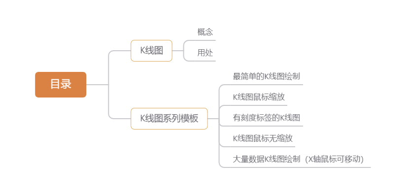
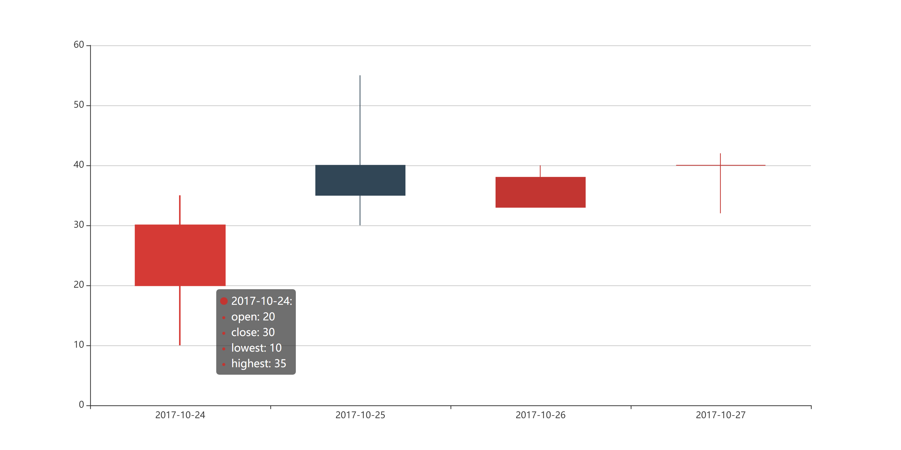
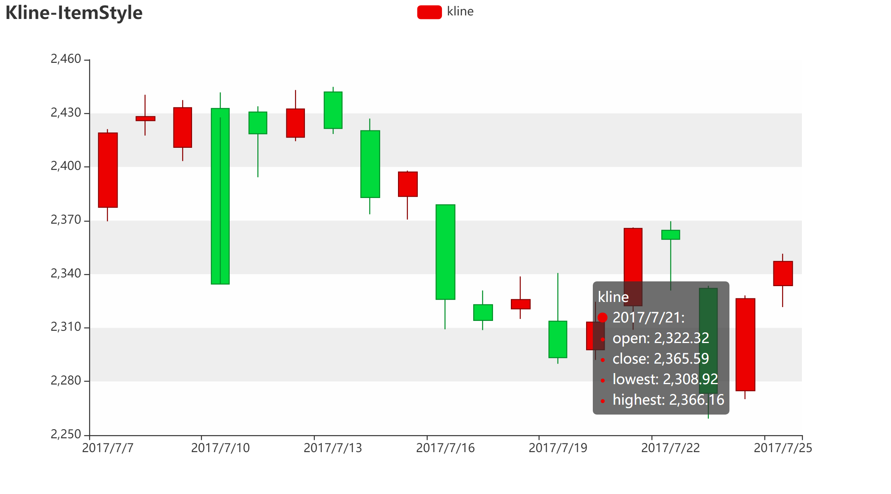
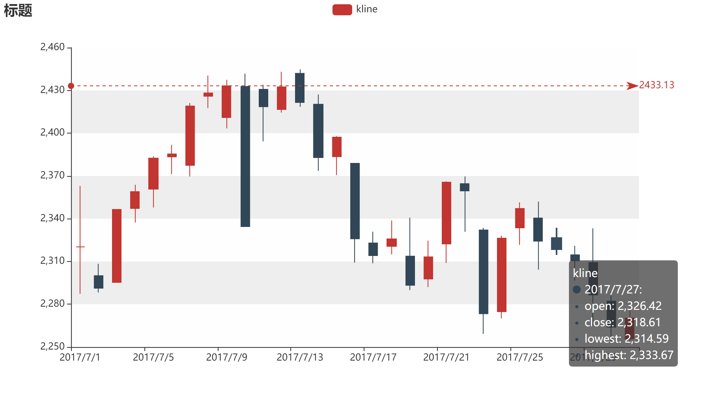
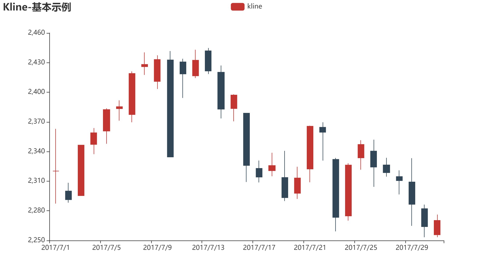
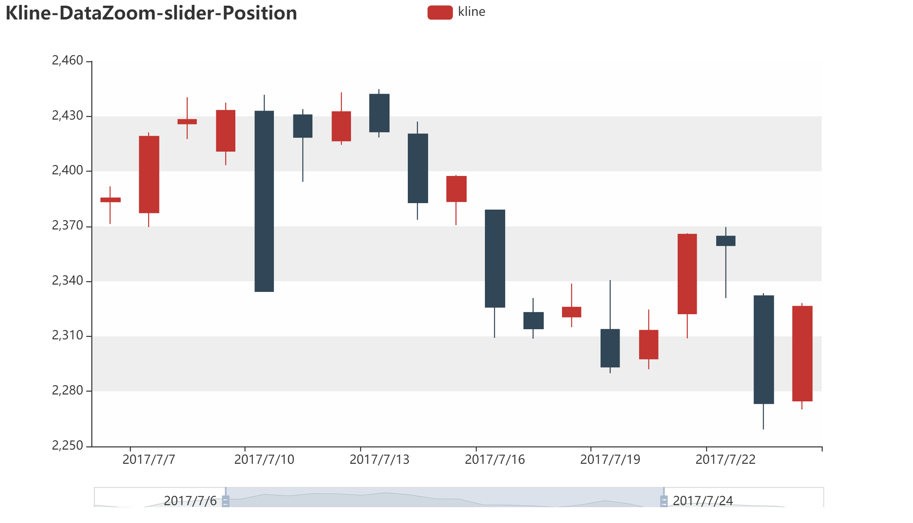

Python Pyecharts 可视化 K线图<br />
<a name="m2050"></a>
## 1、K线图
<a name="Se7pk"></a>
### 一、概念
股市及期货市场中的K线图的画法包含四个数据，即开盘价、最高价、最低价、收盘价，所有的K线都是围绕这四个数据展开，反映大势的状况和价格信息。如果把每日的K线图放在一张纸上，就能得到日K线图，同样也可画出周K线图、月K线图。研究金融的小伙伴肯定比较熟悉这个，那么看起来比较复杂的K线图，又是这样画出来的，一起探索K线图的魅力与神奇之处吧！
<a name="b0QEA"></a>
### 二、用处
K线图用处于股票分析，作为数据分析，以后的进入大数据肯定是一个趋势和热潮，K线图的专业知识比较的复杂，这里就不做过多的展示了！
<a name="cuTvI"></a>
## 2、K线图系列模板
<a name="gXDZJ"></a>
### 一、最简单的K线图绘制
第一个K线图绘制，来看看需要哪些参数吧，数据集都有四个必要的！
```python
import pyecharts.options as opts
from pyecharts.charts import Candlestick

x_data = ["2017-10-24", "2017-10-25", "2017-10-26", "2017-10-27"]
y_data = [[20, 30, 10, 35], [40, 35, 30, 55], [33, 38, 33, 40], [40, 40, 32, 42]]

(
    Candlestick(init_opts=opts.InitOpts(width="1200px", height="600px"))
    .add_xaxis(xaxis_data=x_data)
    .add_yaxis(series_name="", y_axis=y_data)
    .set_series_opts()
    .set_global_opts(
        yaxis_opts=opts.AxisOpts(
            splitline_opts=opts.SplitLineOpts(
                is_show=True, linestyle_opts=opts.LineStyleOpts(width=1)
            )
        )
    )
    .render("简单K线图.html")
)
```

<a name="bxuh2"></a>
### 二、K线图鼠标缩放
大量的数据集的时候，不可以全部同时展示，可以缩放来进行定向展示。
```python
from pyecharts import options as opts
from pyecharts.charts import Kline

data = [
    [2320.26, 2320.26, 2287.3, 2362.94],
    [2300, 2291.3, 2288.26, 2308.38],
    [2295.35, 2346.5, 2295.35, 2345.92],
    [2347.22, 2358.98, 2337.35, 2363.8],
    [2360.75, 2382.48, 2347.89, 2383.76],
    [2383.43, 2385.42, 2371.23, 2391.82],
    [2377.41, 2419.02, 2369.57, 2421.15],
    [2425.92, 2428.15, 2417.58, 2440.38],
    [2411, 2433.13, 2403.3, 2437.42],
    [2432.68, 2334.48, 2427.7, 2441.73],
    [2430.69, 2418.53, 2394.22, 2433.89],
    [2416.62, 2432.4, 2414.4, 2443.03],
    [2441.91, 2421.56, 2418.43, 2444.8],
    [2420.26, 2382.91, 2373.53, 2427.07],
    [2383.49, 2397.18, 2370.61, 2397.94],
    [2378.82, 2325.95, 2309.17, 2378.82],
    [2322.94, 2314.16, 2308.76, 2330.88],
    [2320.62, 2325.82, 2315.01, 2338.78],
    [2313.74, 2293.34, 2289.89, 2340.71],
    [2297.77, 2313.22, 2292.03, 2324.63],
    [2322.32, 2365.59, 2308.92, 2366.16],
    [2364.54, 2359.51, 2330.86, 2369.65],
    [2332.08, 2273.4, 2259.25, 2333.54],
    [2274.81, 2326.31, 2270.1, 2328.14],
    [2333.61, 2347.18, 2321.6, 2351.44],
    [2340.44, 2324.29, 2304.27, 2352.02],
    [2326.42, 2318.61, 2314.59, 2333.67],
    [2314.68, 2310.59, 2296.58, 2320.96],
    [2309.16, 2286.6, 2264.83, 2333.29],
    [2282.17, 2263.97, 2253.25, 2286.33],
    [2255.77, 2270.28, 2253.31, 2276.22],
]


c = (
    Kline()
    .add_xaxis(["2017/7/{}".format(i + 1) for i in range(31)])
    .add_yaxis(
        "kline",
        data,
        itemstyle_opts=opts.ItemStyleOpts(
            color="#ec0000",
            color0="#00da3c",
            border_color="#8A0000",
            border_color0="#008F28",
),
    )
    .set_global_opts(
        xaxis_opts=opts.AxisOpts(is_scale=True),
        yaxis_opts=opts.AxisOpts(
            is_scale=True,
            splitarea_opts=opts.SplitAreaOpts(
                is_show=True, areastyle_opts=opts.AreaStyleOpts(opacity=1)
            ),
        ),
        datazoom_opts=[opts.DataZoomOpts(type_="inside")],
        title_opts=opts.TitleOpts(title="Kline-ItemStyle"),
    )
    .render("K线图鼠标缩放.html")
)
```

<a name="eZN8b"></a>
### 三、有刻度标签的K线图
知道一个数据节点，但是不能在图像里面一眼看出有哪些数据量超出了它的范围，刻度标签就可以派上用场了。
```python
from pyecharts import options as opts
from pyecharts.charts import Kline

data = [
    [2320.26, 2320.26, 2287.3, 2362.94],
    [2300, 2291.3, 2288.26, 2308.38],
    [2295.35, 2346.5, 2295.35, 2345.92],
    [2347.22, 2358.98, 2337.35, 2363.8],
    [2360.75, 2382.48, 2347.89, 2383.76],
    [2383.43, 2385.42, 2371.23, 2391.82],
    [2377.41, 2419.02, 2369.57, 2421.15],
    [2425.92, 2428.15, 2417.58, 2440.38],
    [2411, 2433.13, 2403.3, 2437.42],
    [2432.68, 2334.48, 2427.7, 2441.73],
    [2430.69, 2418.53, 2394.22, 2433.89],
    [2416.62, 2432.4, 2414.4, 2443.03],
    [2441.91, 2421.56, 2418.43, 2444.8],
    [2420.26, 2382.91, 2373.53, 2427.07],
    [2383.49, 2397.18, 2370.61, 2397.94],
    [2378.82, 2325.95, 2309.17, 2378.82],
    [2322.94, 2314.16, 2308.76, 2330.88],
    [2320.62, 2325.82, 2315.01, 2338.78],
    [2313.74, 2293.34, 2289.89, 2340.71],
    [2297.77, 2313.22, 2292.03, 2324.63],
    [2322.32, 2365.59, 2308.92, 2366.16],
    [2364.54, 2359.51, 2330.86, 2369.65],
    [2332.08, 2273.4, 2259.25, 2333.54],
    [2274.81, 2326.31, 2270.1, 2328.14],
    [2333.61, 2347.18, 2321.6, 2351.44],
    [2340.44, 2324.29, 2304.27, 2352.02],
    [2326.42, 2318.61, 2314.59, 2333.67],
    [2314.68, 2310.59, 2296.58, 2320.96],
    [2309.16, 2286.6, 2264.83, 2333.29],
    [2282.17, 2263.97, 2253.25, 2286.33],
    [2255.77, 2270.28, 2253.31, 2276.22],
]

c = (
    Kline()
    .add_xaxis(["2017/7/{}".format(i + 1) for i in range(31)])
    .add_yaxis(
        "kline",
        data,
        markline_opts=opts.MarkLineOpts(
            data=[opts.MarkLineItem(type_="max", value_dim="close")]
        ),
    )
    .set_global_opts(
        xaxis_opts=opts.AxisOpts(is_scale=True),
        yaxis_opts=opts.AxisOpts(
            is_scale=True,
            splitarea_opts=opts.SplitAreaOpts(
                is_show=True, areastyle_opts=opts.AreaStyleOpts(opacity=1)
            ),
        ),
        title_opts=opts.TitleOpts(title="标题"),
    )
    .render("刻度标签.html")
)
```

<a name="OQFoR"></a>
### 四、K线图鼠标无缩放
前面的是一个有缩放功能的图例代码，但是有时候不想要那么修改一下参数就可以了。
```python
from pyecharts import options as opts
from pyecharts.charts import Kline

data = [
    [2320.26, 2320.26, 2287.3, 2362.94],
    [2300, 2291.3, 2288.26, 2308.38],
    [2295.35, 2346.5, 2295.35, 2345.92],
    [2347.22, 2358.98, 2337.35, 2363.8],
    [2360.75, 2382.48, 2347.89, 2383.76],
    [2383.43, 2385.42, 2371.23, 2391.82],
    [2377.41, 2419.02, 2369.57, 2421.15],
    [2425.92, 2428.15, 2417.58, 2440.38],
    [2411, 2433.13, 2403.3, 2437.42],
    [2432.68, 2334.48, 2427.7, 2441.73],
    [2430.69, 2418.53, 2394.22, 2433.89],
    [2416.62, 2432.4, 2414.4, 2443.03],
    [2441.91, 2421.56, 2418.43, 2444.8],
    [2420.26, 2382.91, 2373.53, 2427.07],
    [2383.49, 2397.18, 2370.61, 2397.94],
    [2378.82, 2325.95, 2309.17, 2378.82],
    [2322.94, 2314.16, 2308.76, 2330.88],
    [2320.62, 2325.82, 2315.01, 2338.78],
    [2313.74, 2293.34, 2289.89, 2340.71],
    [2297.77, 2313.22, 2292.03, 2324.63],
    [2322.32, 2365.59, 2308.92, 2366.16],
    [2364.54, 2359.51, 2330.86, 2369.65],
    [2332.08, 2273.4, 2259.25, 2333.54],
    [2274.81, 2326.31, 2270.1, 2328.14],
    [2333.61, 2347.18, 2321.6, 2351.44],
    [2340.44, 2324.29, 2304.27, 2352.02],
    [2326.42, 2318.61, 2314.59, 2333.67],
    [2314.68, 2310.59, 2296.58, 2320.96],
    [2309.16, 2286.6, 2264.83, 2333.29],
    [2282.17, 2263.97, 2253.25, 2286.33],
    [2255.77, 2270.28, 2253.31, 2276.22],
]


c = (
    Kline()
    .add_xaxis(["2017/7/{}".format(i + 1) for i in range(31)])
    .add_yaxis("kline", data)
    .set_global_opts(
        yaxis_opts=opts.AxisOpts(is_scale=True),
        xaxis_opts=opts.AxisOpts(is_scale=True),
        title_opts=opts.TitleOpts(title="Kline-基本示例"),
    )
    .render("鼠标无缩放.html")
)
```

<a name="JQxj0"></a>
### 五、大量数据K线图绘制（X轴鼠标可移动）
虽然有时候缩放可以容纳较多的数据量，但是还是不够智能，可以利用这个：
```python
from pyecharts import options as opts
from pyecharts.charts import Kline

data = [
    [2320.26, 2320.26, 2287.3, 2362.94],
    [2300, 2291.3, 2288.26, 2308.38],
    [2295.35, 2346.5, 2295.35, 2345.92],
    [2347.22, 2358.98, 2337.35, 2363.8],
    [2360.75, 2382.48, 2347.89, 2383.76],
    [2383.43, 2385.42, 2371.23, 2391.82],
    [2377.41, 2419.02, 2369.57, 2421.15],
    [2425.92, 2428.15, 2417.58, 2440.38],
    [2411, 2433.13, 2403.3, 2437.42],
    [2432.68, 2334.48, 2427.7, 2441.73],
    [2430.69, 2418.53, 2394.22, 2433.89],
    [2416.62, 2432.4, 2414.4, 2443.03],
    [2441.91, 2421.56, 2418.43, 2444.8],
    [2420.26, 2382.91, 2373.53, 2427.07],
    [2383.49, 2397.18, 2370.61, 2397.94],
    [2378.82, 2325.95, 2309.17, 2378.82],
    [2322.94, 2314.16, 2308.76, 2330.88],
    [2320.62, 2325.82, 2315.01, 2338.78],
    [2313.74, 2293.34, 2289.89, 2340.71],
    [2297.77, 2313.22, 2292.03, 2324.63],
    [2322.32, 2365.59, 2308.92, 2366.16],
    [2364.54, 2359.51, 2330.86, 2369.65],
    [2332.08, 2273.4, 2259.25, 2333.54],
    [2274.81, 2326.31, 2270.1, 2328.14],
    [2333.61, 2347.18, 2321.6, 2351.44],
    [2340.44, 2324.29, 2304.27, 2352.02],
    [2326.42, 2318.61, 2314.59, 2333.67],
    [2314.68, 2310.59, 2296.58, 2320.96],
    [2309.16, 2286.6, 2264.83, 2333.29],
    [2282.17, 2263.97, 2253.25, 2286.33],
    [2255.77, 2270.28, 2253.31, 2276.22],
]

c = (
    Kline()
    .add_xaxis(["2017/7/{}".format(i + 1) for i in range(31)])
    .add_yaxis("kline", data)
    .set_global_opts(
        xaxis_opts=opts.AxisOpts(is_scale=True),
        yaxis_opts=opts.AxisOpts(
            is_scale=True,
            splitarea_opts=opts.SplitAreaOpts(
                is_show=True, areastyle_opts=opts.AreaStyleOpts(opacity=1)
            ),
        ),
        datazoom_opts=[opts.DataZoomOpts(pos_bottom="-2%")],
        title_opts=opts.TitleOpts(title="Kline-DataZoom-slider-Position"),
    )
    .render("大量数据展示.html")
)
```

<a name="RAdCz"></a>
## 3、附录-示例代码
[Pyecharts-K-Line.zip](https://www.yuque.com/attachments/yuque/0/2021/zip/396745/1630474579314-74e64fee-c0f0-4810-bbbf-87b6fab8ddec.zip?_lake_card=%7B%22src%22%3A%22https%3A%2F%2Fwww.yuque.com%2Fattachments%2Fyuque%2F0%2F2021%2Fzip%2F396745%2F1630474579314-74e64fee-c0f0-4810-bbbf-87b6fab8ddec.zip%22%2C%22name%22%3A%22Pyecharts-K-Line.zip%22%2C%22size%22%3A11761%2C%22type%22%3A%22application%2Fx-zip-compressed%22%2C%22ext%22%3A%22zip%22%2C%22status%22%3A%22done%22%2C%22taskId%22%3A%22u613524e5-7096-4d35-8bf9-21f1dd053a0%22%2C%22taskType%22%3A%22upload%22%2C%22id%22%3A%22u6c6e436c%22%2C%22card%22%3A%22file%22%7D)
