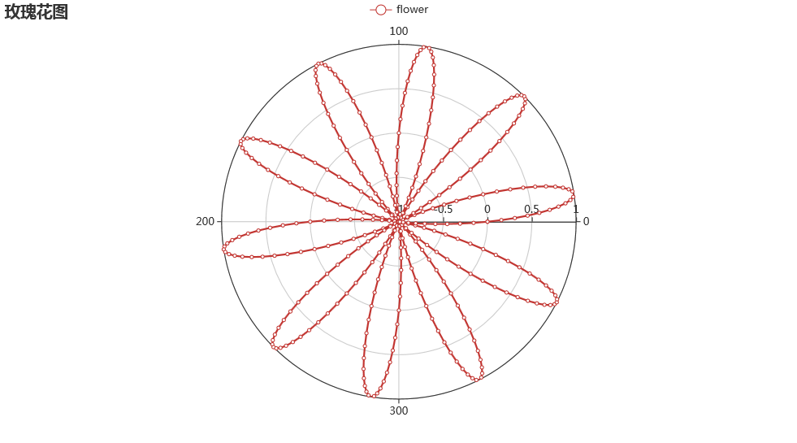
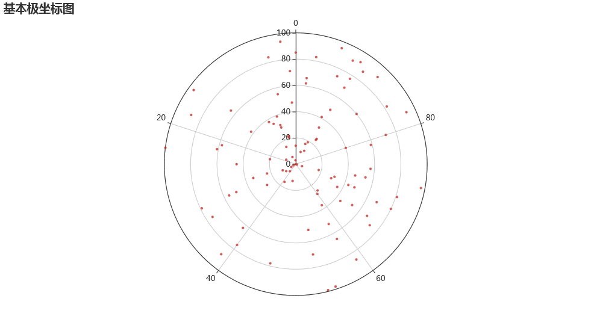
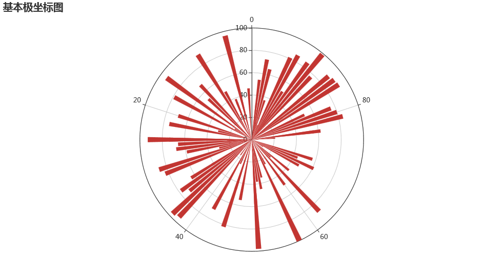
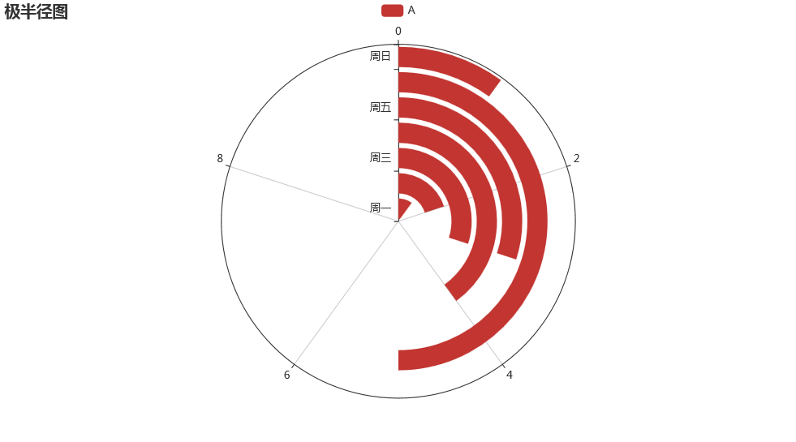
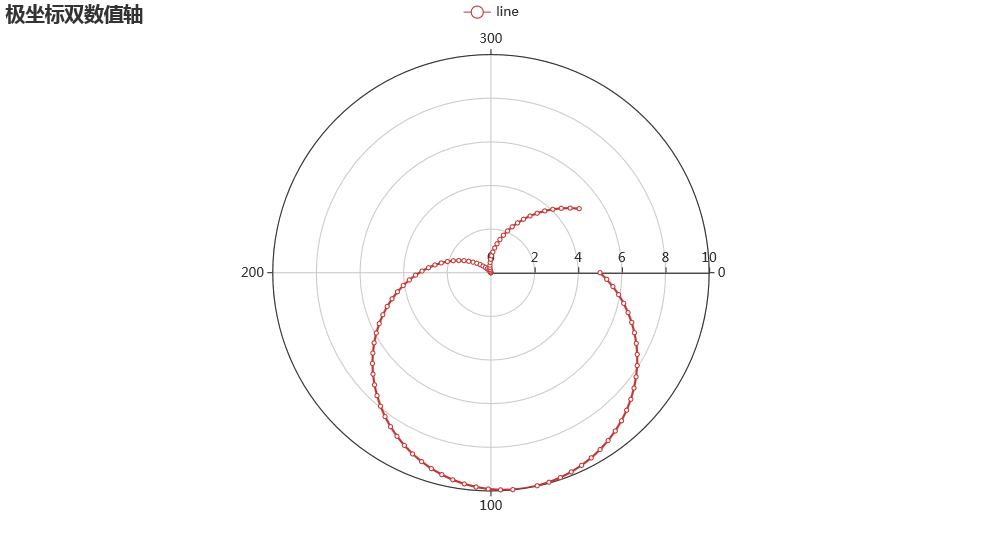
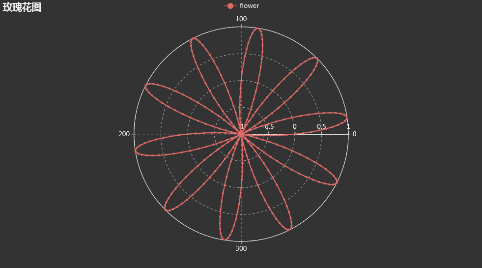

Python 数据可视化<br />
<a name="Tl2L7"></a>
## 一、基本极坐标图
基本极坐标图就是圆形的散点图（柱状图或折线图），代码如下：
```python
import random
from pyecharts import options as opts
from pyecharts.charts import Polar
data = [(i, random.randint(1, 100)) for i in range(101)]
c = (
    Polar()
    .add("", data, type_="scatter", label_opts=opts.LabelOpts(is_show=False))
    .set_global_opts(title_opts=opts.TitleOpts(title="基本极坐标图"))
)
c.render_notebook()
```
<br />数据data是1个列表，列表内的元素为元组，单个元组有2个数据，第一个数据为半径，第二个数据相当于角度，这样就好理解了<br />也可把`type`改为`bar`
```python
c = (
    Polar()
    .add("", data, type_="bar", label_opts=opts.LabelOpts(is_show=False))
    .set_global_opts(title_opts=opts.TitleOpts(title="基本极坐标图"))
)
c.render_notebook()
```
<br />同理也可以改成折线（line）等，可以自己尝试一下。
<a name="EM8zH"></a>
## 二、极半径图
在极坐标中引入柱状图
```python
from pyecharts import options as opts
from pyecharts.charts import Polar
from pyecharts.faker import Faker
c = (
    Polar()
    .add_schema(
        radiusaxis_opts=opts.RadiusAxisOpts(data=Faker.week,  #数据项
                                            type_="category"  #坐标轴类型，类目轴，适用于离散的类目数据，为该类型时必须通过 data 设置类目数据。
                                           ),
        angleaxis_opts=opts.AngleAxisOpts(is_clockwise=True, #是否顺时针排布
                                          max_=10            #坐标轴刻度最大值
                                         ),
    )
    .add("A", [1, 2, 3, 4, 3, 5, 1], type_="bar")
    .set_global_opts(title_opts=opts.TitleOpts(title="Polar-RadiusAxis"))
)
c.render_notebook()
```

<a name="cKnBn"></a>
### 参数介绍
`RadiusAxisOpts`：极坐标系径向轴配置项<br />`AngleAxisOpts`：极坐标系角度轴配置项
<a name="fLhpo"></a>
## 三、画玫瑰花图
首先要引入数学中的`sin`函数，假设角度为`theta`，则长度为`n(m+sin(theta))`，n和m都为常量，那么元组（长度，角度）就可以在极坐标中确定一个点，把一系列的点放入列表中，并用折线图连接起来，就可以画出漂亮的数学图形。
```python
import math
import pyecharts.options as opts
from pyecharts.charts import Polar
data = []
for i in range(0, 101):
    theta = i / 100 * 360
    r = 5 * (1 + math.sin(theta / 180 * math.pi))
    data.append([r, theta])
c=(
    Polar()
    .add(series_name="line", data=data, label_opts=opts.LabelOpts(is_show=False))
    .add_schema(
        angleaxis_opts=opts.AngleAxisOpts(
            start_angle=0, type_="value", is_clockwise=True
        )
    )
    .set_global_opts(
        tooltip_opts=opts.TooltipOpts(trigger="axis", axis_pointer_type="cross"),
        title_opts=opts.TitleOpts(title="极坐标双数值轴"),
    )
)
c.render_notebook()
```

<a name="IbL8C"></a>
### `AngleAxisOpts`参数介绍：
`start_angle`：极坐标开始的角度<br />`type_`：坐标轴类型，`'value'`表示数值轴，适用于连续数据<br />`is_clockwise`：是否为顺时针
<a name="L5etT"></a>
### `TooltipOpts`参数介绍：
`trigger`：触发类型，`'axis'`表示坐标轴触发，主要在柱状图，折线图等会使用类目轴的图表中使用`axis_pointer_type`：指示器类型，`'cross'`表示十字准星指示器
<a name="Bp0pb"></a>
## 开始画玫瑰花图
```python
import math

from pyecharts import options as opts
from pyecharts.charts import Polar
data = []
for i in range(401):
    t = i / 180 * math.pi
    r = math.sin(9*t)
    data.append([r, i])
c = (
    Polar()
    .add_schema(angleaxis_opts=opts.AngleAxisOpts(start_angle=0, min_=0))
    .add("flower", data, label_opts=opts.LabelOpts(is_show=False))
    .set_global_opts(title_opts=opts.TitleOpts(title="Polar-Flower"))
)
c.render_notebook()
```

