Python 可视化 Pyecharts
<a name="JL3jg"></a>
### Theme图表背景
Pyecharts模块内部内置了10多种不同风格的图表绘制样式，分别是
```python
LIGHT = "light"
DARK = "dark"
WHITE = "white"
CHALK: str = "chalk"
ESSOS: str = "essos"
INFOGRAPHIC: str = "infographic"
MACARONS: str = "macarons"
PURPLE_PASSION: str = "purple-passion"
ROMA: str = "roma"
ROMANTIC: str = "romantic"
SHINE: str = "shine"
VINTAGE: str = "vintage"
WALDEN: str = "walden"
WESTEROS: str = "westeros"
WONDERLAND: str = "wonderland"
HALLOWEEN: str = "halloween"
```
依次来看一下每一种风格出来的样子，这次用到的数据集依然是Pyecharts模块当中内置的模块，当然首先需要导入相对应的模块
```python
from pyecharts import options as opts
from pyecharts.charts import Bar, Page
from pyecharts.faker import Collector, Faker
from pyecharts.globals import ThemeType
```
<a name="QGKQ3"></a>
### Light
```python
c = (
        Bar(init_opts=opts.InitOpts(theme=ThemeType.LIGHT))
        .add_xaxis(Faker.choose())
        .add_yaxis("商家A", Faker.values())
        .add_yaxis("商家B", Faker.values())
        .add_yaxis("商家C", Faker.values())
        .add_yaxis("商家D", Faker.values())
        .set_global_opts(title_opts=opts.TitleOpts("Theme-Light"))
    )

c.render("1.html")
```
output<br />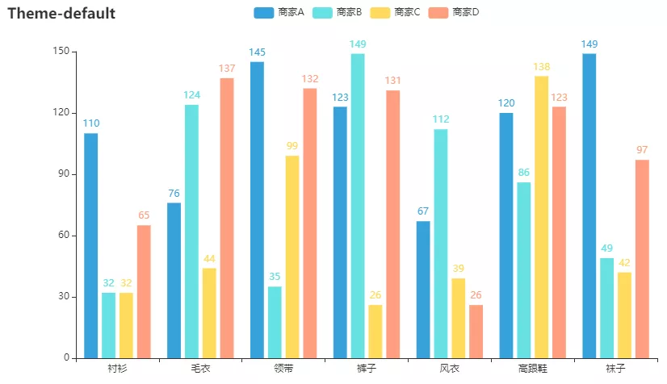
<a name="HiANh"></a>
### Dark
```python
c = (
        Bar(init_opts=opts.InitOpts(theme=ThemeType.DARK))
        .add_xaxis(Faker.choose())
        .add_yaxis("商家A", Faker.values())
        .add_yaxis("商家B", Faker.values())
        .add_yaxis("商家C", Faker.values())
        .add_yaxis("商家D", Faker.values())
        .set_global_opts(title_opts=opts.TitleOpts("Theme-Dark"))
    )

c.render("2.html")
```
output<br />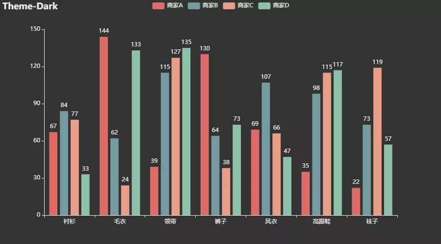
<a name="Da2Ip"></a>
### Chalk
```python
c = (
        Bar(init_opts=opts.InitOpts(theme=ThemeType.CHALK))
        .add_xaxis(Faker.choose())
        .add_yaxis("商家A", Faker.values())
        .add_yaxis("商家B", Faker.values())
        .add_yaxis("商家C", Faker.values())
        .add_yaxis("商家D", Faker.values())
        .set_global_opts(title_opts=opts.TitleOpts("Theme-Chalk"))
    )

c.render("3.html")
```
output<br />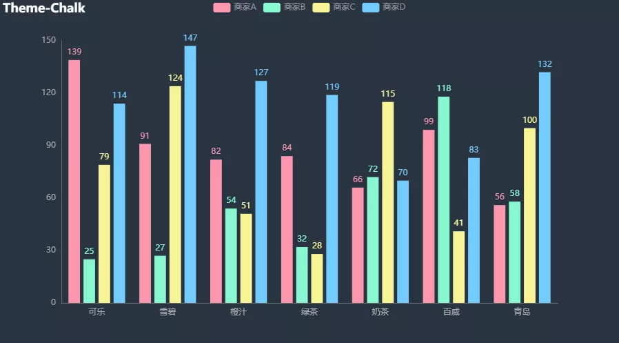
<a name="lAxkp"></a>
### Essos
```python
c = (
        Bar(init_opts=opts.InitOpts(theme=ThemeType.ESSOS))
        .add_xaxis(Faker.choose())
        .add_yaxis("商家A", Faker.values())
        .add_yaxis("商家B", Faker.values())
        .add_yaxis("商家C", Faker.values())
        .add_yaxis("商家D", Faker.values())
        .set_global_opts(title_opts=opts.TitleOpts("Theme-Essos"))
    )

c.render("4.html")
```
output<br />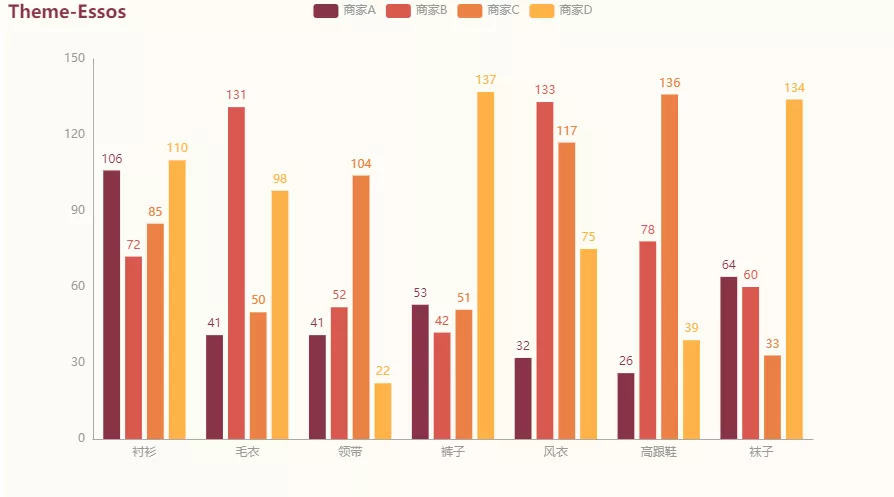
<a name="Hol6y"></a>
### Infographic
```python
c = (
        Bar(init_opts=opts.InitOpts(theme=ThemeType.INFOGRAPHIC))
        .add_xaxis(Faker.choose())
        .add_yaxis("商家A", Faker.values())
        .add_yaxis("商家B", Faker.values())
        .add_yaxis("商家C", Faker.values())
        .add_yaxis("商家D", Faker.values())
        .set_global_opts(title_opts=opts.TitleOpts("Theme-Infographic"))
    )

c.render("5.html")
```
output<br />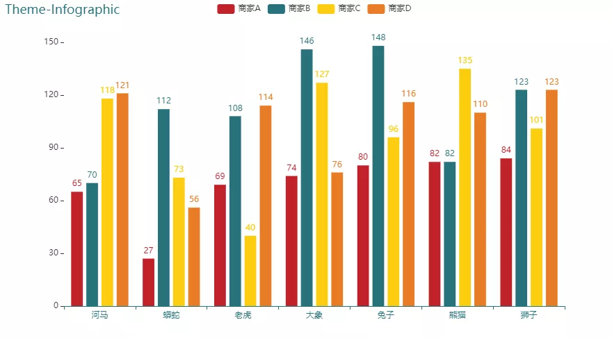
<a name="DC4YM"></a>
### Macarons
```python
c = (
        Bar(init_opts=opts.InitOpts(theme=ThemeType.MACARONS))
        .add_xaxis(Faker.choose())
        .add_yaxis("商家A", Faker.values())
        .add_yaxis("商家B", Faker.values())
        .add_yaxis("商家C", Faker.values())
        .add_yaxis("商家D", Faker.values())
        .set_global_opts(title_opts=opts.TitleOpts("Theme-Macarons"))
    )

c.render("6.html")
```
output<br />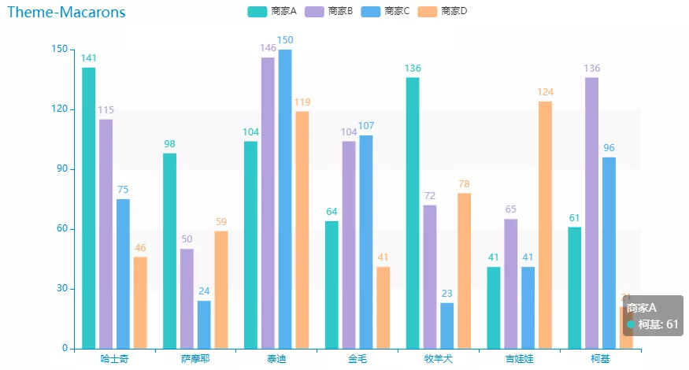

- Purple_Passion
```python
c = (
        Bar(init_opts=opts.InitOpts(theme=ThemeType.PURPLE_PASSION))
        .add_xaxis(Faker.choose())
        .add_yaxis("商家A", Faker.values())
        .add_yaxis("商家B", Faker.values())
        .add_yaxis("商家C", Faker.values())
        .add_yaxis("商家D", Faker.values())
        .set_global_opts(title_opts=opts.TitleOpts("Theme-PURPLE_PASSION"))
    )

c.render("7.html")
```
output<br />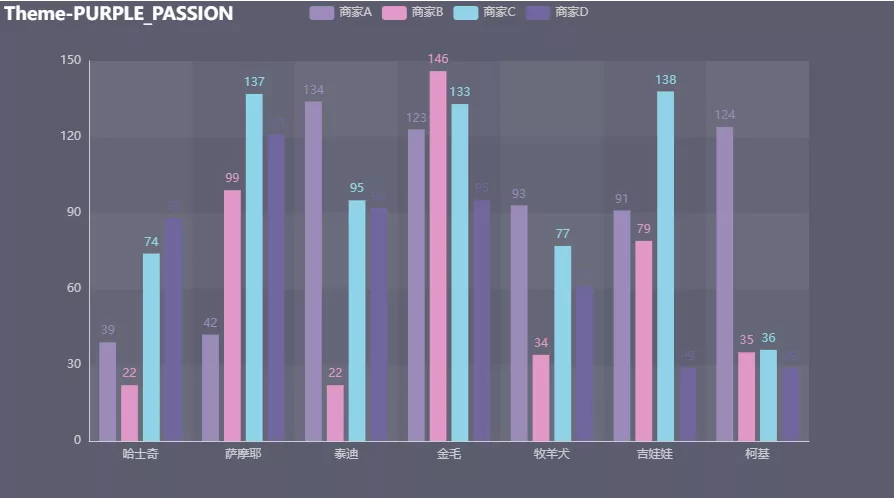
<a name="HITMK"></a>
### Roma
```python
c = (
        Bar(init_opts=opts.InitOpts(theme=ThemeType.ROMA))
        .add_xaxis(Faker.choose())
        .add_yaxis("商家A", Faker.values())
        .add_yaxis("商家B", Faker.values())
        .add_yaxis("商家C", Faker.values())
        .add_yaxis("商家D", Faker.values())
        .set_global_opts(title_opts=opts.TitleOpts("Theme-ROMA"))
    )

c.render("8.html")
```
output<br />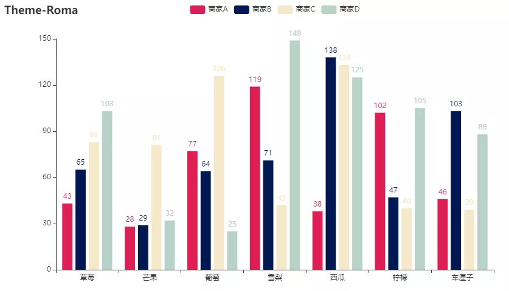
<a name="xmxB4"></a>
### Romantic
```python
c = (
        Bar(init_opts=opts.InitOpts(theme=ThemeType.ROMANTIC))
        .add_xaxis(Faker.choose())
        .add_yaxis("商家A", Faker.values())
        .add_yaxis("商家B", Faker.values())
        .add_yaxis("商家C", Faker.values())
        .add_yaxis("商家D", Faker.values())
        .set_global_opts(title_opts=opts.TitleOpts("Theme-ROMANTIC"))
    )

c.render("9.html")
```
output<br />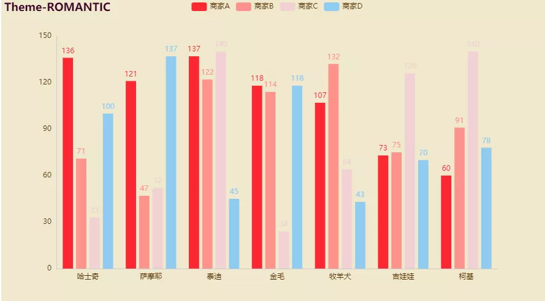
<a name="FLIsS"></a>
### Shine
```python
c = (
        Bar(init_opts=opts.InitOpts(theme=ThemeType.SHINE))
        .add_xaxis(Faker.choose())
        .add_yaxis("商家A", Faker.values())
        .add_yaxis("商家B", Faker.values())
        .add_yaxis("商家C", Faker.values())
        .add_yaxis("商家D", Faker.values())
        .set_global_opts(title_opts=opts.TitleOpts("Theme-Shine"))
    )

c.render("10.html")
```
output<br />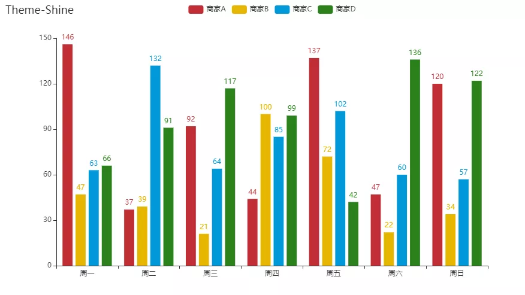
<a name="czwPs"></a>
### Vintage
```python
c = (
        Bar(init_opts=opts.InitOpts(theme=ThemeType.VINTAGE))
        .add_xaxis(Faker.choose())
        .add_yaxis("商家A", Faker.values())
        .add_yaxis("商家B", Faker.values())
        .add_yaxis("商家C", Faker.values())
        .add_yaxis("商家D", Faker.values())
        .set_global_opts(title_opts=opts.TitleOpts("Theme-Vintage"))
    )

c.render("11.html")
```
output<br />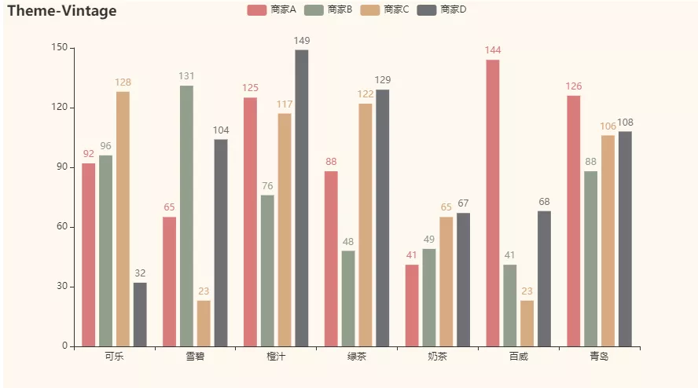
<a name="w7Y01"></a>
### Walden
```python
c = (
        Bar(init_opts=opts.InitOpts(theme=ThemeType.WALDEN))
        .add_xaxis(Faker.choose())
        .add_yaxis("商家A", Faker.values())
        .add_yaxis("商家B", Faker.values())
        .add_yaxis("商家C", Faker.values())
        .add_yaxis("商家D", Faker.values())
        .set_global_opts(title_opts=opts.TitleOpts("Theme-Walden"))
    )

c.render("12.html")
```
output<br />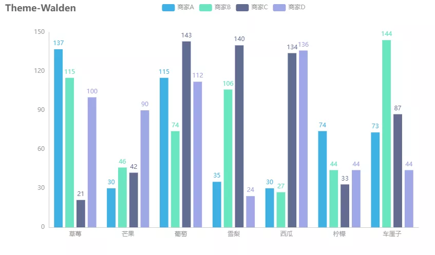
<a name="x160Q"></a>
### Westeros
```python
c = (
        Bar(init_opts=opts.InitOpts(theme=ThemeType.WESTEROS))
        .add_xaxis(Faker.choose())
        .add_yaxis("商家A", Faker.values())
        .add_yaxis("商家B", Faker.values())
        .add_yaxis("商家C", Faker.values())
        .add_yaxis("商家D", Faker.values())
        .set_global_opts(title_opts=opts.TitleOpts("Theme-Westeros"))
    )

c.render("13.html")
```
output

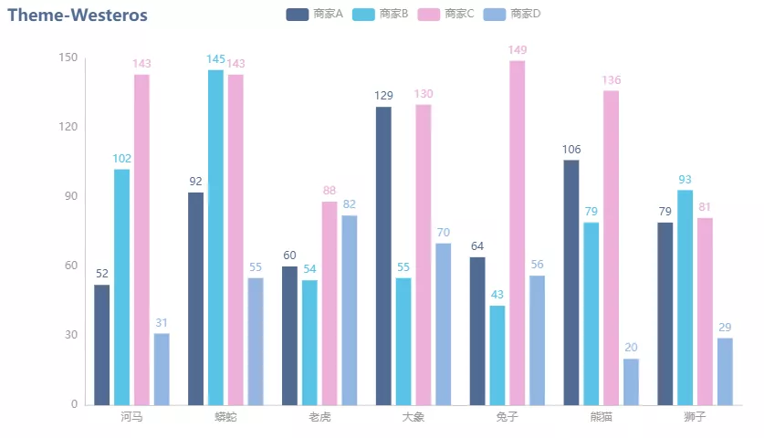
<a name="hJXcW"></a>
### Wonderland
```python
c = (
        Bar(init_opts=opts.InitOpts(theme=ThemeType.WONDERLAND))
        .add_xaxis(Faker.choose())
        .add_yaxis("商家A", Faker.values())
        .add_yaxis("商家B", Faker.values())
        .add_yaxis("商家C", Faker.values())
        .add_yaxis("商家D", Faker.values())
        .set_global_opts(title_opts=opts.TitleOpts("Theme-Wonderland"))
    )

c.render("14.html")
```
output<br />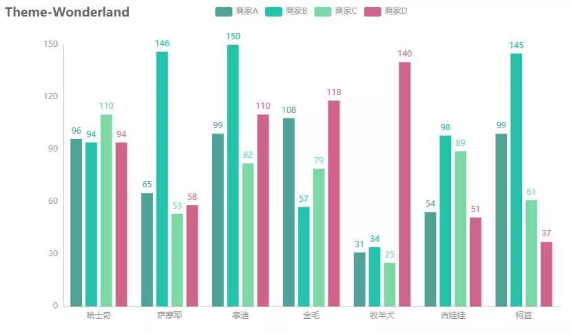
<a name="JrVbe"></a>
### Halloween
```python
c = (
        Bar(init_opts=opts.InitOpts(theme=ThemeType.HALLOWEEN))
        .add_xaxis(Faker.choose())
        .add_yaxis("商家A", Faker.values())
        .add_yaxis("商家B", Faker.values())
        .add_yaxis("商家C", Faker.values())
        .add_yaxis("商家D", Faker.values())
        .set_global_opts(title_opts=opts.TitleOpts("Theme-Halloween"))
    )

c.render("15.html")
```
output<br />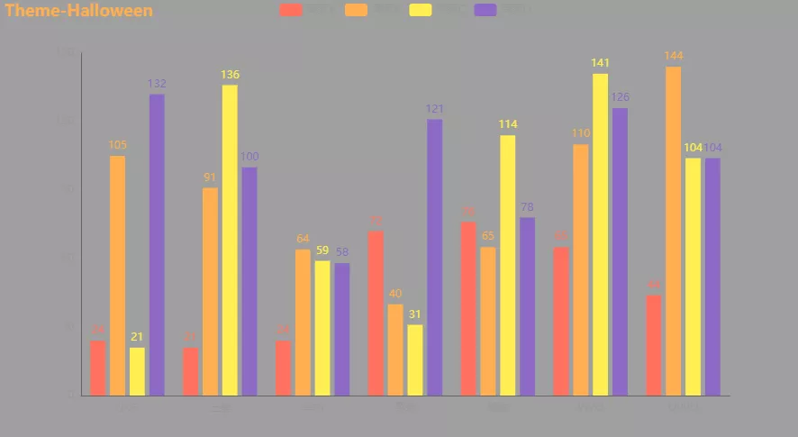
<a name="ZRxnN"></a>
### 图片带有背景图
同时还能为自己绘制的图表配上自带的背景图片
```python
c = (
    Bar(
        init_opts=opts.InitOpts(
            bg_color={"type": "pattern", "image": JsCode("img"), "repeat": "no-repeat"}
        )
    )
    .add_xaxis(Faker.choose())
    .add_yaxis("商家A", Faker.values())
    .add_yaxis("商家B", Faker.values())
    .set_global_opts(
        title_opts=opts.TitleOpts(
            title="Bar-背景图基本示例",
            subtitle="我是副标题",
            title_textstyle_opts=opts.TextStyleOpts(color="white"),
        )
    )
)
c.add_js_funcs(
    """
    var img = new Image(); img.src = 'https://t7.baidu.com/it/u=2638406194,523661981&fm=193&f=GIF';
    """
)
c.render("柱状图-自带背景图.html")
```
output<br />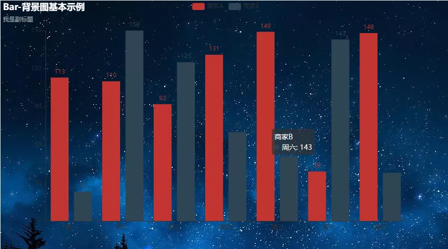
