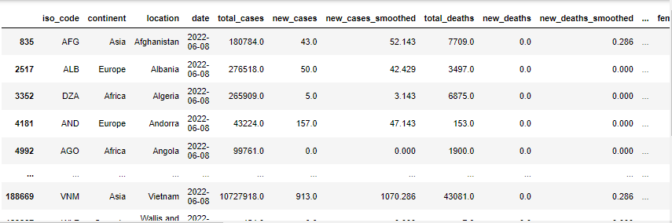
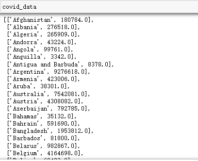

Python可视化Pyecharts
<a name="UdZ2Y"></a>
## 数据处理
这里使用全球新冠感染人数的数据集作为测试数据，先来看看数据的整体情况
```python
import pandas as pd

df = pd.read_csv("owid-covid-data.csv")
df_0608 = df[df['date'] == '2022-06-08']
df_new = df_0608[pd.isna(df_0608['continent']) == False]
df_new
```
Output:<br /><br />选取0608这一天的数据，可以看到 total_cases 字段就是国家当前的累计总确诊人数<br />下面就提取国家和确诊人数
```python
covid_data = df_new[['location', 'total_cases']].values.tolist()
```
Output:<br />
<a name="kGT1J"></a>
## **Pyecharts 绘图**
通过 Pyecharts 绘制地球图，在官网上有很详细的例子，直接套用即可<br />首先导入相关库
```python
import pyecharts.options as opts
from pyecharts.charts import MapGlobe
```
定义地球图函数并绘制
```python
data = [x for _, x in covid_data]
low, high = min(data), max(data)

c = (
    MapGlobe()
    .add_schema()
    .add(
        maptype="world",
        series_name="World Covid Data",
        data_pair=covid_data,
        is_map_symbol_show=False,
        label_opts=opts.LabelOpts(is_show=False),
    )
    .set_global_opts(
        visualmap_opts=opts.VisualMapOpts(
            min_=low,
            max_=high,
            range_text=["max", "min"],
            is_calculable=True,
            range_color=["lightskyblue", "yellow", "orangered"],
        )
    )
)
c.render_notebook()
```
这样得到如下全球各国新冠确诊人数分布图<br />
<a name="tDxhR"></a>
## **部署为 Web 服务**
当前所有的代码都是运行在 Jupyter 当中的，如果要分享给其他人，并不是十分的方便，可以将整体代码部署成一个 Web 服务，这样其他人就可以方便的通过浏览器来查看该地球图了<br />先创建项目目录，命名为 flask_map，再将本地安装的 Pyecharts 目录下的 templates 文件夹拷贝到该目录下，同时再创建 data 文件夹和 main.py 文件，Pyecharts 模板位置如下：<br />pyecharts.render.templates<br />将数据集 owid-covid-data.csv 放到 data 文件夹下，再编写 main.py 文件
```python
# coding = utf-8
"""
======================
@File: main.py
======================
"""
from flask import Flask, render_template
from jinja2 import Markup, Environment, FileSystemLoader
from pyecharts.globals import CurrentConfig

# 关于 CurrentConfig，可参考 [基本使用-全局变量]
CurrentConfig.GLOBAL_ENV = Environment(loader=FileSystemLoader("./templates"))

from pyecharts import options as opts
from pyecharts.charts import MapGlobe
import pandas as pd


df = pd.read_csv("data/owid-covid-data.csv")
df_0608 = df[df['date'] == '2022-06-08']
df_new = df_0608[pd.isna(df_0608['continent']) == False]
covid_data = df_new[['location', 'total_cases']].values.tolist()


app = Flask(__name__, static_folder="templates")


def Map_base():
    data = [x for _, x in covid_data]
    low, high = min(data), max(data)

    c = (
        MapGlobe()
            .add_schema()
            .add(
            maptype="world",
            series_name="World Covid Data",
            data_pair=covid_data,
            is_map_symbol_show=False,
            label_opts=opts.LabelOpts(is_show=False),
        )
            .set_global_opts(
            visualmap_opts=opts.VisualMapOpts(
                min_=low,
                max_=high,
                range_text=["max", "min"],
                is_calculable=True,
                range_color=["lightskyblue", "yellow", "orangered"],
            )
        )
    )
    return c


@app.route("/")
def index():
    c = Map_base()
    c.render('templates/Map.html')
    return render_template("Map.html")


if __name__ == "__main__":
    app.run()
```
这样，当启动 Flask 服务器之后，只需要访问根目录（/），就会在 templates 目录下生成 Map.html 文件，也会在浏览器正常展示地球图了<br />
