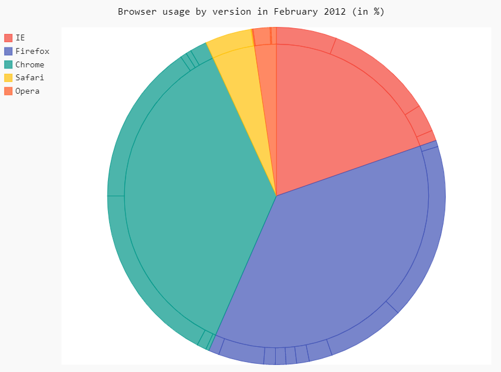

Python Pygal<br />Pygal是一个性感的Python制表工具，提供了14种图表类型，可以轻松定制出版级别的交互式图表。<br /><br />相比较seaborn等明星库，Pygal有哪些值得一说的优点呢？

1. 高度可定制，而且用法简单；
2. 图表可交互性强；
3. 图像可导出SVG格式（矢量图形）；
4. 与Django、Flask等Web框架高度集成；
<a name="Dkx1k"></a>
## Pygal支持的图表类型
Pygal目前支持的图表有折线图、点图、柱状图、直方图、饼图、雷达图、箱图、气泡图、漏斗图、圆环图、仪表板、漏斗图、热力图、地图。<br />既可以在浏览器中直接查看图表，或集成到web中，也可以导出图表。<br />可以导出的格式有：SVG、PNG、Etree、64位URI<br />Pygal默认在jupyter notebook不显示，需要保存svg、png等格式，浏览器打开查看，为了便于展示，做了如下设置可在jupyter notebook中展示。
```python
import pygal
 
#设置pygal与jupyter notebook交互
from IPython.display import display, HTML
 
base_html = """
<!DOCTYPE html>
<html>
  <head>
  <script type="text/javascript" src="http://kozea.github.com/pygal.js/javascripts/svg.jquery.js"></script>
  <script type="text/javascript" src="https://kozea.github.io/pygal.js/2.0.x/pygal-tooltips.min.js""></script>
  </head>
  <body>
    <figure>
      {rendered_chart}
    </figure>
  </body>
</html>
"""
```
<a name="R6Ok7"></a>
## 安装并导入Pygal
使用pip或者conda进行安装，在命令行输入：
```bash
pip install pygal
```
<br />安装好后，导入Pygal：
```python
import pygal
```
这里用的是Jupyter Notebook环境，接下来正式绘图。
<a name="2pKxW"></a>
## 绘图步骤
Pygal的用法非常简单，主要分三步：

1. 生成图表对象
2. 导入数据
3. 导出图像

这里简单绘制一个柱状图：
```python
# 导入pygal库
import pygal  
# 创建柱状图对象
bar_chart = pygal.Bar() 
# 图表命名
bar_chart.title = 'NBA历史得分前五球星数据'
# 添加数据
bar_chart.add('贾巴尔', 38387) 
bar_chart.add('马龙', 36928) 
bar_chart.add('詹姆斯', 34384) 
bar_chart.add('科比', 33643) 
bar_chart.add('乔丹', 32292) 
# 在浏览器中查看
bar_chart.render_in_browser()
# 导出为矢量图形
bar_chart.render_to_file('NBA.svg')
```

<a name="LdoMl"></a>
## 常见图形
<a name="t085S"></a>
### 1、折线图
```python
line_chart = pygal.Line()
line_chart.title = 'Browser usage evolution (in %)'
# 添加x轴标签
line_chart.x_labels = map(str, range(2002, 2013))
# 传入数据
line_chart.add('Firefox', [None, None,    0, 16.6,   25,   31, 36.4, 45.5, 46.3, 42.8, 37.1])
line_chart.add('Chrome',  [None, None, None, None, None, None,    0,  3.9, 10.8, 23.8, 35.3])
line_chart.add('IE',      [85.8, 84.6, 84.7, 74.5,   66, 58.6, 54.7, 44.8, 36.2, 26.6, 20.1])
line_chart.add('Others',  [14.2, 15.4, 15.3,  8.9,    9, 10.4,  8.9,  5.8,  6.7,  6.8,  7.5])
#图片渲染
HTML(base_html.format(rendered_chart=line_chart.render(is_unicode=True)))
```

<a name="7642765f"></a>
### 2、柱状图
```python
line_chart = pygal.HorizontalBar()
line_chart.title = 'Browser usage in February 2012 (in %)'
line_chart.add('IE', 19.5)
line_chart.add('Firefox', 36.6)
line_chart.add('Chrome', 36.3)
line_chart.add('Safari', 4.5)
line_chart.add('Opera', 2.3)
#图片渲染
HTML(base_html.format(rendered_chart=line_chart.render(is_unicode=True)))
```

<a name="c391e7af"></a>
### 3、饼图
```python
pie_chart = pygal.Pie()
pie_chart.title = 'Browser usage by version in February 2012 (in %)'
pie_chart.add('IE', [5.7, 10.2, 2.6, 1])
pie_chart.add('Firefox', [.6, 16.8, 7.4, 2.2, 1.2, 1, 1, 1.1, 4.3, 1])
pie_chart.add('Chrome', [.3, .9, 17.1, 15.3, .6, .5, 1.6])
pie_chart.add('Safari', [4.4, .1])
pie_chart.add('Opera', [.1, 1.6, .1, .5])
#图片渲染
HTML(base_html.format(rendered_chart=pie_chart.render(is_unicode=True)))
```

<a name="vomXB"></a>
### 4、环形图
```python
pie_chart = pygal.Pie(inner_radius=.4)
pie_chart.title = 'Browser usage in February 2012 (in %)'
pie_chart.add('IE', 19.5)
pie_chart.add('Firefox', 36.6)
pie_chart.add('Chrome', 36.3)
pie_chart.add('Safari', 4.5)
pie_chart.add('Opera', 2.3)
#图片渲染
HTML(base_html.format(rendered_chart=pie_chart.render(is_unicode=True)))
```

<a name="44072aa3"></a>
### 5、雷达图
```python
radar_chart = pygal.Radar()
radar_chart.title = 'V8 benchmark results'
radar_chart.x_labels = ['Richards', 'DeltaBlue', 'Crypto', 'RayTrace', 'EarleyBoyer', 'RegExp', 'Splay', 'NavierStokes']
radar_chart.add('Chrome', [6395, 8212, 7520, 7218, 12464, 1660, 2123, 8607])
radar_chart.add('Firefox', [7473, 8099, 11700, 2651, 6361, 1044, 3797, 9450])
radar_chart.add('Opera', [3472, 2933, 4203, 5229, 5810, 1828, 9013, 4669])
radar_chart.add('IE', [43, 41, 59, 79, 144, 136, 34, 102])
radar_chart.render()
#图片渲染
HTML(base_html.format(rendered_chart=radar_chart.render(is_unicode=True)))
```

<a name="mpGEB"></a>
### 6、箱图
```python
box_plot = pygal.Box()
box_plot.title = 'V8 benchmark results'
box_plot.add('Chrome', [6395, 8212, 7520, 7218, 12464, 1660, 2123, 8607])
box_plot.add('Firefox', [7473, 8099, 11700, 2651, 6361, 1044, 3797, 9450])
box_plot.add('Opera', [3472, 2933, 4203, 5229, 5810, 1828, 9013, 4669])
box_plot.add('IE', [43, 41, 59, 79, 144, 136, 34, 102])
#图片渲染
HTML(base_html.format(rendered_chart=box_plot.render(is_unicode=True)))
```

<a name="EZTDR"></a>
### 7、环形图
```python
gauge = pygal.SolidGauge(inner_radius=0.70)
percent_formatter = lambda x: '{:.10g}%'.format(x)
dollar_formatter = lambda x: '{:.10g}$'.format(x)
gauge.value_formatter = percent_formatter
gauge.add('Series 1', [{'value': 225000, 'max_value': 1275000}],
          formatter=dollar_formatter)
gauge.add('Series 2', [{'value': 110, 'max_value': 100}])
gauge.add('Series 3', [{'value': 3}])
gauge.add(
    'Series 4', [
        {'value': 51, 'max_value': 100},
        {'value': 12, 'max_value': 100}])
gauge.add('Series 5', [{'value': 79, 'max_value': 100}])
gauge.add('Series 6', 99)
gauge.add('Series 7', [{'value': 100, 'max_value': 100}])
#图片渲染
HTML(base_html.format(rendered_chart=gauge.render(is_unicode=True)))
```

<a name="a732a6eb"></a>
### 8、热力图
```python
treemap = pygal.Treemap()
treemap.title = 'Binary TreeMap'
treemap.add('A', [2, 1, 12, 4, 2, 1, 1, 3, 12, 3, 4, None, 9])
treemap.add('B', [4, 2, 5, 10, 3, 4, 2, 7, 4, -10, None, 8, 3, 1])
treemap.add('C', [3, 8, 3, 3, 5, 3, 3, 5, 4, 12])
treemap.add('D', [23, 18])
treemap.add('E', [1, 2, 1, 2, 3, 3, 1, 2, 3,
      4, 3, 1, 2, 1, 1, 1, 1, 1])
treemap.add('F', [31])
treemap.add('G', [5, 9.3, 8.1, 12, 4, 3, 2])
treemap.add('H', [12, 3, 3])
#图片渲染
HTML(base_html.format(rendered_chart=treemap.render(is_unicode=True)))
```

<a name="823ea45c"></a>
### 9、地图
```python
# 使用地图需先安装插件pygal_maps_world
# 在命令行输入：pip install pygal_maps_world
worldmap_chart = pygal.maps.world.World()
worldmap_chart.title = 'Some countries'
worldmap_chart.add('F countries', ['fr', 'fi'])
worldmap_chart.add('M countries', ['ma', 'mc', 'md', 'me', 'mg',
                                   'mk', 'ml', 'mm', 'mn', 'mo',
                                   'mr', 'mt', 'mu', 'mv', 'mw',
                                   'mx', 'my', 'mz'])
worldmap_chart.add('U countries', ['ua', 'ug', 'us', 'uy', 'uz'])
[图片上传中...(image.png-863dc1-1609602511392-0)]
#图片渲染
HTML(base_html.format(rendered_chart=worldmap_chart.render(is_unicode=True)))
```

<a name="LlBHV"></a>
## 常见参数设置
```python
from pygal.style import LightSolarizedStyle
chart = pygal.Bar(margin_bottom=10,#图与低端距离，类似的有上下左右
                  height=450,
                  #style=NeonStyle,#设置绘图风格，pygal拥有23种style，
                  #其它style可选：'BlueStyle', 'CleanStyle', 'DarkColorizedStyle', 'DarkGreenBlueStyle', 'DarkGreenStyle', 'DarkSolarizedStyle', 'DarkStyle', 'DarkenStyle', 'DefaultStyle', 'DesaturateStyle', 'LightColorizedStyle', 'LightGreenStyle', 'LightSolarizedStyle', 'LightStyle', 'LightenStyle', 'NeonStyle', 'ParametricStyleBase', 'RedBlueStyle', 'RotateStyle', 'SaturateStyle', 'SolidColorStyle', 'Style', 'TurquoiseStyle'
                  
                  ##title设置
                  title=u'Some points', #图标题
                  x_title='X Axis',#x轴标题
                  y_title='Y Axis',#y轴标题
                  
                  ##label设置
                  show_x_labels=True,#显示x轴标签
                  x_label_rotation=20,#x轴标签倾斜角度
                  x_labels = list('ABCD'),#自定义x轴标签
                  value_formatter = lambda x: "%.2f" % x,#y轴刻度值格式化输出
                  
                  ##图例legend设置
                  show_legend=True,#开启图例
                  legend_at_bottom=True,#图例放置于底部
                  legend_at_bottom_columns=2,#图例标签显示行数
                  legend_box_size=12,#图例前箱子大小
                  
                  ##坐标轴axis设置
                  include_x_axis=True,#坐标轴开启
                  range=(0, 30),#设置y轴刻度值范围
                  
                  secondary_range=(10, 25),#第二坐标轴刻度范围
                  xrange=(0,10),#x轴刻度范围
                  
                  ##柱子上text设置
                  print_values=True,#开启柱子上文本
                  print_values_position='top',#文本位置
                  style=LightSolarizedStyle(
                  value_font_family='googlefont:Raleway',#文本字体设置
                  value_font_size=15,#大小
                  value_colors=('red','blue'),#颜色设置
                  ),
                  
                 )
#chart.x_labels = u'αβγδ'#自定义x轴刻度标签
chart.add('line 1', [5, 15, 10, 8],
          secondary=True,#开启第二坐标轴
         )
chart.add('line 2', [15, 20, 8, 11])
HTML(base_html.format(rendered_chart=chart.render(is_unicode=True)))
```
