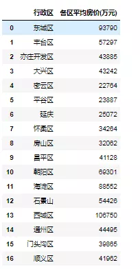
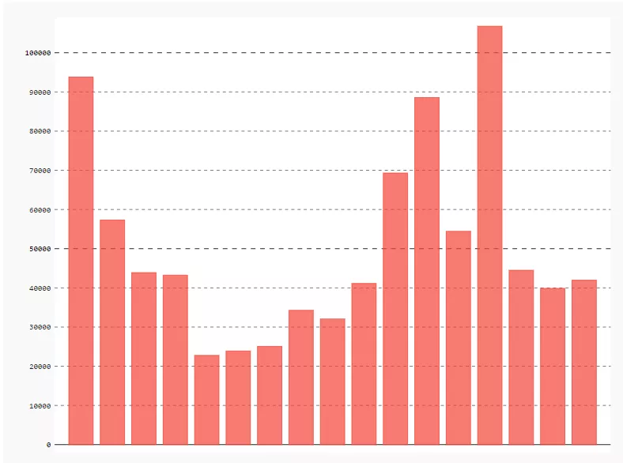
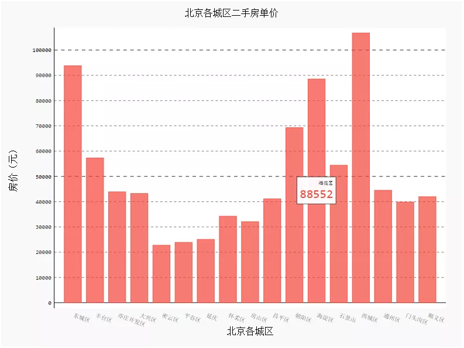
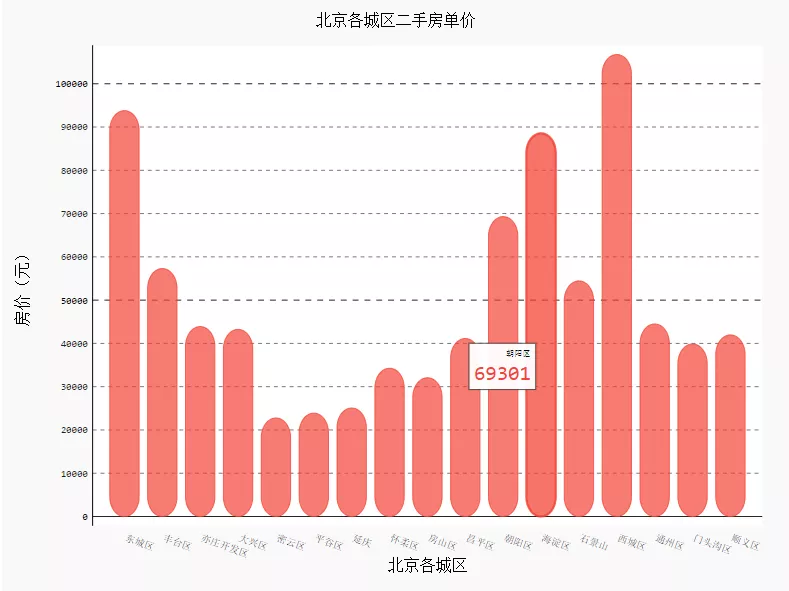
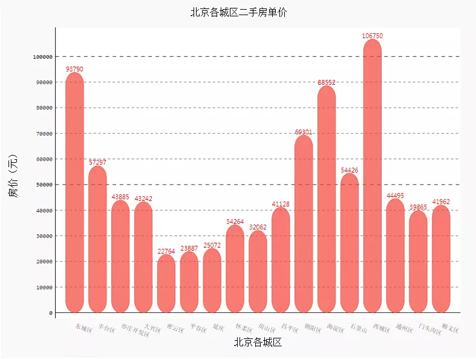
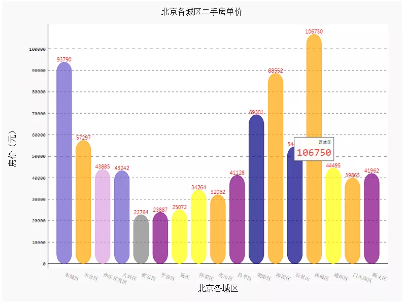
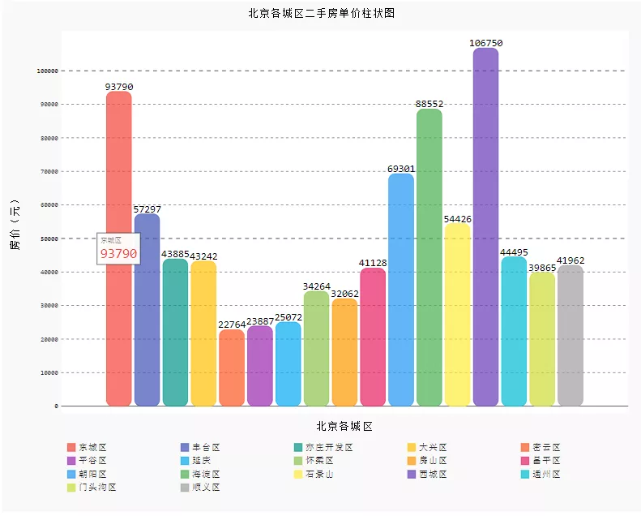
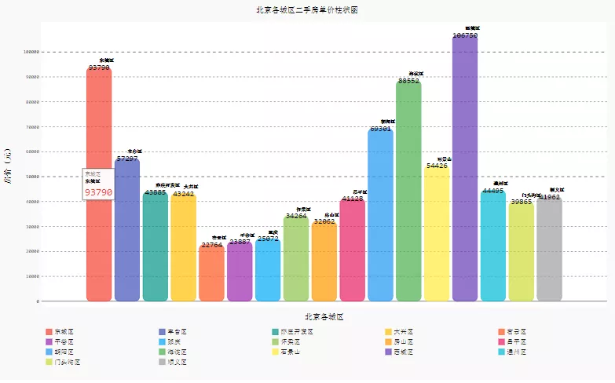

Python Pygal
<a name="NjEFf"></a>
### 以北京二手房数据为例，计算各区平均房价
```python
import pandas as pd
data=pd.read_excel('各区平均房价.xlsx')
data['各区平均房价(万元)']=[int(i) for i in data['各区平均房价(万元)'].values.tolist()]
data
```

<a name="kZ4Gj"></a>
### 画出各区平均房价基本柱状图
```python
import pygal
#设置pygal与jupyter notebook交互
from IPython.display import display, HTML
base_html = """
<!DOCTYPE html>
<html>
  <head>
  <script type="text/javascript" src="http://kozea.github.com/pygal.js/javascripts/svg.jquery.js"></script>
  <script type="text/javascript" src="https://kozea.github.io/pygal.js/2.0.x/pygal-tooltips.min.js""></script>
  </head>
  <body>
    <figure>
      {rendered_chart}
    </figure>
  </body>
</html>
"""
```
```python
import pygal
from pygal.style import *
bar_chart = pygal.Bar(show_legend=False)  #show_legend=False不显示图例
bar_chart.add('',data['各区平均房价(万元)'].values.tolist())
HTML(base_html.format(rendered_chart=bar_chart.render(is_unicode=True)))#图片渲染
```


<a name="8c396de1"></a>
### 添加标题、横坐标及X、Y轴坐标名称
```python
import pygal
from pygal.style import *
bar_chart = pygal.Bar(
    show_legend=False,     #show_legend=False不显示图例
    x_title='北京各城区',
    y_title='房价（元）',
)  
bar_chart.title='北京各城区二手房单价'
bar_chart.x_labels=data['行政区'].values.tolist()  #以列表的形式添加
bar_chart.add('',data['各区平均房价(万元)'].values.tolist())
HTML(base_html.format(rendered_chart=bar_chart.render(is_unicode=True)))#图片渲染
```

<a name="Tx7OR"></a>
### 设置横坐标样式（旋转角度）
```python
import pygal
from pygal.style import *
bar_chart = pygal.Bar(
    show_legend=False,        #show_legend=False不显示图例
    x_label_rotation=20,        #旋转横坐标角度
    x_title='北京各城区',
    y_title='房价（元）',
)  
bar_chart.title='北京各城区二手房单价'
bar_chart.x_labels=data['行政区'].values.tolist()
bar_chart.add('',data['各区平均房价(万元)'].values.tolist())
HTML(base_html.format(rendered_chart=bar_chart.render(is_unicode=True)))#图片渲染
```

<a name="xsXeV"></a>
### 给条形图增加一个效果
```python
import pygal
from pygal.style import *
bar_chart = pygal.Bar(
    show_legend=False,        #show_legend=False不显示图例
    x_label_rotation=20,        #旋转横坐标角度
    rounded_bars=20,
    x_title='北京各城区',
    y_title='房价（元）',
    
)  
bar_chart.title='北京各城区二手房单价'
bar_chart.x_labels=data['行政区'].values.tolist()
bar_chart.add('',data['各区平均房价(万元)'].values.tolist())
HTML(base_html.format(rendered_chart=bar_chart.render(is_unicode=True)))#图片渲染
```

<a name="0a6ea30a"></a>
### 添加数值并设置样式
```python
import pygal
from pygal.style import *
bar_chart = pygal.Bar(
    show_legend=False,        #show_legend=False不显示图例
    x_label_rotation=20,        #旋转横坐标角度
    rounded_bars=20,
    x_title='北京各城区',
    y_title='房价（元）',
    print_values=True,         #是否添加数值
    print_values_position='top', #数值位置
    style=DefaultStyle(
          value_font_family='googlefont:Raleway', #设置字体
          value_font_size=10,                     #设置大小
          value_colors=('red',))                  #设置颜色
)  
bar_chart.title='北京各城区二手房单价'
bar_chart.x_labels=data['行政区'].values.tolist()
bar_chart.add('',data['各区平均房价(万元)'].values.tolist())
HTML(base_html.format(rendered_chart=bar_chart.render(is_unicode=True)))#图片渲染
```

<a name="FYavx"></a>
### 设置柱形图颜色
```python
import pygal
from pygal.style import *
import random
colors = ['red','yellow','green','blue','gray','purple','orange','plum','Indigo','SlateBlue','Navy']
bar_chart = pygal.Bar(
    show_legend=False,        #show_legend=False不显示图例
    x_label_rotation=20,        #旋转横坐标角度
    x_title='北京各城区',
    y_title='房价（元）',
    rounded_bars=20,
    print_values=True,         #是否添加数值
    print_values_position='top', #数值位置
    style=DefaultStyle(
          value_font_family='googlefont:Raleway', #设置字体
          value_font_size=10,                     #设置大小
          value_colors=('red',))                  #设置颜色
)  
bar_chart.title='北京各城区二手房单价'
bar_chart.x_labels=data['行政区'].values.tolist()
list_values=[]
for i in data['各区平均房价(万元)'].values.tolist():
    list_values.append({'value':i,'color':random.choice(colors)})
bar_chart.add('',list_values)
HTML(base_html.format(rendered_chart=bar_chart.render(is_unicode=True)))#图片渲染
```

<a name="wajUR"></a>
### pygal还有一种更加简单漂亮的画法
```python
from pygal.style import *
bar_chart = pygal.Bar(
    width=1000,   #宽度
    height=800,   #高度
    print_values=True,  #是否显示数值
    print_labels_position='bottom',
    x_title='北京各城区',
    y_title='房价（元）',
    print_values_position='top',  #数值位置
    legend_at_bottom=True,       #是否显示图例
    style=DefaultStyle)
bar_chart.title = '北京各城区二手房单价柱状图'
for i,j in zip(data['行政区'].values.tolist(),data['各区平均房价(万元)'].values.tolist()):
    bar_chart.add(
        i,j,rounded_bars=10)
HTML(base_html.format(rendered_chart=bar_chart.render(is_unicode=True)))#图片渲染
```
<br />这种画法相当于将所有数值画到同一个横坐标中，所以不能添加横坐标，只能靠图例辨别，不过可以在图形上添加图例文本来弥补：
```python
from pygal.style import *
bar_chart = pygal.Bar(
    width=1300,   #宽度
    height=800,   #高度
    print_values=True,
    print_labels=True,
    print_values_position='top',
    print_labels_position='bottom',
    x_title='北京各城区',
    y_title='房价（元）',
    legend_at_bottom=True,       #是否显示图例
    style=DefaultStyle)
bar_chart.title = '北京各城区二手房单价柱状图'
for i,j in zip(data['行政区'].values.tolist(),data['各区平均房价(万元)'].values.tolist()):
    bar_chart.add(
        i,[{'value': int(j), 'label': i}],rounded_bars=10)
HTML(base_html.format(rendered_chart=bar_chart.render(is_unicode=True)))#图片渲染
```

