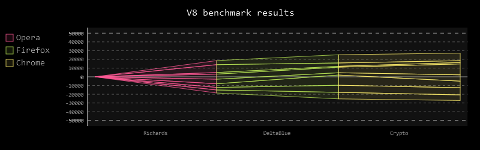

Python<br />pygal比较小众，「注于SVG图」，「擅长交互」，可弥补matplotlib和seaborn这方面的缺陷。<br />

---

<a name="segH7"></a>
## 一、pygal安装
```python
pip install pygal
```

---

<a name="OEGGI"></a>
## 二、常见图形绘制
<a name="OhNqq"></a>
### 1、pygal与jupyter notebook交互设置
pygal默认在jupyter notebook不显示，需要保存问svg、png等格式，浏览器打开查看，为了便于展示，做了如下设置可在jupyter notebook中展示。
```python
import pygal

#设置pygal与jupyter notebook交互
from IPython.display import display, HTML

base_html = """
<!DOCTYPE html>
<html>
  <head>
  <script type="text/javascript" src="http://kozea.github.com/pygal.js/javascripts/svg.jquery.js"></script>
  <script type="text/javascript" src="https://kozea.github.io/pygal.js/2.0.x/pygal-tooltips.min.js""></script>
  </head>
  <body>
    <figure>
      {rendered_chart}
    </figure>
  </body>
</html>
"""
```
<a name="Oq07I"></a>
### 2、 折线图`line`，`pygal.Line`
```python
from pygal.style import NeonStyle#绘图style导入
line_chart = pygal.Line(height=250,style=NeonStyle)
line_chart.title = 'Browser usage evolution (in %)'
line_chart.x_labels = map(str, range(2002, 2013))#添加x轴标签
line_chart.add('Firefox', [None, None,    0, 16.6,   25,   31, 36.4, 45.5, 46.3, 42.8, 37.1])#传入第一组数据
line_chart.add('Chrome',  [None, None, None, None, None, None,    0,  3.9, 10.8, 23.8, 35.3])
line_chart.add('IE',      [85.8, 84.6, 84.7, 74.5,   66, 58.6, 54.7, 44.8, 36.2, 26.6, 20.1])
line_chart.add('Others',  [14.2, 15.4, 15.3,  8.9,    9, 10.4,  8.9,  5.8,  6.7,  6.8,  7.5])
HTML(base_html.format(rendered_chart=line_chart.render(is_unicode=True)))#图片渲染
```

<a name="qqeUG"></a>
### 3、柱状图`bar`，`pygal.Bar`
```python
#柱状图bar，pygal.Bar
from pygal.style import NeonStyle
line_chart = pygal.Bar(height=250,style=NeonStyle)
line_chart.title = 'Browser usage evolution (in %)'
line_chart.x_labels = map(str, range(2002, 2013))
line_chart.add('Firefox', [None, None, 0, 16.6,   25,   31, 36.4, 45.5, 46.3, 42.8, 37.1])
line_chart.add('Chrome',  [None, None, None, None, None, None,    0,  3.9, 10.8, 23.8, 35.3])
line_chart.add('IE',      [85.8, 84.6, 84.7, 74.5,   66, 58.6, 54.7, 44.8, 36.2, 26.6, 20.1])
line_chart.add('Others',  [14.2, 15.4, 15.3,  8.9,    9, 10.4,  8.9,  5.8,  6.7,  6.8,  7.5])
HTML(base_html.format(rendered_chart=line_chart.render(is_unicode=True)))
```

<a name="bMOPD"></a>
### 4、水平柱状图`bar`，`pygal.HorizontalBar`
```python
#水平柱状图bar，pygal.HorizontalBar
from pygal.style import NeonStyle
line_chart = pygal.HorizontalBar(height=250,style=NeonStyle)
line_chart.title = 'Browser usage evolution (in %)'
line_chart.x_labels = map(str, range(2002, 2013))
line_chart.add('Firefox', [None, None, 0, 16.6,   25,   31, 36.4, 45.5, 46.3, 42.8, 37.1])
line_chart.add('Chrome',  [None, None, None, None, None, None,    0,  3.9, 10.8, 23.8, 35.3])
line_chart.add('IE',      [85.8, 84.6, 84.7, 74.5,   66, 58.6, 54.7, 44.8, 36.2, 26.6, 20.1])
line_chart.add('Others',  [14.2, 15.4, 15.3,  8.9,    9, 10.4,  8.9,  5.8,  6.7,  6.8,  7.5])
HTML(base_html.format(rendered_chart=line_chart.render(is_unicode=True))) 
```

<a name="KbWIO"></a>
### 5、堆积柱状图`bar`，`pygal.StackedBar`
```python
#堆积柱状图bar，pygal.StackedBar
from pygal.style import NeonStyle
line_chart = pygal.StackedBar(height=250,style=NeonStyle)
line_chart.title = 'Browser usage evolution (in %)'
line_chart.x_labels = map(str, range(2002, 2013))
line_chart.add('Firefox', [None, None, 0, 16.6,   25,   31, 36.4, 45.5, 46.3, 42.8, 37.1])
line_chart.add('Chrome',  [None, None, None, None, None, None,    0,  3.9, 10.8, 23.8, 35.3])
line_chart.add('IE',      [85.8, 84.6, 84.7, 74.5,   66, 58.6, 54.7, 44.8, 36.2, 26.6, 20.1])
line_chart.add('Others',  [14.2, 15.4, 15.3,  8.9,    9, 10.4,  8.9,  5.8,  6.7,  6.8,  7.5])
HTML(base_html.format(rendered_chart=line_chart.render(is_unicode=True)))
```

<a name="hub5n"></a>
### 6、直方图`hist`，`pygal.Histogram`
```python
#直方图hist，pygal.Histogram
from pygal.style import NeonStyle
hist = pygal.Histogram(height=250,style=NeonStyle)
hist.add('Wide bars', [(5, 0, 10), (4, 5, 13), (2, 0, 15)])#每个柱子传入三个参数：纵坐标高、x轴起始点、x轴终止点
hist.add('Narrow bars',  [(10, 1, 2), (12, 4, 4.5), (8, 11, 13)])
HTML(base_html.format(rendered_chart=hist.render(is_unicode=True))) 
```

<a name="QxhgK"></a>
### 7、散点图`scatter`，`pygal.XY`
```python
#散点图scatter，pygal.XY
from pygal.style import NeonStyle
xy_chart = pygal.XY(stroke=False,height=250,style=NeonStyle)
xy_chart.title = 'Correlation'
xy_chart.add('A', [(0, 0), (.1, .2), (.3, .1), (.5, 1), (.8, .6), (1, 1.08), (1.3, 1.1), (2, 3.23), (2.43, 2)])
xy_chart.add('B', [(.1, .15), (.12, .23), (.4, .3), (.6, .4), (.21, .21), (.5, .3), (.6, .8), (.7, .8)])
xy_chart.add('C', [(.05, .01), (.13, .02), (1.5, 1.7), (1.52, 1.6), (1.8, 1.63), (1.5, 1.82), (1.7, 1.23), (2.1, 2.23), (2.3, 1.98)])
HTML(base_html.format(rendered_chart=xy_chart.render(is_unicode=True)))
```

<a name="PsZrx"></a>
### 8、时间序列图，`pygal.DateTimeLine`
```python
#时间序列图，pygal.DateTimeLine
from pygal.style import NeonStyle
from datetime import datetime
datetimeline = pygal.DateTimeLine(height=250,style=NeonStyle,
    x_label_rotation=35, truncate_label=-1,
    x_value_formatter=lambda dt: dt.strftime('%d, %b %Y at %I:%M:%S %p'))
datetimeline.add("Serie", [
    (datetime(2013, 1, 2, 12, 0), 300),
    (datetime(2013, 1, 12, 14, 30, 45), 412),
    (datetime(2013, 2, 2, 6), 823),
    (datetime(2013, 2, 22, 9, 45), 672)
])
HTML(base_html.format(rendered_chart=datetimeline.render(is_unicode=True)))
```

<a name="mVLqG"></a>
### 9、饼图`pie`，`pygal.Pie`
```python
#饼图pie，pygal.Pie
from pygal.style import NeonStyle
pie_chart = pygal.Pie(height=250,style=NeonStyle)
pie_chart.title = 'Browser usage in February 2012 (in %)'
pie_chart.add('IE', 19.5)
pie_chart.add('Firefox', 36.6)
pie_chart.add('Chrome', 36.3)
pie_chart.add('Safari', 4.5)
pie_chart.add('Opera', 2.3)
HTML(base_html.format(rendered_chart=pie_chart.render(is_unicode=True)))
```

<a name="hsgry"></a>
### 10、饼图`pie`，`pygal.Pie`半圆显示
```python
#饼图pie，pygal.Pie半圆显示
from pygal.style import NeonStyle
pie_chart = pygal.Pie(half_pie=True,height=250,style=NeonStyle)
pie_chart.title = 'Browser usage in February 2012 (in %)'
pie_chart.add('IE', 19.5)
pie_chart.add('Firefox', 36.6)
pie_chart.add('Chrome', 36.3)
pie_chart.add('Safari', 4.5)
pie_chart.add('Opera', 2.3)
HTML(base_html.format(rendered_chart=pie_chart.render(is_unicode=True)))
```

<a name="n5IQi"></a>
### 11、雷达图`radar`，`pygal.Radar`
```python
# 雷达图radar，pygal.Radar
from pygal.style import NeonStyle
radar_chart = pygal.Radar(height=550,style=NeonStyle)
radar_chart.title = 'V8 benchmark results'
radar_chart.x_labels = ['Richards', 'DeltaBlue', 'Crypto', 'RayTrace', 'EarleyBoyer', 'RegExp', 'Splay', 'NavierStokes']
radar_chart.add('Chrome', [6395, 8212, 7520, 7218, 12464, 1660, 2123, 8607])
radar_chart.add('Firefox', [7473, 8099, 11700, 2651, 6361, 1044, 3797, 9450])
radar_chart.add('Opera', [3472, 2933, 4203, 5229, 5810, 1828, 9013, 4669])
radar_chart.add('IE', [43, 41, 59, 79, 144, 136, 34, 102])
HTML(base_html.format(rendered_chart=radar_chart.render(is_unicode=True)))
```

<a name="fpVdx"></a>
### 12、箱图，`pygal.Box`
```python
from pygal.style import NeonStyle
box_plot = pygal.Box(box_mode="tukey",height=250,style=NeonStyle)#box_mode可选default，1.5IQR，tukey，stdev，pstdev，
box_plot.title = 'V8 benchmark results'
box_plot.add('Chrome', [6395, 8212, 7520, 7218, 12464, 1660, 2123, 8607])
box_plot.add('Firefox', [7473, 8099, 11700, 2651, 6361, 1044, 3797, 9450])
box_plot.add('Opera', [3472, 2933, 4203, 5229, 5810, 1828, 9013, 4669])
box_plot.add('IE', [43, 41, 59, 79, 144, 136, 34, 102])
HTML(base_html.format(rendered_chart=box_plot.render(is_unicode=True)))
```

<a name="sU20P"></a>
### 13、气泡图`dot`，`pygal.Dot`
```python
#气泡图dot，pygal.Dot
#气泡大小随数值大小变化
from pygal.style import NeonStyle
dot_chart = pygal.Dot(x_label_rotation=30,height=250,style=NeonStyle)
dot_chart.title = 'V8 benchmark results'
dot_chart.x_labels = ['Richards', 'DeltaBlue', 'Crypto', 'RayTrace', 'EarleyBoyer', 'RegExp', 'Splay', 'NavierStokes']
dot_chart.add('Chrome', [-6395, 8212, 7520, 7218, 12464, 1660, 2123, 8607])#负值气泡不填充
dot_chart.add('Firefox', [7473, 8099, 11700, 2651, 6361, 1044, 3797, 9450])
dot_chart.add('Opera', [3472, 2933, 4203, 5229, 5810, 1828, 9013, 4669])
dot_chart.add('IE', [43, 41, 59, 79, 144, 136, 34, 102])
HTML(base_html.format(rendered_chart=dot_chart.render(is_unicode=True)))
```

<a name="Z4KI6"></a>
### 14、漏斗图`funnel`，`pygal.Funnel`
```python
#漏斗图funnel，pygal.Funnel
from pygal.style import NeonStyle
funnel_chart = pygal.Funnel(height=250,style=NeonStyle)
funnel_chart.title = 'V8 benchmark results'
funnel_chart.x_labels = ['Richards', 'DeltaBlue', 'Crypto', 'RayTrace', 'EarleyBoyer', 'RegExp', 'Splay', 'NavierStokes']
funnel_chart.add('Opera', [3472, 2933, 4203, 5229, 5810, 1828, 9013, 4669])
funnel_chart.add('Firefox', [7473, 8099, 11700, 2651, 6361, 1044, 3797, 9450])
funnel_chart.add('Chrome', [6395, 8212, 7520, 7218, 12464, 1660, 2123, 8607])
HTML(base_html.format(rendered_chart=funnel_chart.render(is_unicode=True)))
```

<a name="S1uit"></a>
### 15、仪表盘图，`pygal.SolidGauge`
```python
#仪表盘图，pygal.SolidGauge
from pygal.style import DarkSolarizedStyle
gauge = pygal.SolidGauge(inner_radius=0.70,height=350,style=DarkSolarizedStyle)#half_pie=True显示半边
percent_formatter = lambda x: '{:.10g}%'.format(x)
dollar_formatter = lambda x: '{:.10g}.format(x)'
gauge.value_formatter = percent_formatter

gauge.add('Series 1', [{'value': 225000, 'max_value': 1275000}],
          formatter=dollar_formatter)
gauge.add('Series 2', [{'value': 110, 'max_value': 100}])
gauge.add('Series 3', [{'value': 3}])
gauge.add(
    'Series 4', [
        {'value': 51, 'max_value': 100},
        {'value': 12, 'max_value': 100}])
gauge.add('Series 5', [{'value': 79, 'max_value': 100}])
gauge.add('Series 6', 99)
gauge.add('Series 7', [{'value': 100, 'max_value': 100}])
HTML(base_html.format(rendered_chart=gauge.render(is_unicode=True)))
```

<a name="bTJfg"></a>
### 16、金字塔图`pyramid`，`pygal.Pyramid`
```python
#金字塔图pyramid，pygal.Pyramid
from pygal.style import NeonStyle
ages = [(364381, 358443, 360172, 345848, 334895, 326914, 323053, 312576, 302015, 301277, 309874, 318295, 323396, 332736, 330759, 335267, 345096, 352685, 368067, 381521, 380145, 378724, 388045, 382303, 373469, 365184, 342869, 316928, 285137, 273553, 250861, 221358, 195884, 179321, 171010, 162594, 152221, 148843, 143013, 135887, 125824, 121493, 115913, 113738, 105612, 99596, 91609, 83917, 75688, 69538, 62999, 58864, 54593, 48818, 44739, 41096, 39169, 36321, 34284, 32330, 31437, 30661, 31332, 30334, 23600, 21999, 20187, 19075, 16574, 15091, 14977, 14171, 13687, 13155, 12558, 11600, 10827, 10436, 9851, 9794, 8787, 7993, 6901, 6422, 5506, 4839, 4144, 3433, 2936, 2615),
   (346205, 340570, 342668, 328475, 319010, 312898, 308153, 296752, 289639, 290466, 296190, 303871, 309886, 317436, 315487, 316696, 325772, 331694, 345815, 354696, 354899, 351727, 354579, 341702, 336421, 321116, 292261, 261874, 242407, 229488, 208939, 184147, 162662, 147361, 140424, 134336, 126929, 125404, 122764, 116004, 105590, 100813, 95021, 90950, 85036, 79391, 72952, 66022, 59326, 52716, 46582, 42772, 38509, 34048, 30887, 28053, 26152, 23931, 22039, 20677, 19869, 19026, 18757, 18308, 14458, 13685, 12942, 12323, 11033, 10183, 10628, 10803, 10655, 10482, 10202, 10166, 9939, 10138, 10007, 10174, 9997, 9465, 9028, 8806, 8450, 7941, 7253, 6698, 6267, 5773),
   (0, 0, 0, 0, 0, 0, 0, 0, 0, 0, 0, 0, 0, 0, 0, 0, 23, 91, 412, 1319, 2984, 5816, 10053, 16045, 24240, 35066, 47828, 62384, 78916, 97822, 112738, 124414, 130658, 140789, 153951, 168560, 179996, 194471, 212006, 225209, 228886, 239690, 245974, 253459, 255455, 260715, 259980, 256481, 252222, 249467, 240268, 238465, 238167, 231361, 223832, 220459, 222512, 220099, 219301, 221322, 229783, 239336, 258360, 271151, 218063, 213461, 207617, 196227, 174615, 160855, 165410, 163070, 157379, 149698, 140570, 131785, 119936, 113751, 106989, 99294, 89097, 78413, 68174, 60592, 52189, 43375, 35469, 29648, 24575, 20863),
   (0, 0, 0, 0, 0, 0, 0, 0, 0, 0, 0, 0, 0, 0, 0, 0, 74, 392, 1351, 3906, 7847, 12857, 19913, 29108, 42475, 58287, 74163, 90724, 108375, 125886, 141559, 148061, 152871, 159725, 171298, 183536, 196136, 210831, 228757, 238731, 239616, 250036, 251759, 259593, 261832, 264864, 264702, 264070, 258117, 253678, 245440, 241342, 239843, 232493, 226118, 221644, 223440, 219833, 219659, 221271, 227123, 232865, 250646, 261796, 210136, 201824, 193109, 181831, 159280, 145235, 145929, 140266, 133082, 124350, 114441, 104655, 93223, 85899, 78800, 72081, 62645, 53214, 44086, 38481, 32219, 26867, 21443, 16899, 13680, 11508),
   (0, 0, 0, 0, 0, 0, 0, 0, 0, 0, 0, 0, 0, 0, 0, 0, 7, 5, 17, 15, 31, 34, 38, 35, 45, 299, 295, 218, 247, 252, 254, 222, 307, 316, 385, 416, 463, 557, 670, 830, 889, 1025, 1149, 1356, 1488, 1835, 1929, 2130, 2362, 2494, 2884, 3160, 3487, 3916, 4196, 4619, 5032, 5709, 6347, 7288, 8139, 9344, 11002, 12809, 11504, 11918, 12927, 13642, 13298, 14015, 15751, 17445, 18591, 19682, 20969, 21629, 22549, 23619, 25288, 26293, 27038, 27039, 27070, 27750, 27244, 25905, 24357, 22561, 21794, 20595),
   (0, 0, 0, 0, 0, 0, 0, 0, 0, 0, 0, 0, 0, 0, 0, 0, 6, 8, 0, 8, 21, 34, 49, 84, 97, 368, 401, 414, 557, 654, 631, 689, 698, 858, 1031, 1120, 1263, 1614, 1882, 2137, 2516, 2923, 3132, 3741, 4259, 4930, 5320, 5948, 6548, 7463, 8309, 9142, 10321, 11167, 12062, 13317, 15238, 16706, 18236, 20336, 23407, 27024, 32502, 37334, 34454, 38080, 41811, 44490, 45247, 46830, 53616, 58798, 63224, 66841, 71086, 73654, 77334, 82062, 87314, 92207, 94603, 94113, 92753, 93174, 91812, 87757, 84255, 79723, 77536, 74173),
   (0, 0, 0, 0, 0, 0, 0, 0, 0, 0, 0, 0, 0, 0, 0, 0, 0, 1, 5, 0, 11, 35, 137, 331, 803, 1580, 2361, 3632, 4866, 6849, 8754, 10422, 12316, 14152, 16911, 19788, 22822, 27329, 31547, 35711, 38932, 42956, 46466, 49983, 52885, 55178, 56549, 57632, 57770, 57427, 56348, 55593, 55554, 53266, 51084, 49342, 48555, 47067, 45789, 44988, 44624, 44238, 46267, 46203, 36964, 33866, 31701, 28770, 25174, 22702, 21934, 20638, 19051, 17073, 15381, 13736, 11690, 10368, 9350, 8375, 7063, 6006, 5044, 4030, 3420, 2612, 2006, 1709, 1264, 1018),
   (0, 0, 0, 0, 0, 0, 0, 0, 0, 0, 0, 0, 0, 0, 0, 0, 4, 6, 11, 20, 68, 179, 480, 1077, 2094, 3581, 5151, 7047, 9590, 12434, 15039, 17257, 19098, 21324, 24453, 27813, 32316, 37281, 43597, 49647, 53559, 58888, 62375, 67219, 70956, 73547, 74904, 75994, 76224, 74979, 72064, 70330, 68944, 66527, 63073, 60899, 60968, 58756, 57647, 56301, 57246, 57068, 59027, 59187, 47549, 44425, 40976, 38077, 32904, 29431, 29491, 28020, 26086, 24069, 21742, 19498, 17400, 15738, 14451, 13107, 11568, 10171, 8530, 7273, 6488, 5372, 4499, 3691, 3259, 2657)]

types = ['Males single', 'Females single',
         'Males married', 'Females married',
         'Males widowed', 'Females widowed',
         'Males divorced', 'Females divorced']

pyramid_chart = pygal.Pyramid(human_readable=True, legend_at_bottom=True,height=350,style=NeonStyle)
pyramid_chart.title = 'England population by age in 2010 (source: ons.gov.uk)'
pyramid_chart.x_labels = map(lambda x: str(x) if not x % 5 else '', range(90))
for type, age in zip(types, ages):
    pyramid_chart.add(type, age)
HTML(base_html.format(rendered_chart=pyramid_chart.render(is_unicode=True)))
```

<a name="VSTMS"></a>
### 17、树地图`treemap`，`pygal.Treemap`
```python
#树地图treemap，pygal.Treemap
from pygal.style import NeonStyle
treemap = pygal.Treemap(height=350,style=NeonStyle)
treemap.title = 'Binary TreeMap'
treemap.add('A', [2, 1, 12, 4, 2, 1, 1, 3, 12, 3, 4, None, 9])
treemap.add('B', [4, 2, 5, 10, 3, 4, 2, 7, 4, -10, None, 8, 3, 1])
treemap.add('C', [3, 8, 3, 3, 5, 3, 3, 5, 4, 12])
treemap.add('D', [23, 18])
treemap.add('E', [1, 2, 1, 2, 3, 3, 1, 2, 3,
      4, 3, 1, 2, 1, 1, 1, 1, 1])
treemap.add('F', [31])
treemap.add('G', [5, 9.3, 8.1, 12, 4, 3, 2])
treemap.add('H', [12, 3, 3])
HTML(base_html.format(rendered_chart=treemap.render(is_unicode=True)))
```


---

<a name="bdTLL"></a>
## 三、常见图形参数设置
详细见pygal官网。这里介绍部分。
```python
from pygal.style import LightSolarizedStyle
chart = pygal.Bar(margin_bottom=10,#图与低端距离，类似的有上下左右
                  height=450,
                  #style=NeonStyle,#设置绘图风格，pygal拥有23种style，
                  #其它style可选：'BlueStyle', 'CleanStyle', 'DarkColorizedStyle', 'DarkGreenBlueStyle', 'DarkGreenStyle', 'DarkSolarizedStyle', 'DarkStyle', 'DarkenStyle', 'DefaultStyle', 'DesaturateStyle', 'LightColorizedStyle', 'LightGreenStyle', 'LightSolarizedStyle', 'LightStyle', 'LightenStyle', 'NeonStyle', 'ParametricStyleBase', 'RedBlueStyle', 'RotateStyle', 'SaturateStyle', 'SolidColorStyle', 'Style', 'TurquoiseStyle'
                  
                  ##title设置
                  title=u'Some points', #图标题
                  x_title='X Axis',#x轴标题
                  y_title='Y Axis',#y轴标题
                  
                  ##label设置
                  show_x_labels=True,#显示x轴标签
                  x_label_rotation=20,#x轴标签倾斜角度
                  x_labels = list('ABCD'),#自定义x轴标签
                  value_formatter = lambda x: "%.2f" % x,#y轴刻度值格式化输出
                  
                  ##图例legend设置
                  show_legend=True,#开启图例
                  legend_at_bottom=True,#图例放置于底部
                  legend_at_bottom_columns=2,#图例标签显示行数
                  legend_box_size=12,#图例前箱子大小
                  
                  ##坐标轴axis设置
                  include_x_axis=True,#坐标轴开启
                  range=(0, 30),#设置y轴刻度值范围
                  
                  secondary_range=(10, 25),#第二坐标轴刻度范围
                  xrange=(0,10),#x轴刻度范围
                  
                  
                  
                  
                  ##柱子上text设置
                  print_values=True,#开启柱子上文本
                  print_values_position='top',#文本位置
                  style=LightSolarizedStyle(
                  value_font_family='googlefont:Raleway',#文本字体设置
                  value_font_size=15,#大小
                  value_colors=('red','blue'),#颜色设置
                  ),
                  
                 )
#chart.x_labels = u'αβγδ'#自定义x轴刻度标签
chart.add('line 1', [5, 15, 10, 8],
          secondary=True,#开启第二坐标轴
         )
chart.add('line 2', [15, 20, 8, 11])
HTML(base_html.format(rendered_chart=chart.render(is_unicode=True)))
```
<br /> 
