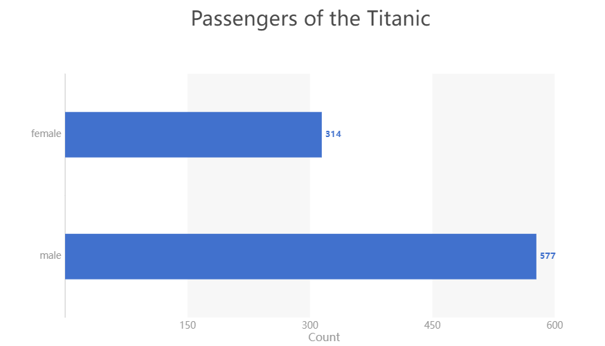
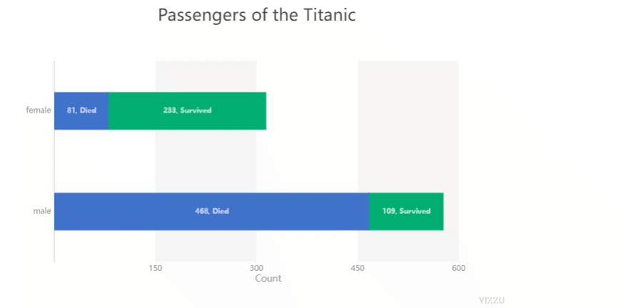
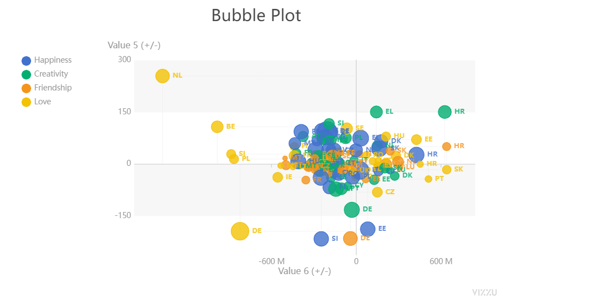
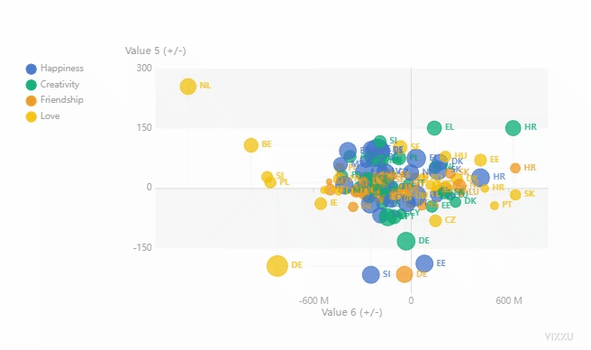

Python 可视化<br />介绍一款可视化模块，使用它可以绘制出十分惊艳的动图效果，那么当然第一步首先是要安装一下该模块，通过pip命令行来安装
```bash
pip install ipyvizzu
```
<a name="HjU1g"></a>
### **简单使用**
首先来简单地使用该模块来绘制一张动图，用Pandas导入数据集，代码如下
```python
import pandas as pd
from ipyvizzu import Chart, Data, Config

data_frame = pd.read_csv("titanic.csv")
```
在导入数据集完毕之后，先来介绍一下使用该模块的大致步骤，实例化`Data()`对象，然后将导入的数据集放置其中，代码如下
```python
data = Data()
data.add_data_frame(data_frame)
```
然后再实例化图表对象`Chart()`，将含有数据集的data放置其中
```python
chart = Chart()
chart.animate(data)
```
接下来开始绘制图表，需要指定好的是图表的一些属性，例如直方图的话就是X轴Y轴该放置什么样的数据，颜色选择是默认的还是需要另外指定的，以及标题等等
```python
chart.animate(Config({"x": "Count", "y": "Sex", "label": "Count","title":"Passengers of the Titanic"}))
```
output<br /><br />然后在此基础之上，再添加上下面的代码：
```python
chart.animate(Config({"x": ["Count","Survived"], "label": ["Count","Survived"], "color": "Survived"}))
```
output<br /><br />因此该模块绘制出来的所谓的动图，其实就是若干张静态图表的叠加，不妨来看一下完整的案例。
```python
import pandas as pd
from ipyvizzu import Chart, Data, Config

data_frame = pd.read_csv("titanic.csv")
data = Data()
data.add_data_frame(data_frame)

chart = Chart()
chart.animate(data)
chart.animate(Config({"x": "Count", "y": "Sex", "label": "Count","title":"Passengers of the Titanic"}))
chart.animate(Config({"x": ["Count","Survived"], "label": ["Count","Survived"], "color": "Survived"}))
chart.animate(Config({"x": "Count", "y": ["Sex","Survived"]}))
```
output<br />
<a name="KmE0E"></a>
### **散点图与直方图之间的动图转变**
可以自行去官网上查阅，Github的地址是：[https://github.com/vizzuhq/ipyvizzu/tree/main](https://github.com/vizzuhq/ipyvizzu/tree/main)<br />这里尝试来绘制绘制一下散点图与直方图之间的动图转变，首先是绘制散点图，代码如下
```python
import pandas as pd
from ipyvizzu import Chart, Data, Config, Style

data_frame = pd.read_csv("chart_types_eu.csv", dtype={"Year": str})
data = Data()
data.add_data_frame(data_frame)

chart = Chart()
chart.animate(data)

chart.animate(
	Config(
		{
			"channels": {
				"x": ["Joy factors", "Value 6 (+/-)"],
				"y": "Value 5 (+/-)",
				"color": "Joy factors",
				"size": "Value 2 (+)",
				"label": "Country_code",
			},
			"title": "Bubble Plot",
			"geometry": "circle",
		}
	)
)
```
output<br /><br />通过title参数在设置标题，size参数在设置散点的大小以及color参数在设置散点的颜色，接下来绘制直方图，代码如下：
```python
chart.animate(
    Config(
        {
            "channels": {
                "y": "Joy factors",
                "x": ["Value 2 (+)", "Country_code"],
                "label": None
            },
            "title": "Bar Chart",
            "geometry": "rectangle",
            "orientation": "vertical",
        }
    ),
    geometry={"delay": 0.7, "duration": 1},
)
```
output<br /><br />然后在直方图上标上标记，代码如下：
```python
chart.animate(
    Config(
        {"channels": {"x": {"set": ["Value 2 (+)"]}, "label": {"set": ["Value 2 (+)"]}}}
    )
)
```
总体来看一下出来的动图效果，如下图所示：<br /><br />无论是静态的图表还是动态，还有其他很多的案例，具体可以查阅以下的链接：[https://vizzuhq.github.io/ipyvizzu/examples/examples.html](https://vizzuhq.github.io/ipyvizzu/examples/examples.html)

 
