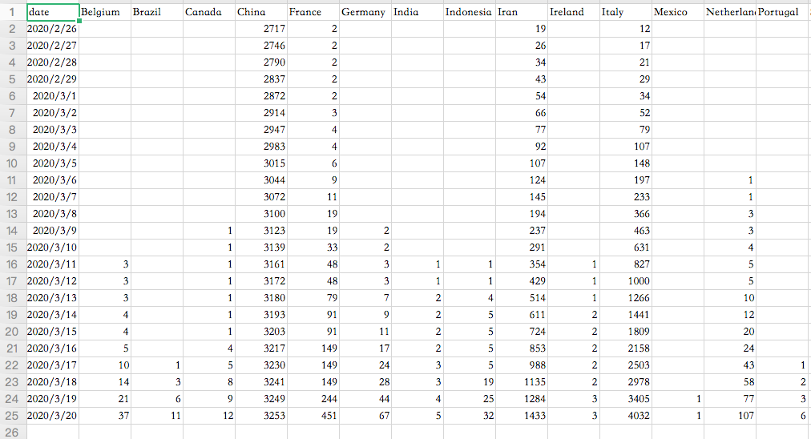
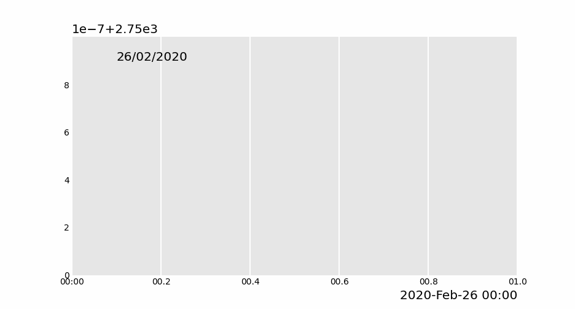
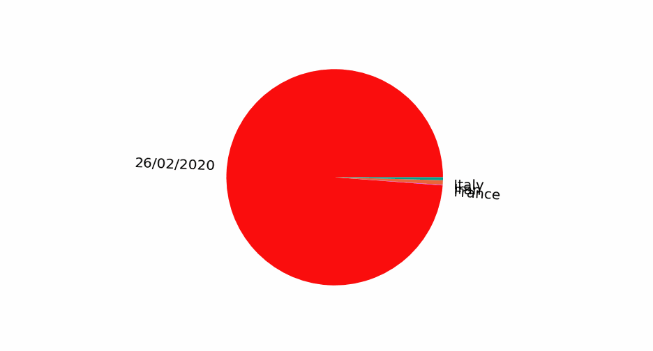

Python 动态图表<br />「**Pandas_Alive**」不仅包含动态条形图，还可以绘制**动态曲线图、气泡图、饼状图、地图**等。<br />同样也是几行代码就能完成动态图表的绘制。<br />GitHub地址：<br />_[https://github.com/JackMcKew/pandas_alive](https://github.com/JackMcKew/pandas_alive)_<br />使用文档：_[https://jackmckew.github.io/pandas_alive/](https://jackmckew.github.io/pandas_alive/)_<br />**安装版本建议是0.2.3**，**matplotlib版本是3.2.1**。<br />同时需自行安装tqdm(显示进度条)和descartes(绘制地图相关库)。<br />要不然会出现报错，估计是作者的requestment.txt没包含这两个库。<br />成功安装后就可以引入这个第三方库，直接选择加载本地文件。
```python
import pandas_alive
import pandas as pd
covid_df = pd.read_csv('data/covid19.csv', index_col=0, parse_dates=[0])
covid_df.plot_animated(filename='examples/example-barh-chart.gif', n_visible=15)
```
生成了一个GIF图，具体如下。<br /><br />刚开始学习这个库的时候，可以**减少数据**，这样**生成GIF的时间就会快一些**。<br />比如在接下来的使用中，基本都只选取了20天左右的数据。<br /><br />对于其他图表，可以查看官方文档的API说明，得以了解。
<a name="4c18aa6c"></a>
### 1、动态条形图
```python
elec_df = pd.read_csv("data/Aus_Elec_Gen_1980_2018.csv", index_col=0, parse_dates=[0], thousands=',')
elec_df = elec_df.iloc[:20, :]
elec_df.fillna(0).plot_animated('examples/example-electricity-generated-australia.gif', period_fmt="%Y",
                                title='Australian Electricity Generation Sources 1980-2018')
```

<a name="ZtAYJ"></a>
### 2、动态柱状图
```python
covid_df = pd.read_csv('data/covid19.csv', index_col=0, parse_dates=[0])
covid_df.plot_animated(filename='examples/example-barv-chart.gif', orientation='v', n_visible=15)
```

<a name="yW3UI"></a>
### 3、动态曲线图
```python
covid_df = pd.read_csv('data/covid19.csv', index_col=0, parse_dates=[0])
covid_df.diff().fillna(0).plot_animated(filename='examples/example-line-chart.gif', kind='line', period_label={'x': 0.25, 'y': 0.9})
```

<a name="rUhNE"></a>
### 4、动态面积图
```python
covid_df = pd.read_csv('data/covid19.csv', index_col=0, parse_dates=[0])
covid_df.sum(axis=1).fillna(0).plot_animated(filename='examples/example-bar-chart.gif', kind='bar',
        period_label={'x': 0.1, 'y': 0.9},
        enable_progress_bar=True, steps_per_period=2, interpolate_period=True, period_length=200
)
```

<a name="hU4ap"></a>
### 5、动态散点图
```python
max_temp_df = pd.read_csv(
    "data/Newcastle_Australia_Max_Temps.csv",
    parse_dates={"Timestamp": ["Year", "Month", "Day"]},
)
min_temp_df = pd.read_csv(
    "data/Newcastle_Australia_Min_Temps.csv",
    parse_dates={"Timestamp": ["Year", "Month", "Day"]},
)
max_temp_df = max_temp_df.iloc[:5000, :]
min_temp_df = min_temp_df.iloc[:5000, :]
merged_temp_df = pd.merge_asof(max_temp_df, min_temp_df, on="Timestamp")
merged_temp_df.index = pd.to_datetime(merged_temp_df["Timestamp"].dt.strftime('%Y/%m/%d'))
keep_columns = ["Minimum temperature (Degree C)", "Maximum temperature (Degree C)"]
merged_temp_df[keep_columns].resample("Y").mean().plot_animated(filename='examples/example-scatter-chart.gif', kind="scatter",
                                                                title='Max & Min Temperature Newcastle, Australia')
```

<a name="uZO4S"></a>
### 6、动态饼状图
```python
covid_df = pd.read_csv('data/covid19.csv', index_col=0, parse_dates=[0])
covid_df.plot_animated(filename='examples/example-pie-chart.gif', kind="pie",
                       rotatelabels=True, period_label={'x': 0, 'y': 0})
```

<a name="BWcY8"></a>
### 7、动态气泡图
```python
multi_index_df = pd.read_csv("data/multi.csv", header=[0, 1], index_col=0)
multi_index_df.index = pd.to_datetime(multi_index_df.index, dayfirst=True)
map_chart = multi_index_df.plot_animated(
    kind="bubble",
    filename="examples/example-bubble-chart.gif",
    x_data_label="Longitude",
    y_data_label="Latitude",
    size_data_label="Cases",
    color_data_label="Cases",
    vmax=5, steps_per_period=3, interpolate_period=True, period_length=500,
    dpi=100
)
```

<a name="f503520d"></a>
### 8、地理空间点图表
```python
import geopandas
import pandas_alive
import contextily
gdf = geopandas.read_file('data/nsw-covid19-cases-by-postcode.gpkg')
gdf.index = gdf.postcode
gdf = gdf.drop('postcode',axis=1)
result = gdf.iloc[:, :20]
result['geometry'] = gdf.iloc[:, -1:]['geometry']
map_chart = result.plot_animated(filename='examples/example-geo-point-chart.gif',
                                 basemap_format={'source':contextily.providers.Stamen.Terrain})
```

<a name="nAkXC"></a>
### 9、多边形地理图表
```python
import geopandas
import pandas_alive
import contextily
gdf = geopandas.read_file('data/italy-covid-region.gpkg')
gdf.index = gdf.region
gdf = gdf.drop('region',axis=1)
result = gdf.iloc[:, :20]
result['geometry'] = gdf.iloc[:, -1:]['geometry']
map_chart = result.plot_animated(filename='examples/example-geo-polygon-chart.gif',
                                 basemap_format={'source': contextily.providers.Stamen.Terrain})
```

<a name="bcc163e9"></a>
### 10、多个动态图表
```python
covid_df = pd.read_csv('data/covid19.csv', index_col=0, parse_dates=[0])
animated_line_chart = covid_df.diff().fillna(0).plot_animated(kind='line', period_label=False,add_legend=False)
animated_bar_chart = covid_df.plot_animated(n_visible=10)
pandas_alive.animate_multiple_plots('examples/example-bar-and-line-chart.gif',
                                    [animated_bar_chart, animated_line_chart], enable_progress_bar=True)
```

<a name="8f3802c9"></a>
### 11、城市人口
```python
def population():
    urban_df = pd.read_csv("data/urban_pop.csv", index_col=0, parse_dates=[0])
    animated_line_chart = (
        urban_df.sum(axis=1)
            .pct_change()
            .fillna(method='bfill')
            .mul(100)
            .plot_animated(kind="line", title="Total % Change in Population", period_label=False, add_legend=False)
    )
    animated_bar_chart = urban_df.plot_animated(n_visible=10, title='Top 10 Populous Countries', period_fmt="%Y")
    pandas_alive.animate_multiple_plots('examples/example-bar-and-line-urban-chart.gif',
                                        [animated_bar_chart, animated_line_chart],
                                        title='Urban Population 1977 - 2018', adjust_subplot_top=0.85,
                                        enable_progress_bar=True)
```
<br />

<a name="1HqCD"></a>
### 12、G7国家平均寿命
```python
def life():
    data_raw = pd.read_csv("data/long.csv")
    list_G7 = [
        "Canada",
        "France",
        "Germany",
        "Italy",
        "Japan",
        "United Kingdom",
        "United States",
    ]
    data_raw = data_raw.pivot(
        index="Year", columns="Entity", values="Life expectancy (Gapminder, UN)"
    )
    data = pd.DataFrame()
    data["Year"] = data_raw.reset_index()["Year"]
    for country in list_G7:
        data[country] = data_raw[country].values
        data = data.fillna(method="pad")
        data = data.fillna(0)
        data = data.set_index("Year").loc[1900:].reset_index()
        data["Year"] = pd.to_datetime(data.reset_index()["Year"].astype(str))
        data = data.set_index("Year")
        data = data.iloc[:25, :]
        animated_bar_chart = data.plot_animated(
            period_fmt="%Y", perpendicular_bar_func="mean", period_length=200, fixed_max=True
        )
        animated_line_chart = data.plot_animated(
            kind="line", period_fmt="%Y", period_length=200, fixed_max=True
        )
        pandas_alive.animate_multiple_plots(
            "examples/life-expectancy.gif",
            plots=[animated_bar_chart, animated_line_chart],
            title="Life expectancy in G7 countries up to 2015",
            adjust_subplot_left=0.2, adjust_subplot_top=0.9, enable_progress_bar=True
        )
```

<a name="yYjJB"></a>
### 13、新南威尔斯州COVID可视化
```python
def nsw():
    import geopandas
    import pandas as pd
    import pandas_alive
    import contextily
    import matplotlib.pyplot as plt
    import json
    with open('data/package_show.json', 'r', encoding='utf8')as fp:
        data = json.load(fp)
        # Extract url to csv component
        covid_nsw_data_url = data["result"]["resources"][0]["url"]
        print(covid_nsw_data_url)
        # Read csv from data API url
        nsw_covid = pd.read_csv('data/confirmed_cases_table1_location.csv')
        postcode_dataset = pd.read_csv("data/postcode-data.csv")
        # Prepare data from NSW health dataset
        nsw_covid = nsw_covid.fillna(9999)
        nsw_covid["postcode"] = nsw_covid["postcode"].astype(int)
        grouped_df = nsw_covid.groupby(["notification_date", "postcode"]).size()
        grouped_df = pd.DataFrame(grouped_df).unstack()
        grouped_df.columns = grouped_df.columns.droplevel().astype(str)
        grouped_df = grouped_df.fillna(0)
        grouped_df.index = pd.to_datetime(grouped_df.index)
        cases_df = grouped_df
        # Clean data in postcode dataset prior to matching
        grouped_df = grouped_df.T
        postcode_dataset = postcode_dataset[postcode_dataset['Longitude'].notna()]
        postcode_dataset = postcode_dataset[postcode_dataset['Longitude'] != 0]
        postcode_dataset = postcode_dataset[postcode_dataset['Latitude'].notna()]
        postcode_dataset = postcode_dataset[postcode_dataset['Latitude'] != 0]
        postcode_dataset['Postcode'] = postcode_dataset['Postcode'].astype(str)
        # Build GeoDataFrame from Lat Long dataset and make map chart
        grouped_df['Longitude'] = grouped_df.index.map(postcode_dataset.set_index('Postcode')['Longitude'].to_dict())
        grouped_df['Latitude'] = grouped_df.index.map(postcode_dataset.set_index('Postcode')['Latitude'].to_dict())
        gdf = geopandas.GeoDataFrame(
            grouped_df, geometry=geopandas.points_from_xy(grouped_df.Longitude, grouped_df.Latitude), crs="EPSG:4326")
        gdf = gdf.dropna()
        # Prepare GeoDataFrame for writing to geopackage
        gdf = gdf.drop(['Longitude', 'Latitude'], axis=1)
        gdf.columns = gdf.columns.astype(str)
        gdf['postcode'] = gdf.index
        # gdf.to_file("data/nsw-covid19-cases-by-postcode.gpkg", layer='nsw-postcode-covid', driver="GPKG")
        # Prepare GeoDataFrame for plotting
        gdf.index = gdf.postcode
        gdf = gdf.drop('postcode', axis=1)
        gdf = gdf.to_crs("EPSG:3857")  # Web Mercator
        result = gdf.iloc[:, :22]
        result['geometry'] = gdf.iloc[:, -1:]['geometry']
        gdf = result
        map_chart = gdf.plot_animated(basemap_format={'source': contextily.providers.Stamen.Terrain}, cmap='cool')
        # cases_df.to_csv('data/nsw-covid-cases-by-postcode.csv')
        cases_df = cases_df.iloc[:22, :]
        from datetime import datetime
        bar_chart = cases_df.sum(axis=1).plot_animated(
            kind='line',
            label_events={
                'Ruby Princess Disembark': datetime.strptime("19/03/2020", "%d/%m/%Y"),
                # 'Lockdown': datetime.strptime("31/03/2020", "%d/%m/%Y")
            },
            fill_under_line_color="blue",
            add_legend=False
        )
        map_chart.ax.set_title('Cases by Location')
        grouped_df = pd.read_csv('data/nsw-covid-cases-by-postcode.csv', index_col=0, parse_dates=[0])
        grouped_df = grouped_df.iloc[:22, :]
        line_chart = (
            grouped_df.sum(axis=1)
            .cumsum()
            .fillna(0)
            .plot_animated(kind="line", period_label=False, title="Cumulative Total Cases", add_legend=False)
        )
        def current_total(values):
            total = values.sum()
            s = f'Total : {int(total)}'
            return {'x': .85, 'y': .2, 's': s, 'ha': 'right', 'size': 11}
        race_chart = grouped_df.cumsum().plot_animated(
            n_visible=5, title="Cases by Postcode", period_label=False, period_summary_func=current_total
        )
        import time
        timestr = time.strftime("%d/%m/%Y")
        plots = [bar_chart, line_chart, map_chart, race_chart]
        from matplotlib import rcParams
        rcParams.update({"figure.autolayout": False})
        # make sure figures are `Figure()` instances
        figs = plt.Figure()
        gs = figs.add_gridspec(2, 3, hspace=0.5)
        f3_ax1 = figs.add_subplot(gs[0, :])
        f3_ax1.set_title(bar_chart.title)
        bar_chart.ax = f3_ax1
        f3_ax2 = figs.add_subplot(gs[1, 0])
        f3_ax2.set_title(line_chart.title)
        line_chart.ax = f3_ax2
        f3_ax3 = figs.add_subplot(gs[1, 1])
        f3_ax3.set_title(map_chart.title)
        map_chart.ax = f3_ax3
        f3_ax4 = figs.add_subplot(gs[1, 2])
        f3_ax4.set_title(race_chart.title)
        race_chart.ax = f3_ax4
        timestr = cases_df.index.max().strftime("%d/%m/%Y")
        figs.suptitle(f"NSW COVID-19 Confirmed Cases up to {timestr}")
        pandas_alive.animate_multiple_plots(
            'examples/nsw-covid.gif',
            plots,
            figs,
            enable_progress_bar=True
        )
```

<a name="cpUDG"></a>
### 14、意大利COVID可视化
```python
def italy():
    import geopandas
    import pandas as pd
    import pandas_alive
    import contextily
    import matplotlib.pyplot as plt
    region_gdf = geopandas.read_file('data/geo-data/italy-with-regions')
    region_gdf.NOME_REG = region_gdf.NOME_REG.str.lower().str.title()
    region_gdf = region_gdf.replace('Trentino-Alto Adige/Sudtirol', 'Trentino-Alto Adige')
    region_gdf = region_gdf.replace("Valle D'Aosta/Vallée D'Aoste\r\nValle D'Aosta/Vallée D'Aoste", "Valle d'Aosta")
    italy_df = pd.read_csv('data/Regional Data - Sheet1.csv', index_col=0, header=1, parse_dates=[0])
    italy_df = italy_df[italy_df['Region'] != 'NA']
    cases_df = italy_df.iloc[:, :3]
    cases_df['Date'] = cases_df.index
    pivoted = cases_df.pivot(values='New positives', index='Date', columns='Region')
    pivoted.columns = pivoted.columns.astype(str)
    pivoted = pivoted.rename(columns={'nan': 'Unknown Region'})
    cases_gdf = pivoted.T
    cases_gdf['geometry'] = cases_gdf.index.map(region_gdf.set_index('NOME_REG')['geometry'].to_dict())
    cases_gdf = cases_gdf[cases_gdf['geometry'].notna()]
    cases_gdf = geopandas.GeoDataFrame(cases_gdf, crs=region_gdf.crs, geometry=cases_gdf.geometry)
    gdf = cases_gdf
    result = gdf.iloc[:, :22]
    result['geometry'] = gdf.iloc[:, -1:]['geometry']
    gdf = result
    map_chart = gdf.plot_animated(basemap_format={'source': contextily.providers.Stamen.Terrain}, cmap='viridis')
    cases_df = pivoted
    cases_df = cases_df.iloc[:22, :]
    from datetime import datetime
    bar_chart = cases_df.sum(axis=1).plot_animated(
        kind='line',
        label_events={
            'Schools Close': datetime.strptime("4/03/2020", "%d/%m/%Y"),
            'Phase I Lockdown': datetime.strptime("11/03/2020", "%d/%m/%Y"),
            # '1M Global Cases': datetime.strptime("02/04/2020", "%d/%m/%Y"),
            # '100k Global Deaths': datetime.strptime("10/04/2020", "%d/%m/%Y"),
            # 'Manufacturing Reopens': datetime.strptime("26/04/2020", "%d/%m/%Y"),
            # 'Phase II Lockdown': datetime.strptime("4/05/2020", "%d/%m/%Y"),
        },
        fill_under_line_color="blue",
        add_legend=False
    )
    map_chart.ax.set_title('Cases by Location')
    line_chart = (
        cases_df.sum(axis=1)
            .cumsum()
            .fillna(0)
            .plot_animated(kind="line", period_label=False, title="Cumulative Total Cases", add_legend=False)
    )
    def current_total(values):
        total = values.sum()
        s = f'Total : {int(total)}'
        return {'x': .85, 'y': .1, 's': s, 'ha': 'right', 'size': 11}
    race_chart = cases_df.cumsum().plot_animated(
        n_visible=5, title="Cases by Region", period_label=False, period_summary_func=current_total
    )
    import time
    timestr = time.strftime("%d/%m/%Y")
    plots = [bar_chart, race_chart, map_chart, line_chart]
    # Otherwise titles overlap and adjust_subplot does nothing
    from matplotlib import rcParams
    from matplotlib.animation import FuncAnimation
    rcParams.update({"figure.autolayout": False})
    # make sure figures are `Figure()` instances
    figs = plt.Figure()
    gs = figs.add_gridspec(2, 3, hspace=0.5)
    f3_ax1 = figs.add_subplot(gs[0, :])
    f3_ax1.set_title(bar_chart.title)
    bar_chart.ax = f3_ax1
    f3_ax2 = figs.add_subplot(gs[1, 0])
    f3_ax2.set_title(race_chart.title)
    race_chart.ax = f3_ax2
    f3_ax3 = figs.add_subplot(gs[1, 1])
    f3_ax3.set_title(map_chart.title)
    map_chart.ax = f3_ax3
    f3_ax4 = figs.add_subplot(gs[1, 2])
    f3_ax4.set_title(line_chart.title)
    line_chart.ax = f3_ax4
    axes = [f3_ax1, f3_ax2, f3_ax3, f3_ax4]
    timestr = cases_df.index.max().strftime("%d/%m/%Y")
    figs.suptitle(f"Italy COVID-19 Confirmed Cases up to {timestr}")
    pandas_alive.animate_multiple_plots(
        'examples/italy-covid.gif',
        plots,
        figs,
        enable_progress_bar=True
    )
```

<a name="YEmJR"></a>
### 15、单摆运动
```python
def simple():
    import pandas as pd
    import matplotlib.pyplot as plt
    import pandas_alive
    import numpy as np
    # Physical constants
    g = 9.81
    L = .4
    mu = 0.2
    THETA_0 = np.pi * 70 / 180  # init angle = 70degs
    THETA_DOT_0 = 0  # no init angVel
    DELTA_T = 0.01  # time stepping
    T = 1.5  # time period
    # Definition of ODE (ordinary differential equation)
    def get_theta_double_dot(theta, theta_dot):
        return -mu * theta_dot - (g / L) * np.sin(theta)
    # Solution to the differential equation
    def pendulum(t):
        # initialise changing values
        theta = THETA_0
        theta_dot = THETA_DOT_0
        delta_t = DELTA_T
        ang = []
        ang_vel = []
        ang_acc = []
        times = []
        for time in np.arange(0, t, delta_t):
            theta_double_dot = get_theta_double_dot(
                theta, theta_dot
            )
            theta += theta_dot * delta_t
            theta_dot += theta_double_dot * delta_t
            times.append(time)
            ang.append(theta)
            ang_vel.append(theta_dot)
            ang_acc.append(theta_double_dot)
            data = np.array([ang, ang_vel, ang_acc])
            return pd.DataFrame(data=data.T, index=np.array(times), columns=["angle", "ang_vel", "ang_acc"])
        # units used for ref: ["angle [rad]", "ang_vel [rad/s]", "ang_acc [rad/s^2]"]
        df = pendulum(T)
        df.index.names = ["Time (s)"]
        print(df)
        # generate dataFrame for animated bubble plot
        df2 = pd.DataFrame(index=df.index)
        df2["dx (m)"] = L * np.sin(df["angle"])
        df2["dy (m)"] = -L * np.cos(df["angle"])
        df2["ang_vel"] = abs(df["ang_vel"])
        df2["size"] = df2["ang_vel"] * 100  # scale angular vels to get nice size on bubble plot
        print(df2)
        # static pandas plots
        #
        # print(plt.style.available)
        # NOTE: 2 lines below required in Jupyter to switch styles correctly
        plt.rcParams.update(plt.rcParamsDefault)
        plt.style.use("ggplot")  # set plot style
        fig, (ax1a, ax2b) = plt.subplots(1, 2, figsize=(8, 4), dpi=100)  # 1 row, 2 subplots
        # fig.subplots_adjust(wspace=0.1)      # space subplots in row
        fig.set_tight_layout(True)
        fontsize = "small"
        df.plot(ax=ax1a).legend(fontsize=fontsize)
        ax1a.set_title("Outputs vs Time", fontsize="medium")
        ax1a.set_xlabel('Time [s]', fontsize=fontsize)
        ax1a.set_ylabel('Amplitudes', fontsize=fontsize);
        df.plot(ax=ax2b, x="angle", y=["ang_vel", "ang_acc"]).legend(fontsize=fontsize)
        ax2b.set_title("Outputs vs Angle | Phase-Space", fontsize="medium")
        ax2b.set_xlabel('Angle [rad]', fontsize=fontsize)
        ax2b.set_ylabel('Angular Velocity / Acc', fontsize=fontsize)
        # sample scatter plot with colorbar
        fig, ax = plt.subplots()
        sc = ax.scatter(df2["dx (m)"], df2["dy (m)"], s=df2["size"] * .1, c=df2["ang_vel"], cmap="jet")
        cbar = fig.colorbar(sc)
        cbar.set_label(label="ang_vel [rad/s]", fontsize="small")
        # sc.set_clim(350, 400)
        ax.tick_params(labelrotation=0, labelsize="medium")
        ax_scale = 1.
        ax.set_xlim(-L * ax_scale, L * ax_scale)
        ax.set_ylim(-L * ax_scale - 0.1, L * ax_scale - 0.1)
        # make axes square: a circle shows as a circle
        ax.set_aspect(1 / ax.get_data_ratio())
        ax.arrow(0, 0, df2["dx (m)"].iloc[-1], df2["dy (m)"].iloc[-1],
                 color="dimgray", ls=":", lw=2.5, width=.0, head_width=0, zorder=-1
                )
        ax.text(0, 0.15, s="size and colour of pendulum bob\nbased on pd column\nfor angular velocity",
                ha='center', va='center')
        # plt.show()
        dpi = 100
        ax_scale = 1.1
        figsize = (3, 3)
        fontsize = "small"
        # set up figure to pass onto `pandas_alive`
        # NOTE: by using Figure (capital F) instead of figure() `FuncAnimation` seems to run twice as fast!
        # fig1, ax1 = plt.subplots()
        fig1 = plt.Figure()
        ax1 = fig1.add_subplot()
        fig1.set_size_inches(figsize)
        ax1.set_title("Simple pendulum animation, L=" + str(L) + "m", fontsize="medium")
        ax1.set_xlabel("Time (s)", color='dimgray', fontsize=fontsize)
        ax1.set_ylabel("Amplitudes", color='dimgray', fontsize=fontsize)
        ax1.tick_params(labelsize=fontsize)
        # pandas_alive
        line_chart = df.plot_animated(filename="pend-line.gif", kind='line', period_label={'x': 0.05, 'y': 0.9},
                                      steps_per_period=1, interpolate_period=False, period_length=50,
                                      period_fmt='Time:{x:10.2f}',
                                      enable_progress_bar=True, fixed_max=True, dpi=100, fig=fig1
                                     )
        plt.close()
        # Video('examples/pend-line.mp4', html_attributes="controls muted autoplay")
        # set up and generate animated scatter plot
        #
        # set up figure to pass onto `pandas_alive`
        # NOTE: by using Figure (capital F) instead of figure() `FuncAnimation` seems to run twice as fast!
        fig1sc = plt.Figure()
        ax1sc = fig1sc.add_subplot()
        fig1sc.set_size_inches(figsize)
        ax1sc.set_title("Simple pendulum animation, L=" + str(L) + "m", fontsize="medium")
        ax1sc.set_xlabel("Time (s)", color='dimgray', fontsize=fontsize)
        ax1sc.set_ylabel("Amplitudes", color='dimgray', fontsize=fontsize)
        ax1sc.tick_params(labelsize=fontsize)
        # pandas_alive
        scatter_chart = df.plot_animated(filename="pend-scatter.gif", kind='scatter', period_label={'x': 0.05, 'y': 0.9},
                                         steps_per_period=1, interpolate_period=False, period_length=50,
                                         period_fmt='Time:{x:10.2f}',
                                         enable_progress_bar=True, fixed_max=True, dpi=100, fig=fig1sc, size="ang_vel"
                                        )
        plt.close()
        print("Points size follows one of the pd columns: ang_vel")
        # Video('./pend-scatter.gif', html_attributes="controls muted autoplay")
        # set up and generate animated bar race chart
        #
        # set up figure to pass onto `pandas_alive`
        # NOTE: by using Figure (capital F) instead of figure() `FuncAnimation` seems to run twice as fast!
        fig2 = plt.Figure()
        ax2 = fig2.add_subplot()
        fig2.set_size_inches(figsize)
        ax2.set_title("Simple pendulum animation, L=" + str(L) + "m", fontsize="medium")
        ax2.set_xlabel("Amplitudes", color='dimgray', fontsize=fontsize)
        ax2.set_ylabel("", color='dimgray', fontsize="x-small")
        ax2.tick_params(labelsize=fontsize)
        # pandas_alive
        race_chart = df.plot_animated(filename="pend-race.gif", kind='race', period_label={'x': 0.05, 'y': 0.9},
                                      steps_per_period=1, interpolate_period=False, period_length=50,
                                      period_fmt='Time:{x:10.2f}',
                                      enable_progress_bar=True, fixed_max=False, dpi=100, fig=fig2
                                     )
        plt.close()
        # set up and generate bubble animated plot
        #
        # set up figure to pass onto `pandas_alive`
        # NOTE: by using Figure (capital F) instead of figure() `FuncAnimation` seems to run twice as fast!
        fig3 = plt.Figure()
        ax3 = fig3.add_subplot()
        fig3.set_size_inches(figsize)
        ax3.set_title("Simple pendulum animation, L=" + str(L) + "m", fontsize="medium")
        ax3.set_xlabel("Hor Displacement (m)", color='dimgray', fontsize=fontsize)
        ax3.set_ylabel("Ver Displacement (m)", color='dimgray', fontsize=fontsize)
        # limits & ratio below get the graph square
        ax3.set_xlim(-L * ax_scale, L * ax_scale)
        ax3.set_ylim(-L * ax_scale - 0.1, L * ax_scale - 0.1)
        ratio = 1.  # this is visual ratio of axes
        ax3.set_aspect(ratio / ax3.get_data_ratio())
        ax3.arrow(0, 0, df2["dx (m)"].iloc[-1], df2["dy (m)"].iloc[-1],
                  color="dimgray", ls=":", lw=1, width=.0, head_width=0, zorder=-1)
        # pandas_alive
        bubble_chart = df2.plot_animated(
            kind="bubble", filename="pend-bubble.gif",
            x_data_label="dx (m)", y_data_label="dy (m)",
            size_data_label="size", color_data_label="ang_vel", cmap="jet",
            period_label={'x': 0.05, 'y': 0.9}, vmin=None, vmax=None,
            steps_per_period=1, interpolate_period=False, period_length=50, period_fmt='Time:{x:10.2f}s',
            enable_progress_bar=True, fixed_max=False, dpi=dpi, fig=fig3
        )
        plt.close()
        print("Bubble size & colour animates with pd data column for ang_vel.")
        # Combined plots
        #
        fontsize = "x-small"
        # Otherwise titles overlap and subplots_adjust does nothing
        from matplotlib import rcParams
        rcParams.update({"figure.autolayout": False})
        figs = plt.Figure(figsize=(9, 4), dpi=100)
        figs.subplots_adjust(wspace=0.1)
        gs = figs.add_gridspec(2, 2)
        ax1 = figs.add_subplot(gs[0, 0])
        ax1.set_xlabel("Time(s)", color='dimgray', fontsize=fontsize)
        ax1.set_ylabel("Amplitudes", color='dimgray', fontsize=fontsize)
        ax1.tick_params(labelsize=fontsize)
        ax2 = figs.add_subplot(gs[1, 0])
        ax2.set_xlabel("Amplitudes", color='dimgray', fontsize=fontsize)
        ax2.set_ylabel("", color='dimgray', fontsize=fontsize)
        ax2.tick_params(labelsize=fontsize)
        ax3 = figs.add_subplot(gs[:, 1])
        ax3.set_xlabel("Hor Displacement (m)", color='dimgray', fontsize=fontsize)
        ax3.set_ylabel("Ver Displacement (m)", color='dimgray', fontsize=fontsize)
        ax3.tick_params(labelsize=fontsize)
        # limits & ratio below get the graph square
        ax3.set_xlim(-L * ax_scale, L * ax_scale)
        ax3.set_ylim(-L * ax_scale - 0.1, L * ax_scale - 0.1)
        ratio = 1.  # this is visual ratio of axes
        ax3.set_aspect(ratio / ax3.get_data_ratio())
        line_chart.ax = ax1
        race_chart.ax = ax2
        bubble_chart.ax = ax3
        plots = [line_chart, race_chart, bubble_chart]
        # pandas_alive combined using custom figure
        pandas_alive.animate_multiple_plots(
            filename='pend-combined.gif', plots=plots, custom_fig=figs, dpi=100, enable_progress_bar=True,
            adjust_subplot_left=0.2, adjust_subplot_right=None,
            title="Simple pendulum animations, L=" + str(L) + "m", title_fontsize="medium"
        )
        plt.close()
```
<br />最后如果想完成**中文动态图表**的制作，加入中文显示代码即可。
```python
# 中文显示
plt.rcParams['font.sans-serif'] = ['SimHei']  # Windows
plt.rcParams['font.sans-serif'] = ['Hiragino Sans GB'] # Mac
plt.rcParams['axes.unicode_minus'] = False
# 读取数据
df_result = pd.read_csv('data/yuhuanshui.csv', index_col=0, parse_dates=[0])
# 生成图表
animated_line_chart = df_result.diff().fillna(0).plot_animated(kind='line', period_label=False, add_legend=False)
animated_bar_chart = df_result.plot_animated(n_visible=10)
pandas_alive.animate_multiple_plots('examples/yuhuanshui.gif',
                                    [animated_bar_chart, animated_line_chart], enable_progress_bar=True,
                                    title='我是余欢水演职人员热度排行')
```
还是使用演员的**百度指数**数据。<br />
