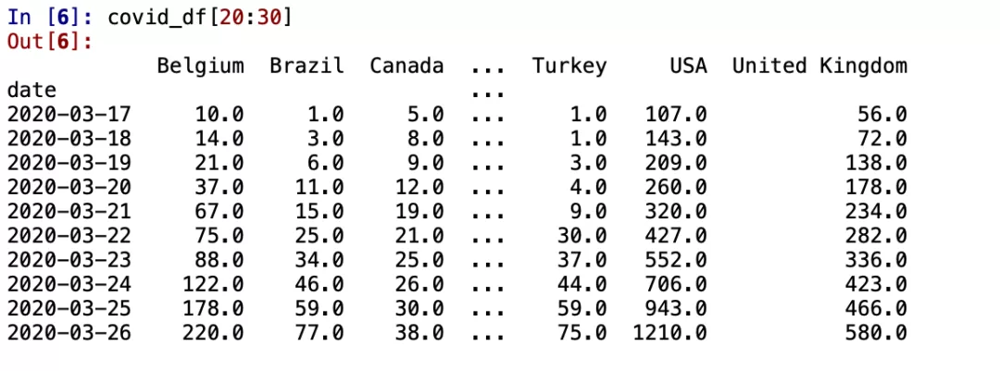
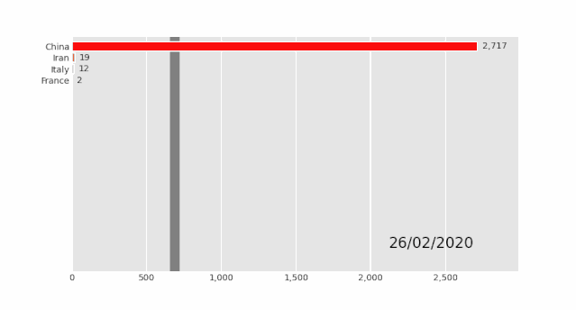
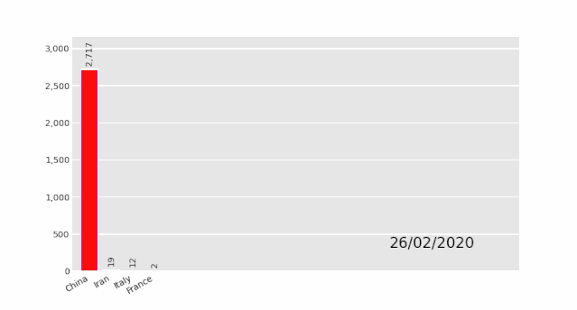
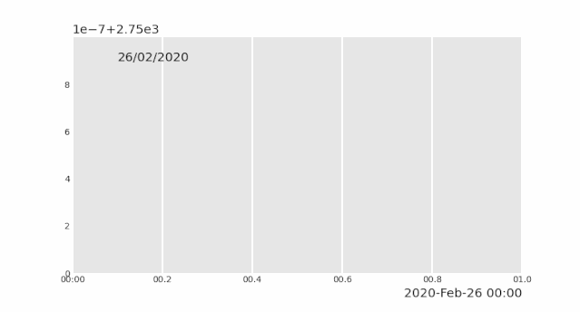
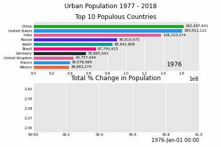
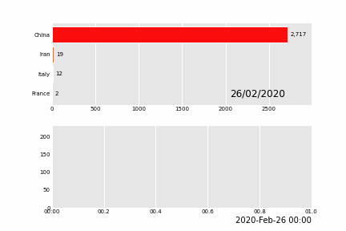
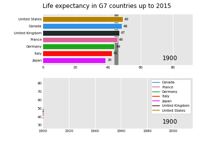
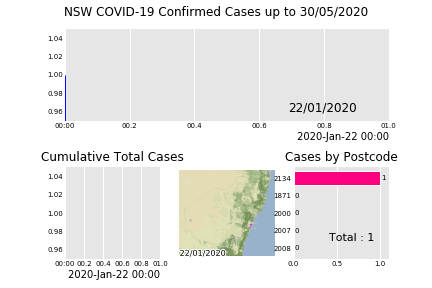

Python 可视化<br />数据动画可视化制作在日常工作中是非常实用的一项技能。目前支持动画可视化的库主要以Matplotlib-Animation为主，其特点为：配置复杂，保存动图容易报错。<br />分享一款非常棒的动画可视化工具：Pandas_Alive，它以 matplotlib 绘图为后端，不仅可以创建出令人惊叹的动画可视化，而且使用方法非常简单。本文详情如下：

- 安装方法
- 使用说明
- 支持示例展示
<a name="DXzZ3"></a>
### 安装方法
```bash
pip install pandas_alive  # 或者
conda install pandas_alive -c conda-forge
```
<a name="FVm9T"></a>
### 使用说明
pandas_alive 的设计灵感来自 bar_chart_race，为方便快速进行动画可视化制作，在数据的格式上需要满足如下条件：

- 每行表示单个时间段
- 每列包含特定类别的值
- 索引包含时间组件（可选）

<br />数据示例
<a name="CCBnJ"></a>
### 支持示例展示
<a name="GIBWn"></a>
#### 水平条形图
```python
import pandas_alive

covid_df = pandas_alive.load_dataset()

covid_df.plot_animated(filename='examples/perpendicular-example.gif',perpendicular_bar_func='mean')
```

<a name="TZxIp"></a>
#### 垂直条形图比赛
```python
import pandas_alive
covid_df = pandas_alive.load_dataset()
covid_df.plot_animated(filename='examples/example-barv-chart.gif',orientation='v')
```

<a name="rj0cr"></a>
#### 条形图
与时间与 x 轴一起显示的折线图类似
```python
import pandas_alive

covid_df = pandas_alive.load_dataset()

covid_df.sum(axis=1).fillna(0).plot_animated(filename='examples/example-bar-chart.gif',kind='bar',
        period_label={'x':0.1,'y':0.9},
        enable_progress_bar=True, steps_per_period=2, interpolate_period=True, period_length=200
)
```

<a name="h2ZF5"></a>
#### 饼图
```python
import pandas_alive

covid_df = pandas_alive.load_dataset()

covid_df.plot_animated(filename='examples/example-pie-chart.gif',kind="pie",rotatelabels=True,period_label={'x':0,'y':0})
```

<a name="CGmU9"></a>
#### 多边形地理空间图
```python
import geopandas
import pandas_alive
import contextily

gdf = geopandas.read_file('data/italy-covid-region.gpkg')
gdf.index = gdf.region
gdf = gdf.drop('region',axis=1)

map_chart = gdf.plot_animated(filename='examples/example-geo-polygon-chart.gif',basemap_format={'source':contextily.providers.Stamen.Terrain})
```

<a name="QMuYr"></a>
#### 多个图表
pandas_alive 支持单个可视化中的多个动画图表。
<a name="SS1OD"></a>
##### 示例1
```python
import pandas_alive

urban_df = pandas_alive.load_dataset("urban_pop")

animated_line_chart = (
    urban_df.sum(axis=1)
    .pct_change()
    .fillna(method='bfill')
    .mul(100)
    .plot_animated(kind="line", title="Total % Change in Population",period_label=False,add_legend=False)
)

animated_bar_chart = urban_df.plot_animated(n_visible=10,title='Top 10 Populous Countries',period_fmt="%Y")

pandas_alive.animate_multiple_plots('examples/example-bar-and-line-urban-chart.gif',[animated_bar_chart,animated_line_chart],
    title='Urban Population 1977 - 2018', adjust_subplot_top=0.85, enable_progress_bar=True)
```

<a name="e9DRD"></a>
##### 示例2
```python
import pandas_alive

covid_df = pandas_alive.load_dataset()

animated_line_chart = covid_df.diff().fillna(0).plot_animated(kind='line',period_label=False,add_legend=False)

animated_bar_chart = covid_df.plot_animated(n_visible=10)

pandas_alive.animate_multiple_plots('examples/example-bar-and-line-chart.gif',[animated_bar_chart,animated_line_chart],
    enable_progress_bar=True)
```

<a name="AfC37"></a>
##### 示例3
```python
import pandas_alive
import pandas as pd

data_raw = pd.read_csv(
    "https://raw.githubusercontent.com/owid/owid-datasets/master/datasets/Long%20run%20life%20expectancy%20-%20Gapminder%2C%20UN/Long%20run%20life%20expectancy%20-%20Gapminder%2C%20UN.csv"
)

list_G7 = [
    "Canada",
    "France",
    "Germany",
    "Italy",
    "Japan",
    "United Kingdom",
    "United States",
]

data_raw = data_raw.pivot(
    index="Year", columns="Entity", values="Life expectancy (Gapminder, UN)"
)

data = pd.DataFrame()
data["Year"] = data_raw.reset_index()["Year"]
for country in list_G7:
    data[country] = data_raw[country].values

data = data.fillna(method="pad")
data = data.fillna(0)
data = data.set_index("Year").loc[1900:].reset_index()

data["Year"] = pd.to_datetime(data.reset_index()["Year"].astype(str))

data = data.set_index("Year")

animated_bar_chart = data.plot_animated(
    period_fmt="%Y",perpendicular_bar_func="mean", period_length=200,fixed_max=True
)

animated_line_chart = data.plot_animated(
    kind="line", period_fmt="%Y", period_length=200,fixed_max=True
)

pandas_alive.animate_multiple_plots(
    "examples/life-expectancy.gif",
    plots=[animated_bar_chart, animated_line_chart],
    title="Life expectancy in G7 countries up to 2015",
    adjust_subplot_left=0.2, adjust_subplot_top=0.9, enable_progress_bar=True
)
```

<a name="p8bgB"></a>
##### 示例4
```python
import geopandas
import pandas as pd
import pandas_alive
import contextily
import matplotlib.pyplot as plt

import urllib.request, json

with urllib.request.urlopen(
    "https://data.nsw.gov.au/data/api/3/action/package_show?id=aefcde60-3b0c-4bc0-9af1-6fe652944ec2"
) as url:
    data = json.loads(url.read().decode())

# Extract url to csv component
covid_nsw_data_url = data["result"]["resources"][0]["url"]

# Read csv from data API url
nsw_covid = pd.read_csv(covid_nsw_data_url)
postcode_dataset = pd.read_csv("data/postcode-data.csv")

# Prepare data from NSW health dataset


nsw_covid = nsw_covid.fillna(9999)
nsw_covid["postcode"] = nsw_covid["postcode"].astype(int)

grouped_df = nsw_covid.groupby(["notification_date", "postcode"]).size()
grouped_df = pd.DataFrame(grouped_df).unstack()
grouped_df.columns = grouped_df.columns.droplevel().astype(str)

grouped_df = grouped_df.fillna(0)
grouped_df.index = pd.to_datetime(grouped_df.index)

cases_df = grouped_df

# Clean data in postcode dataset prior to matching

grouped_df = grouped_df.T
postcode_dataset = postcode_dataset[postcode_dataset['Longitude'].notna()]
postcode_dataset = postcode_dataset[postcode_dataset['Longitude'] != 0]
postcode_dataset = postcode_dataset[postcode_dataset['Latitude'].notna()]
postcode_dataset = postcode_dataset[postcode_dataset['Latitude'] != 0]
postcode_dataset['Postcode'] = postcode_dataset['Postcode'].astype(str)

# Build GeoDataFrame from Lat Long dataset and make map chart
grouped_df['Longitude'] = grouped_df.index.map(postcode_dataset.set_index('Postcode')['Longitude'].to_dict())
grouped_df['Latitude'] = grouped_df.index.map(postcode_dataset.set_index('Postcode')['Latitude'].to_dict())
gdf = geopandas.GeoDataFrame(
    grouped_df, geometry=geopandas.points_from_xy(grouped_df.Longitude, grouped_df.Latitude),crs="EPSG:4326")
gdf = gdf.dropna()

# Prepare GeoDataFrame for writing to geopackage
gdf = gdf.drop(['Longitude','Latitude'],axis=1)
gdf.columns = gdf.columns.astype(str)
gdf['postcode'] = gdf.index
gdf.to_file("data/nsw-covid19-cases-by-postcode.gpkg", layer='nsw-postcode-covid', driver="GPKG")

# Prepare GeoDataFrame for plotting
gdf.index = gdf.postcode
gdf = gdf.drop('postcode',axis=1)
gdf = gdf.to_crs("EPSG:3857") #Web Mercator

map_chart = gdf.plot_animated(basemap_format={'source':contextily.providers.Stamen.Terrain},cmap='cool')

cases_df.to_csv('data/nsw-covid-cases-by-postcode.csv')

from datetime import datetime

bar_chart = cases_df.sum(axis=1).plot_animated(
    kind='line',
    label_events={
        'Ruby Princess Disembark':datetime.strptime("19/03/2020", "%d/%m/%Y"),
        'Lockdown':datetime.strptime("31/03/2020", "%d/%m/%Y")
    },
    fill_under_line_color="blue",
    add_legend=False
)

map_chart.ax.set_title('Cases by Location')

grouped_df = pd.read_csv('data/nsw-covid-cases-by-postcode.csv', index_col=0, parse_dates=[0])

line_chart = (
    grouped_df.sum(axis=1)
    .cumsum()
    .fillna(0)
    .plot_animated(kind="line", period_label=False, title="Cumulative Total Cases", add_legend=False)
)


def current_total(values):
    total = values.sum()
    s = f'Total : {int(total)}'
    return {'x': .85, 'y': .2, 's': s, 'ha': 'right', 'size': 11}

race_chart = grouped_df.cumsum().plot_animated(
    n_visible=5, title="Cases by Postcode", period_label=False,period_summary_func=current_total
)

import time

timestr = time.strftime("%d/%m/%Y")

plots = [bar_chart, line_chart, map_chart, race_chart]

from matplotlib import rcParams

rcParams.update({"figure.autolayout": False})
# make sure figures are `Figure()` instances
figs = plt.Figure()
gs = figs.add_gridspec(2, 3, hspace=0.5)
f3_ax1 = figs.add_subplot(gs[0, :])
f3_ax1.set_title(bar_chart.title)
bar_chart.ax = f3_ax1

f3_ax2 = figs.add_subplot(gs[1, 0])
f3_ax2.set_title(line_chart.title)
line_chart.ax = f3_ax2

f3_ax3 = figs.add_subplot(gs[1, 1])
f3_ax3.set_title(map_chart.title)
map_chart.ax = f3_ax3

f3_ax4 = figs.add_subplot(gs[1, 2])
f3_ax4.set_title(race_chart.title)
race_chart.ax = f3_ax4

timestr = cases_df.index.max().strftime("%d/%m/%Y")
figs.suptitle(f"NSW COVID-19 Confirmed Cases up to {timestr}")

pandas_alive.animate_multiple_plots(
    'examples/nsw-covid.gif',
    plots,
    figs,
    enable_progress_bar=True
)
```

