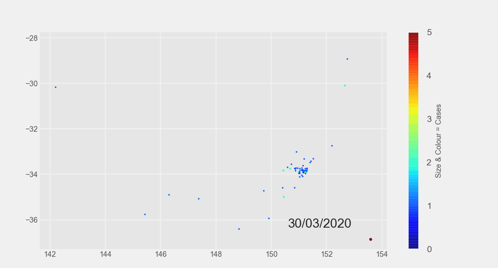

Python可视化
<a name="gesHb"></a>
## **安装**
```bash
pip install pandas_alive

#或者
conda install pandas_alive -c conda-forge
```
<a name="s7C2C"></a>
## **玩起来**
**支持数据**数据格式如下：<br /><br />使用方法类似pandas。<br />
<a name="AZMti"></a>
### 动态地图
结合geopandas<br />
<a name="q6h2a"></a>
### 动态水平bar
```python
import pandas as pd
import pandas_alive
import matplotlib.pyplot as plt

plt.style.use('ggplot')

#读入数据
elec_df = pd.read_csv("Aus_Elec_Gen_1980_2018.csv",
                      index_col=0,
                      parse_dates=[0],
                      thousands=',')

#定义求和def
def current_total(values):
    total = values.sum()
    s = f'Total : {int(total)}'
    return {'x': .85, 'y': .2, 's': s, 'ha': 'right', 'size': 11}


#缺省值0填充、绘图
elec_df.fillna(0).tail(n=10).plot_animated(
    'electricity-generated-australia.gif',  #保存gif名称
    period_fmt="%d/%m/%Y",  #动态更新图中时间戳
    title='Australian Electricity Sources 1980-2018',  #标题
    perpendicular_bar_func='mean',  #添加均值辅助线
    period_summary_func=current_total,  #汇总
    cmap='Set1',  #定义调色盘
    n_visible=5,  #柱子显示数
    orientation='h',#柱子方向
)
```

<a name="vOIHv"></a>
### 动态垂直bar

<a name="L3fBk"></a>
### 动态折线
```python
elec_df.diff().fillna(0).tail(n=10).plot_animated(filename='line-chart.gif',
                                                  kind='line',#指定折线模式
                                                  cmap='Set1',
                                                  period_label={
                                                      'x': 0.25,
                                                      'y': 0.9
                                                  },
                                                  line_width=1,
                                                  add_legend=True,
                                                 fill_under_line_color='#01a2d9')
```

<a name="lV0rH"></a>
### 动态累积bar
```python
import pandas_alive
covid_df.sum(axis=1).fillna(0).tail(n=10).plot_animated(
    filename='sumbar-chart.gif',
    kind='bar',   #指定bar模式
    cmap='Set1',  #定义调色盘
    period_label={
        'x': 0.1,
        'y': 0.9
    },
    orientation='h',
    enable_progress_bar=True,
    steps_per_period=2,
    interpolate_period=True,
    period_length=200)
```

<a name="iIjsp"></a>
### 动态散点图
```python
import pandas as pd
import pandas_alive

#max散点数据
max_temp_df = pd.read_csv(
    "Newcastle_Australia_Max_Temps.csv",
    parse_dates={"Timestamp": ["Year", "Month", "Day"]},
)

#min散点数据
min_temp_df = pd.read_csv(
    "Newcastle_Australia_Min_Temps.csv",
    parse_dates={"Timestamp": ["Year", "Month", "Day"]},
)

#按时间戳merge max/min数据
merged_temp_df = pd.merge_asof(max_temp_df, min_temp_df, on="Timestamp")

merged_temp_df.index = pd.to_datetime(
    merged_temp_df["Timestamp"].dt.strftime('%Y/%m/%d'))

keep_columns = [
    "Minimum temperature (Degree C)", "Maximum temperature (Degree C)"
]

merged_temp_df.head(n=5000)[keep_columns].resample("Y").mean().plot_animated(
    filename='scatter-chart.gif',
    cmap='Set1', 
    kind="scatter",#指定散点模式
    size=10,
    title='Max & Min Temperature Newcastle, Australia')
```

<a name="F8vyp"></a>
### 动态气泡图
```python
import pandas_alive

multi_index_df = pd.read_csv("multi.csv", header=[0, 1], index_col=0)

multi_index_df.index = pd.to_datetime(multi_index_df.index, dayfirst=True)

map_chart = multi_index_df.tail(n=40).plot_animated(
    kind="bubble",  #指定气泡模式
    filename="bubble-chart.gif",
    x_data_label="Longitude",
    y_data_label="Latitude",
    size_data_label="Cases",
    color_data_label="Cases",
    vmax=5,
    steps_per_period=1,
    interpolate_period=True,
    period_length=500,
    dpi=150)
```

<a name="scqgS"></a>
### 多子图一起动
这部分可以结合matplotlib的多子图绘制，实现各种个性化动图，核心代码如下：<br />
