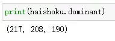

Python 可视化<br />在利用Python进行数据可视化时，有着大量的高质量库可以用，比如：**Matplotlib**、**seaborn**、**Plotly**、**Bokeh**、**ggplot**等等。但图表好不好看，配色占一半。如果没有良好的审美观，很容易做出来的东西辣眼睛……<br /><br />所以想做好数据可视化，就要有合适的配色方案。除了可以借鉴参考配色网站的案例，也可以自己自定义一套配色方案。<br />如何去自定义呢？<br />配色的美感需要培养，但在一开始可以在优秀的作品上寻找灵感，比如经典电影、海报、风景图、Logo等等，这些都是绝佳的参考。<br />自然风景的颜色往往令人惊艳，咱们不妨以风景图为例。下图是一副海上夕阳图，通过一番操作就提取到了一套配色方案（见图右）。<br /><br /><br />那么，用Python能不能做到呢？<br />答案当然是可以！
<a name="qcPWd"></a>
## 提取图片中的配色
在Python中对图片进行操作，最常用的两个模块就是PIL和opencv了。所以一开始的方案是，用Python库打开图片，然后遍历像素颜色，最后按照色彩比例进行排序，即可得到该图片的配色方案。<br />搜了一下，有相关的库可以提取图片中的配色，那就不用重复造轮子了。<br />这个模块就是——**Haishoku**，可以用于从图像中获取主色调和主要配色方案。<br /><br />其GitHub网址为：[https://github.com/LanceGin/haishoku](https://github.com/LanceGin/haishoku)<br /><br />具体用法，还是先安装
```bash
pip install haishoku
```
将前文提到的海上夕阳图，保存到本地并命名为test.png。
```python
from haishoku.haishoku import Haishoku
image = 'test.png'
haishoku = Haishoku.loadHaishoku(image)
```
导入模块，运行代码会返回一个Haishoku实例，可以通过实例属性`haishoku.dominant` 和 `haishoku.palette`，从而直接获取到对应的主色调和配色方案。
<a name="GBFdy"></a>
### 主色调
首先，要怎么获取图片的主色调呢？
```python
print(haishoku.dominant)
```
这返回了一个结构为 (R, G, B) 的元组，就是该图片的主色调。<br /><br />运行下面这行代码
```python
Haishoku.showDominant(image)
```
则会打开一个临时文件，用来预览主色调的颜色。<br />
<a name="t2yXI"></a>
### 配色方案
```python
#获取配色方案
pprint.pprint(haishoku.palette)
```
返回一个结构为：[(R, G, B), (R, G, B), …] 最大长度为8的数组。<br /><br />这里使用了`pprint`模块，对于这种多层嵌套的元组，正好可以美观地打印出来。<br />运行下面这行代码
```python
Haishoku.showPalette(image)
```
则会打开一个临时文件，用来预览图片配色方案。（不会保存在本地）<br /><br />就这样，只需几行代码就提取到图片中的配色方案，是不是很简单。<br />另外，Haishoku库从v1.1.4版本后，支持从 url 中直接加载图像。
```python
imagepath = 'https://img-blog.csdnimg.cn/20190222215216318.png'
    
haishoku = Haishoku.loadHaishoku(imagepath)
```
<a name="mzz48"></a>
## 配色方案与可视化
通过前面的操作，就提取到了合适的配色，那么就实战一下吧。<br />经典电影、海报、风景图、Logo都是绝佳的参考对象。<br /><br />所以这次，选择了Google的Logo，并提取到它的配色方案。
```python
imagepath = 'google.png'

haishoku = Haishoku.loadHaishoku(imagepath)

pprint.pprint(haishoku.palette)

Haishoku.showPalette(imagepath)
```
<br /><br />那么，这套配色方案应用到了数据可视化中，会是怎么样呢？？<br />这次用刚才得到的Google配色，Python绘制一个环形图试试看<br />
