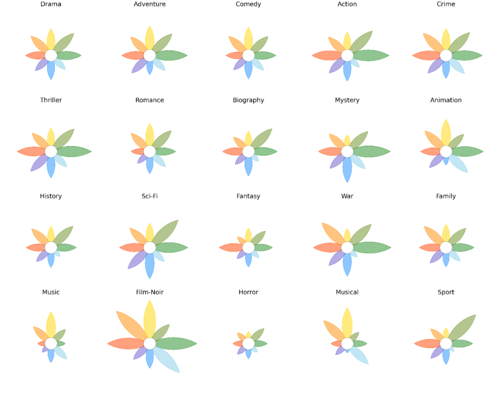
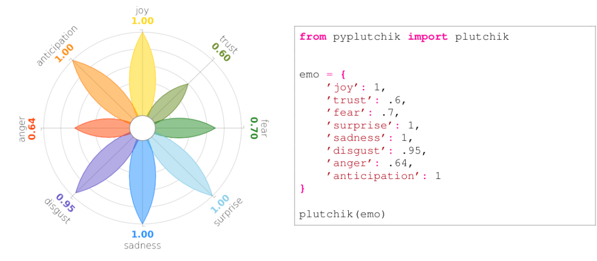
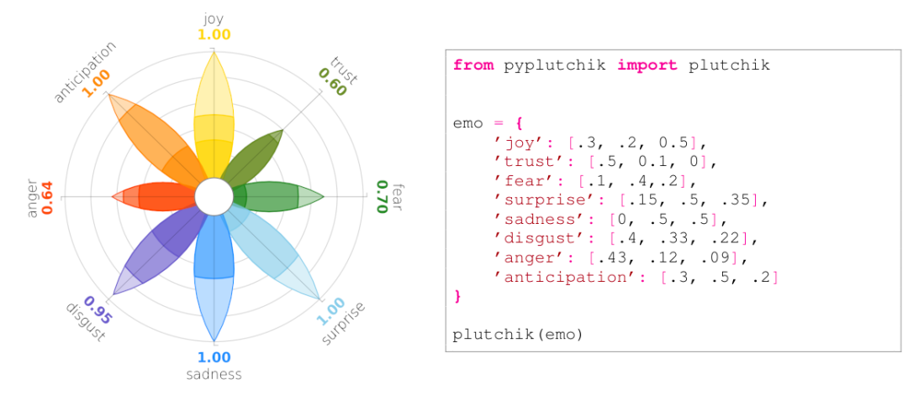
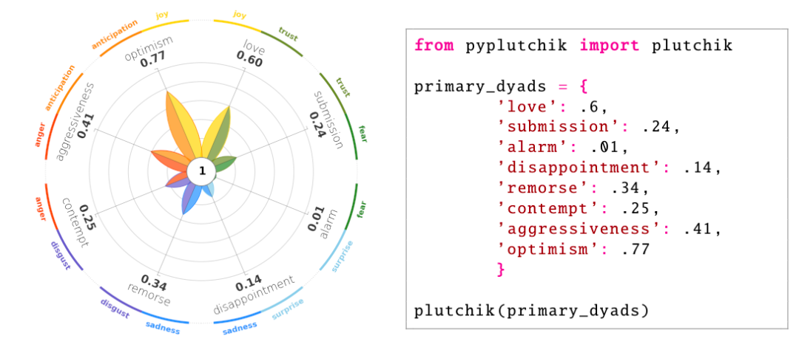
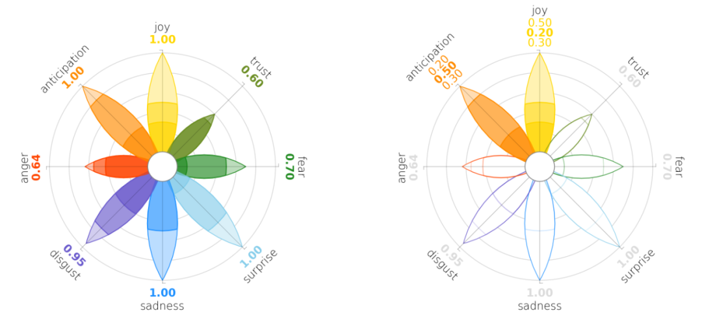
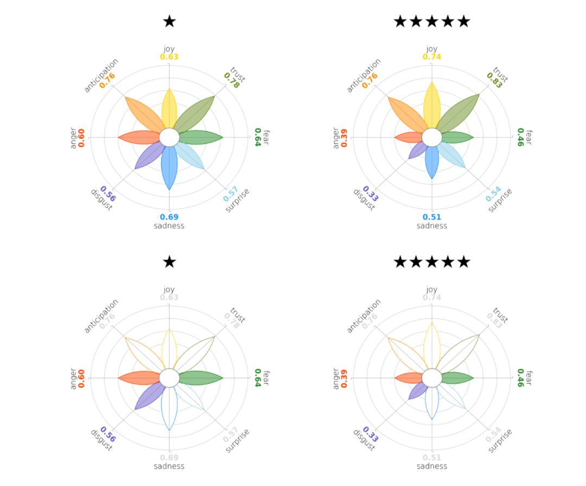

Python可视化<br />越来越多的社交网络学者， 为测量情绪， 基于**心理学家 Robert Plutchik** 提出的模型（通常简称为“**Plutchik轮**”，人类的情绪一共有8大类）制作了大量的情绪可视化作品。在某种程度上，Plutchik轮可以看做情绪指纹，例如不同的电影题材在8类情绪的分布是不一样的。<br /><br />**PyPlutchik**是一个 Python 专门用于在文本或语料库中可视化 Plutchik 的情绪库。PyPlutchik 绘制 Plutchik 的花朵，每个情感花瓣的大小取决于语料库中检测到或注释了多少情感，也代表每个情感花瓣的三个强度程度。
<a name="Jfsc4"></a>
## 安装
```bash
pip3 install pyplutchik
```
<a name="qaF8V"></a>
## Usage
```python
from pyplutchik import plutchik

emotions = {'joy': 0.6,
			'trust': 0.4,
			'fear': 0.1,
			'surprise': 0.7,
			'sadness': 0.1,
			'disgust': 0.5,
			'anger': 0.4,
			'anticipation': 0.6}

plutchik(emotions)
```
<a name="d76Yl"></a>
## 功能特性
PyPlutchik 提供了一个即插即用的工具，用于在文本或语料库中定量表示 Plutchik 的情绪。它尊重 Plutchik 轮中每个花瓣的原始颜色和空间位移。<br />在 Pyplutchik 中，用户可以只传递一个字典作为唯一参数，其中字典的键必须是 8 种基本情绪。每个值必须是 ∈ [0, 1]。<br /><br />每类情绪存在三种强度，下表是Pyplutchik的8大类情绪三种强度汇总。<br />用户还可以给每个情绪传入一个长度是3的列表，依次表示情绪在低、中、高三种强度的程度，数值0 和 1 之间。

| Lower intensity | Emotion | Higher intensity |
| --- | --- | --- |
| Annoyance | Anger | Rage |
| Interest | Anticipation | Vigilance |
| Serenity | Joy | Ecstasy |
| Acceptance | Trust | Admiration |
| Apprehension | Fear | Terror |
| Distraction | Surprise | Amazement |
| Pensiveness | Sadness | Grief |
| Boredom | Disgust | Loathing |

<br />PyPlutchik 也可表征用户数据中的主要二元、次要二元、二元和相反的情绪。它会自动从字典的关键字中了解用户想要显示什么样的二元组。<br />
<a name="UwfYG"></a>
## 绘图技巧
可以专注于情绪子集，不会忽视其他情绪，将情绪列表作为参数“**highlight_emotions**”的值传递：<br /><br />可以比较同一亚马逊语料库的不同子组，将可视化并排放置，并仅突出显示愤怒、厌恶和恐惧的花瓣，以轻松发现这些负面情绪在 5 星评论中的表现如何低于 1 星评论 .<br /><br />或者可以隐藏坐标、刻度和标签，只绘制花瓣，使用参数 `show_coordinates = False` 和 `show_ticklabels = False`。下图是imdb不同电影的情绪轮<br />
<a name="KzJaK"></a>
## 完整的文档
有关所有参数的文档和示例库，请参见<br />[https://hidadeng.github.io/blog/pyplutchik-emotion-circle/Documentation.md](https://hidadeng.github.io/blog/pyplutchik-emotion-circle/Documentation.md)<br />[https://hidadeng.github.io/blog/pyplutchik-emotion-circle/PyPlutchik.zip](https://hidadeng.github.io/blog/pyplutchik-emotion-circle/PyPlutchik.zip)<br />🔥 PyPlutchik 2.0 即将推出！新功能包括从文本中提取情感并检查非主题词典。敬请期待……🔥
