Python
<a name="DOz81"></a>
## 一、安装
```bash
pip install mayavi -i https://pypi.tuna.tsinghua.edu.cn/simple # 报错 推荐下面的这条指令安装
pip install git+https://github.com/enthought/mayavi.git
```
<a name="XnQs8"></a>
## 二、使用
<a name="CfJQH"></a>
### 1、Mayavi库基本元素
<a name="HfEV7"></a>
#### 1. 处理/显示图形的mlab模块
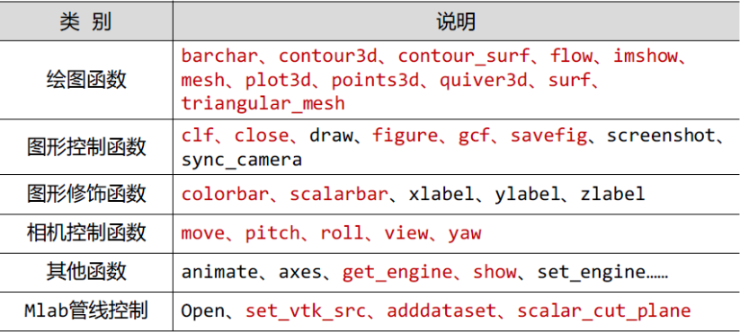
<a name="NFRIK"></a>
#### 2. Mayavi的api
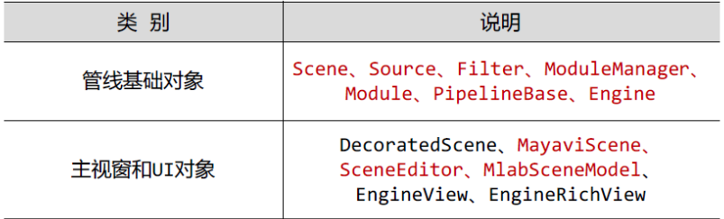
<a name="Uwffg"></a>
### 2、快速绘图实例
实例代码1：
```python
# coding=utf-8
from mayavi import mlab

x = [[-1,1,1,-1,-1],[-1,1,1,-1,-1]]
y = [[-1,-1,-1,-1,-1],[1,1,1,1,1]]
z = [[1,1,-1,-1,1],[1,1,-1,-1,1]]

s = mlab.mesh(x,y,z)
mlab.show()
```
效果：<br />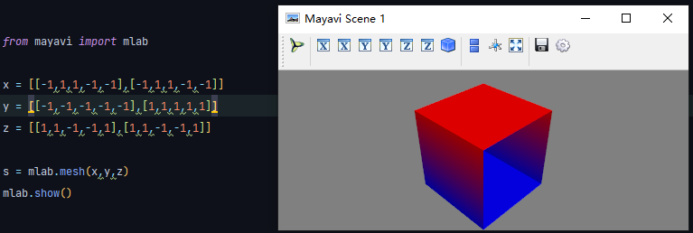<br />只显示框的话：
```python
from mayavi import mlab

x = [[-1,1,1,-1,-1],[-1,1,1,-1,-1]]
y = [[-1,-1,-1,-1,-1],[1,1,1,1,1]]
z = [[1,1,-1,-1,1],[1,1,-1,-1,1]]

s = mlab.mesh(x, y, z,representation = 'wireframe', line_width = 1.0)
mlab.show()
```
效果：<br />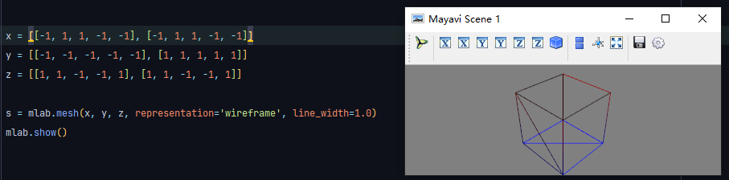<br />实例代码2：
```python
from numpy import pi,sin,cos,mgrid
from mayavi import mlab
#建立数据
dphi, dtheta = pi/250.0, pi/250.0
[phi,theta] = mgrid[0:pi+dphi*1.5:dphi,0:2*pi+dtheta*1.5:dtheta]
m0 = 4;m1 = 3;m2 = 2;m3 = 3;m4 = 6;m5 = 2;m6 = 6;m7 = 4
r = sin(m0*phi)**m1 + cos(m2*phi)**m3 +sin(m4*theta)**m5 + cos(m6*theta)**m7
x = r*sin(phi)*cos(theta)
y = r*cos(phi)
z = r*sin(phi)*sin(theta)
#对数据进行三维可视化
s = mlab.mesh(x,y,z)
mlab.show()
```
效果：<br />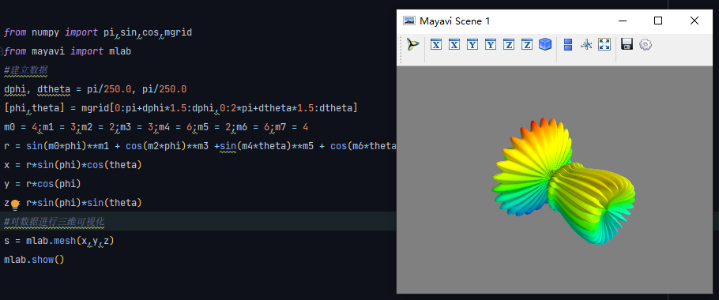
<a name="RJ9tJ"></a>
### 3、基于numpy数组绘图
基本知识：
<a name="nvspF"></a>
#### 1. Points3d
实现代码：
```python
import numpy as np
from mayavi import mlab

def test_points3d():
    t = np.linspace(0, 4 * np.pi, 20)
    x = np.sin(2 * t)
    y = np.cos(t)
    z = np.cos(2 * t)
    s = 2 + np.sin(t)
    return mlab.points3d(x, y, z, s, colormap="Reds", scale_factor=.25) # s (x,y,z)处标量的值 copper

test_points3d()
mlab.show()
```
参数说明：结果：<br />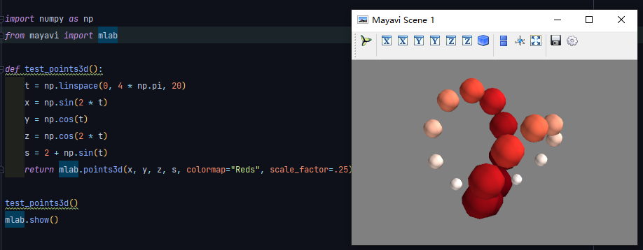
<a name="tQT4U"></a>
#### 2. Plot3d
实现代码：
```python
from mayavi import mlab
import numpy as np

n_mer, n_long = 6, 11
dphi = np.pi / 1000.0
phi = np.arange(0.0, 2*np.pi + 0.5*dphi, dphi)
mu = phi * n_mer
x = np.cos(mu) + (1+np.cos(n_long*mu/n_mer)*0.5)
y = np.sin(mu) + (1+np.cos(n_long*mu/n_mer)*0.5)
z = np.sin(n_long * mu / n_mer) * 0.5

l = mlab.plot3d(x, y, z, np.sin(mu), tube_radius = 0.025, colormap = 'Spectral')
mlab.show()
```
效果：<br />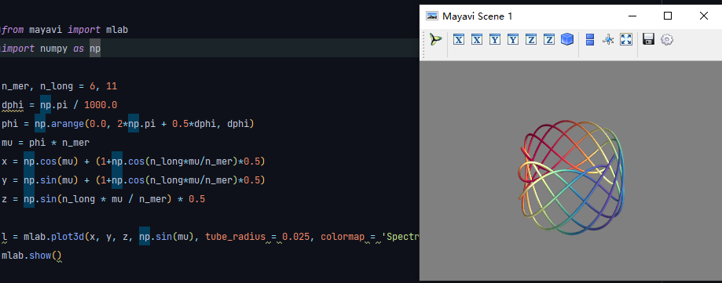
<a name="zLZ5l"></a>
#### 3. imshow
实现代码：
```python
from mayavi import mlab
import numpy as np

s = np.random.random((10, 10))

img = mlab.imshow(s, colormap = 'gist_earth')
mlab.show()
```
效果：<br />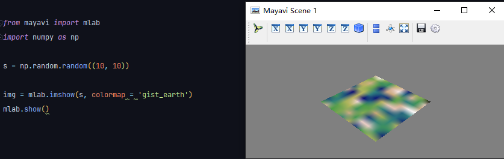
<a name="t9gfo"></a>
#### 4. surf
实现代码1：
```python
from mayavi import mlab
import numpy as np

def f(x, y):
	return np.sin(x-y) + np.cos(x + y)

x, y = np.mgrid[-7.:7.05:0.1, -5.:5.05:0.05]
s = mlab.surf(x, y, f)
mlab.show()
```
效果：<br />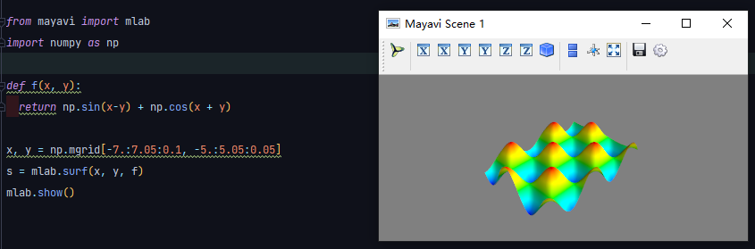<br />实现代码2：
```python
from mayavi import mlab
import numpy as np

def f(x, y):
	return np.sin(x-y) + np.cos(x + y)

x, y = np.mgrid[-7.:7.05:0.1, -5.:5.05:0.05]
s = mlab.contour_surf(x, y, f)
mlab.show()
```
效果：<br />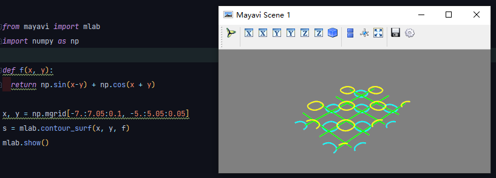
<a name="nBRw4"></a>
#### 5. contour3d
实现代码：
```python
from mayavi import mlab
import numpy as np

x, y, z = np.ogrid[-5:5:64j, -5:5:64j, -5:5:64j]
scalars = x*x + y*y + z*z

obj = mlab.contour3d(scalars, contours=8, transparent=True)
mlab.show()
```
效果：<br />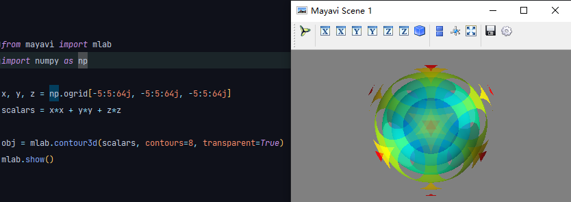
<a name="z0cKY"></a>
#### 6. quiver3d
实现代码：
```python
import numpy as np
from mayavi import mlab

x, y, z = np.mgrid[-2:3, -2:3, -2:3]
r = np.sqrt(x ** 2 + y ** 2 + z ** 4)
u = y * np.sin(r)/(r + 0.001)
v = -x * np.sin(r)/(r+0.001)
w = np.zeros_like(z)

obj = mlab.quiver3d(x, y, z, u, v, w, line_width=3, scale_factor=1)
mlab.show()
```
效果：<br />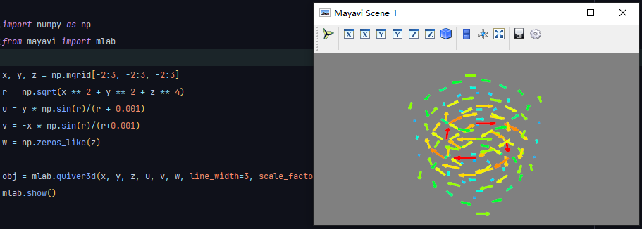
