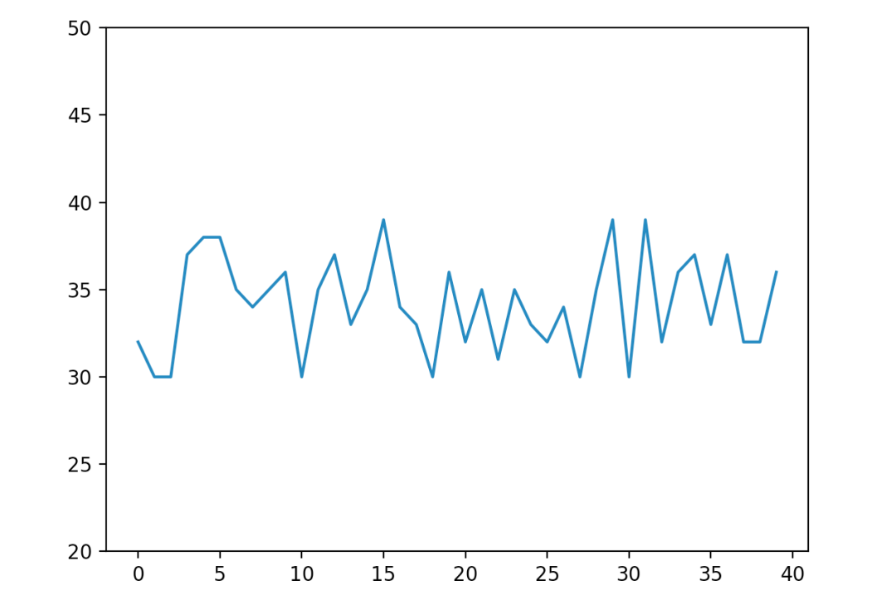
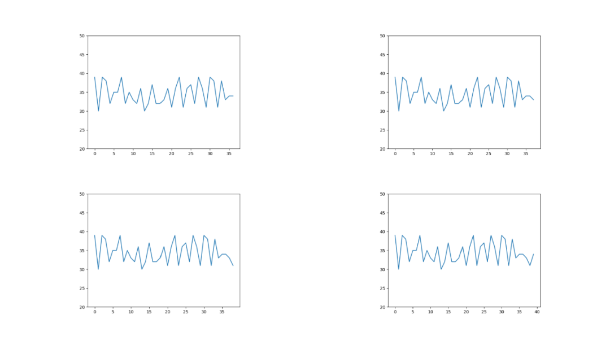
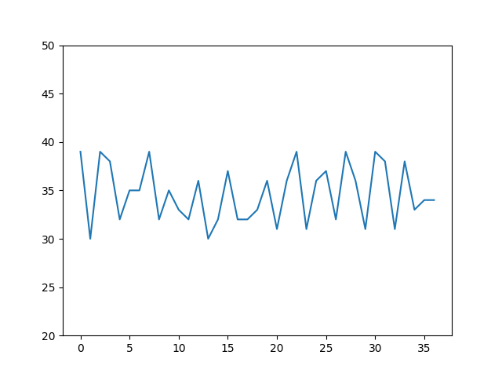
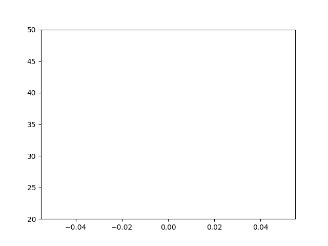
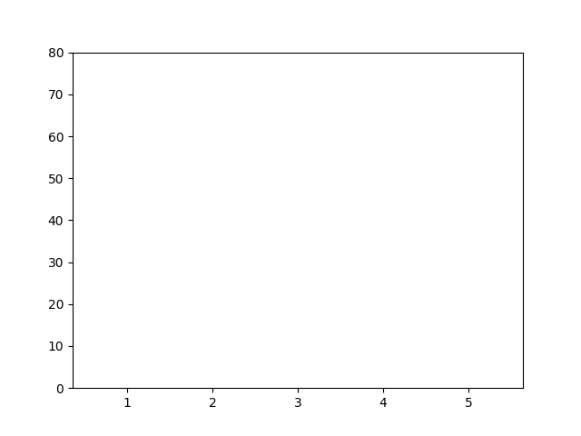
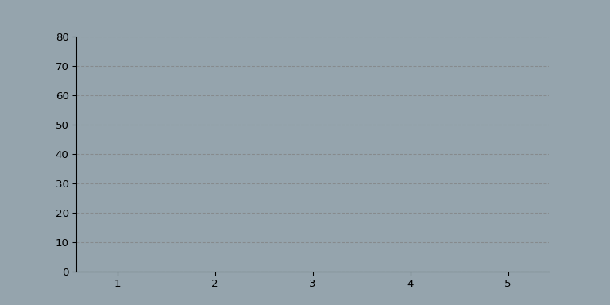
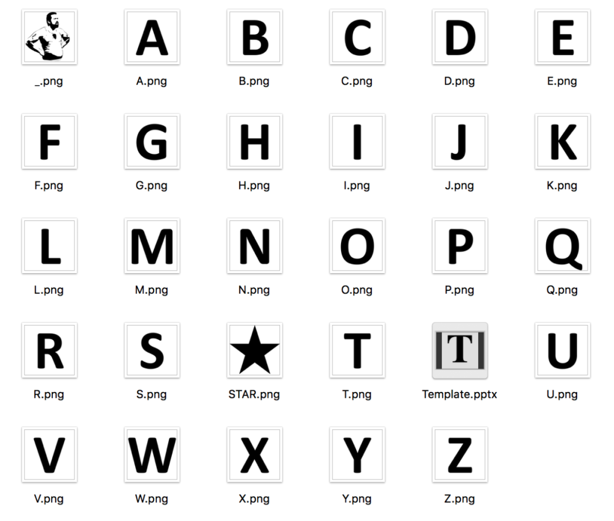

Python 动态可视化<br />通常大家做出来的图表，绝大部分都是静态的，有时会显得不够吸引人。<br />用Python绘制动态图表。主要是使用到Matplotlib+imageio，其中Matplotlib就有一个Animation类，可以生成动图GIF，不过使用起来学习成本较高，还是有一定难度的。<br /><br />这里先创建静态图表的图片，然后使用Imageio创建一个GIF(动态图表)。<br />一共介绍三种动态图表的绘制，折线图，条形图，散点图。
<a name="rMxOT"></a>
## 1、折线图
先来绘制一个简单的折线图看看。
```python
import os
import numpy as np
import matplotlib.pyplot as plt
import imageio

# 生成40个取值在30-40的数
y = np.random.randint(30, 40, size=(40))
# 绘制折线
plt.plot(y)
# 设置y轴最小值和最大值
plt.ylim(20, 50)

# 显示
plt.show()
```
使用Numpy创建一个数值范围在30到40之间的随机整数列表，结果如下。<br /><br />下面将对整数列表进行切片，生成不同阶段的图表。
```python
# 第一张图
plt.plot(y[:-3])
plt.ylim(20, 50)
plt.savefig('1.png')
plt.show()

# 第二张图
plt.plot(y[:-2])
plt.ylim(20, 50)
plt.savefig('2.png')
plt.show()

# 第三张图
plt.plot(y[:-1])
plt.ylim(20, 50)
plt.savefig('3.png')
plt.show()

# 第四张图
plt.plot(y)
plt.ylim(20, 50)
plt.savefig('4.png')
plt.show()
```
得到x轴为0:36、0:37、0:38、0:39四个折线图表。<br /><br />有了这四张图，就可以使用Imageio生成GIF了。
```python
# 生成Gif
with imageio.get_writer('mygif.gif', mode='I') as writer:
    for filename in ['1.png', '2.png', '3.png', '4.png']:
        image = imageio.imread(filename)
        writer.append_data(image)
```
动图来了。<br /><br />一个会动的折线图表就制作出来了，不过不是从x轴坐标为0的时候开始的。
```python
filenames = []
num = 0
for i in y:
    num += 1
    # 绘制40张折线图
    plt.plot(y[:num])
    plt.ylim(20, 50)

    # 保存图片文件
    filename = f'{num}.png'
    filenames.append(filename)
    plt.savefig(filename)
    plt.close()

# 生成gif
with imageio.get_writer('mygif.gif', mode='I') as writer:
    for filename in filenames:
        image = imageio.imread(filename)
        writer.append_data(image)

# 删除40张折线图
for filename in set(filenames):
    os.remove(filename)
```
绘制出40张折线图，并且保存图片，生成GIF。<br /><br />可以看到折线图的x坐标从0一直到了40。
<a name="coLvm"></a>
## 2、条形图
上面的折线图每次只有一个y值即可，而条形图则需要所有的y值，如此所有的条形才能同时移动。<br />给X轴创建固定值，Y轴创建列表，并使用Matplotlib的条形图函数。
```python
x = [1, 2, 3, 4, 5]
coordinates_lists = [[0, 0, 0, 0, 0],
                     [10, 30, 60, 30, 10],
                     [70, 40, 20, 40, 70],
                     [10, 20, 30, 40, 50],
                     [50, 40, 30, 20, 10],
                     [75, 0, 75, 0, 75],
                     [0, 0, 0, 0, 0]]
filenames = []
for index, y in enumerate(coordinates_lists):
    # 条形图
    plt.bar(x, y)
    plt.ylim(0, 80)

    # 保存图片文件
    filename = f'{index}.png'
    filenames.append(filename)

    # 重复最后一张图形15帧(数值都为0),15张图片
    if (index == len(coordinates_lists) - 1):
        for i in range(15):
            filenames.append(filename)

    # 保存
    plt.savefig(filename)
    plt.close()

# 生成gif
with imageio.get_writer('mygif.gif', mode='I') as writer:
    for filename in filenames:
        image = imageio.imread(filename)
        writer.append_data(image)

# 删除20张柱状图
for filename in set(filenames):
    os.remove(filename)
```
有数值的条形图图片是5张，没数值的图片是2+15=17张。<br /><br />GIF结束段，添加了15帧空白图片。所以在结束的时候会显示一段时间的空白。<br />可以设置一下条形图当前位置到下个位置的速度，让过渡变得平滑。<br />将当前位置和下一个位置之间的距离除以过渡帧数。
```python
n_frames = 10
x = [1, 2, 3, 4, 5]
coordinates_lists = [[0, 0, 0, 0, 0],
                     [10, 30, 60, 30, 10],
                     [70, 40, 20, 40, 70],
                     [10, 20, 30, 40, 50],
                     [50, 40, 30, 20, 10],
                     [75, 0, 75, 0, 75],
                     [0, 0, 0, 0, 0]]
print('生成图表\n')
filenames = []
for index in np.arange(0, len(coordinates_lists) - 1):
    # 获取当前图像及下一图像的y轴坐标值
    y = coordinates_lists[index]
    y1 = coordinates_lists[index + 1]

    # 计算当前图像与下一图像y轴坐标差值
    y_path = np.array(y1) - np.array(y)
    for i in np.arange(0, n_frames + 1):
        # 分配每帧的y轴移动距离
        # 逐帧增加y轴的坐标值
        y_temp = (y + (y_path / n_frames) * i)
        # 绘制条形图
        plt.bar(x, y_temp)
        plt.ylim(0, 80)
        # 保存每一帧的图像
        filename = f'images/frame_{index}_{i}.png'
        filenames.append(filename)
        # 最后一帧重复,画面停留一会
        if (i == n_frames):
            for i in range(5):
                filenames.append(filename)
        # 保存图片
        plt.savefig(filename)
        plt.close()
print('保存图表\n')
# 生成GIF
print('生成GIF\n')
with imageio.get_writer('mybars.gif', mode='I') as writer:
    for filename in filenames:
        image = imageio.imread(filename)
        writer.append_data(image)
print('保存GIF\n')
print('删除图片\n')
# 删除图片
for filename in set(filenames):
    os.remove(filename)
print('完成')
```
看起来是平滑了许多。<br /><br />接下来更改一下图表相关的配置参数，让图表变得好看。
```python
n_frames = 10
bg_color = '#95A4AD'
bar_color = '#283F4E'
gif_name = 'bars'
x = [1, 2, 3, 4, 5]
coordinates_lists = [[0, 0, 0, 0, 0],
                     [10, 30, 60, 30, 10],
                     [70, 40, 20, 40, 70],
                     [10, 20, 30, 40, 50],
                     [50, 40, 30, 20, 10],
                     [75, 0, 75, 0, 75],
                     [0, 0, 0, 0, 0]]
print('生成图表\n')
filenames = []
for index in np.arange(0, len(coordinates_lists) - 1):
    y = coordinates_lists[index]
    y1 = coordinates_lists[index + 1]
    y_path = np.array(y1) - np.array(y)
    for i in np.arange(0, n_frames + 1):
        y_temp = (y + (y_path / n_frames) * i)
        # 绘制条形图
        fig, ax = plt.subplots(figsize=(8, 4))
        ax.set_facecolor(bg_color)
        plt.bar(x, y_temp, width=0.4, color=bar_color)
        plt.ylim(0, 80)
        # 移除图表的上边框和右边框
        ax.spines['right'].set_visible(False)
        ax.spines['top'].set_visible(False)
        # 设置虚线网格线
        ax.set_axisbelow(True)
        ax.yaxis.grid(color='gray', linestyle='dashed', alpha=0.7)
        # 保存每一帧的图像
        filename = f'images/frame_{index}_{i}.png'
        filenames.append(filename)

        # 最后一帧重复,画面停留一会
        if (i == n_frames):
            for i in range(5):
                filenames.append(filename)
        # 保存图片
        plt.savefig(filename, dpi=96, facecolor=bg_color)
        plt.close()
print('保存图表\n')
# 生成GIF
print('生成GIF\n')
with imageio.get_writer(f'{gif_name}.gif', mode='I') as writer:
    for filename in filenames:
        image = imageio.imread(filename)
        writer.append_data(image)
print('保存GIF\n')
print('删除图片\n')
# 删除图片
for filename in set(filenames):
    os.remove(filename)
print('完成')
```
给图表添加了背景色、条形图上色、去除边框、增加网格线等。<br /><br />看起来，效果还不错！<br />当然也有一些值得改进的地方，比如添加标题。通过插值的方式来使过渡变得更平滑，甚至可以让条形图在x轴上移动。
<a name="ghjxA"></a>
## 3、散点图
要绘制动态散点图，则需要同时考虑x轴和y轴的值。<br />这里不一定要在每帧上显示相同数量的点，因此需要对其进行校正来进行过渡。
```python
coordinates_lists = [[[0], [0]],
                     [[100, 200, 300], [100, 200, 300]],
                     [[400, 500, 600], [400, 500, 600]],
                     [[400, 500, 600, 400, 500, 600], [400, 500, 600, 600, 500, 400]],
                     [[500], [500]],
                     [[0], [0]]]
gif_name = 'movie'
n_frames = 10
bg_color = '#95A4AD'
marker_color = '#283F4E'
marker_size = 25
print('生成图表\n')
filenames = []
for index in np.arange(0, len(coordinates_lists) - 1):
    # 获取当前图像及下一图像的x与y轴坐标值
    x = coordinates_lists[index][0]
    y = coordinates_lists[index][1]
    x1 = coordinates_lists[index + 1][0]
    y1 = coordinates_lists[index + 1][1]
    # 查看两点差值
    while len(x) < len(x1):
        diff = len(x1) - len(x)
        x = x + x[:diff]
        y = y + y[:diff]
    while len(x1) < len(x):
        diff = len(x) - len(x1)
        x1 = x1 + x1[:diff]
        y1 = y1 + y1[:diff]
    # 计算路径
    x_path = np.array(x1) - np.array(x)
    y_path = np.array(y1) - np.array(y)
    for i in np.arange(0, n_frames + 1):
        # 计算当前位置
        x_temp = (x + (x_path / n_frames) * i)
        y_temp = (y + (y_path / n_frames) * i)
        # 绘制图表
        fig, ax = plt.subplots(figsize=(6, 6), subplot_kw=dict(aspect="equal"))
        ax.set_facecolor(bg_color)

        plt.scatter(x_temp, y_temp, c=marker_color, s=marker_size)
        plt.xlim(0, 1000)
        plt.ylim(0, 1000)
        # 移除边框线
        ax.spines['right'].set_visible(False)
        ax.spines['top'].set_visible(False)
        # 网格线
        ax.set_axisbelow(True)
        ax.yaxis.grid(color='gray', linestyle='dashed', alpha=0.7)
        ax.xaxis.grid(color='gray', linestyle='dashed', alpha=0.7)
        # 保存图片
        filename = f'images/frame_{index}_{i}.png'
        filenames.append(filename)
        if (i == n_frames):
            for i in range(5):
                filenames.append(filename)
        # 保存
        plt.savefig(filename, dpi=96, facecolor=bg_color)
        plt.close()
print('保存图表\n')
# 生成GIF
print('生成GIF\n')
with imageio.get_writer(f'{gif_name}.gif', mode='I') as writer:
    for filename in filenames:
        image = imageio.imread(filename)
        writer.append_data(image)
print('保存GIF\n')
print('删除图片\n')
# 删除图片
for filename in set(filenames):
    os.remove(filename)
print('完成')
```
效果如下。<br /><br />当然还有更有趣的散点图变化，比如字母变化。<br />使用OpenCV从图像创建mask，绘制填充有随机x/y坐标的图，并过滤mask内的点。 <br />使用Matplotlib绘制散点图，使用ImageIO生成gif。
```python
import os
import numpy as np
import matplotlib.pyplot as plt
import imageio
import random
import cv2


# 根据字母的形状, 将字母转化为多个随机点
def get_masked_data(letter, intensity=2):
    # 多个随机点填充字母
    random.seed(420)
    x = []
    y = []

    for i in range(intensity):
        x = x + random.sample(range(0, 1000), 500)
        y = y + random.sample(range(0, 1000), 500)

    if letter == ' ':
        return x, y

    # 获取图片的mask
    mask = cv2.imread(f'images/letters/{letter.upper()}.png', 0)
    mask = cv2.flip(mask, 0)

    # 检测点是否在mask中
    result_x = []
    result_y = []
    for i in range(len(x)):
        if (mask[y[i]][x[i]]) == 0:
            result_x.append(x[i])
            result_y.append(y[i])

    # 返回x,y
    return result_x, result_y


# 将文字切割成一个个字母
def text_to_data(txt, repeat=True, intensity=2):
    print('将文本转换为数据\n')
    letters = []
    for i in txt.upper():
        letters.append(get_masked_data(i, intensity=intensity))
    # 如果repeat为1时,重复第一个字母
    if repeat:
        letters.append(get_masked_data(txt[0], intensity=intensity))
    return letters


def build_gif(coordinates_lists, gif_name='movie', n_frames=10, bg_color='#95A4AD',
              marker_color='#283F4E', marker_size=25):
    print('生成图表\n')
    filenames = []
    for index in np.arange(0, len(coordinates_lists) - 1):
        # 获取当前图像及下一图像的x与y轴坐标值
        x = coordinates_lists[index][0]
        y = coordinates_lists[index][1]

        x1 = coordinates_lists[index + 1][0]
        y1 = coordinates_lists[index + 1][1]

        # 查看两点差值
        while len(x) < len(x1):
            diff = len(x1) - len(x)
            x = x + x[:diff]
            y = y + y[:diff]

        while len(x1) < len(x):
            diff = len(x) - len(x1)
            x1 = x1 + x1[:diff]
            y1 = y1 + y1[:diff]

        # 计算路径
        x_path = np.array(x1) - np.array(x)
        y_path = np.array(y1) - np.array(y)

        for i in np.arange(0, n_frames + 1):
            # 计算当前位置
            x_temp = (x + (x_path / n_frames) * i)
            y_temp = (y + (y_path / n_frames) * i)

            # 绘制图表
            fig, ax = plt.subplots(figsize=(6, 6), subplot_kw=dict(aspect="equal"))
            ax.set_facecolor(bg_color)
            plt.xticks([])  # 去掉x轴
            plt.yticks([])  # 去掉y轴
            plt.axis('off')  # 去掉坐标轴

            plt.scatter(x_temp, y_temp, c=marker_color, s=marker_size)

            plt.xlim(0, 1000)
            plt.ylim(0, 1000)

            # 移除框线
            ax.spines['right'].set_visible(False)
            ax.spines['top'].set_visible(False)

            # 网格线
            ax.set_axisbelow(True)
            ax.yaxis.grid(color='gray', linestyle='dashed', alpha=0.7)
            ax.xaxis.grid(color='gray', linestyle='dashed', alpha=0.7)

            # 保存图片
            filename = f'images/frame_{index}_{i}.png'

            if (i == n_frames):
                for i in range(5):
                    filenames.append(filename)

            filenames.append(filename)

            # 保存
            plt.savefig(filename, dpi=96, facecolor=bg_color)
            plt.close()
    print('保存图表\n')
    # 生成GIF
    print('生成GIF\n')
    with imageio.get_writer(f'{gif_name}.gif', mode='I') as writer:
        for filename in filenames:
            image = imageio.imread(filename)
            writer.append_data(image)
    print('保存GIF\n')
    print('删除图片\n')
    # 删除图片
    for filename in set(filenames):
        os.remove(filename)

    print('完成')


coordinates_lists = text_to_data('Python', repeat=True, intensity=50)

build_gif(coordinates_lists,
          gif_name='Python',
          n_frames=7,
          bg_color='#52A9F0',
          marker_color='#000000',
          marker_size=0.2)
```
生成一个Python单词字母的动态散点图。<br /><br />三个主要的函数。
```python
# 创建一个随机的x/y坐标列表，并使用mask对其进行过滤。
get_masked_data()
# 将文本转化为数据
text_to_data()
# 使用坐标点生成散点图, 保存GIF
build_gif()
```
这里提供了26个字母，可以自行组合。<br /><br />当然其他图形也是可以的，就是需要自己作图。<br />图片的大小应为1000x1000像素，mask着色为黑色，背景为白色。<br />然后将png文件保存在images/letters文件夹中，单独一个字符命名。
```python
coordinates_lists = text_to_data('mac_', repeat=True, intensity=50)

build_gif(coordinates_lists,
          gif_name='mac',
          n_frames=7,
          bg_color='#F5B63F',
          marker_color='#000000',
          marker_size=0.2)
```
结果如下，最后一张是个人物像。<br />
