Python 可视化 cufflinks
<a name="BJHL0"></a>
### cufflinks简介
安装cufflinks的依赖库
```bash
pip3 install cufflinks
```
cufflinks库主要和dataFrame数据结合使用，绘图函数就是 dataFrame.iplot，但是 iplot 函数里的参数很多，一些参数说明如下：
```
kind：图的种类，如 scatter、pie、histogram 等
mode：lines、markers、lines+markers，分别表示折线、点、折线和点
colors：轨迹对应的颜色
dash：轨迹对应的虚实线，solid、dash、dashdot 三种
width：轨迹的粗细
xTitle：横坐标名称
yTitle：纵坐标的名称
title：图表的标题
```
<a name="VhTu8"></a>
### 使用cufflinks前配置验证信息
在使用cufflinks之前，要安装chart_studio库，该库是必要的<br />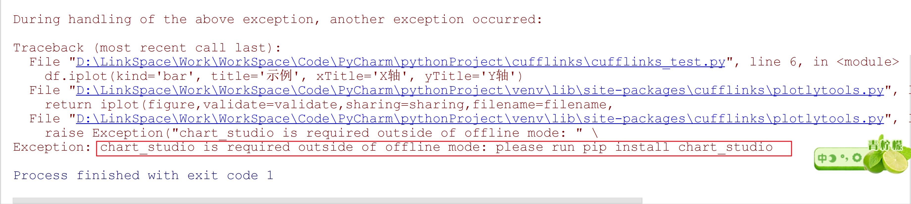
```bash
pip3 install chart_studio
```
<br />然后在[https://plot.ly/api_signup](https://plot.ly/api_signup)注册申请帐号，在设置里获取API_KEY后，代码中进行配置才能正常使用<br />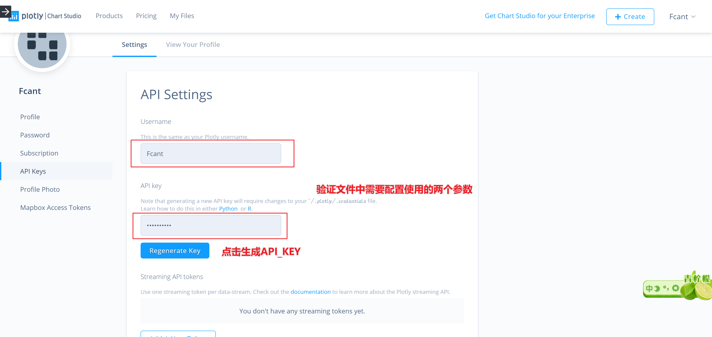<br />在用到cufflinks库的地方，添加验证文件的配置信息相关的代码，即可正常使用
```python
import chart_studio
chart_studio.tools.set_credentials_file(username='DemoAccount', api_key='lr1c37zw81')
```
以上代码中的username和api_key换成API Setting页面里的UserName和API key即可，否则在使用中会报错如下<br />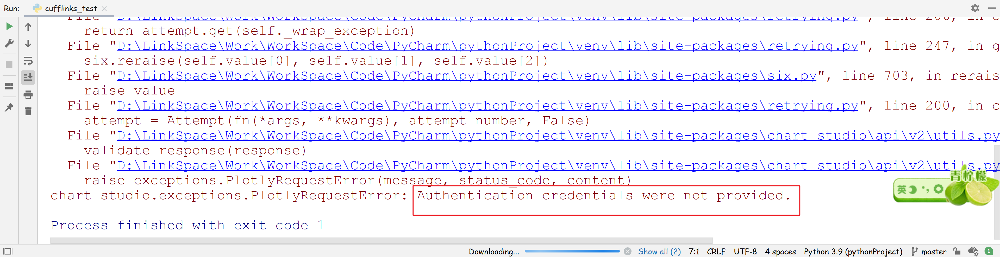
<a name="98WN6"></a>
### cufflinks的使用示例
如下图，df为随机生成的dataFrame数据，kind='bar'表示柱状图，title代表标题，xTitle命名X轴，yTitle命名Y轴：
```python
import pandas as pd
import numpy as np
import cufflinks as cf
import chart_studio
chart_studio.tools.set_credentials_file(username='DemoAccount', api_key='lr1c37zw81')
df=pd.DataFrame(np.random.rand(12, 4), columns=['a', 'b', 'c', 'd'])
df.iplot(kind ='bar',title='示例', xTitle = 'X轴', yTitle ='Y轴')
```
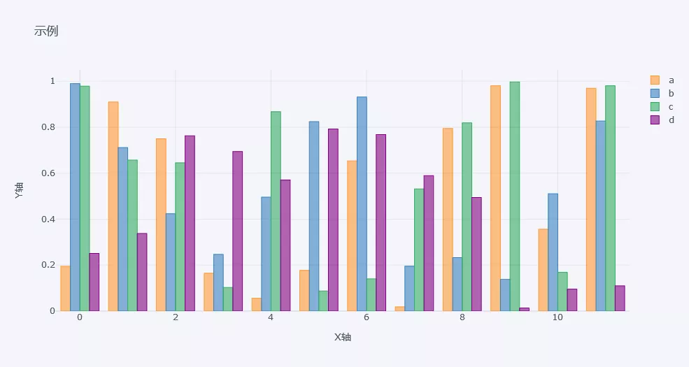**<br />cufflinks提供了丰富的主题样式，支持包括polar、pearl、henanigans、solar、ggplot、space和white等7种主题。
<a name="iy9qY"></a>
#### 折线图
```python
cf.datagen.lines(4,10).iplot(mode='lines+markers',theme='solar')
```
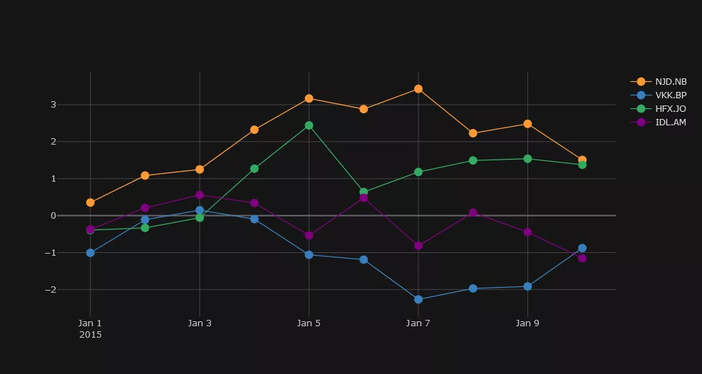<br />cufflinks使用datagen生成随机数，figure定义为lines形式，cf.datagen.lines(2,10)的具体形式如下：
```python
cf.datagen.lines(2,10)  #2代表2组，10代表10天
```
| <br /> | WCB.EH | OAA.CQ |
| :--- | :--- | :--- |
| 2015-01-01 | -0.052580 | -0.351618 |
| 2015-01-02 | 1.056254 | -1.476417 |
| 2015-01-03 | 0.078017 | 1.129168 |
| 2015-01-04 | 0.282141 | 0.908655 |
| 2015-01-05 | 0.960537 | -0.223996 |
| 2015-01-06 | 1.420355 | 0.212851 |
| 2015-01-07 | 2.266144 | 0.358502 |
| 2015-01-08 | 0.008034 | 1.086130 |
| 2015-01-09 | 1.876946 | 2.226895 |
| 2015-01-10 | 1.855625 | 2.852383 |

<a name="umUXf"></a>
#### 散点图
```python
df = pd.DataFrame(np.random.rand(50, 4), columns=['a', 'b', 'c', 'd'])
df.iplot(kind='scatter',mode='markers',colors=['orange','teal','blue','yellow'],size=20,theme='solar')
```
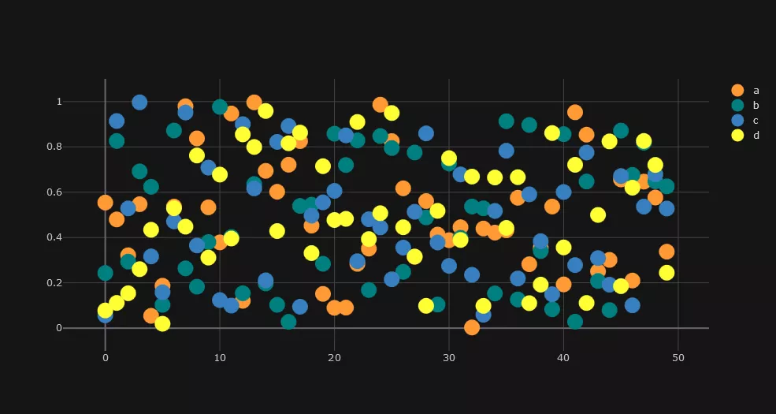
<a name="DE9ZF"></a>
#### 气泡图
```python
df.iplot(kind='bubble',x='a',y='b',size='c',theme='solar')
```
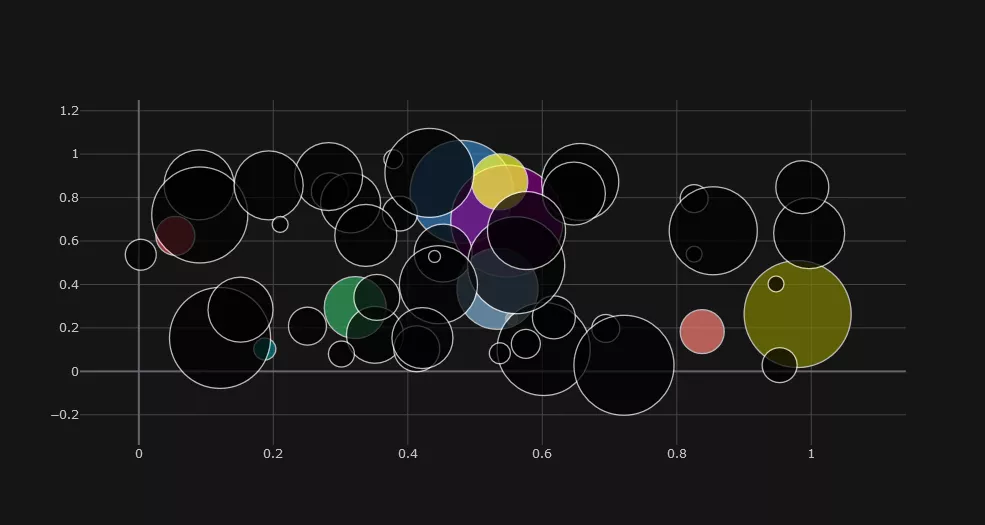
<a name="yWSoq"></a>
#### subplots 子图
```python
df=cf.datagen.lines(4)
df.iplot(subplots=True,shape=(4,1),shared_xaxes=True,vertical_spacing=.02,fill=True,theme='ggplot')
```
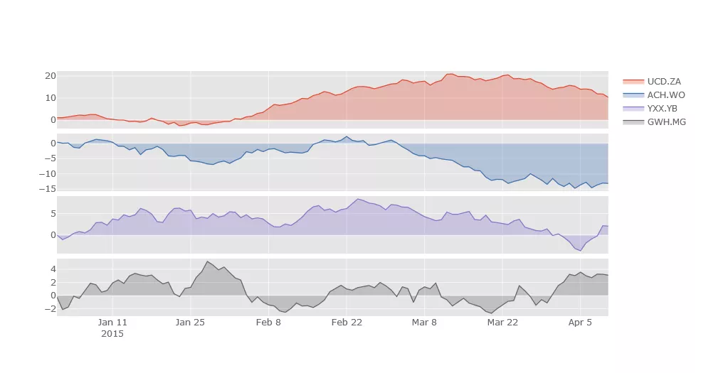
<a name="fLOGQ"></a>
#### 箱形图
```python
cf.datagen.box(20).iplot(kind='box',legend=False,theme='ggplot')
```
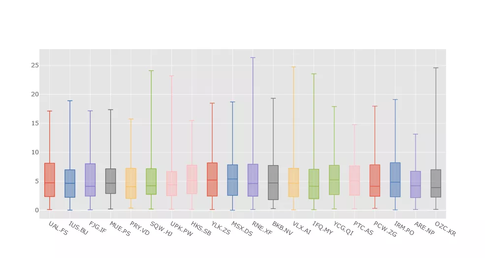
<a name="cHwQC"></a>
#### 直方图
```python
df.iloc[:,0:3].iplot(kind='histogram')
```
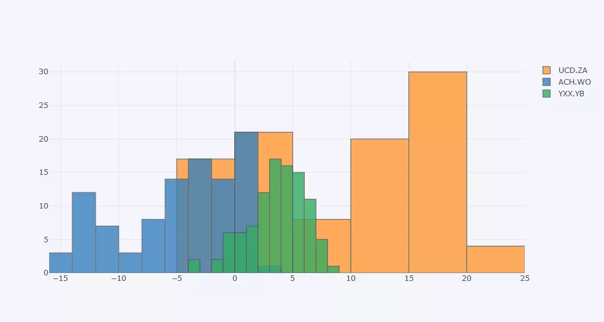
<a name="KK067"></a>
#### 3D图
```python
cf.datagen.scatter3d(5,4).iplot(kind='scatter3d',x='x',y='y',z='z',text='text',categories='categories')
```
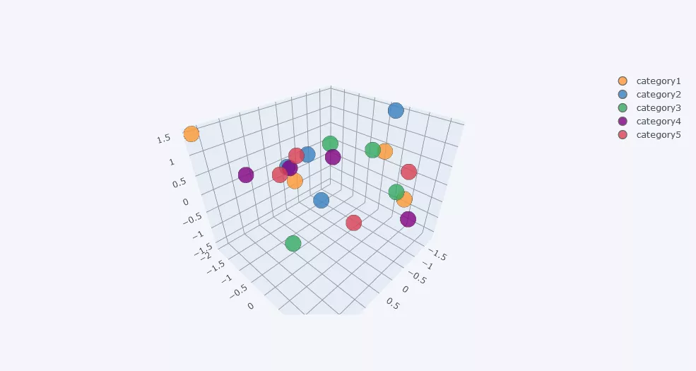
