Python 可视化 cufflinks<br />就像是seaborn封装了matplotlib一样，cufflinks也在plotly上面做了进一步的包装及优化，方法统一、参数配置简单，对于DataFrame数据集而言也可以方便灵活的绘图，而这次要绘制的图表包括

- 折线图
- 面积图
- 散点图
- 柱状图
- 直方图
- 箱型图
- 热力图
- 3D 散点图/3D 气泡图
- 趋势图
- 饼图
- K线图
- 多个子图相拼合
<a name="NT0JU"></a>
### 模块的安装
涉及到安装，直接`pip install`即可
```bash
pip install cufflinks
```
<a name="y20oT"></a>
### 导入模块，并查看相关的配置
导入该模块，看一下目前的版本是在多少
```python
cf.__version__
```
output
```python
'0.17.3'
```
目前该模块的版本已经到了0.17.3，也是最新的版本，然后最新版本支持可以绘制的图表有哪些
```python
cf.help()
```
output
```python
Use 'cufflinks.help(figure)' to see the list of available parameters for the given figure.
Use 'DataFrame.iplot(kind=figure)' to plot the respective figure
Figures:
 bar
 box
 bubble
 bubble3d
 candle
 choroplet
 distplot
 .......
```
从上面的输出可以看到，绘制图表大致的语法是`df.iplot(kind=图表名称)`而如果 想要查看某个特定图表绘制时候的参数，例如柱状图`bar`参数有哪些，可以这么做
```python
cf.help('bar')
```
<a name="H5s09"></a>
### 柱状图
先来看一下直方图图表的绘制，首先来创建一个数据集用于图表的绘制
```python
df2 = pd.DataFrame({'Category':['A','B','C','D'],
                    'Values':[95,56,70,85]})
df2
```
output
```python
  Category  Values
0        A      95
1        B      56
2        C      70
3        D      85
```
然后来绘制直方图
```python
df2.iplot(kind='bar',x='Category',y='Values',
          xTitle = "Category",yTitle = "Values",
          title = "直方图")
```
output<br />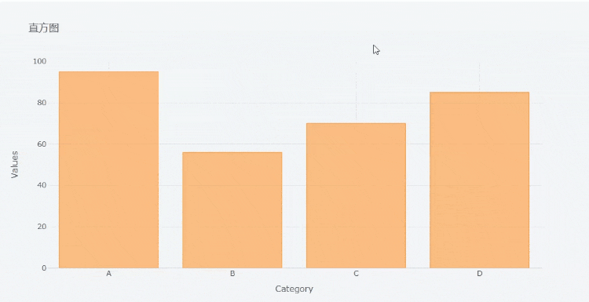<br />其中的x参数上面填的是x轴上面对应的变量名，而y参数填的是y轴上面对应的变量名，可以将绘制的图表以png的格式下载下来，<br />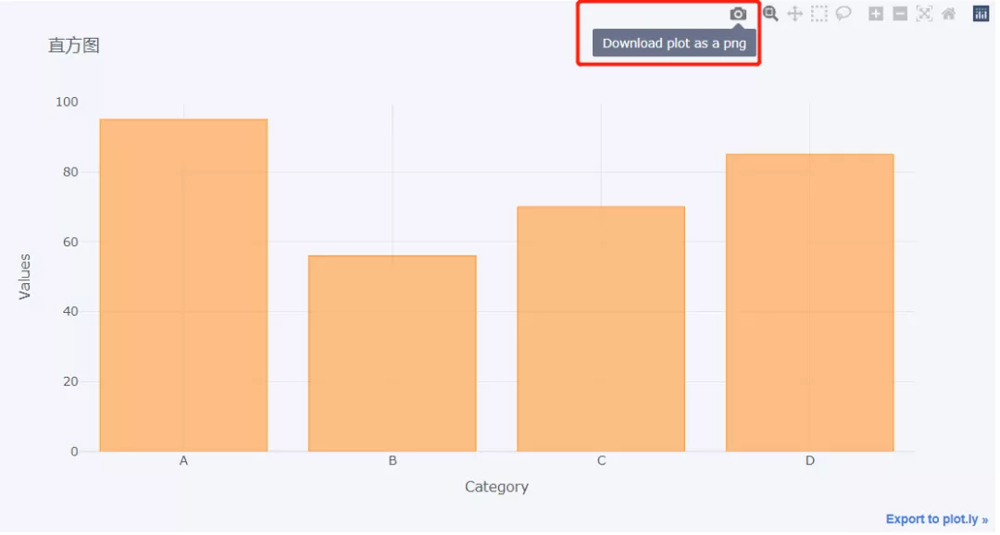<br />同时也还可以对绘制的图表放大查看，<br /><br />再来看一下下面这组数据
```python
df = pd.DataFrame(np.random.randn(100,4),columns='A B C D'.split())
df.head()
```
output
```python
          A         B         C         D
0  0.612403 -0.029236 -0.595502  0.027722
1  1.167609  1.528045 -0.498168 -0.221060
2 -1.338883 -0.732692  0.935410  0.338740
3  1.662209  0.269750 -1.026117 -0.858472
4  1.387077 -0.839192 -0.562382 -0.989672
```
来绘制直方图的图表
```python
df.head(10).iplot('bar')
```
output<br />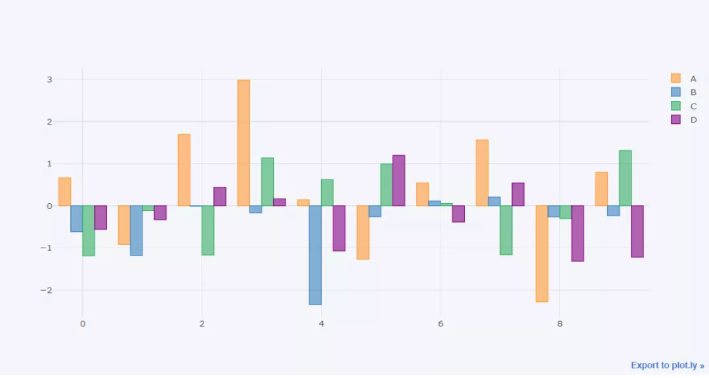<br />也可以来绘制“堆叠式”的直方图
```python
df.head(10).iplot(kind='bar',barmode='stack')
```
output<br />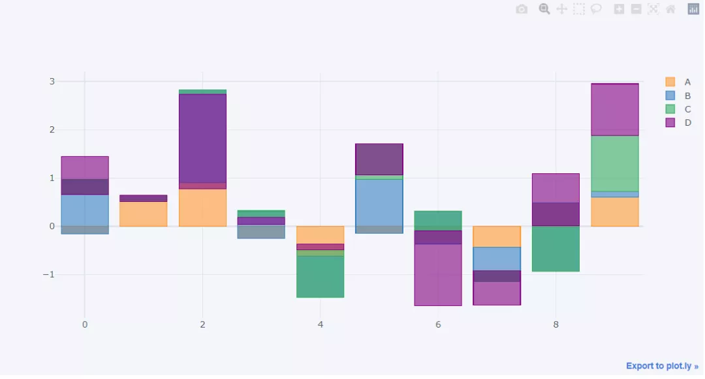<br />那么同样地，也可以将直方图横过来来绘制
```python
df.head(10).iplot(kind='barh',barmode='stack')
```
output<br />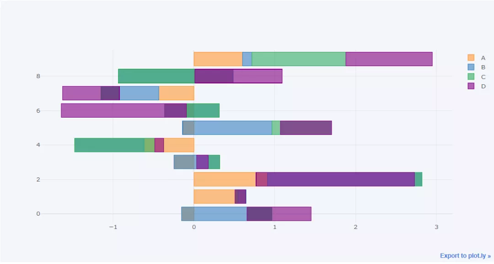
<a name="frj8E"></a>
### 折线图
下面来看一下折线图的绘制，首先针对上面的df数据集各列做一个累加
```python
df3 = df.cumsum()
```
然后来绘制折线图
```python
df3.iplot()
```
output<br />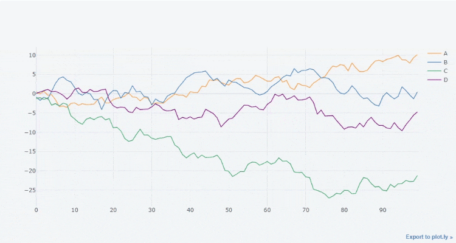<br />当然也可以筛选出当中的几列然后来进行绘制，效果如下
```python
df3[["A", "B"]].iplot()
```
output<br />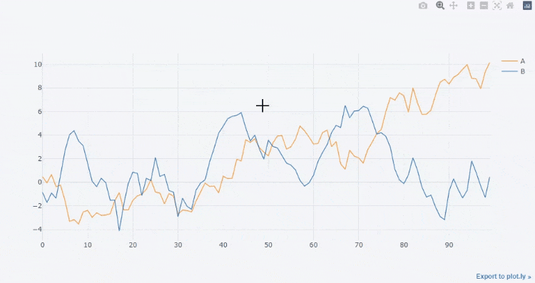<br />也可以给折线图画一条拟合其走势的直线，
```python
df3['A'].iplot(bestfit = True,bestfit_colors=['pink'])
```
output<br />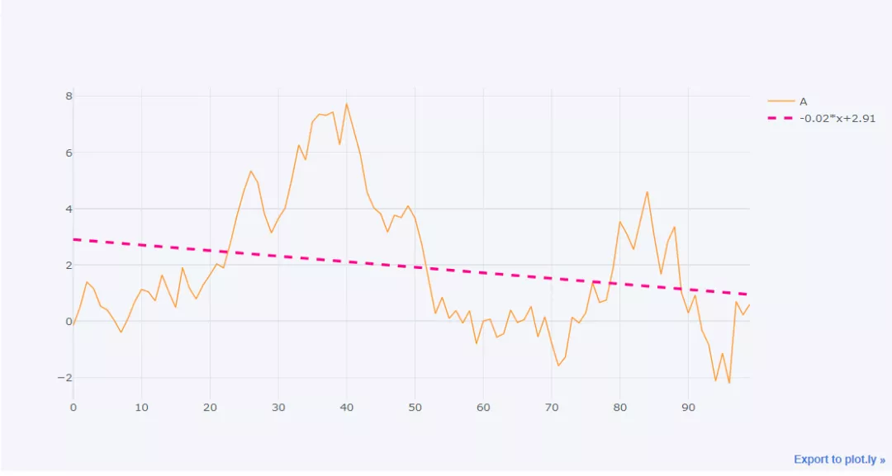<br />这里着重来介绍一个`iplot()`方法里面常用的参数

- kind:图表类型，默认的是scatter，散点类型，可供选择的类型还有bar(直方图)、box(箱型图)、heatmap(热力图)等等
- theme: 布局主题，可以通过cf.getThemes()来查看主要有哪些
- title: 图表的标题
- xTitle/yTitle: x或者y轴上面的轴名
- colors: 绘制图表时候的颜色
- subplots: 布尔值，绘制子图时候需要用到，默认为False
- mode: 字符串，绘图的模式，可以有lines、markers，也还有lines+markers和lines+text等模式
- size: 针对于散点图而言，主要用来调整散点的大小
- shape: 在绘制子图时候各个图的布局
- bargap: 直方图当中柱子之间的距离
- barmode : 直方图的形态，stack(堆叠式)、group(簇状)、overlay(覆盖)
<a name="MJtk4"></a>
### 面积图
从折线图到面积图的转变非常的简单，只需要将参数`fill`设置为`True`即可，代码如下
```python
df3.iplot(fill = True)
```
output<br />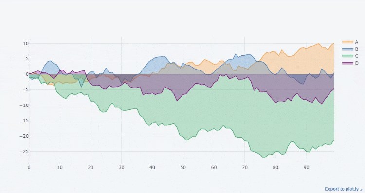
<a name="jD8ii"></a>
### 散点图
对于散点图的绘制，需要将mode设置成marker，代码如下
```python
df3.iplot(kind='scatter',x='A',y='B',
          mode='markers',size=10)
```
output<br />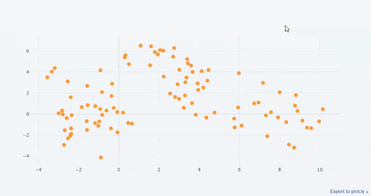<br />可以通过调整size参数来调整散点的大小，例如将size调整成20
```python
df3.iplot(kind='scatter',x='A',y='B',
          mode='markers',size=20)
```
output<br />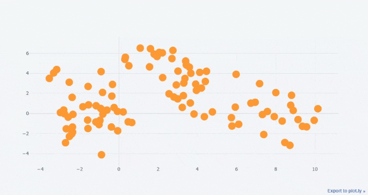<br />或者将mode设置成lines+markers，代码如下
```python
df3.iplot(kind='scatter',x='A',y='B',
          mode='lines + markers',size=10)
```
还可以对散点的形状加以设定，例如下面的代码
```python
df3.iplot(kind='scatter',x='A',y='B',
          mode='markers',size=20,symbol="x",
          colorscale='paired',)
```
output<br />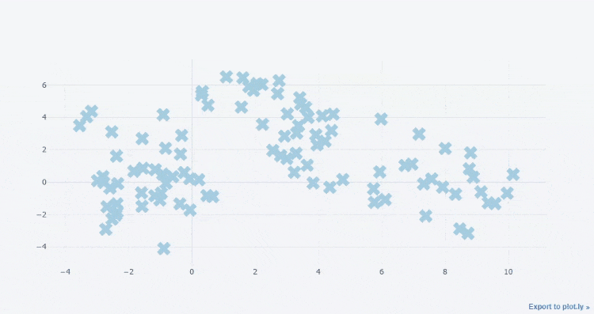<br />当然也可以对散点的颜色加以设定
```bash
df.iplot(kind='scatter' ,mode='markers',
         symbol='square',colors=['orange','purple','blue','red'],
         size=20)
```
output<br />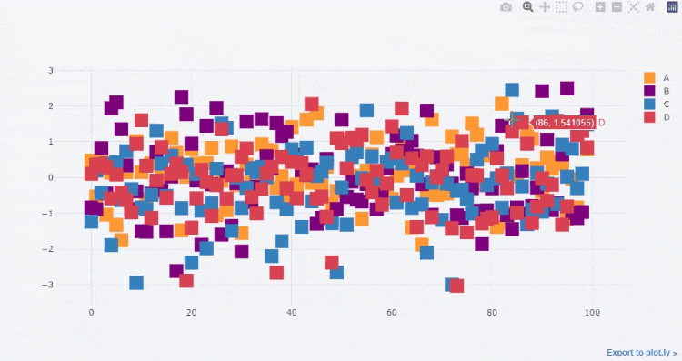
<a name="G68ok"></a>
### 气泡图
气泡图的呈现方式与散点图相比有着异曲同工之妙，在绘制上面将`kind`参数改成`bubble`，假设有这样一组数据
```bash
cf.datagen.bubble(prefix='industry').head()
```
output
```bash
          x         y  size    text categories
0  0.332274  1.053811     2  LCN.CG  industry1
1 -0.856835  0.422373    87  ZKY.XC  industry1
2 -0.818344 -0.167020    72  ZSJ.DJ  industry1
3 -0.720254  0.458264    11  ONG.SM  industry1
4 -0.004744  0.644006    40  HUW.DN  industry1
```
来绘制一下气泡图
```bash
cf.datagen.bubble(prefix='industry').iplot(kind='bubble',x='x',y='y',size='size',
       categories='categories',text='text', xTitle='Returns',
       yTitle='Analyst Score',title='Cufflinks - 气泡图')
```
output<br />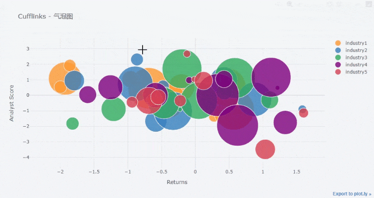<br />气泡图与散点图的不同就在于，散点图当中的每个点大小都是一致的，但是气泡图并不是如此
<a name="Z4dXh"></a>
### 3D散点图
既然已经提到了气泡图，那么3D散点图也就顺便提一下吧，假设数据如下所示
```bash
cf.datagen.scatter3d(2,150).head()
```
output
```bash
          x         y         z    text categories
0  0.375359 -0.683845 -0.960599  RER.JD  category1
1  0.635806  1.210649  0.319687  INM.LE  category1
2  0.578831  0.103654  1.333646  BSZ.HS  category1
3 -1.128907 -1.189098  1.531494  GJZ.UX  category1
4  0.067668 -1.990996  0.088281  IQZ.KS  category1
```
来绘制一下3D的气泡图，既然是三维的图形就说明有x轴、y轴还有z轴，代码如下
```bash
cf.datagen.scatter3d(2,150).iplot(kind='scatter3d',x='x',y='y',z='z',size=15,
                                  categories='categories',text='text',
                                  title='Cufflinks - 3D气泡图',colors=['yellow','purple'],
                                  width=1,margin=(0,0,0,0),
                                  opacity=1)
```
output<br />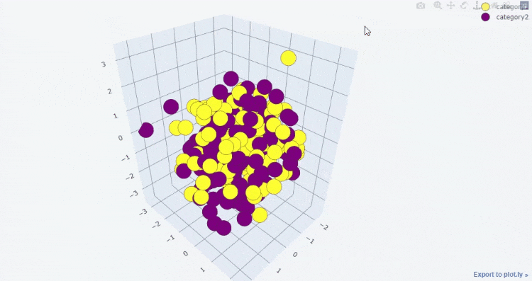
<a name="AsLPh"></a>
### 3D气泡图
那么提到了3D散点图，就不得不提3D的气泡图了，假设数据集长这样
```bash
cf.datagen.bubble3d(5,4).head()
```
output
```bash
          x         y         z  size    text categories
0 -1.888528  0.801430 -0.493671    77  OKC.HL  category1
1 -0.744953 -0.004398 -1.249949    61  GAG.UH  category1
2  0.980846  1.241730 -0.741482    37  LVB.EM  category1
3 -0.230157  0.427072  0.007010    78  NWZ.MG  category1
4  0.025272 -0.424051 -0.602937    76  JDW.AX  category2
```
来绘制一下3D的气泡图
```bash
cf.datagen.bubble3d(5,4).iplot(kind='bubble3d',x='x',y='y',z='z',size='size',
                               text='text',categories='categories',
                               title='Cufflinks - 3D气泡图',colorscale='set1',
                               width=.9,opacity=0.9)
```
output<br />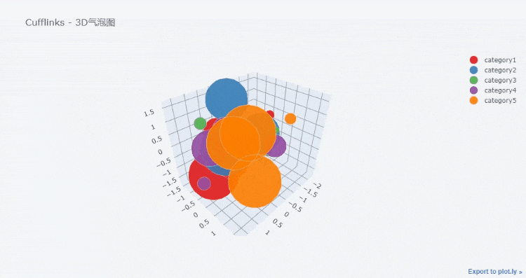
<a name="gYFb0"></a>
### 箱型图
接下来看一下箱型图的绘制，箱型图对于观察数据的分布、是否存在极值等情况有着很大的帮助
```bash
df.iplot(kind = "box")
```
output<br />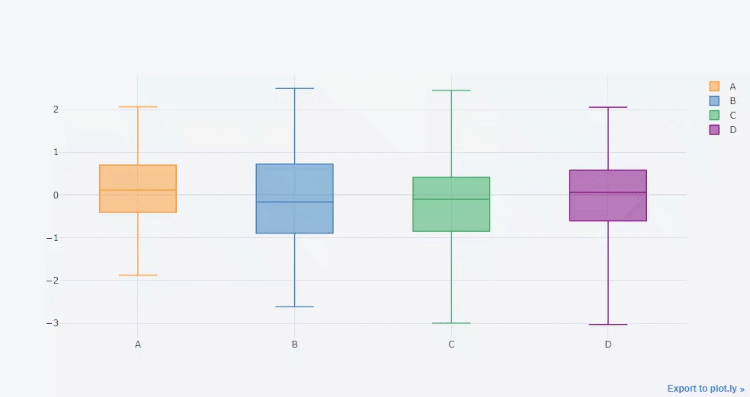
<a name="go2UU"></a>
### 热力图
这个是热力图的绘制，来看一下数据集
```bash
cf.datagen.heatmap(20,20).head()
```
output
```bash
           y_0        y_1        y_2  ...       y_17       y_18       y_19
x_0  40.000000  58.195525  55.355233  ...  77.318287  80.187609  78.959951
x_1  37.111934  25.068114  25.730511  ...  27.261941  32.303315  28.550340
x_2  54.881357  54.254479  59.434281  ...  75.894161  74.051203  72.896999
x_3  41.337221  39.319033  37.916613  ...  15.885289  29.404226  26.278611
x_4  42.862472  36.365226  37.959368  ...  24.998608  25.096598  32.413760
```
来绘制一下热力图，代码如下
```bash
cf.datagen.heatmap(20,20).iplot(kind='heatmap',colorscale='spectral',title='Cufflinks - 热力图')
```
output<br />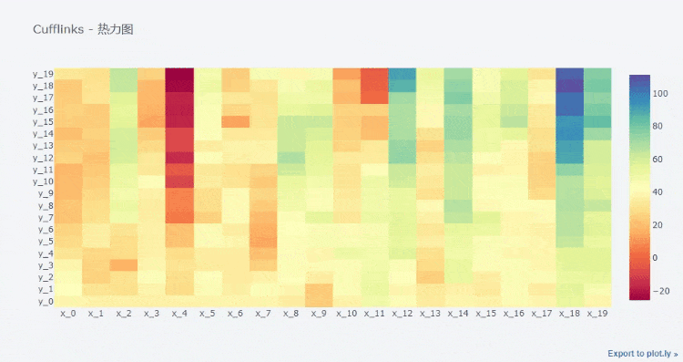
<a name="Np9xE"></a>
### 趋势图
所谓的趋势图，说白了就是折线图和面积图两者的结合，代码如下
```bash
df[["A", "B"]].iplot(kind = 'spread')
```
output<br />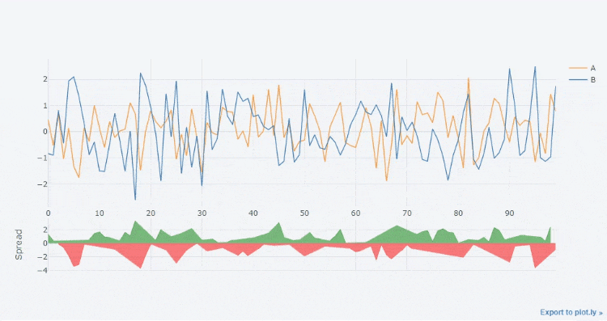
<a name="XGbAh"></a>
### 饼图
下面来看一下饼图的绘制，代码如下
```bash
cf.datagen.pie(n_labels=6, mode = "stocks").iplot(
    kind = "pie",
    labels = "labels",
    values = "values")
```
output<br />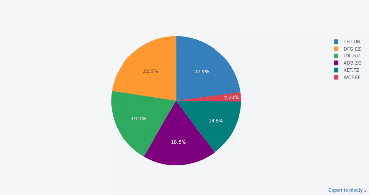
<a name="p0rKB"></a>
### K线图
cufflinks也可以用来绘制K线图，来看一下这里的数据集
```bash
cf.datagen.ohlc().head()
```
output
```bash
                  open        high         low       close
2015-01-01  100.000000  119.144561   97.305961  106.125985
2015-01-02  106.131897  118.814224   96.740816  115.124342
2015-01-03  116.091647  131.477558  115.801048  126.913591
2015-01-04  128.589287  144.116844  117.837221  136.332657
2015-01-05  134.809052  138.681252  118.273850  120.252828
```
从上面的数据集当中可以看到，有开盘价、收盘价、最高/最低价，然后来绘制K线图
```bash
cf.datagen.ohlc().iplot(kind = "ohlc",xTitle = "日期",
                        yTitle="价格",title = "K线图")
```
output<br />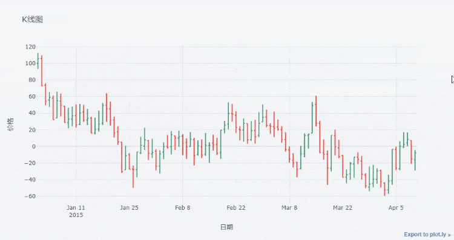
<a name="e8A0Y"></a>
### 直方图
```bash
df = pd.DataFrame({'a': np.random.randn(1000) + 1, 'b': np.random.randn(1000),
                    'c': np.random.randn(1000) - 1}, columns=['a', 'b', 'c'])
df.iplot(kind = "histogram")
```
output<br />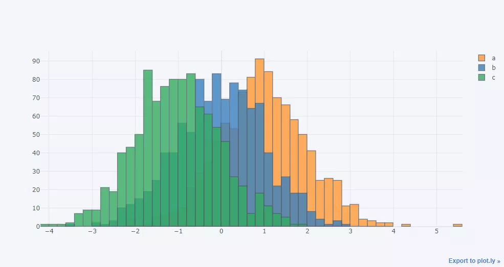
<a name="OdnRQ"></a>
### 多个子图的绘制
然后看一下多个子图的绘制，一个是用`scatter_matrix()`方法来实现
```bash
df = pd.DataFrame(np.random.randn(1000, 4),
                  columns=['a', 'b', 'c', 'd'])
df.scatter_matrix()
```
output<br />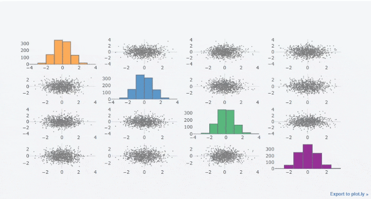<br />另外就是使用`subplots`参数，将其参数设置为`True`，例如来绘制多个直方图子图
```bash
df_h=cf.datagen.histogram(4)
df_h.iplot(kind='histogram',subplots=True,bins=50)
```
output<br />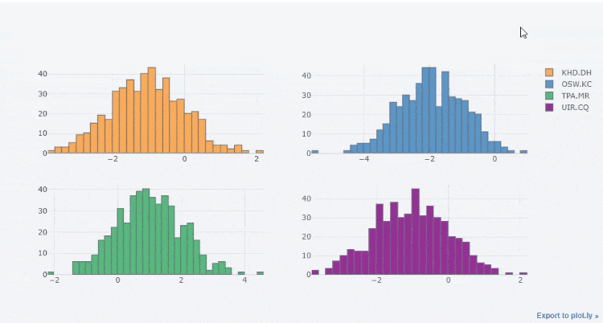<br />或者是绘制多个折线图子图
```bash
df=cf.datagen.lines(4)
df.iplot(subplots=True,subplot_titles=True,legend=True)
```
output<br />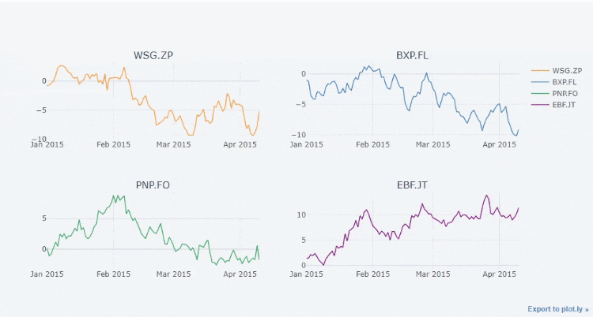<br />最后还可以自由来组合多个子图的绘制，通过里面的`specs`参数
```bash
df=cf.datagen.bubble(10,50,mode='stocks')
# 定义要绘制图表的形式
figs=cf.figures(df,[dict(kind='histogram',keys='x',color='blue'),
                    dict(kind='scatter',mode='markers',x='x',y='y',size=5),
                    dict(kind='scatter',mode='markers',x='x',y='y',size=5,color='teal')],asList=True)
figs.append(cf.datagen.lines(1).figure(bestfit=True,colors=['blue'],bestfit_colors=['red']))
base_layout=cf.tools.get_base_layout(figs)
# 多个子图如何来分布，specs参数当中，分为两行两列来进行分布
specs=cf.subplots(figs,shape=(3,2),base_layout=base_layout,vertical_spacing=.25,horizontal_spacing=.04,
               specs=[[{'rowspan':2},{}],[None,{}],[{'colspan':2},None]],
               subplot_titles=['直方图','散点图_1','散点图_2','折线图+拟合线'])
specs['layout'].update(showlegend=True)
cf.iplot(specs)
```
output<br />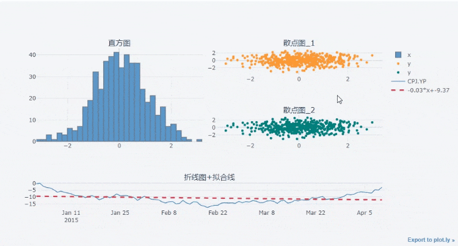
