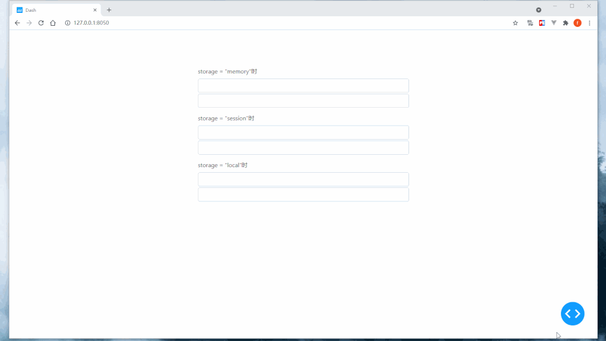
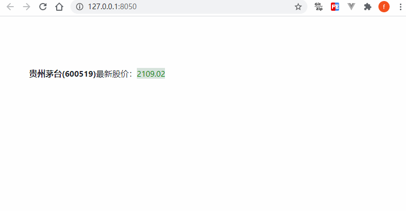
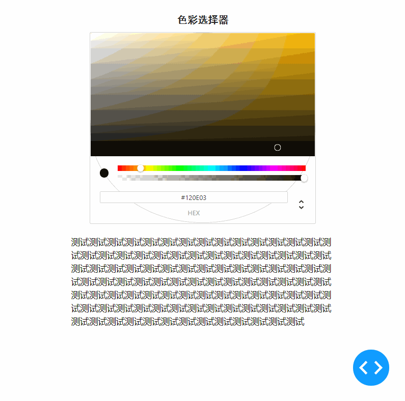
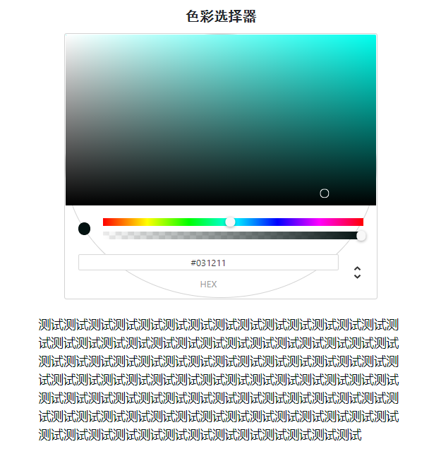
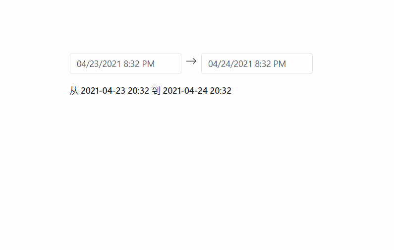

Python
<a name="cBgZi"></a>
## 1、简介
在Dash生态中还有一系列功能比较特殊但又非常实用的部件，来了解一下这些常用的「特殊部件」。<br />
<a name="y3n7A"></a>
## 2、Dash中的常用特殊功能部件
<a name="iOpBU"></a>
### 2.1 用`Store()`来存储数据
在`dash_core_components`中有着很多功能特殊的部件，Store()就是其中之一，它的功能十分的简单，就是用来存储数据的，譬如存储一些数值、字符串等基础数据类型或者把Python中的列表、字典等作为json格式数据存进去。<br />`Store()`的主要参数/属性除了id之外，还有：<br />data，代表其所存放的数据，也是编写回调函数时关注的属性；<br />`modified_timestamp`，用于记录最后一次data属性被修改的时间戳，通常用不到；<br />`storage_type`，用于设置存储数据的生命周期，有3种，`storage_type='memory'`时生命周期最短，只要页面一刷新，data就会恢复初始状态；`storage_type='session'`时，只有浏览器被关闭时data才会被重置；而最后一种`storage_type='local'`时，会将数据存储在本地缓存中，只有手动清除，data才会被重置。<br />直接来看一个直观的例子：<br />app1.py
```python
import dash
import dash_core_components as dcc
import dash_bootstrap_components as dbc
from dash.dependencies import Input, Output

app = dash.Dash(__name__)

app.layout = dbc.Container(
    [
        dbc.Form(
            [
                dbc.FormGroup(
                    [
                        dbc.Label('storage = "memory"时'),
                        dbc.Input(id='input-memory1', autoComplete='off'),
                        dbc.Input(id='input-memory2', style={'margin-top': '3px'}),
                        dcc.Store(id='data-in-memory')
                    ]
                ),
                dbc.FormGroup(
                    [
                        dbc.Label('storage = "session"时'),
                        dbc.Input(id='input-session1', autoComplete='off'),
                        dbc.Input(id='input-session2', style={'margin-top': '3px'}),
                        dcc.Store(id='data-in-session', storage_type='session')
                    ]
                ),
                dbc.FormGroup(
                    [
                        dbc.Label('storage = "local"时'),
                        dbc.Input(id='input-local1', autoComplete='off'),
                        dbc.Input(id='input-local2', style={'margin-top': '3px'}),
                        dcc.Store(id='data-in-local', storage_type='local')
                    ]
                ),
            ]
        )
    ],
    style={
        'margin-top': '100px',
        'max-width': '600px'
    }
)


# memory对应回调
@app.callback(
    Output('data-in-memory', 'data'),
    Input('input-memory1', 'value')
)
def data_in_memory_save_data(value):
    if value:
        return value

    return dash.no_update


@app.callback(
    Output('input-memory2', 'placeholder'),
    Input('data-in-memory', 'data')
)
def data_in_memory_placeholder(data):
    if data:
        return data

    return dash.no_update


# session对应回调
@app.callback(
    Output('data-in-session', 'data'),
    Input('input-session1', 'value')
)
def data_in_session_save_data(value):
    if value:
        return value

    return dash.no_update


@app.callback(
    Output('input-session2', 'placeholder'),
    Input('data-in-session', 'data')
)
def data_in_session_placeholder(data):
    if data:
        return data

    return dash.no_update


# local对应回调
@app.callback(
    Output('data-in-local', 'data'),
    Input('input-local1', 'value')
)
def data_in_local_save_data(value):
    if value:
        return value

    return dash.no_update


@app.callback(
    Output('input-local2', 'placeholder'),
    Input('data-in-local', 'data')
)
def data_in_local_placeholder(data):
    if data:
        return data

    return dash.no_update


if __name__ == '__main__':
    app.run_server(debug=True)
```
可以看到，不同`storage`参数对应的数据，生命周期有着很大的区别：<br /><br />就是凭借着这种自由存储数据的特性，`Store()`可以完成很多非常实用的功能。
<a name="COHXl"></a>
### 2.2 用`Interval()`实现周期性回调
同样是`dash_core_components`中的组件，`Interval()`的功能也很有意思，它可以实现周期性自动回调，譬如开发一个实时股价系统，每隔一段时间就从后台获取最新的数据，无需手动刷新页面，其主要的参数/属性有：<br />`n_intervals`，`Interval()`的核心属性，所谓的自动更新实际上就是自动对`n_intervals`的递增过程；<br />`interval`，数值型，用于设置每隔多少毫秒对n_intervals的值进行一次递增，默认为1000即1秒；<br />`max_intervals`，int型，用于设置在经历多少次递增后，不再继续自动更新，默认为-1即不限制；<br />`disabled`，`bool`型，默认为`False`，用于设置是否停止递增更新过程，如果说`max_intervals`控制的过程是for循环的话，`disabled`就是`while`循环，可以利用它自行编写逻辑在特定的条件下停止`Interval()`的递增过程。<br />下面从一个伪造数据的股价实时更新系统例子中进一步理解`Interval()`的作用：<br />app2.py
```python
import dash
import numpy as np
import dash_core_components as dcc
import dash_html_components as html
import dash_bootstrap_components as dbc
from dash.dependencies import Input, Output, State

app = dash.Dash(__name__)

app.layout = dbc.Container(
    [
        html.P(
            [
                html.Strong('贵州茅台(600519)'),
                '最新股价：',
                html.Span('2108.94', id='latest-price')
            ]
        ),
        dcc.Interval(id='demo-interval', interval=1000)
    ],
    style={
        'margin-top': '100px'
    }
)


@app.callback(
    [Output('latest-price', 'children'),
     Output('latest-price', 'style')],
    Input('demo-interval', 'n_intervals'),
    State('latest-price', 'children')
)
def fake_price_generator(n_intervals, latest_price):
    fake_price = float(latest_price) + np.random.normal(0, 0.1)

    if fake_price > float(latest_price):
        return f'{fake_price:.2f}', {'color': 'red', 'background-color': 'rgba(195, 8, 26, 0.2)'}

    elif fake_price < float(latest_price):
        return f'{fake_price:.2f}', {'color': 'green', 'background-color': 'rgba(50, 115, 80, 0.2)'}

    return f'{fake_price:.2f}', {'background-color': 'rgba(113, 120, 117, 0.2)'}


if __name__ == '__main__':
    app.run_server(debug=True)
```

<a name="Ix8or"></a>
### 2.3 利用`ColorPicker()`进行交互式色彩设置
接下来要介绍的这个很有意思的部件来自Dash的官方依赖`dash_daq`，它并不是自带的，需要用pip进行安装。<br />`ColorPicker()`的功能是渲染出一个交互式的色彩选择部件，可以更方便更直观地选择色彩值，其主要参数/属性有：<br />`label`，字符串或字典，若只传入字符串，则传入的文字会作为渲染出的色彩选择器的标题，若传入字典，其`label`键值对用于设置标题文本内容，`style`参数用于自定义`css`样式；<br />`labelPosition`，字符型，top时标题会置于顶部，`bottom`时会置于底部；<br />`size`，设置部件整体的像素宽度<br />`value`，字典型，作为参数时可以用来设定色彩选择器的初始色彩，作为属性时可以获取当前色彩选择器的选定色彩，hex键值对可以直接获取十六进制色彩值，rgb键对应的值为包含r、g、b和a四个键值对的字典，即构成rgba色彩值的三通道+透明度值。<br />通过下面这个简单的例子来认识它的工作过程：<br />app3.py
```python
import dash
import dash_daq as daq
import dash_html_components as html
import dash_bootstrap_components as dbc
from dash.dependencies import Input, Output

app = dash.Dash(__name__)

app.layout = dbc.Container(
    [
        daq.ColorPicker(
            id='color-picker',
            label={
                'label': '色彩选择器',
                'style': {
                    'font-size': '18px',
                    'font-family': 'SimHei',
                    'font-weight': 'bold'
                }
            },
            size=400,
            value=dict(hex="#120E03")
        ),
        html.P(
            '测试'*100,
            id='demo-p',
            style={
                'margin-top': '20px'
            }
        )
    ],
    style={
        'margin-top': '30px',
        'max-width': '500px'
    }
)

app.clientside_callback(
    """
    function(color) {
        return {'color': color.hex, 'margin-top': '20px'};
    }
    """,
    Output('demo-p', 'style'),
    Input('color-picker', 'value')
)

if __name__ == '__main__':
    app.run_server(debug=True)
```
动图录制出来因为被压缩了所以色彩区域看起来跟打了码：<br /><br />实际上是这样的：<br />
<a name="ea9UA"></a>
### 2.4 利用`DashDatetimepicker()`进行时间范围选择
接下来介绍的这个部件`DashDatetimepicker()`也是来自第三方库，它基于react-datetime，可以创建进行日期选择功能的部件（其实dash-core_components中也有类似功能的`DatePickerRange()`部件，但是太丑了，而且对中文支持的不好）。<br />使用`pip install dash_datetimepicker`完成安装之后，默认的部件月份和星期的名称显示都是英文的，通过对相关的js源码略加修改之后，便可以使用中文了，使用的时候把附件中的`dash_datetimepicker.min.js`放到`assets`目录下即可。<br />`DashDatetimepicker()`使用起来非常简单，除了id之外，只需要在回调中获取它的`startDate`与`endDate`属性即可捕获到用户设置的日期时间范围（在回调中接收到的开始结束时间需要加上8个小时，这是个bug）：<br />app4.py
```python
import dash
import pandas as pd
import dash_datetimepicker
import dash_html_components as html
import dash_bootstrap_components as dbc
from dash.dependencies import Input, Output

app = dash.Dash(__name__)

app.layout = dbc.Container(
    [
        dash_datetimepicker.DashDatetimepicker(id="datetime-picker"),
        html.H6(id='datetime-output', style={'margin-top': '20px'})
    ],
    style={
        'margin-top': '100px',
        'max-width': '600px'
    }
)


@app.callback(
    Output('datetime-output', 'children'),
    [Input('datetime-picker', 'startDate'),
     Input('datetime-picker', 'endDate')]
)
def datetime_range(startDate, endDate):
    # 修正8小时时间差bug并格式化为字符串
    startDate = (pd.to_datetime(startDate) + pd.Timedelta(hours=8)).strftime('%Y-%m-%d %H:%M')
    endDate = (pd.to_datetime(endDate) + pd.Timedelta(hours=8)).strftime('%Y-%m-%d %H:%M')

    return f'从 {startDate} 到 {endDate}'


if __name__ == "__main__":
    app.run_server(debug=True)
```

<a name="WnuVI"></a>
## 3、动手打造一个实时可视化大屏
在了解完今天的内容之后，就可以做一些功能上很amazing的事情——搭建一个实时更新的可视化仪表盘。<br />思路其实很简单，主要用到`Interval()`与`Store()`，原理是先从官网静态的案例中移植js代码到Dash的浏览器端回调中，构建出输入为`Store()`的data的回调函数；<br />再利用`Interval()`的`n_intervals`触发`Store()`的data更新，从而实现这套从数据更新到图表更新的链式反应。效果如下：<br />
<a name="bh2JO"></a>
## 4、附件
[附件.zip](https://www.yuque.com/attachments/yuque/0/2021/zip/396745/1622736135032-884ffa7c-6723-4ab7-a6e0-3d89a9b6aa77.zip?_lake_card=%7B%22src%22%3A%22https%3A%2F%2Fwww.yuque.com%2Fattachments%2Fyuque%2F0%2F2021%2Fzip%2F396745%2F1622736135032-884ffa7c-6723-4ab7-a6e0-3d89a9b6aa77.zip%22%2C%22name%22%3A%22%E9%99%84%E4%BB%B6.zip%22%2C%22size%22%3A439440%2C%22type%22%3A%22application%2Fx-zip-compressed%22%2C%22ext%22%3A%22zip%22%2C%22status%22%3A%22done%22%2C%22taskId%22%3A%22u44b26d4f-c5d6-4953-aca0-9134b24bfe2%22%2C%22taskType%22%3A%22upload%22%2C%22id%22%3A%22uc42a2b1f%22%2C%22card%22%3A%22file%22%7D)
