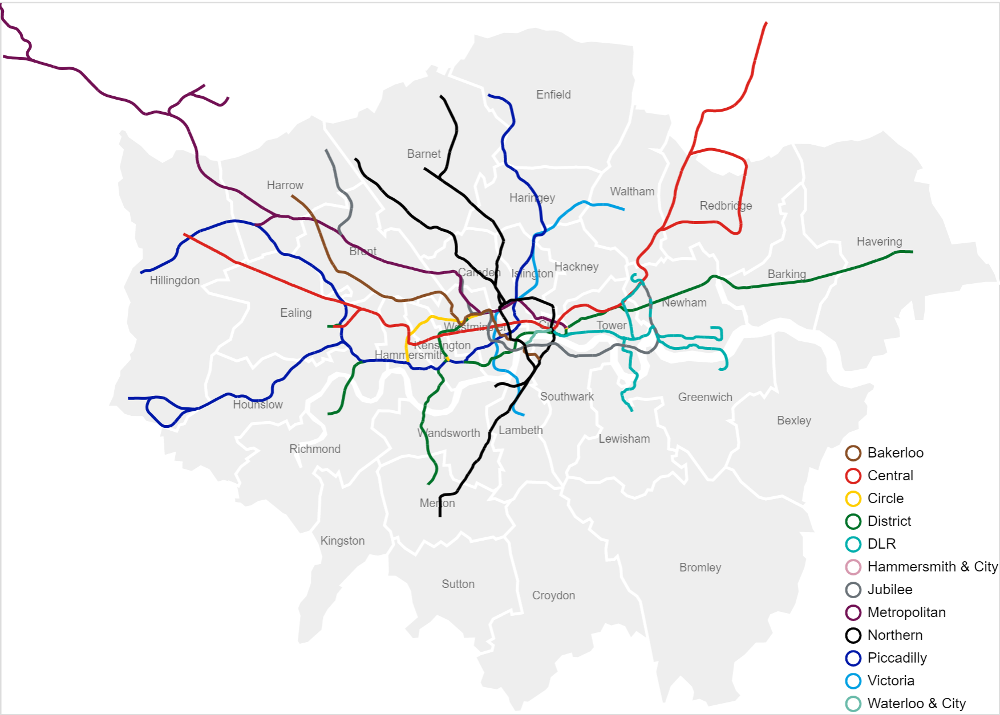

Python可视化Altair<br />
```python
from chord import Chord

matrix = [
    [0, 5, 6, 4, 7, 4],
    [5, 0, 5, 4, 6, 5],
    [6, 5, 0, 4, 5, 5],
    [4, 4, 4, 0, 5, 5],
    [7, 6, 5, 5, 0, 4],
    [4, 5, 5, 5, 4, 0],
]

names = ["Action", "Adventure", "Comedy", "Drama", "Fantasy", "Thriller"]

# 保存
Chord(matrix, names).to_html("chord-diagram.html")
```
图形表现力强悍！
<a name="HKXN1"></a>
## Altair概述
Altair是一个用于Python的声明式统计可视化库，基于Vega和Vega-Lite。<br />Altair提供了一个强大而简洁的可视化语法，能够快速建立一个广泛的统计可视化。下面是一个使用Altair API的例子，通过一个交互式散点图快速实现数据集的可视化。<br />**Github：**[https://altair-viz.github.io/getting_started/overview.html](https://altair-viz.github.io/getting_started/overview.html)<br /><br />表现强悍<br /><br />图形表现力强悍！
```python
import matplotlib.pyplot as plt

# 创建数据
size_of_groups = [12, 11, 3, 30]

# 生成饼图
plt.pie(size_of_groups)

# 在中心添加一个圆, 生成环形图
my_circle = plt.Circle((0, 0), 0.7, color='white')
p = plt.gcf()
p.gca().add_artist(my_circle)

plt.show()
```

```python
import matplotlib.pyplot as plt
from matplotlib_venn import venn2

# 创建图表
venn2(subsets=(10, 5, 2), set_labels=('Group A', 'Group B'))

# 显示
plt.show()
```

```python
import circlify
import matplotlib.pyplot as plt

# 创建画布, 包含一个子图
fig, ax = plt.subplots(figsize=(14, 14))

# 标题
ax.set_title('Repartition of the world population')

# 移除坐标轴
ax.axis('off')

# 人口数据
data = [{'id': 'World', 'datum': 6964195249, 'children': [
              {'id': "North America", 'datum': 450448697,
                  'children': [
                     {'id': "United States", 'datum': 308865000},
                     {'id': "Mexico", 'datum': 107550697},
                     {'id': "Canada", 'datum': 34033000}
                   ]},
              {'id': "South America", 'datum': 278095425,
                  'children': [
                     {'id': "Brazil", 'datum': 192612000},
                     {'id': "Colombia", 'datum': 45349000},
                     {'id': "Argentina", 'datum': 40134425}
                   ]},
              {'id': "Europe", 'datum': 209246682,
                  'children': [
                     {'id': "Germany", 'datum': 81757600},
                     {'id': "France", 'datum': 65447374},
                     {'id': "United Kingdom", 'datum': 62041708}
                   ]},
              {'id': "Africa", 'datum': 311929000,
                  'children': [
                     {'id': "Nigeria", 'datum': 154729000},
                     {'id': "Ethiopia", 'datum': 79221000},
                     {'id': "Egypt", 'datum': 77979000}
                   ]},
              {'id': "Asia", 'datum': 2745929500,
                  'children': [
                     {'id': "China", 'datum': 1336335000},
                     {'id': "India", 'datum': 1178225000},
                     {'id': "Indonesia", 'datum': 231369500}
                   ]}
    ]}]

# 使用circlify()计算, 获取圆的大小, 位置
circles = circlify.circlify(
    data,
    show_enclosure=False,
    target_enclosure=circlify.Circle(x=0, y=0, r=1)
)


lim = max(
    max(
        abs(circle.x) + circle.r,
        abs(circle.y) + circle.r,
    )
    for circle in circles
)
plt.xlim(-lim, lim)
plt.ylim(-lim, lim)

for circle in circles:
    if circle.level != 2:
        continue
    x, y, r = circle
    ax.add_patch(plt.Circle((x, y), r, alpha=0.5, linewidth=2, color="lightblue"))

for circle in circles:
    if circle.level != 3:
        continue
    x, y, r = circle
    label = circle.ex["id"]
    ax.add_patch(plt.Circle((x, y), r, alpha=0.5, linewidth=2, color="#69b3a2"))
    plt.annotate(label, (x, y), ha='center', color="white")

for circle in circles:
    if circle.level != 2:
        continue
    x, y, r = circle
    label = circle.ex["id"]
    plt.annotate(label, (x, y), va='center', ha='center', bbox=dict(facecolor='white', edgecolor='black', boxstyle='round', pad=.5))

plt.show()
```

```python
import folium
import pandas as pd

# 创建地图对象
m = folium.Map(location=[20,0], tiles="OpenStreetMap", zoom_start=2)

# 坐标点数据
data = pd.DataFrame({
   'lon': [-58, 2, 145, 30.32, -4.03, -73.57, 36.82, -38.5],
   'lat': [-34, 49, -38, 59.93, 5.33, 45.52, -1.29, -12.97],
   'name': ['Buenos Aires', 'Paris', 'melbourne', 'St Petersbourg', 'Abidjan', 'Montreal', 'Nairobi', 'Salvador'],
   'value': [10, 12, 40, 70, 23, 43, 100, 43]
}, dtype=str)

# 添加气泡
for i in range(0, len(data)):
    folium.Circle(
      location=[data.iloc[i]['lat'], data.iloc[i]['lon']],
      popup=data.iloc[i]['name'],
      radius=float(data.iloc[i]['value'])*20000,
      color='crimson',
      fill=True,
      fill_color='crimson'
    ).add_to(m)

# 保存
m.save('bubble-map.html')
```

```python
import altair as alt
from vega_datasets import data

boroughs = alt.topo_feature(data.londonBoroughs.url, 'boroughs')
tubelines = alt.topo_feature(data.londonTubeLines.url, 'line')
centroids = data.londonCentroids.url

background = alt.Chart(boroughs).mark_geoshape(
    stroke='white',
    strokeWidth=2
).encode(
    color=alt.value('#eee'),
).properties(
    width=700,
    height=500
)

labels = alt.Chart(centroids).mark_text().encode(
    longitude='cx:Q',
    latitude='cy:Q',
    text='bLabel:N',
    size=alt.value(8),
    opacity=alt.value(0.6)
).transform_calculate(
    "bLabel", "indexof (datum.name,' ') > 0  ? substring(datum.name,0,indexof(datum.name, ' ')) : datum.name"
)

line_scale = alt.Scale(domain=["Bakerloo", "Central", "Circle", "District", "DLR",
                               "Hammersmith & City", "Jubilee", "Metropolitan", "Northern",
                               "Piccadilly", "Victoria", "Waterloo & City"],
                       range=["rgb(137,78,36)", "rgb(220,36,30)", "rgb(255,206,0)",
                              "rgb(1,114,41)", "rgb(0,175,173)", "rgb(215,153,175)",
                              "rgb(106,114,120)", "rgb(114,17,84)", "rgb(0,0,0)",
                              "rgb(0,24,168)", "rgb(0,160,226)", "rgb(106,187,170)"])

lines = alt.Chart(tubelines).mark_geoshape(
    filled=False,
    strokeWidth=2
).encode(
    alt.Color(
        'id:N',
        legend=alt.Legend(
            title=None,
            orient='bottom-right',
            offset=0
        ),
        scale=line_scale
    )
)

background + labels + lines
```

```python
import altair as alt
from vega_datasets import data

source = data.disasters.url

alt.Chart(source).mark_circle(
    opacity=0.8,
    stroke='black',
    strokeWidth=1
).encode(
    alt.X('Year:O', axis=alt.Axis(labelAngle=0)),
    alt.Y('Entity:N'),
    alt.Size('Deaths:Q',
        scale=alt.Scale(range=[0, 4000]),
        legend=alt.Legend(title='Annual Global Deaths')
    ),
    alt.Color('Entity:N', legend=None)
).properties(
    width=450,
    height=320
).transform_filter(
    alt.datum.Entity != 'All natural disasters'
)
```

```python
import altair as alt
import pandas as pd

source = pd.DataFrame([
      {'country': 'Great Britain', 'animal': 'cattle'},
      {'country': 'Great Britain', 'animal': 'cattle'},
      {'country': 'Great Britain', 'animal': 'cattle'},
      {'country': 'Great Britain', 'animal': 'pigs'},
      {'country': 'Great Britain', 'animal': 'pigs'},
      {'country': 'Great Britain', 'animal': 'sheep'},
      {'country': 'Great Britain', 'animal': 'sheep'},
      {'country': 'Great Britain', 'animal': 'sheep'},
      {'country': 'Great Britain', 'animal': 'sheep'},
      {'country': 'Great Britain', 'animal': 'sheep'},
      {'country': 'Great Britain', 'animal': 'sheep'},
      {'country': 'Great Britain', 'animal': 'sheep'},
      {'country': 'Great Britain', 'animal': 'sheep'},
      {'country': 'Great Britain', 'animal': 'sheep'},
      {'country': 'Great Britain', 'animal': 'sheep'},
      {'country': 'United States', 'animal': 'cattle'},
      {'country': 'United States', 'animal': 'cattle'},
      {'country': 'United States', 'animal': 'cattle'},
      {'country': 'United States', 'animal': 'cattle'},
      {'country': 'United States', 'animal': 'cattle'},
      {'country': 'United States', 'animal': 'cattle'},
      {'country': 'United States', 'animal': 'cattle'},
      {'country': 'United States', 'animal': 'cattle'},
      {'country': 'United States', 'animal': 'cattle'},
      {'country': 'United States', 'animal': 'pigs'},
      {'country': 'United States', 'animal': 'pigs'},
      {'country': 'United States', 'animal': 'pigs'},
      {'country': 'United States', 'animal': 'pigs'},
      {'country': 'United States', 'animal': 'pigs'},
      {'country': 'United States', 'animal': 'pigs'},
      {'country': 'United States', 'animal': 'sheep'},
      {'country': 'United States', 'animal': 'sheep'},
      {'country': 'United States', 'animal': 'sheep'},
      {'country': 'United States', 'animal': 'sheep'},
      {'country': 'United States', 'animal': 'sheep'},
      {'country': 'United States', 'animal': 'sheep'},
      {'country': 'United States', 'animal': 'sheep'}
    ])

domains = ['person', 'cattle', 'pigs', 'sheep']

shape_scale = alt.Scale(
    domain=domains,
    range=[
        'M1.7 -1.7h-0.8c0.3 -0.2 0.6 -0.5 0.6 -0.9c0 -0.6 -0.4 -1 -1 -1c-0.6 0 -1 0.4 -1 1c0 0.4 0.2 0.7 0.6 0.9h-0.8c-0.4 0 -0.7 0.3 -0.7 0.6v1.9c0 0.3 0.3 0.6 0.6 0.6h0.2c0 0 0 0.1 0 0.1v1.9c0 0.3 0.2 0.6 0.3 0.6h1.3c0.2 0 0.3 -0.3 0.3 -0.6v-1.8c0 0 0 -0.1 0 -0.1h0.2c0.3 0 0.6 -0.3 0.6 -0.6v-2c0.2 -0.3 -0.1 -0.6 -0.4 -0.6z',
        'M4 -2c0 0 0.9 -0.7 1.1 -0.8c0.1 -0.1 -0.1 0.5 -0.3 0.7c-0.2 0.2 1.1 1.1 1.1 1.2c0 0.2 -0.2 0.8 -0.4 0.7c-0.1 0 -0.8 -0.3 -1.3 -0.2c-0.5 0.1 -1.3 1.6 -1.5 2c-0.3 0.4 -0.6 0.4 -0.6 0.4c0 0.1 0.3 1.7 0.4 1.8c0.1 0.1 -0.4 0.1 -0.5 0c0 0 -0.6 -1.9 -0.6 -1.9c-0.1 0 -0.3 -0.1 -0.3 -0.1c0 0.1 -0.5 1.4 -0.4 1.6c0.1 0.2 0.1 0.3 0.1 0.3c0 0 -0.4 0 -0.4 0c0 0 -0.2 -0.1 -0.1 -0.3c0 -0.2 0.3 -1.7 0.3 -1.7c0 0 -2.8 -0.9 -2.9 -0.8c-0.2 0.1 -0.4 0.6 -0.4 1c0 0.4 0.5 1.9 0.5 1.9l-0.5 0l-0.6 -2l0 -0.6c0 0 -1 0.8 -1 1c0 0.2 -0.2 1.3 -0.2 1.3c0 0 0.3 0.3 0.2 0.3c0 0 -0.5 0 -0.5 0c0 0 -0.2 -0.2 -0.1 -0.4c0 -0.1 0.2 -1.6 0.2 -1.6c0 0 0.5 -0.4 0.5 -0.5c0 -0.1 0 -2.7 -0.2 -2.7c-0.1 0 -0.4 2 -0.4 2c0 0 0 0.2 -0.2 0.5c-0.1 0.4 -0.2 1.1 -0.2 1.1c0 0 -0.2 -0.1 -0.2 -0.2c0 -0.1 -0.1 -0.7 0 -0.7c0.1 -0.1 0.3 -0.8 0.4 -1.4c0 -0.6 0.2 -1.3 0.4 -1.5c0.1 -0.2 0.6 -0.4 0.6 -0.4z',
        'M1.2 -2c0 0 0.7 0 1.2 0.5c0.5 0.5 0.4 0.6 0.5 0.6c0.1 0 0.7 0 0.8 0.1c0.1 0 0.2 0.2 0.2 0.2c0 0 -0.6 0.2 -0.6 0.3c0 0.1 0.4 0.9 0.6 0.9c0.1 0 0.6 0 0.6 0.1c0 0.1 0 0.7 -0.1 0.7c-0.1 0 -1.2 0.4 -1.5 0.5c-0.3 0.1 -1.1 0.5 -1.1 0.7c-0.1 0.2 0.4 1.2 0.4 1.2l-0.4 0c0 0 -0.4 -0.8 -0.4 -0.9c0 -0.1 -0.1 -0.3 -0.1 -0.3l-0.2 0l-0.5 1.3l-0.4 0c0 0 -0.1 -0.4 0 -0.6c0.1 -0.1 0.3 -0.6 0.3 -0.7c0 0 -0.8 0 -1.5 -0.1c-0.7 -0.1 -1.2 -0.3 -1.2 -0.2c0 0.1 -0.4 0.6 -0.5 0.6c0 0 0.3 0.9 0.3 0.9l-0.4 0c0 0 -0.4 -0.5 -0.4 -0.6c0 -0.1 -0.2 -0.6 -0.2 -0.5c0 0 -0.4 0.4 -0.6 0.4c-0.2 0.1 -0.4 0.1 -0.4 0.1c0 0 -0.1 0.6 -0.1 0.6l-0.5 0l0 -1c0 0 0.5 -0.4 0.5 -0.5c0 -0.1 -0.7 -1.2 -0.6 -1.4c0.1 -0.1 0.1 -1.1 0.1 -1.1c0 0 -0.2 0.1 -0.2 0.1c0 0 0 0.9 0 1c0 0.1 -0.2 0.3 -0.3 0.3c-0.1 0 0 -0.5 0 -0.9c0 -0.4 0 -0.4 0.2 -0.6c0.2 -0.2 0.6 -0.3 0.8 -0.8c0.3 -0.5 1 -0.6 1 -0.6z',
        'M-4.1 -0.5c0.2 0 0.2 0.2 0.5 0.2c0.3 0 0.3 -0.2 0.5 -0.2c0.2 0 0.2 0.2 0.4 0.2c0.2 0 0.2 -0.2 0.5 -0.2c0.2 0 0.2 0.2 0.4 0.2c0.2 0 0.2 -0.2 0.4 -0.2c0.1 0 0.2 0.2 0.4 0.1c0.2 0 0.2 -0.2 0.4 -0.3c0.1 0 0.1 -0.1 0.4 0c0.3 0 0.3 -0.4 0.6 -0.4c0.3 0 0.6 -0.3 0.7 -0.2c0.1 0.1 1.4 1 1.3 1.4c-0.1 0.4 -0.3 0.3 -0.4 0.3c-0.1 0 -0.5 -0.4 -0.7 -0.2c-0.3 0.2 -0.1 0.4 -0.2 0.6c-0.1 0.1 -0.2 0.2 -0.3 0.4c0 0.2 0.1 0.3 0 0.5c-0.1 0.2 -0.3 0.2 -0.3 0.5c0 0.3 -0.2 0.3 -0.3 0.6c-0.1 0.2 0 0.3 -0.1 0.5c-0.1 0.2 -0.1 0.2 -0.2 0.3c-0.1 0.1 0.3 1.1 0.3 1.1l-0.3 0c0 0 -0.3 -0.9 -0.3 -1c0 -0.1 -0.1 -0.2 -0.3 -0.2c-0.2 0 -0.3 0.1 -0.4 0.4c0 0.3 -0.2 0.8 -0.2 0.8l-0.3 0l0.3 -1c0 0 0.1 -0.6 -0.2 -0.5c-0.3 0.1 -0.2 -0.1 -0.4 -0.1c-0.2 -0.1 -0.3 0.1 -0.4 0c-0.2 -0.1 -0.3 0.1 -0.5 0c-0.2 -0.1 -0.1 0 -0.3 0.3c-0.2 0.3 -0.4 0.3 -0.4 0.3l0.2 1.1l-0.3 0l-0.2 -1.1c0 0 -0.4 -0.6 -0.5 -0.4c-0.1 0.3 -0.1 0.4 -0.3 0.4c-0.1 -0.1 -0.2 1.1 -0.2 1.1l-0.3 0l0.2 -1.1c0 0 -0.3 -0.1 -0.3 -0.5c0 -0.3 0.1 -0.5 0.1 -0.7c0.1 -0.2 -0.1 -1 -0.2 -1.1c-0.1 -0.2 -0.2 -0.8 -0.2 -0.8c0 0 -0.1 -0.5 0.4 -0.8z'
    ]
)

color_scale = alt.Scale(
    domain=domains,
    range=['rgb(162,160,152)', 'rgb(194,81,64)', 'rgb(93,93,93)', 'rgb(91,131,149)']
)

alt.Chart(source).mark_point(filled=True, opacity=1, size=100).encode(
    alt.X('x:O', axis=None),
    alt.Y('animal:O', axis=None),
    alt.Row('country:N', header=alt.Header(title='')),
    alt.Shape('animal:N', legend=None, scale=shape_scale),
    alt.Color('animal:N', legend=None, scale=color_scale),
).transform_window(
    x='rank()',
    groupby=['country', 'animal']
).properties(width=550, height=140)
```

<a name="GHw2E"></a>
## 提供丰富的图形代码
<br /><br />

<br /><br /><br /><br /><br /><br /><br /><br /><br /><br /><br />
