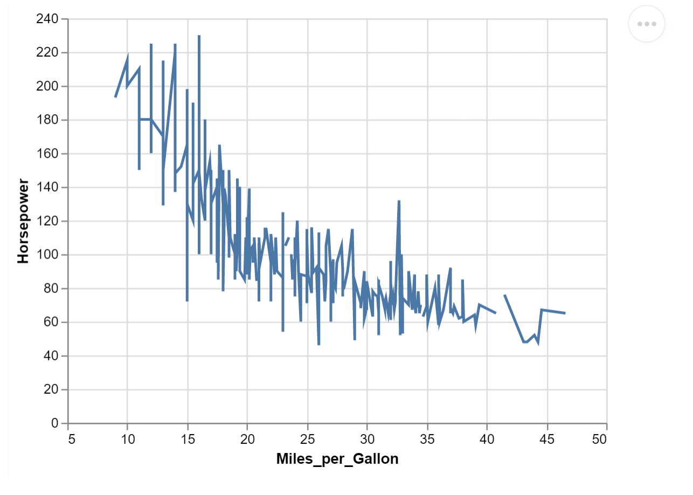
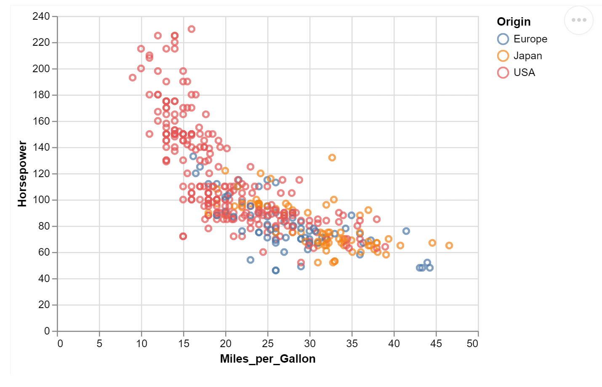
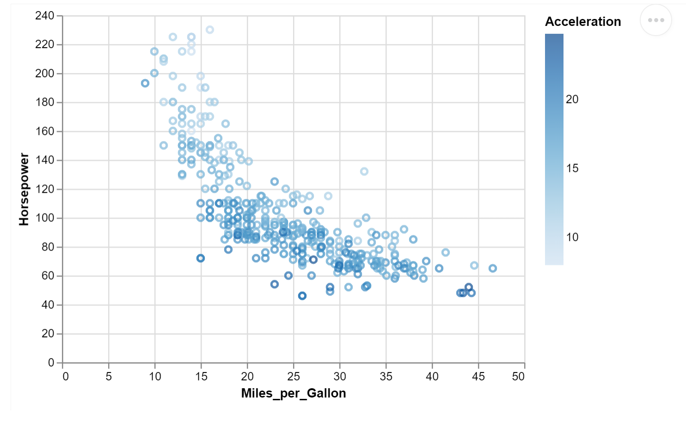
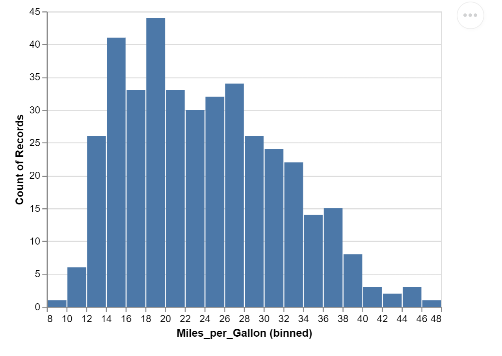
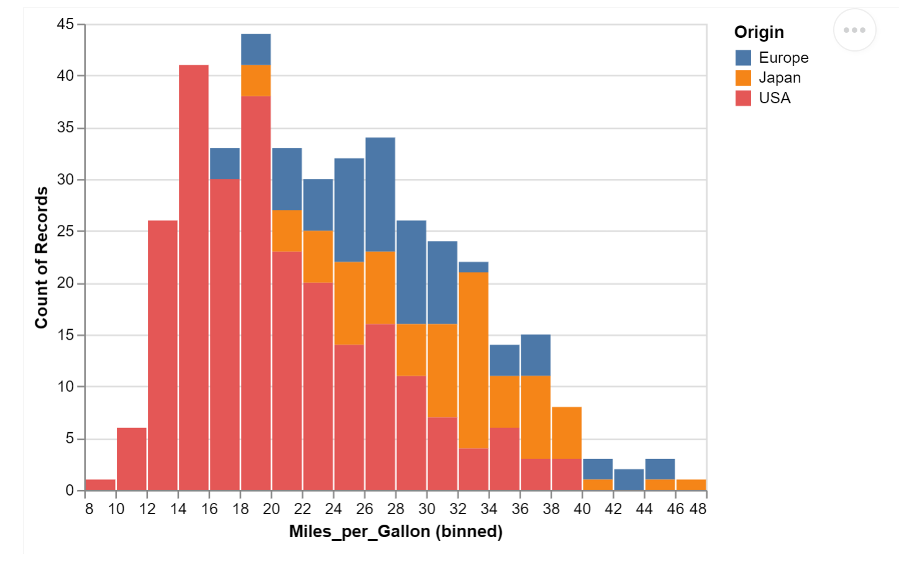
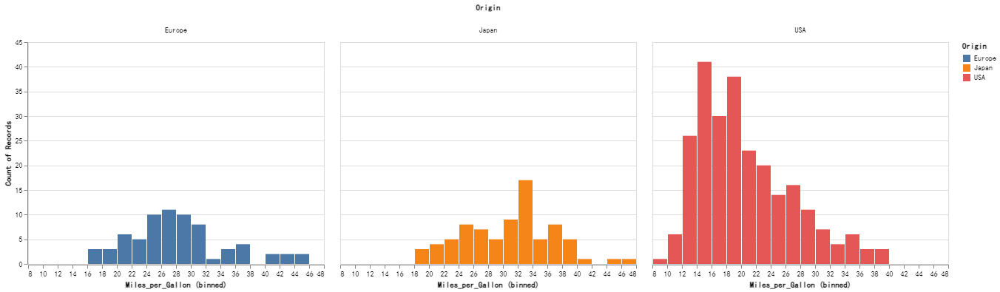
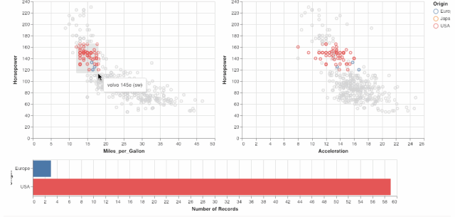
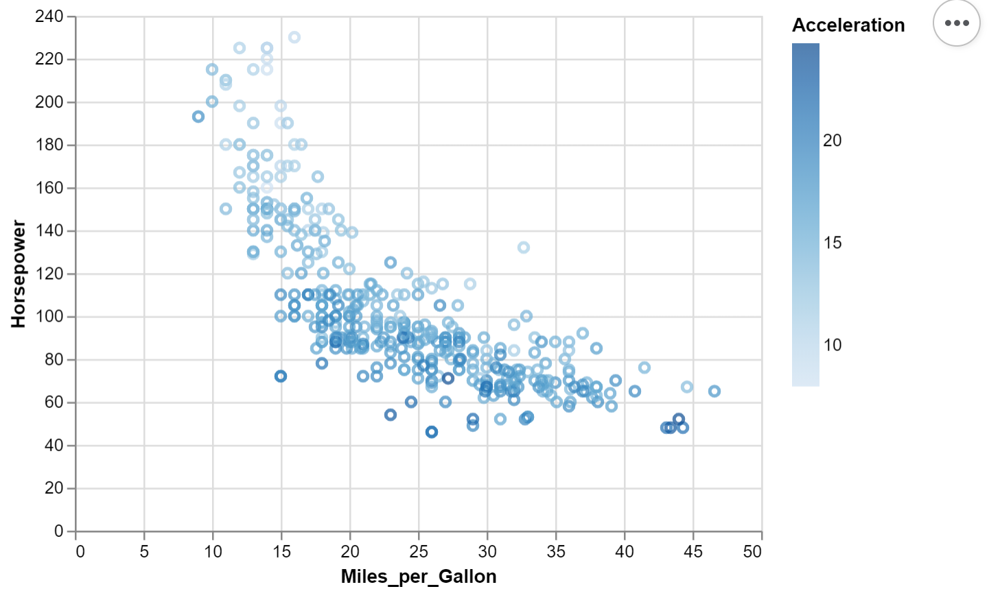
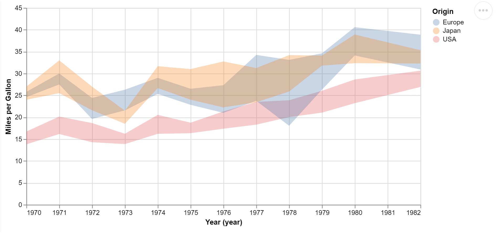
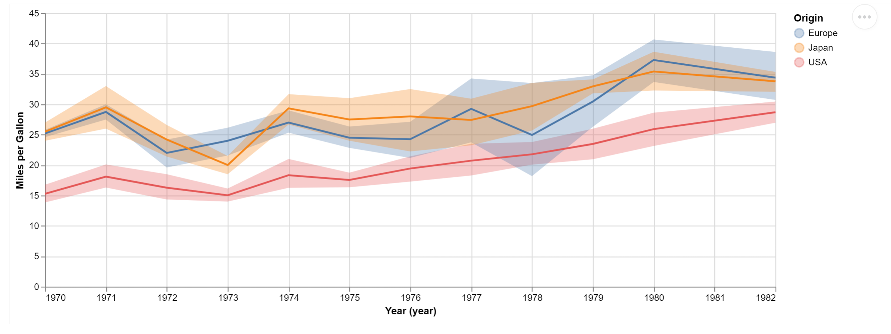

Python 可视化<br />数据转化成更直观的图片，对于理解数据背后的真相很有帮助。<br />**Altair**是一个专为Python编写的可视化软件包，它能让数据科学家更多地关注数据本身和其内在的联系。<br />Altair由华盛顿大学的数据科学家Jake Vanderplas编写，目前在GitHub上已经收获超过7200星。
<a name="XO967"></a>
## 使用教程
Parul以汽车数据为例，将一个汽车数据集“cars”载入到Altair中。
```python
from vega_datasets import data
cars = data.cars()
```
cars中包含汽车的生产年份、耗油量、原产国等9个方面的数据，后面将对这些内容进行可视化处理。
<a name="wv5xy"></a>
### 安装和导入Altair软件包
除了安装Altair和它的依赖软件外，还需要安装其他前端工具，比如Jupyter Notebook、JupyterLab、Colab等等。推荐安装JupyterLab：
```bash
$ pip install -U altair vega_datasets jupyterlab
```
需要注意的是，由于Altair的教程文档中还包含vega数据集，因此也需要一并安装上。<br />接着在终端中输入：jupyter lab，就能在浏览器中自动打开它。<br />在代码开头别忘了导入Altair：
```python
import altair as alt
```
完成以上准备工作，就可以开始绘图了
<a name="TQDHo"></a>
### 开始绘制图表
Altair中的基本对象是**Chart**，它将数据框作为单个参数。可以这样定义它：
```python
chart = alt.Chart(cars)
```
Chart有三个基本方法：**数据**（data）、**标记**（mark）和**编码**（encode），使用它们的格式如下：
```python
alt.Chart(data).mark_point().encode(
    encoding_1='column_1',
    encoding_2='column_2',
    # etc.
)
```
数据顾名思义，直接导入cars数据集即可。标记和编码则决定着绘制图表的样式，下面着重介绍这两部分。<br />**标记**可以让用户在图中以不同形状来表示数据点，比如使用实心点、空心圆、方块等等。<br />如果只调用这个方法，那么所有的数据点都将重叠在一起：<br /><br />这显然是没有意义的，还需要有**编码**来指定图像的具体内容。常用的编码有：<br />**x**: x轴数值<br />**y**: y轴数值<br />**color**: 标记点颜色<br />**opacity**: 标记点的透明度<br />**shape**: 标记点的形状<br />**size**: 标记点的大小<br />**row**: 按行分列图片<br />**column**: 按列分列图片<br />以汽车的耗油量为例，把所有汽车的数据绘制成一个一维散点图，指定x轴为耗油量：
```python
alt.Chart(cars).mark_point().encode(
    x='Miles_per_Gallon'
)
```
<br />但是使用`mark_point()`会让所有标记点混杂在一起，为了让图像更清晰，可以替换成棒状标记点`mark_tick()`：
```python
alt.Chart(cars).mark_tick().encode(
    x='Miles_per_Gallon'
)
```
<br />以耗油量为X轴、马力为Y轴，绘制所有汽车的分布，就得到一张二维图像：
```python
alt.Chart(cars).mark_line().encode(
    x='Miles_per_Gallon',
    y='Horsepower'
)
```

<a name="dk83b"></a>
### 给图表上色
前面已经学会了绘制二维图像，如果能给不同组的数据分配不同的颜色，就相当于给数据增加了第三个维度。
```python
alt.Chart(cars).mark_point().encode(
    x='Miles_per_Gallon',
    y='Horsepower',
    color='Origin'
)
```
<br />上面的图中，第三个维度“原产国”是一个离散变量。<br />使用颜色刻度表，还能实现对连续变量的上色，比如在上图中加入“加速度”维度，颜色越深表示加速度越大：
```python
alt.Chart(cars).mark_point().encode(
    x='Miles_per_Gallon',
    y='Horsepower',
    color='Acceleration'
)
```

<a name="M6qxA"></a>
### 数据的分类与汇总
上面的例子中，使用的主要是散点图。实际上，Altair还能方便地对数据进行分类和汇总，绘制统计直方图。<br />相比其他绘图工具，Altair的特点在于不需要调用其他函数，而是直接在数轴上进行修改。<br />例如统计不同油耗区间的汽车数量，对X轴使用`alt.X()`，指定数据和间隔大小，对Y轴使用`count()`统计数量。
```python
alt.Chart(cars).mark_bar().encode(
    x=alt.X('Miles_per_Gallon', bin=alt.Bin(maxbins=30)),
    y='count()'
)
```
<br />为了分别表示出不同原产国汽车的油耗分布，前文提到的上色方法也能直方图中使用，这样就构成一幅分段的统计直方图：
```python
alt.Chart(cars).mark_bar().encode(
    x=alt.X('Miles_per_Gallon', bin=alt.Bin(maxbins=30)),
    y='count()',
    color='Origin'
)
```
<br />如果觉得上图还不够直观，那么可以用column将汽车按不同原产国分列成3张直方图：
```python
alt.Chart(cars).mark_bar().encode(
    x=alt.X('Miles_per_Gallon', bin=alt.Bin(maxbins=30)),
    y='count()',
    color='Origin',
    column='Origin'
)
```

<a name="LfPXH"></a>
### 交互
除了绘制基本图像，Altair强大之处在于用户可以与图像进行交互，包括平移、缩放、选中某一块数据等操作。<br />在绘制图片的代码后面，调用`interactive()`模块，就能实现平移、缩放：<br /><br />Altair还为创建交互式图像提供了一个`selection`的API。<br />在选择功能上，能做出一些更酷炫的高级功能，例如对选中的数据点进行统计，生成实时的直方图。<br />
<a name="pGNUe"></a>
### 叠加多个图层
如果把前面的汽车耗油量按年度计算出平均值：
```python
alt.Chart(cars).mark_point().encode(
    x='Miles_per_Gallon',
    y='Horsepower',
    color='Acceleration'
)
```
<br />在统计学上，还能定义平均值的置信区间，为了让图表更好看，可以分别列出三个不同产地汽车的耗油量平均值置信区间：
```python
alt.Chart(cars).mark_area(opacity=0.3).encode(
    x=alt.X('Year', timeUnit='year'),
    y=alt.Y('ci0(Miles_per_Gallon)', axis=alt.Axis(title='Miles per Gallon')),
    y2='ci1(Miles_per_Gallon)',
    color='Origin'
).properties(
    width=600
)
```
<br />最后可以用图层API将平均值和置信区间两幅图叠加起来：
```python
spread = alt.Chart(cars).mark_area(opacity=0.3).encode(
    x=alt.X('Year', timeUnit='year'),
    y=alt.Y('ci0(Miles_per_Gallon)', axis=alt.Axis(title='Miles per Gallon')),
    y2='ci1(Miles_per_Gallon)',
    color='Origin'
).properties(
    width=800
)
lines = alt.Chart(cars).mark_line().encode(
    x=alt.X('Year', timeUnit='year'),
    y='mean(Miles_per_Gallon)',
    color='Origin'
).properties(
    width=800
)
spread + lines
```

<a name="AxZqe"></a>
## 更多内容
如果需要了解更多，请参阅GitHub页说明：[https://github.com/altair-viz/altair](https://github.com/altair-viz/altair)
