Python Seaborn 可视化
<a name="BclEd"></a>
## Seaborn简介
<a name="LjNz8"></a>
### 定义
Seaborn是一个基于matplotlib且数据结构与pandas统一的统计图制作库。Seaborn框架旨在以数据可视化为中心来挖掘与理解数据。
<a name="mfmer"></a>
### 优点

1. 代码较少<br />
2. 图形美观<br />
3. 功能齐全<br />
4. 主流模块安装<br />
<a name="gB7cs"></a>
### pip命令安装
```bash
pip install matplotlib
pip install seaborn
```
<a name="749Na"></a>
### 从github安装
```bash
pip install git+https://github.com/mwaskom/seaborn.git
```
<a name="OeqlN"></a>
## 流程
<a name="eeral"></a>
### 导入绘图模块
```python
mport matplotlib.pyplot as plt
import seaborn as sns
```
<a name="0HjdQ"></a>
### 提供显示条件
```python
%matplotlib inline  #在Jupyter中正常显示图形
```
<a name="sWddD"></a>
### 导入数据
```python
#Seaborn内置数据集导入
dataset = sns.load_dataset('dataset')
#外置数据集导入（以csv格式为例）
dataset = pd.read_csv('dataset.csv')
```
<a name="J1Bda"></a>
### 设置画布
```python
#设置一块大小为(12,6)的画布
plt.figure(figsize=(12, 6))
```
<a name="OSWGZ"></a>
### 输出图形
```python
#整体图形背景样式，共5种:"white", "dark", "whitegrid", "darkgrid", "ticks"
sns.set_style('white')
#以条形图为例输出图形
sns.barplot(x=x,y=y,data=dataset,...)
'''
barplot()括号里的是需要设置的具体参数，
涉及到数据、颜色、坐标轴、以及具体图形的一些控制变量，
基本的一些参数包括'x'、'y'、'data'，分别表示x轴，y轴，
以及选择的数据集。
'''
```
<a name="qYhAL"></a>
### 保存图形
```python
#将画布保存为png、jpg、svg等格式图片
plt.savefig('jg.png')
```
<a name="25Aee"></a>
## 实战
[cook.csv](https://www.yuque.com/attachments/yuque/0/2020/xls/396745/1601001998091-5906de29-1ba3-4330-8eb9-b92f7d8de7a8.xls?_lake_card=%7B%22uid%22%3A%221601001995566-0%22%2C%22src%22%3A%22https%3A%2F%2Fwww.yuque.com%2Fattachments%2Fyuque%2F0%2F2020%2Fxls%2F396745%2F1601001998091-5906de29-1ba3-4330-8eb9-b92f7d8de7a8.xls%22%2C%22name%22%3A%22cook.csv%22%2C%22size%22%3A531995%2C%22type%22%3A%22application%2Fvnd.ms-excel%22%2C%22ext%22%3A%22xls%22%2C%22progress%22%3A%7B%22percent%22%3A99%7D%2C%22status%22%3A%22done%22%2C%22percent%22%3A0%2C%22id%22%3A%22u46Me%22%2C%22card%22%3A%22file%22%7D)
```python
#数据准备
df = pd.read_csv('./cook.csv') #读取数据集
df['难度'] = df['用料数'].apply(lambda x:'简单'if x<5else('一般'if x<15 else'较难')) #增加难度字段
df = df[['菜谱','用料','用料数','难度','菜系','评分','用户']] #选择需要的列
df.sample(5)  #查看数据集的随机5行数据
```

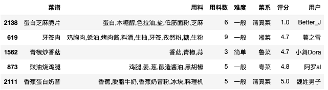
```python
#导入相关包
import numpy as np
import pandas as pd
import matplotlib.pyplot as plt
import matplotlib as mpl
import seaborn as sns
%matplotlib inline
plt.rcParams['font.sans-serif'] = ['SimHei']  # 设置加载的字体名
plt.rcParams['axes.unicode_minus'] = False # 解决保存图像是负号'-'显示为方块的问题
sns.set_style('white')   #设置图形背景样式为white
```
<a name="dHBip"></a>
### 直方图
```python
#语法
'''
seaborn.distplot(a, bins=None, hist=True, kde=True, rug=False, fit=None,
hist_kws=None, kde_kws=None, rug_kws=None, fit_kws=None, color=None,
vertical=False, norm_hist=False, axlabel=None, label=None, ax=None)
'''
#distplot()输出直方图，默认拟合出密度曲线
plt.figure(figsize=(10, 6)) #设置画布大小
rate = df['评分']
sns.distplot(rate,color="salmon",bins=20) #参数color样式为salmon，bins参数设定数据片段的数量
```
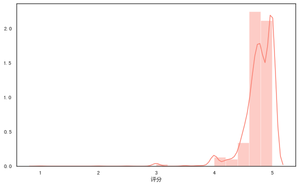

```python
#kde参数设为False,可去掉拟合的密度曲线
plt.figure(figsize=(10, 6))
sns.distplot(rate,kde=False,color="salmon",bins=20)
```
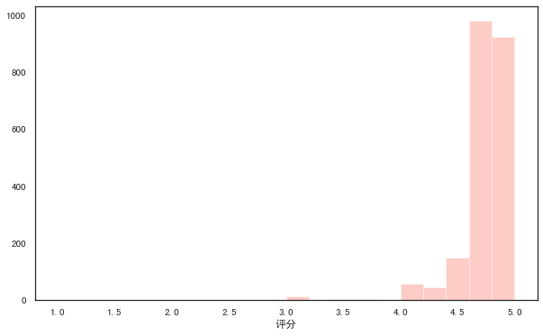

```python
#设置rug参数，可添加观测数值的边际毛毯
fig,axes=plt.subplots(1,2,figsize=(10,6)) #为方便对比，创建一个1行2列的画布,figsize设置画布大小
sns.distplot(rate,color="salmon",bins=10,ax=axes[0]) #axes[0]表示第一张图(左图)
sns.distplot(rate,color="green",bins=10,rug=True,ax=axes[1]) #axes[1]表示第一张图(右图)
```
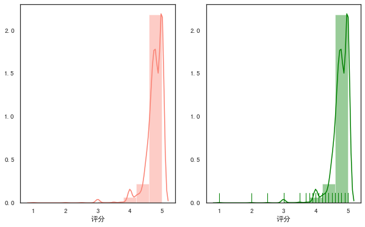

```python
#多个参数可通过字典传递
fig,axes=plt.subplots(1,2,figsize=(10,6))
sns.distplot(rate,color="salmon",bins=20,rug=True,ax=axes[0])
sns.distplot(rate,rug=True,
                     hist_kws={'color':'g','label':'直方图'},
                     kde_kws={'color':'b','label':'密度曲线'},
                     bins=20,
                     ax=axes[1])
```
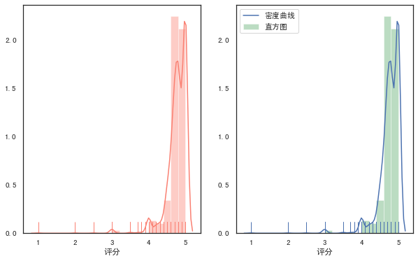
<a name="9MI4r"></a>
### 散点图
<a name="4geLG"></a>
#### 常规散点图:scatterplot
```python
#语法
'''
seaborn.scatterplot(x=None, y=None, hue=None, style=None, size=None,
data=None, palette=None, hue_order=None, hue_norm=None, sizes=None,
size_order=None, size_norm=None, markers=True, style_order=None, x_bins=None,
y_bins=None, units=None, estimator=None, ci=95, n_boot=1000, alpha='auto',
x_jitter=None, y_jitter=None, legend='brief', ax=None, **kwargs)
'''
fig,axes=plt.subplots(1,2,figsize=(10,6))
#hue参数，对数据进行细分
sns.scatterplot(x="用料数", y="评分",hue="难度",data=df,ax=axes[0])
#style参数通过不同的颜色和标记显示分组变量
sns.scatterplot(x="用料数", y="评分",hue="难度",style='难度',data=df,ax=axes[1])
```
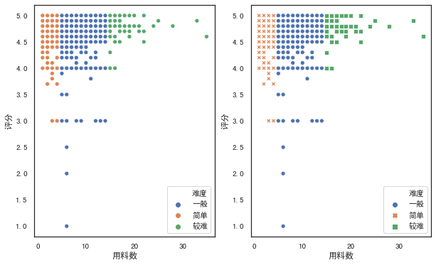
<a name="a8Lnb"></a>
#### 分簇散点图:stripplot
```python
#语法
'''
seaborn.stripplot(x=None, y=None, hue=None, data=None, order=None,
hue_order=None, jitter=True, dodge=False, orient=None, color=None,
palette=None, size=5, edgecolor='gray', linewidth=0, ax=None, **kwargs)
'''
#设置jitter参数控制抖动的大小
plt.figure(figsize=(10, 6))
sns.stripplot(x="菜系", y="评分",hue="难度",jitter=1,data=df)
```
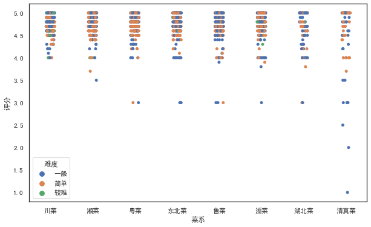
<a name="hQB9P"></a>
#### 分类散点图:swarmplot
```python
#绘制分类散点图(带分布属性)
#语法
'''
seaborn.swarmplot(x=None, y=None, hue=None, data=None, order=None,
hue_order=None, dodge=False, orient=None, color=None, palette=None,
size=5, edgecolor='gray', linewidth=0, ax=None, **kwargs)
'''
plt.figure(figsize=(10, 6))
sns.swarmplot(x="菜系", y="评分",hue="难度",data=df)
```
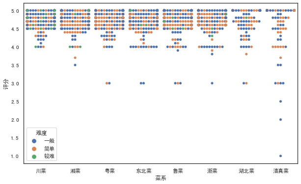
<a name="OIxQe"></a>
### 条形图
<a name="e8o6z"></a>
#### 常规条形图:barplot
```python
#语法
'''
seaborn.barplot(x=None, y=None, hue=None, data=None, order=None,
hue_order=None,ci=95, n_boot=1000, units=None, orient=None, color=None,
palette=None, saturation=0.75, errcolor='.26', errwidth=None, capsize=None,
ax=None, estimator=<function mean>，**kwargs)
'''
#barplot()默认展示的是某种变量分布的平均值（可通过修改estimator参数为max、min、median等）
# from numpy import median
fig,axes=plt.subplots(1,2,figsize=(10,6))
sns.barplot(x='菜系',y='评分',color="r",data=df,ax=axes[0])
sns.barplot(x='菜系',y='评分',color="salmon",data=df,estimator=min,ax=axes[1])
```
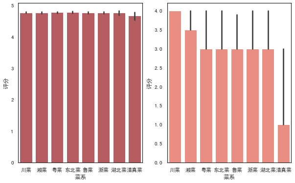

```python
fig,axes=plt.subplots(1,2,figsize=(10,6))
#设置hue参数，对x轴的数据进行细分
sns.barplot(x='菜系',y='评分',color="salmon",hue='难度',data=df,ax=axes[0])
#调换x和y的顺序，可将纵向条形图转为水平条形图
sns.barplot(x='评分',y='菜系',color="salmon",hue='难度',data=df,ax=axes[1])
```
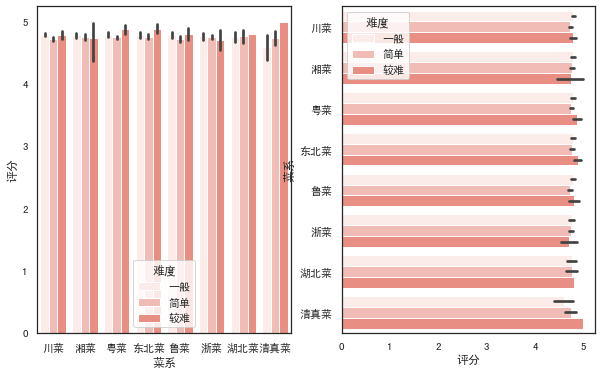
<a name="I6uAX"></a>
#### 计数条形图:countplot
```python
#语法
'''
seaborn.countplot(x=None, y=None, hue=None, data=None, order=None,
hue_order=None, orient=None, color=None, palette=None, saturation=0.75, dodge=True, ax=None, **kwargs)
'''
fig,axes=plt.subplots(1,2,figsize=(10,6))
#选定某个字段，countplot()会自动统计该字段下各类别的数目
sns.countplot(x='菜系',color="salmon",data=df,ax=axes[0])
#同样可以加入hue参数
sns.countplot(x='菜系',color="salmon",hue='难度',data=df,ax=axes[1])
```
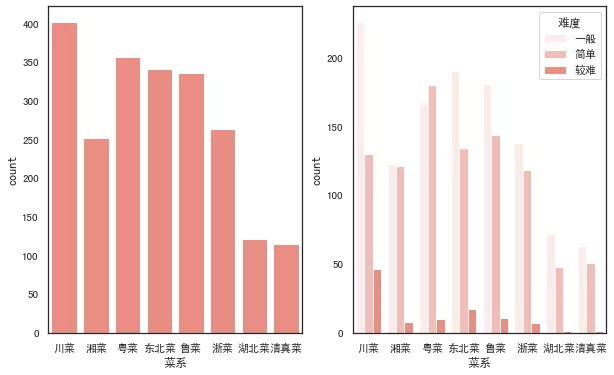
<a name="Lloe0"></a>
### 折线图
```python
#语法
'''
seaborn.lineplot(x=None, y=None, hue=None, size=None, style=None,
data=None, palette=None, hue_order=None, hue_norm=None, sizes=None, size_order=None,
size_norm=None, dashes=True, markers=None, style_order=None, units=None, estimator='mean',
ci=95, n_boot=1000, sort=True, err_style='band', err_kws=None, legend='brief', ax=None, **kwargs)
'''
fig,axes=plt.subplots(1,2,figsize=(10,6))
#默认折线图有聚合
sns.lineplot(x="用料数", y="评分", hue="菜系",data=df,ax=axes[0])
#estimator参数设置为None可取消聚合
sns.lineplot(x="用料数", y="评分", hue="菜系",estimator=None,data=df,ax=axes[1])
```
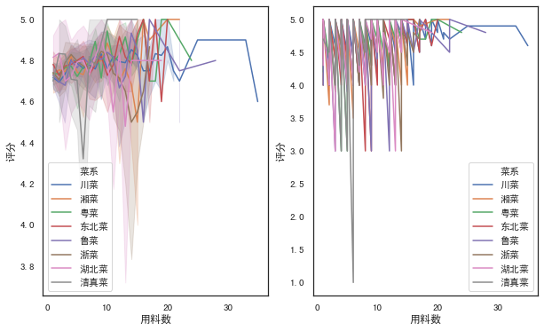
<a name="RAVIw"></a>
### 箱图
<a name="AAqXm"></a>
#### 箱线图:boxplot
```python
#语法
'''
seaborn.boxplot(x=None, y=None, hue=None, data=None, order=None,
hue_order=None, orient=None, color=None, palette=None, saturation=0.75,
width=0.8, dodge=True, fliersize=5, linewidth=None, whis=1.5, notch=False, ax=None, **kwargs)
'''
fig,axes=plt.subplots(1,2,figsize=(10,6))
sns.boxplot(x='菜系',y='评分',hue='难度',data=df,ax=axes[0])
#调节order和hue_order参数，可以控制x轴展示的顺序,linewidth调节线宽
sns.boxplot(x='菜系',y='评分',hue='难度',data=df,color="salmon",linewidth=1,
                    order=['清真菜','粤菜','东北菜','鲁菜','浙菜','湖北菜','川菜'],
                    hue_order=['简单','一般','较难'],ax=axes[1])
```
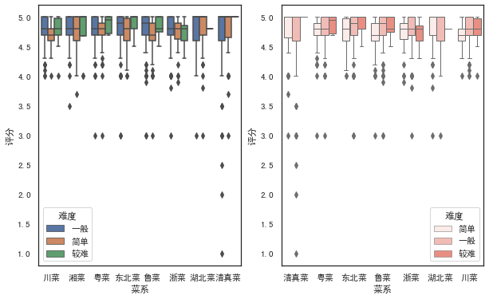
<a name="CCJJt"></a>
#### 箱型图:boxenplot
```python
#语法
'''
seaborn.boxenplot(x=None, y=None, hue=None, data=None, order=None,
hue_order=None, orient=None, color=None, palette=None, saturation=0.75,
width=0.8, dodge=True, k_depth='proportion', linewidth=None, scale='exponential',
outlier_prop=None, ax=None, **kwargs)
'''
fig,axes=plt.subplots(1,2,figsize=(10,6))
sns.boxenplot(x='菜系',y='评分',hue='难度',data=df,color="salmon",ax=axes[0])
#palette参数可设置调色板
sns.boxenplot(x='菜系',y='评分',hue='难度',data=df, palette="Set2",ax=axes[1])
```
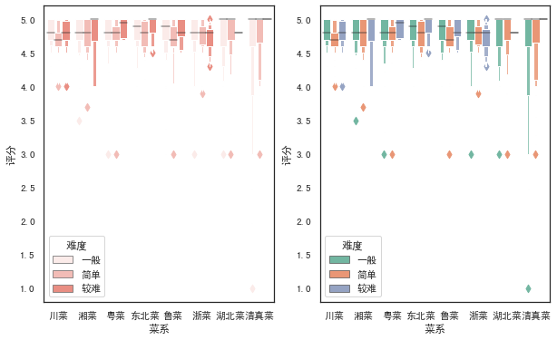
<a name="TSMhO"></a>
### 小提琴图
```python
#语法
'''
seaborn.violinplot(x=None, y=None, hue=None, data=None, order=None,
hue_order=None, bw='scott', cut=2, scale='area', scale_hue=True,
gridsize=100, width=0.8, inner='box', split=False, dodge=True, orient=None,
linewidth=None, color=None, palette=None, saturation=0.75, ax=None, **kwargs)
'''
fig,axes=plt.subplots(1,2,figsize=(10,6))
sns.violinplot(x='菜系',y='评分',data=df, color="salmon",linewidth=1,ax=axes[0])
#inner参数可在小提琴内部添加图形,palette设置颜色渐变
sns.violinplot(x='菜系',y='评分',data=df,palette=sns.color_palette('Greens'),inner='stick',ax=axes[1])
```
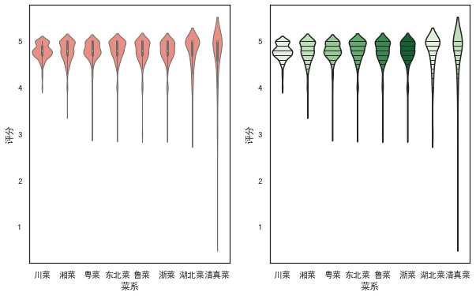
<a name="Sa4DP"></a>
### 回归图
<a name="EVli0"></a>
#### regplot
```python
'''
seaborn.regplot(x, y, data=None, x_estimator=None, x_bins=None, x_ci='ci',
                scatter=True, fit_reg=True, ci=95, n_boot=1000, units=None,
                order=1, logistic=False, lowess=False, robust=False, logx=False,
                x_partial=None, y_partial=None, truncate=False, dropna=True,
                x_jitter=None, y_jitter=None, label=None, color=None, marker='o',
                scatter_kws=None, line_kws=None, ax=None)
'''
fig,axes=plt.subplots(1,2,figsize=(10,6))
#marker参数可设置数据点的形状
sns.regplot(x='用料数',y='评分',data=df,color='r',marker='+',ax=axes[0])
#ci参数设置为None可去除直线附近阴影(置信区间)
sns.regplot(x='用料数',y='评分',data=df,ci=None,color='g',marker='*',ax=axes[1])
```
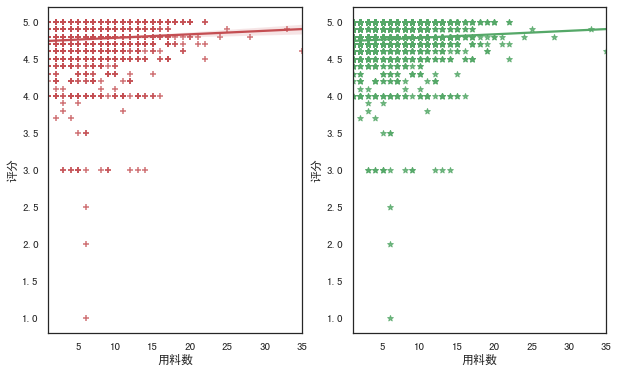
<a name="iNUd9"></a>
#### lmplot
```python
#语法
'''
seaborn.lmplot(x, y, data, hue=None, col=None, row=None, palette=None,
               col_wrap=None, height=5, aspect=1, markers='o', sharex=True,
               sharey=True, hue_order=None, col_order=None, row_order=None,
               legend=True, legend_out=True, x_estimator=None, x_bins=None,
               x_ci='ci', scatter=True, fit_reg=True, ci=95, n_boot=1000,
               units=None, order=1, logistic=False, lowess=False, robust=False,
               logx=False, x_partial=None, y_partial=None, truncate=False,
               x_jitter=None, y_jitter=None, scatter_kws=None, line_kws=None, size=None)
'''
#lmplot()可以设置hue,进行多个类别的显示,而regplot()是不支持的
sns.lmplot(x='用料数',y='评分',hue='难度',data=df,
           palette=sns.color_palette('Reds'),ci=None,markers=['*','o','+'])
```
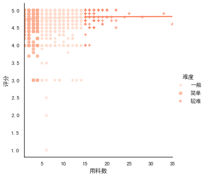
<a name="pq08W"></a>
### 热力图
```python
#语法
'''
seaborn.heatmap(data, vmin=None, vmax=None, cmap=None, center=None,
                robust=False, annot=None, fmt='.2g', annot_kws=None,
                linewidths=0, linecolor='white', cbar=True, cbar_kws=None,
                cbar_ax=None, square=False, xticklabels='auto',
                yticklabels='auto', mask=None, ax=None, **kwargs)
'''
fig,axes=plt.subplots(1,2,figsize=(10,6))
h=pd.pivot_table(df,index=['菜系'],columns=['难度'],values=['评分'],aggfunc=np.mean)
sns.heatmap(h,ax=axes[0])
#annot参数设置为True可显示数字,cmap参数可设置热力图调色板
cmap = sns.diverging_palette(200,20,sep=20,as_cmap=True)
sns.heatmap(h,annot=True,cmap=cmap,ax=axes[1])
#保存图形
plt.savefig('jg.png')
```
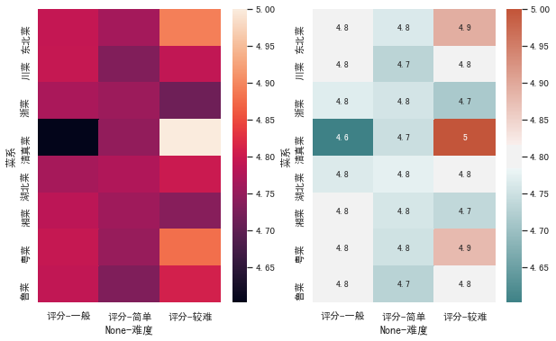
