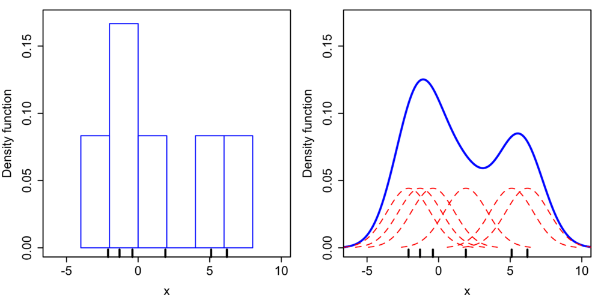

Python Seaborn 可视化<br />Seaborn 是一个统计绘图库，建立在 Matplotlib 基础之上。它具有非常漂亮的默认绘图样式，并且也与 Pandas DataFrames 配合得很好。<br />Seaborn 可以像安装任何其他 Python 包一样使用“pip”进行安装。
```bash
pip install seaborn
```
Seaborn 的官方文档地址如下：<br />[https://seaborn.pydata.org/](https://seaborn.pydata.org/)<br />另一个重要的地址是官方 API，它引用了各种可用的绘图类型。<br />[https://seaborn.pydata.org/api.html](https://seaborn.pydata.org/api.html)<br />将 Seaborn 的功能分解为不同的类别——从能够可视化数据集分布的图开始。<br />从导入开始并加载数据 - 将使用“Financial Sample.xlsx”数据。
```python
import pandas as pd
import seaborn as sns
#如果使用 Jupyter Notebooks，下面的行允许我们在浏览器中显示图表
%matplotlib inline

#在 Pandas DataFrame 中加载我们的数据
df = pd.read_excel('Financial Sample.xlsx') 
#打印前 5 行数据以确保正确加载
df.head()
```
<br />首先看看“distplot”——这可以看到一组单变量观测值的分布——单变量只是意味着一个变量。
```python
#绘制 DataFrame "Profit" 列的分布
sns.displot(df['Profit'])
```
<br />现在有一个感兴趣的分布图——但作为一个快速入门，风格看起来有点平淡。给它一个更常见的“Seaborn”样式，试图让它看起来更好一点……
```python
#设置我们希望用于绘图的样式
sns.set_style("darkgrid")

#绘制 DataFrame "Profit" 列的分布
sns.displot(df['Profit'])
```
<br />已经设法用一行代码绘制 DataFrame 数据的直方图以及“KDE”线——即核密度估计图。如果在 plot 调用中添加“kde=False”，可以删除 KDE。还可以按如下方式更改直方图中“bins”的数量——在本例中，它们被设置为 50：
```python
sns.displot(df['Profit'],kde=False,bins=50)
```
<br />现在看一个“联合图”——这允许组合两个 distplots 并处理双变量数据。创建一个快速的联合图。为此，需要通过传入列名来指定想要绘制的 DataFrame 列，以及从中提取列的实际 DataFrame。这可以按如下方式完成：假设想绘制“Profit”列与“Units Sold”列。
```python
sns.jointplot(x='Profit',y='Units Sold',data=df)
```
<br />现在有一个图，显示了两个变量列之间的散点图，以及它们在任一侧的相应分布图（它甚至在右上角提供了皮尔逊相关系数和 p 分数。）<br />Jointplot 还允许设置一个名为“kind”的附加参数。这允许您影响主图表的表示方式。目前它是一个“散点”，因为这是默认值，但是如果将其更改为“十六进制”，例如，将得到以下图，它将图表上的点表示为密度六边形 - 即包含更多数据点的六边形 显示为比包含较少点的那些更暗。
```python
sns.jointplot(x='Profit',y='Units Sold',data=df,kind='hex')
```
<br />可以为“kind”添加的另一个参数是“reg”，它代表回归。这看起来很像散点图，但这次将添加线性回归线。
```python
sns.jointplot(x='Profit',y='Units Sold',data=df,kind='reg')
```
<br />可以规定的另一种类型是“kde”，它将绘制一个二维 KDE 图，它基本上只显示数据点最常出现的位置的密度。
```python
sns.jointplot(x='Profit',y='Units Sold',data=df,kind='kde')
```
<br />从jointplots继续看“pairplots”。这些能够查看整个数据帧（对于数值数据）的成对关系，并且还支持分类数据点的“色调”参数。所以 pairplot 本质上是为 DataFrame 中数字列的每个可能组合创建一个联合图。快速创建一个新的 DataFrame，它删除“Month Number”和“Year”列，因为这些并不是连续数字数据的一部分，例如“利润”和“COGS”（销售成本）。删除其他几列以缩小 DataFrame，这样输出图就不会过于拥挤。
```python
#删除不需要的列
new_df = df.drop(['Month Number','Year','Manufacturing Price','Sale Price'],axis=1)

sns.pairplot(new_df)
```
<br />请注意，基本上对每对列都有一个配对图，并且在对角线上有一个分布的直方图，因为将数据与自身进行联合图是没有意义的。这是快速可视化数据的好方法。还可以添加一个“色调”——这是指定一个用于分割数据的分类变量的地方。添加“Segment”列作为“色调”。
```python
sns.pairplot(new_df,hue='Segment')
```
<br />现在数据点根据分类数据着色——颜色图例显示在图的右侧边缘。还可以通过设置“调色板”参数来更改绘图使用的调色板。以下是使用“岩浆”配色方案的示例。所有可用的方案都可以在 Matplotlib 站点上找到。
```python
sns.pairplot(new_df,hue='Segment',palette='magma')
```
<br />将看到的下一个图是一个“rugplot”——这将构建和解释之前创建的“kde”图是什么——无论是在 distplot 中还是当传递“kind=kde”作为参数时。
```python
sns.rugplot(df['Profit'])
```
如上所示，对于 rugplot，将要绘制的列作为参数传递 - rugplot 的作用是为分布中的每个点绘制一个破折号。所以 rugplot 和 distplot 之间的区别在于 distplot 涉及“bins”的概念，并将把每个 bin 中的所有数据点相加，并绘制这个数字，而 rugplot 只是在每个数据点绘制一个标记。<br />所以现在将 rugplot 转换为 KDE 图。KDE 代表“核密度估计”。下图是解释如何将 rugplots 构建到 KDE 图中的。<br /><br />如果愿意的话，可以从一组数据和 rugplot 中构建自己的 KDE 图，看看它是否与使用内置的“kdeplot”直接创建的 KDE 图相匹配.
```python
#设置一组 30 个取自正态分布的数据点
x = np.random.normal(0, 1, size=30)

#设置 KDE 点的带宽
bandwidth = 1.06* x.std() * x.size ** (-1/ 5.)

#设置 y 轴的限制
support = np.linspace(-4, 4, 200)

#遍历数据点并为每个点创建内核，然后绘制内核
kernels = []
for x_i in x:

    kernel = stats.norm(x_i, bandwidth).pdf(support)
    kernels.append(kernel)
    plt.plot(support, kernel, color="r")

sns.rugplot(x, color=".2", linewidth=3)
```

```python
#使用复合梯形规则沿给定轴积分并创建 KDE 图
from scipy.integrate import trapz
density = np.sum(kernels, axis=0)
density /= trapz(density, support)
plt.plot(support, density)
```
<br />现在使用内置的“kdeplot”绘制 KDE 图。
```python
sns.kdeplot(x, shade=True)
```
<br />可以看到两个图是相同的，已经正确地创建了 KDE 图。
