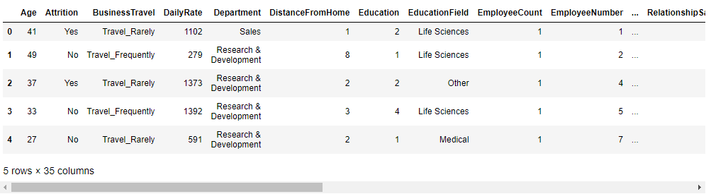

Python 可视化 Seaborn
<a name="Y1hGW"></a>
### ipywidgets
首先通过pip命令来下载该模块
```bash
pip install ipywidgets
```
该模块中的`interact`函数可以和自定义的函数相结合，随着输入的不断变化，输出也会产生相应的不同结果，来看一个简单的案例
```python
from ipywidgets import interact
def f(x):
    print(f"The square value is: {x**2}")
    
interact(f, x=10)
```
output<br /><br />当拖动当中的圆点的时候，输出的结果也随之变化。当然也可以将其当做是装饰器来使用，代码如下
```python
@interact(x=10)
def f(x):
    print(f"The square value is: {x**2}")
```
output<br /><br />上面的自定义函数中，当然可以自行设定横轴当中的最大值与最小值，以及每拖动一次x值的变化(和Python当中的`range`函数类似)，
```python
interact(f, x=widgets.IntSlider(min=-10, max=30, step=1, value=10))
```
output<br /><br />而当输入框中的参数不止一个参数的时候，可以有不止一个的滑动条，代码如下
```python
import ipywidgets as widgets
one = widgets.IntSlider(min = 0, max = 10)
two = widgets.IntSlider(min = 0, max = 100)
three = widgets.IntSlider(min = 0, max = 1000)

ui = widgets.HBox([one, two, three])
def func(x, y, z):
    print(f"The first value is: {x + 2}")
    print(f"The second value is: {y * 2}")
    print(f"The third value is: {z ** 2}")
    
out = widgets.interactive_output(func, {"x": one, "y": two, "z": three})
display(ui, out)
```
output<br /><br />当参数类型是字符串时，则是需要通过输入框的形式来进行交互，代码如下
```python
def f_2(x):
    print(f"The value is: {x}")

interact(f_2, x="Hello World")
```
output<br /><br />而当输入的X参数是一个列表里面有着若干个字符串的时候，则会在输入框中出现个下拉框，如下所示
```python
interact(f_2, x=["Hello World", "你好"])
```
output<br />
<a name="BFns6"></a>
### 和seaborn之间的结合
然后来看看该模块和seaborn之间的结合，先用Pandas模块来读取数据集，代码如下
```python
import pandas as pd
df = pd.read_csv("data.csv")
df.head()
```
output<br /><br />简单地来画一张直方图，代码如下
```python
import seaborn as sns
import matplotlib.pyplot as plt
%matplotlib inline

g = sns.countplot(data = df, x="Gender", hue="Attrition")
```
output<br /><br />可以将绘制图表的这一行代码封装成一个函数，将代码中的“x”甚至是“hue”作为是输入的参数，代码如下
```python
## 筛选出离散型变量的特征
categorical_columns = [column for column in df.columns if df[column].dtype == "object"]
## 做成下拉框的形式来进行交互
dd = widgets.Dropdown(options=categorical_columns, value=categorical_columns[0], description="Select a column")

@interact(column=dd)
def draw_countplot(column):
    g = sns.countplot(data = df, x=column, hue="Attrition")
```
output<br /><br />可以在下拉框中选择不同的离散型变量的特征从而绘制出不同的图表，当然一个下拉框可能有人会觉得有点少，可以再来扩展一下
```python
## 两个下拉框
dd1 = widgets.Dropdown(options=categorical_columns, value=categorical_columns[0], description="Column")
dd2 = widgets.Dropdown(options=categorical_columns, value=categorical_columns[0], description="Hue")

ui = widgets.HBox([dd1, dd2])
## 绘制图表的函数
def draw_countplot(column, hue):
    g = sns.countplot(data = df, x=column, hue=hue)
    ## X轴方向的标记会旋转60度
    if len(df[column].unique()) > 3:
        g.tick_params(axis="x", rotation=60)

out = widgets.interactive_output(draw_countplot, {'column':dd1, "hue": dd2})
## 最终将图表呈现出来
display(ui, out)

```
output<br /><br />当然有可能会觉得都是输入框的话会有点无聊，那在输入框的同时加入一个滑动条，对应的是输入的参数是整型或者是浮点数时
```python
## 两个输入框还有一个滑动条
dd1 = widgets.Dropdown(options=numeric_columns, description="Column1")
dd2 = widgets.Dropdown(options=numeric_columns, description="Column2")
slider = widgets.IntSlider(min=df['Age'].min(), max=df["Age"].max(), description="Max Age")

ui = widgets.HBox([dd1, dd2, slider])
## 绘制图表的函数
def draw_relplot(column1, column2, age):
    p = sns.relplot(data=df[df['Age']<=age], x=column1, y=column2)

out = widgets.interactive_output(draw_countplot, {"column1": dd1, "column2": dd2, "age": slider})
## 将最终的图表给呈现出来
display(ui, out)
```
output<br />
