Python可视化Seaborn<br />Seaborn是一个基于Python语言的数据可视化库，它能够创建高度吸引人的可视化图表。<br />在Matplotlib库的基础上，提供了更为简便的API和更为丰富的可视化函数，使得数据分析与可视化变得更加容易。<br />Seaborn的设计哲学是以美学为中心，致力于创建最佳的数据可视化。<br />同时也保持着与Python生态系统的高度兼容性，可以轻松集成到Python数据分析以及机器学习的工作流程中。<br /><br />介绍如何使用Seaborn制作15种不同类型的可视化图表。<br />具体图表类型，包含条形图、散点图、直方图、折线图、小提琴图、箱线图、热力图、点图、密度图、计数图、分簇散点图、特征图、Facet Grid、联合分布图、分类图。<br />首先使用pip安装Seaborn。
```bash
pip install seaborn
```
Seaborn提供了一些内置的数据集，如iris、tips、dots、glue等。<br />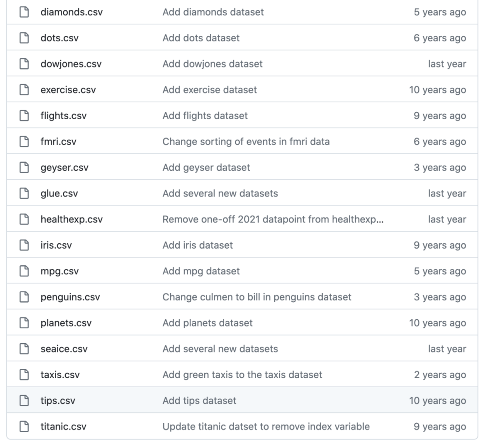<br />可以在GitHub上看到更多的数据集。<br />[_https://github.com/mwaskom/seaborn-data_](https://github.com/mwaskom/seaborn-data)<br />这里使用的是Seaborn的Iris数据集。<br />Iris也称鸢尾花数据集，是一类多重变量分析的数据集。<br />通过花萼长度、花萼宽度、花瓣长度、花瓣宽度4个属性来预测鸢尾花属于（Setosa，Versicolour，Virginica）三个种类中的哪一类。
```python
import matplotlib.pyplot as plt
import seaborn as sns
import pandas as pd

print('\n')
data = pd.read_csv('iris.csv')
print(data[10:15])
```
结果如下。<br />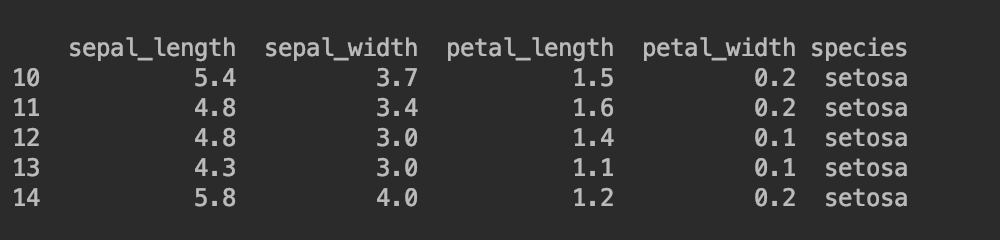<br />查看不同种类数量情况。
```python
print(data['species'].value_counts())
```
结果如下。<br />
<a name="rg7Ig"></a>
## 1、柱状图
柱状图通常被用于表示分类变量，它只显示平均值(或其他参数值)。<br />为了使用这个图，为x轴选择一个分类列(物种)，为y轴选择一个数值列(花瓣长度)。
```
sns.barplot(x='species', y='petal_length', hue='species', data=data)
plt.show()
```
可以看到创建了一个每个分类列取平均值的图。<br />花瓣长度与物种间关系的条形图(基于鸢尾数据集)。<br />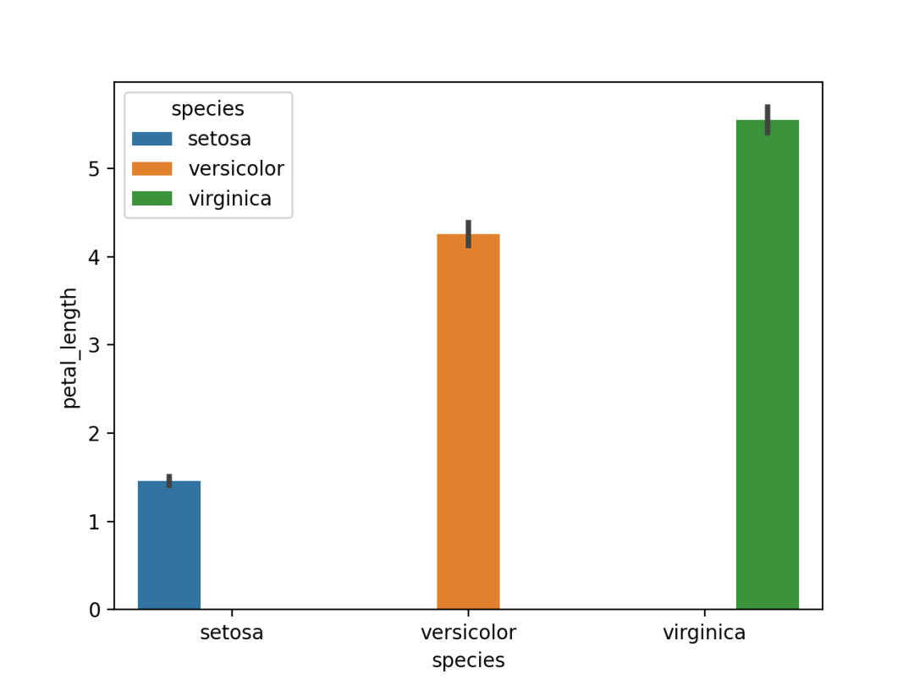
<a name="gqwii"></a>
## 2、散点图
散点图是由几个数据点组成的图。<br />使用x轴表示花瓣长度，y轴表示数据集的萼片长度，制作散点图。
```python
sns.scatterplot(x='petal_length', y='sepal_length', hue='species', style='species', s=90, data=data)
plt.show()
```
结果如下。<br />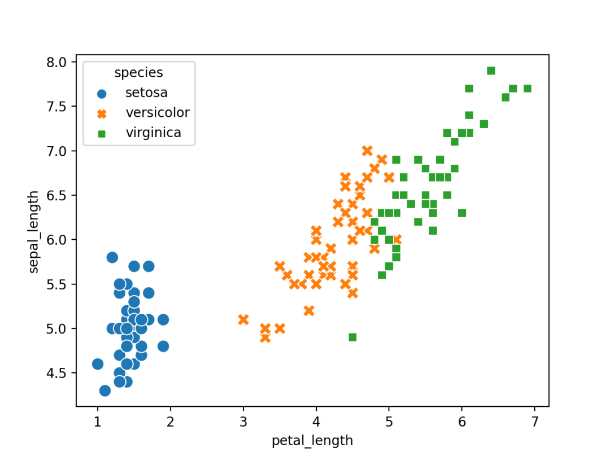<br />在这里，可以看到不同物种的花瓣长度和萼片长度之间有很强的关系。
<a name="IYtBY"></a>
## 3、直方图
直方图通常用于可视化单个变量的分布，不过也可用于比较两个或更多变量的分布。<br />除了直方图之外，KDE参数还可以用来显示核密度估计(KDE)。<br />这里使用鸢尾花数据集的萼片长度来制作直方图。
```python
sns.histplot(x='sepal_length', kde=True, data=data)
plt.show()
```
结果如下。<br />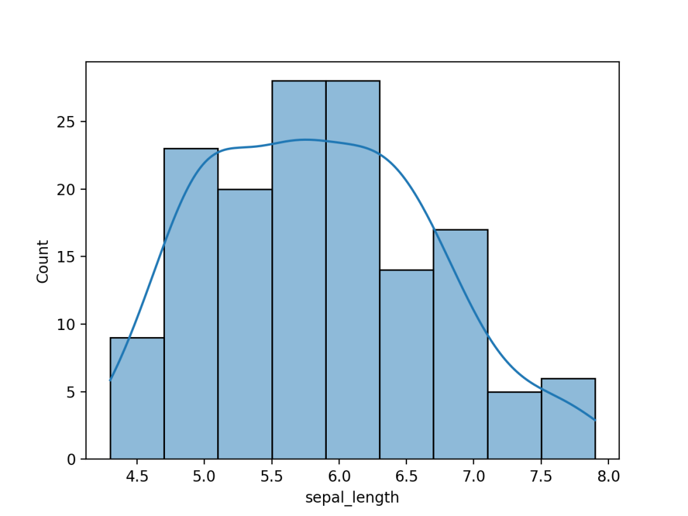<br />两个变量的直方图。
```python
sns.histplot(x='sepal_length', kde=True, hue='species', data=data)
plt.show()
```
结果如下。<br />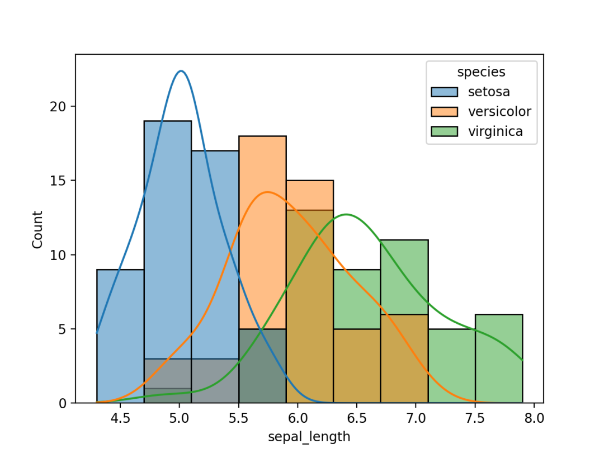
<a name="cS5ri"></a>
## 4、折线图
折线图是一种通用的图表，可以用来可视化各种不同的关系。<br />该图表易于创建和分析，并且可以用于有效地交流数据。<br />在折线图中，每个数据点都是由直线连接。<br />这里在x轴上使用花瓣长度，在y轴上使用花瓣宽度。
```python
sns.lineplot(x='petal_length', y='petal_width', data=data)
plt.show()
```
结果如下。<br />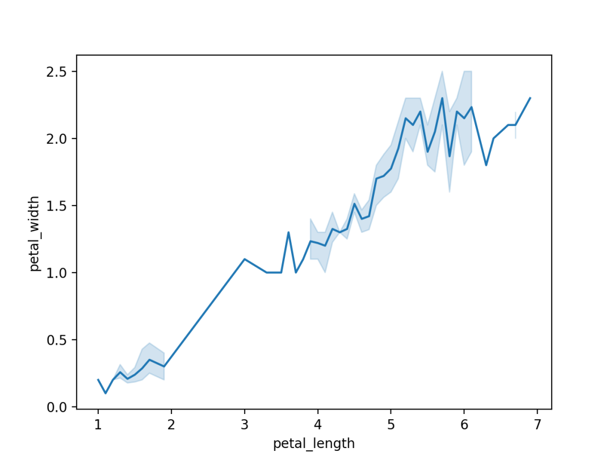
<a name="umI8x"></a>
## 5、小提琴图
小提琴图表示数据的密度，类似于散点图，并像箱线图一样表示分类数据。<br />数据的密度越大的区域越胖。小提琴形状表示数据的核密度估计，形状在每个点的宽度表示该点的数据密度。<br />这里使用x轴表示物种，y轴表示花瓣长度。
```python
sns.violinplot(x='species', y='petal_length', data=data, hue='species')
plt.show()
```
结果如下。<br />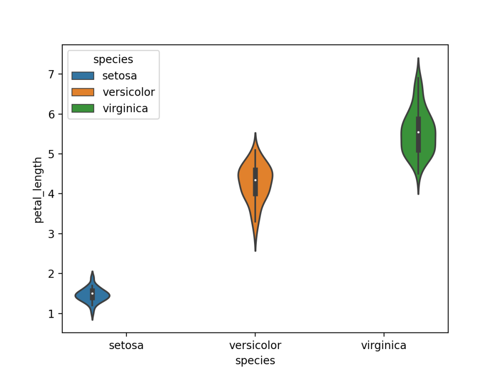
<a name="FG3e5"></a>
## 6、箱线图
箱线图由一个箱形图和两个须状图组成。<br />它表示四分位数范围(IQR)，即第一和第三四分位数之间的范围。中位数由框内的直线表示。<br />晶须从盒子边缘延伸到最小值和最大值的1.5倍IQR。<br />异常值是落在此范围之外的任何数据点，并单独显示。<br />这里使用x轴表示种数，y轴表示萼片长度。
```python
sns.boxplot(x='species', y='sepal_length', data=data, hue='species')
plt.show()
```
结果如下。<br />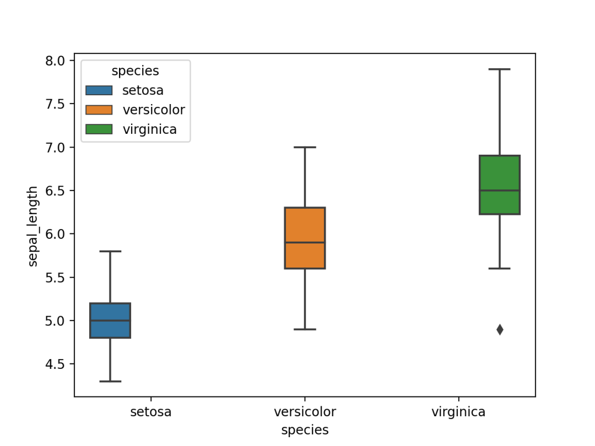
<a name="GBsTi"></a>
## 7、热力图
热力图是数据的二维可视化表示，使用颜色来显示变量的值。<br />热力图经常用于显示数据集中的各种变量的关联关系，使用corr方法来实现。
```python
heat_corr = data.corr()
sns.heatmap(heat_corr, annot=True)
plt.show()
```
结果如下。<br />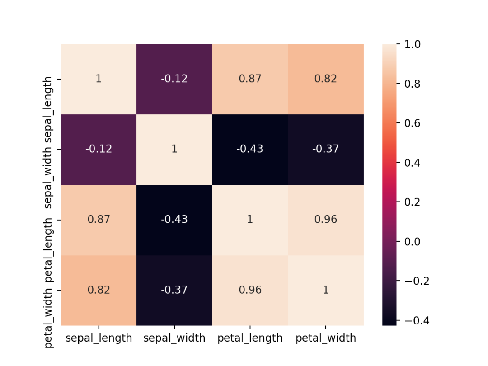
<a name="NynVq"></a>
## 8、点线图
点线图是一种统计图表，用于显示一组数据及其变异性的平均值或集中趋势。<br />点线图通常用于探索性数据分析，以快速可视化数据集的分布或比较多个数据集。<br />本例中的每个数据点表示为单个点，而水平线表示平均值。
```python
sns.pointplot(x='species', y='petal_length', data=data, markers='^', color='g')
plt.show()
```
结果如下。<br />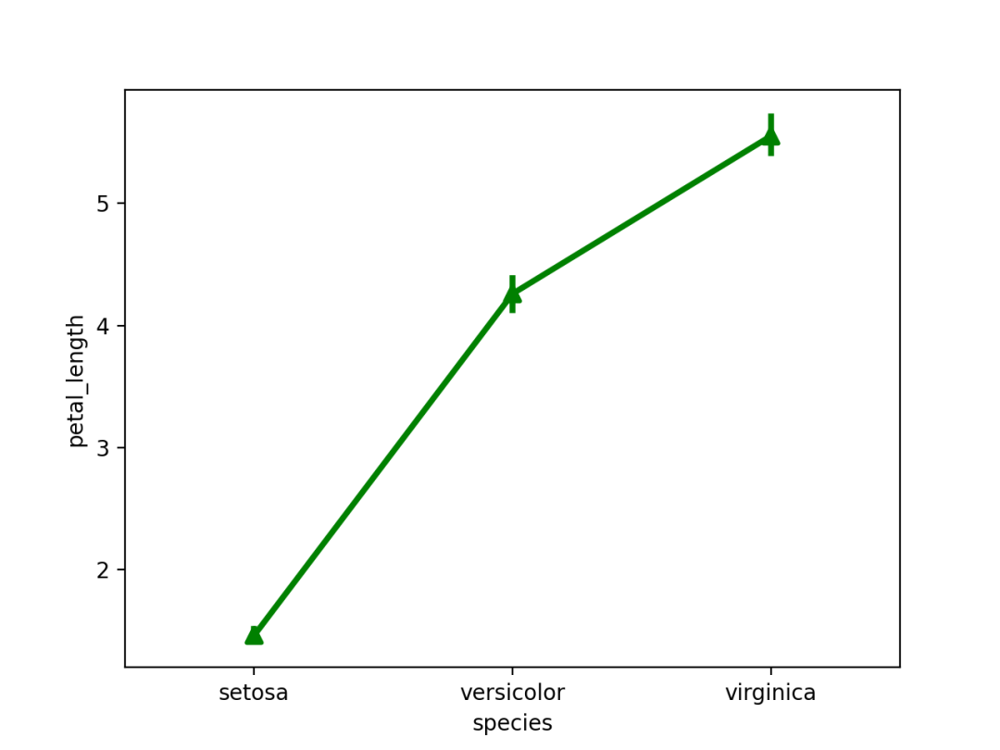
<a name="sGS6l"></a>
## 9、密度图
密度图通过估计连续随机变量的概率函数来表示数据集的分布，也称为核密度估计(KDE)图。
```python
sns.kdeplot(x='petal_length', data=data, hue='species', multiple='stack')
plt.show()
```
结果如下。<br />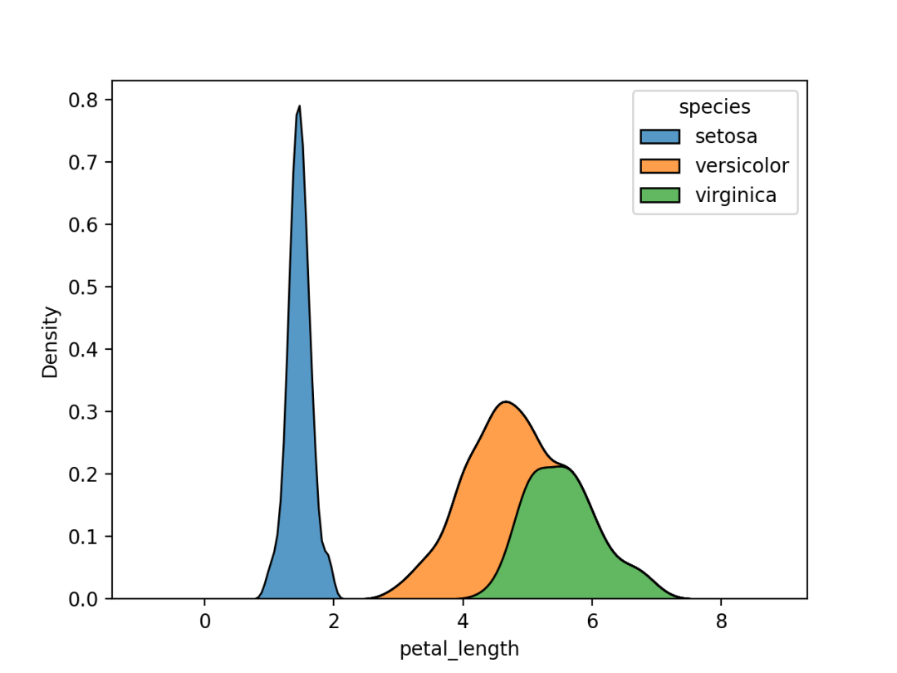<br />上图可以清晰的看出花瓣长度与物种之间的关系。<br />还可以修改密度图的显示方式，和等高线有点像。
```python
sns.kdeplot(x='petal_length', y='sepal_length', data=data, hue='species')
plt.show()
```
结果如下。<br />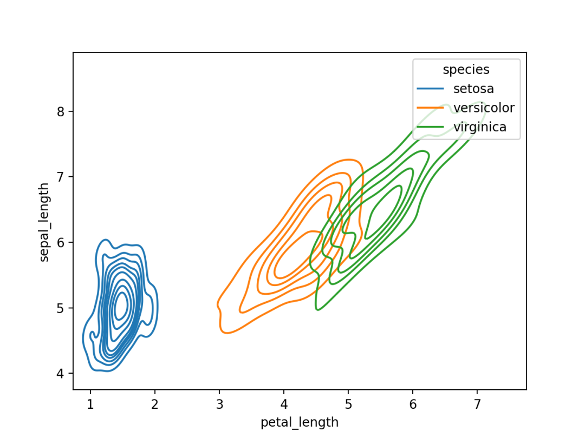
<a name="PwvZV"></a>
## 10、计数图
计数图是一种分类图，它显示了分类变量的每个类别中观测值的计数。<br />它本质上是一个柱状图，其中每个柱的高度代表特定类别的观测值的数量。<br />计算数据集中每个物种的样本总数。
```
sns.countplot(x='species', data=data)
plt.show()
```
结果如下。<br />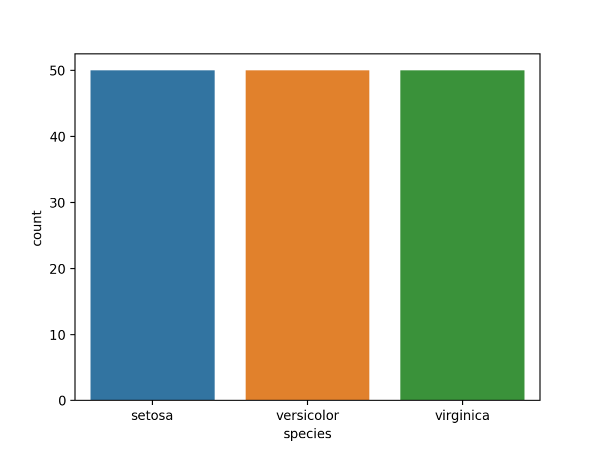<br />从上图可以看出，每个物种在数据集中包含相同数量的样本。
<a name="ccBPz"></a>
## 11、分簇散点图
分簇散点图和条形图挺相似的。<br />不同之处在于，这些点会重叠出现，这样有助于更好地表示值的分布情况。
```python
sns.swarmplot(x='sepal_width', y='species', data=data, hue='species', dodge=True, orient='h', size=8)
plt.show()
```
结果如下。<br />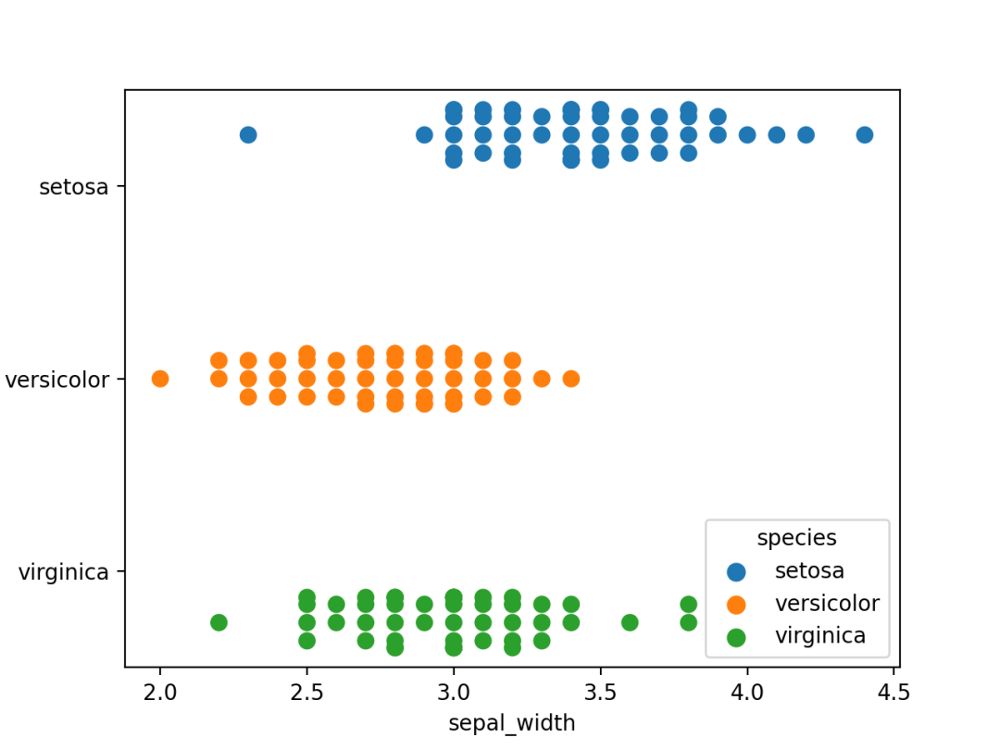<br />在上图中，每个数据点表示为一个点，并且这些点的排列使得它们在分类轴上不会相互重叠。<br />在这里，所有萼片宽度数据点以不同的方式代表每个物种的一个点。
<a name="jIuUg"></a>
## 12、特征图
特征图可视化了数据集中变量之间的两两关系。<br />创建了一个坐标轴网格，将所有数值数据点将在彼此之间创建一个图，在x轴上具有单列，y轴上具有单行。<br />对角线图是单变量分布图，它绘制了每列数据的边际分布。
```python
sns.set(rc={"figure.figsize": (6, 3)})
sns.pairplot(data=data, hue='species')
plt.show()
```
结果如下。<br />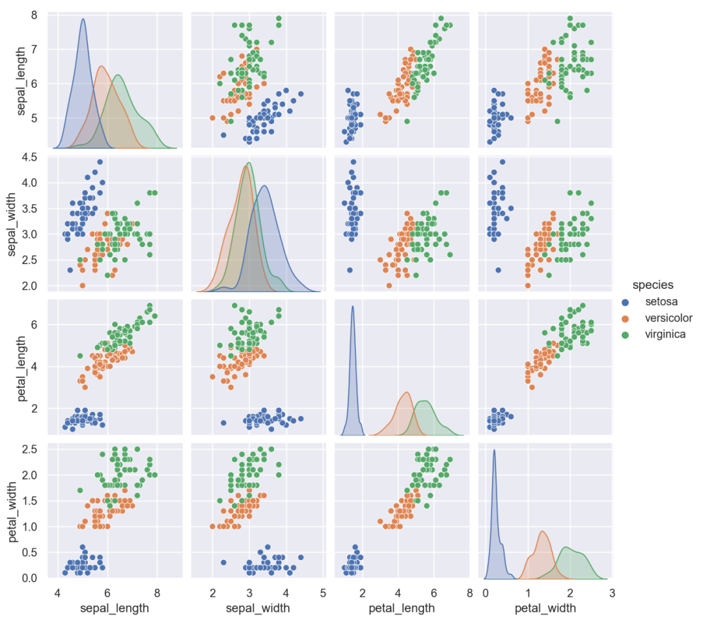<br />上图表示鸢尾花数据集中所有变量之间的关系。
<a name="elBbJ"></a>
## 13、FacetGrid
Seaborn中的FacetGrid函数将数据集的一个或多个分类变量作为输入，然后创建一个图表网格，每种类别变量的组合都有一个图表。<br />网格中的每个图都可以定制为不同类型的图，例如散点图、直方图或箱形图，具体取决于要可视化的数据。<br />在这里，制作了每个物种花瓣长度的图表。
```python
g = sns.FacetGrid(data, col="species", height=4, hue='species')
g.map(sns.histplot, "petal_length")
plt.show()
```
结果如下。<br />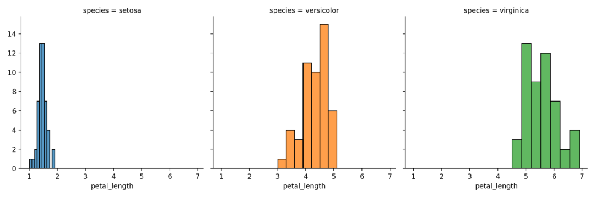
<a name="xyxzj"></a>
## 14、联合分布图
联合分布图将两个不同类型的图表组合在一个表中，展示两个变量之间的关系(二元关系)。
```python
sns.jointplot(x="sepal_length", y="sepal_width", data=data,
              palette='Set2', hue='species')
plt.show()
```
结果如下。<br />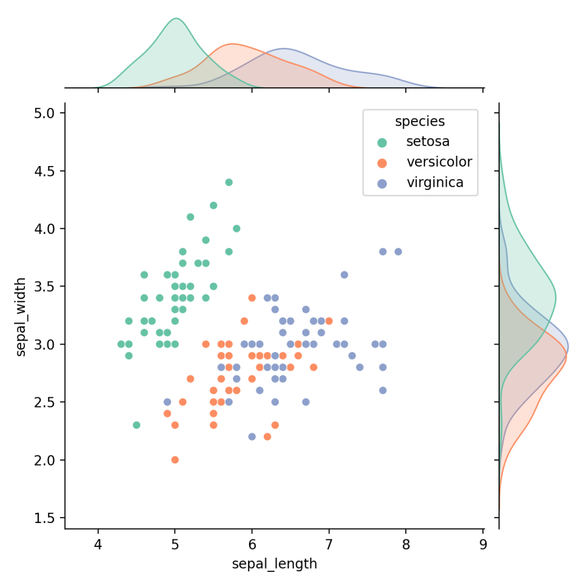<br />在上面的图表中，中间区域绘制了散点图，边侧则是密度图。
<a name="P25Ur"></a>
## 15、分类图
cat图(分类图缩写)是Seaborn中的一种图表，可以用来可视化数据集中一个或多个分类变量与连续变量之间的关系。<br />它可用于显示分布、比较组或显示不同变量之间的关系。
```python
sns.catplot(data=data, x="petal_length", y="species", kind="violin", color=".9", inner=None)
sns.swarmplot(data=data, x="petal_length", y="species", size=3)
plt.show()
```
结果如下。<br />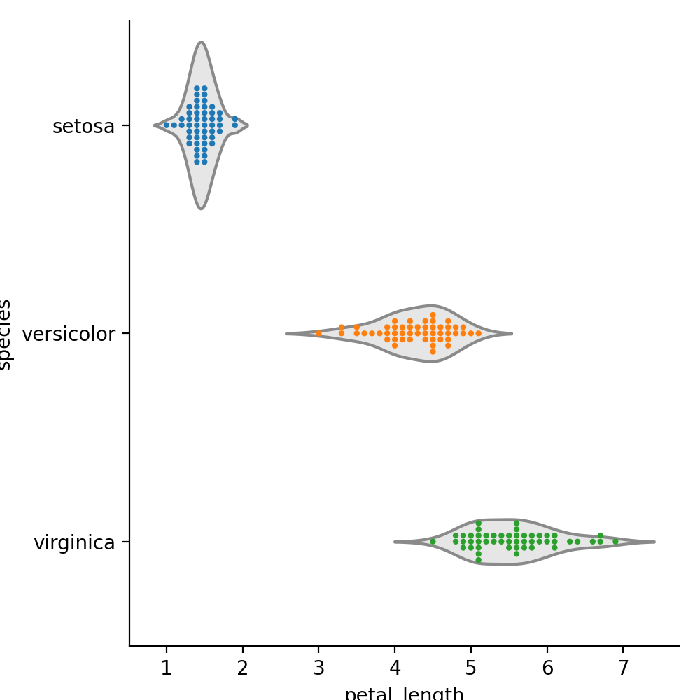<br />这里可以看出鸢尾数据集中花瓣长度与物种之间的关系。
