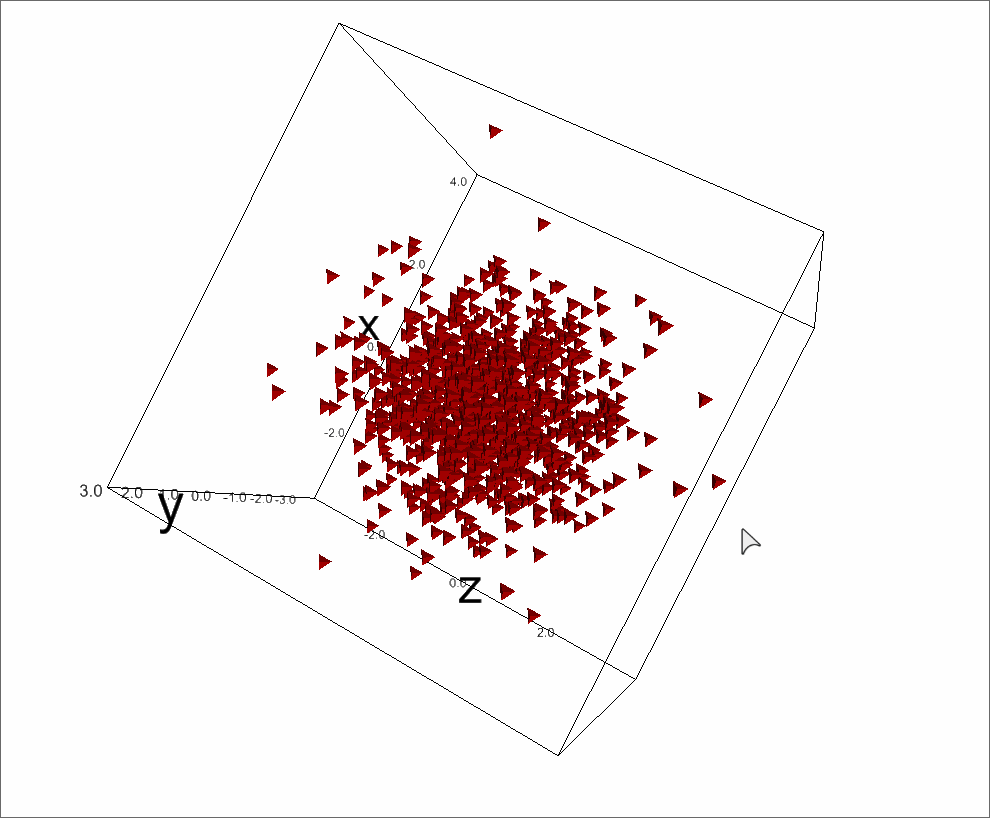
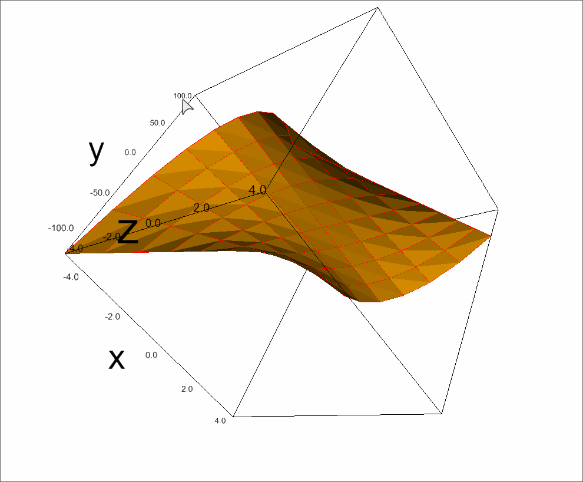
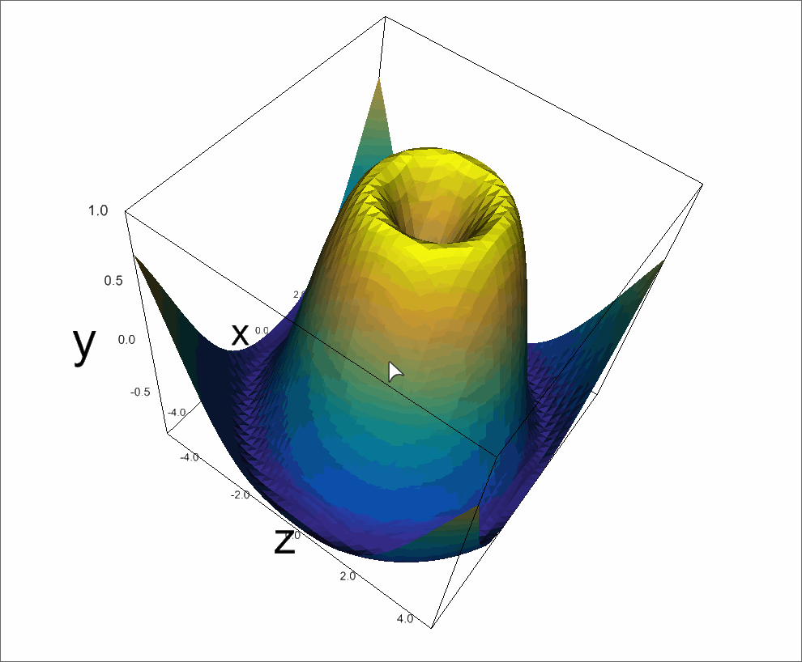
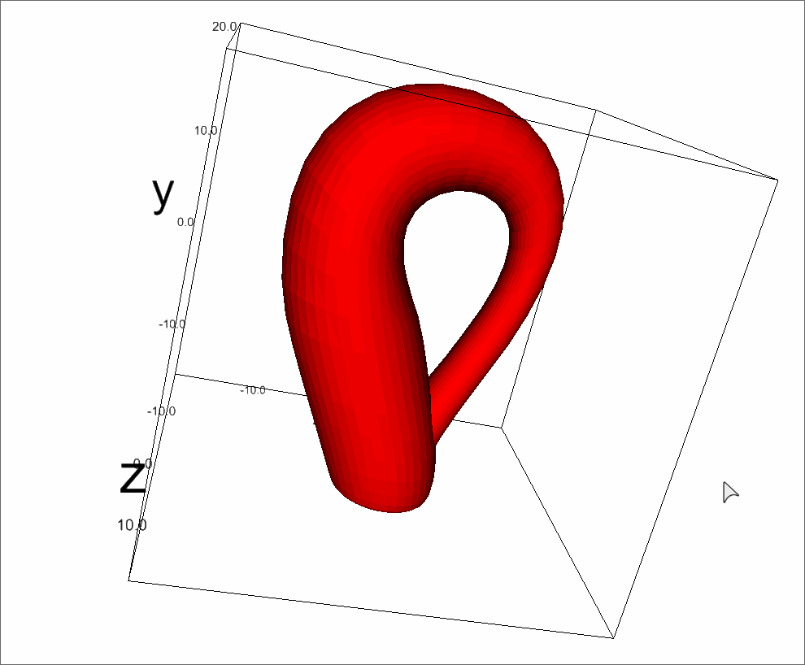

Python 可视化 3D
<a name="BIS5c"></a>
## Python-Ipyvolume库介绍
Python-Ipyvolume库可以在Jupyter Notebook中可视化3D体积和图示符(例如3d散点图)。由于该库目前刚提供1.0版本，介绍内容不是很多，了解其他内容可阅读[**Python-Ipyvolume官网**](https://ipyvolume.readthedocs.io/en/latest/index.html#)
<a name="MqcU6"></a>
## Python-Ipyvolume库 3D图表案例
主要展示Python-Ipyvolume库绘制的3D可视化效果，如下：
<a name="Ccck2"></a>
### Scatter plot
```python
import ipyvolume as ipv
import numpy as np
N = 1000
x, y, z = np.random.normal(0, 1, (3, N))
fig = ipv.figure()
scatter = ipv.scatter(x, y, z)
ipv.show()
```

<a name="x2lrk"></a>
### Surfaces
```python
import ipyvolume as ipv
import numpy as np
# f(u, v) -> (u, v, u*v**2)
a = np.arange(-5, 5)
U, V = np.meshgrid(a, a)
X = U
Y = V
Z = X*Y**2
ipv.figure()
ipv.plot_surface(X, Z, Y, color="orange")
ipv.plot_wireframe(X, Z, Y, color="red")
ipv.show()
```

<a name="namHy"></a>
### Surfaces with colors
```python
from colormaps import parula
X = np.arange(-5, 5, 0.25*1)
Y = np.arange(-5, 5, 0.25*1)
X, Y = np.meshgrid(X, Y)
R = np.sqrt(X**2 + Y**2)
Z = np.sin(R)

colormap = parula
znorm = Z - Z.min()
znorm /= znorm.ptp()
znorm.min(), znorm.max()
color = colormap(znorm)
ipv.figure()
mesh = ipv.plot_surface(X, Z, Y, color=color[...,:3])
ipv.show()
```

<a name="BBSDv"></a>
### mesh
```python
import ipyvolume as ipv
x, y, z, u, v = ipv.examples.klein_bottle(draw=False)
ipv.figure()
m = ipv.plot_mesh(x, y, z, wireframe=False)
ipv.squarelim()
ipv.show()
```
<br />更多关于Python-Ipyvolume 的样例可参考：[**Python-Ipyvolume案例**](https://ipyvolume.readthedocs.io/en/latest/examples.html)
<a name="EFF7M"></a>
## 参考资料
Python-Ipyvolume官网：[https://ipyvolume.readthedocs.io/en/latest/index.html#](https://ipyvolume.readthedocs.io/en/latest/index.html#)<br />**Python-Ipyvolume案例：**[https://ipyvolume.readthedocs.io/en/latest/examples.html](https://ipyvolume.readthedocs.io/en/latest/examples.html)
