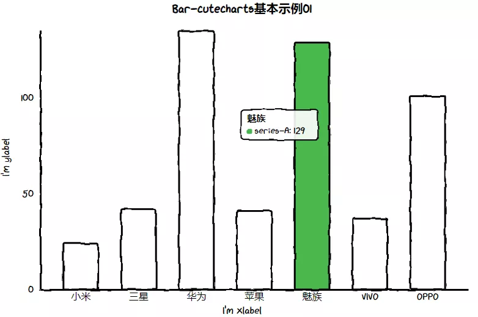
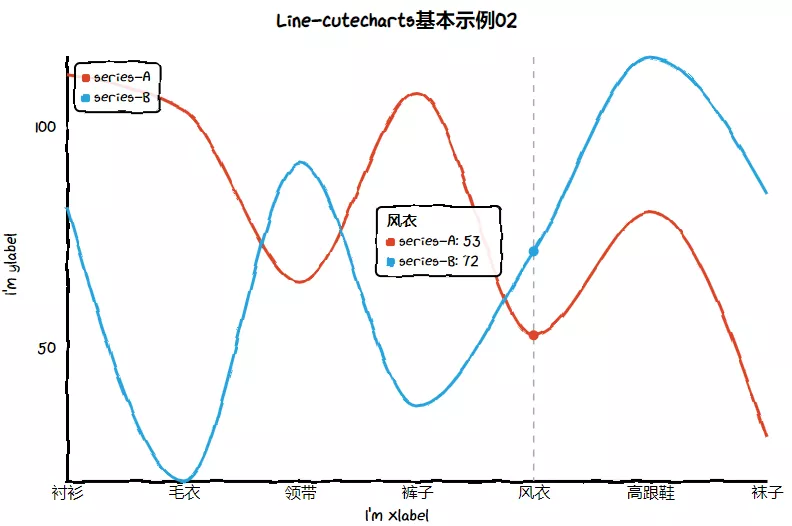
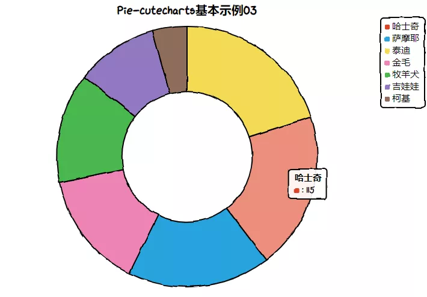
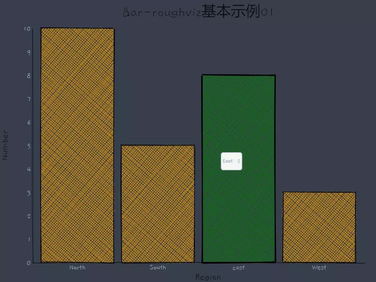
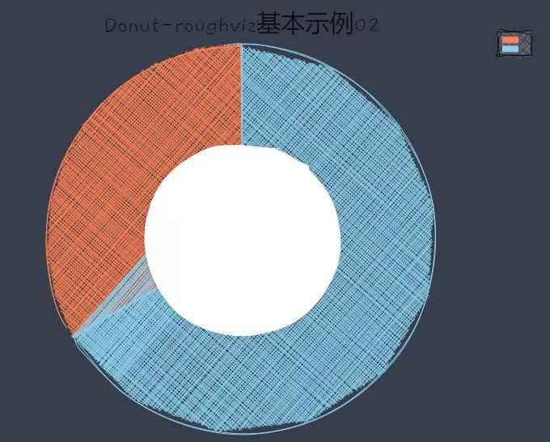

Python 可视化
<a name="ygkkx"></a>
## Python-matplotlib 手绘风格图表绘制
使用Python进行可视化绘制，首先想到的当然是Matplotlib,“手绘风格”的图表绘制方法当然首选它。在Matplotlib中，`matplotlib.pyplot.xkcd()` 绘图函数就可以进行手绘风图表的绘制，下面通过具体样例进行展示：
<a name="GngNK"></a>
### 样例一：
```python
import pandas as pd
import numpy as np
import matplotlib.pyplot as plt

df = pd.DataFrame({
    'x': [4, 20, 40, 50, 55, 70, 90],
    'y': [0, 10, 70, 2, 25, 10, 20],
})

with plt.xkcd():
    fig, ax = plt.subplots(figsize=(6.5,4),dpi=100)
    ax = df.plot.bar(color=["#BC3C28","#0972B5"],ec="black",rot=15,ax=ax)
    ax.set_ylim((0, 100))
    ax.legend(frameon=False)
    ax.set_title("EXAMPLE01 OF MATPLOTLIB.XKCD()",pad=20)
    ax.text(.8,-.22,'Visualization by Fcant',transform = ax.transAxes,
            ha='center', va='center',fontsize = 10,color='black')
```
")
<a name="lygwa"></a>
### 样例二：
```python
import pandas as pd
import matplotlib.pyplot as plt

df = pd.DataFrame({
    'x': [1, 2, 2.5, 3, 3.5, 4, 5],
    'y': [4, 4, 4.5, 5, 5.5, 6, 6],
})

with plt.xkcd():
    fig, ax = plt.subplots(figsize=(6.5,4),dpi=100)
    ax = df.plot.kde(color=["#BC3C28","#0972B5"],ax=ax)
    ax.set_ylim((0, 0.4))
    ax.legend(frameon=False)
    ax.set_title("EXAMPLE02 OF MATPLOTLIB.XKCD()",pad=20)
    ax.text(.8,-.22,'Visualization by Fcant',transform = ax.transAxes,
            ha='center', va='center',fontsize = 10,color='black')
```
")
<a name="tJ7Wo"></a>
### 样例三：
```python
import numpy as np
import matplotlib.pyplot as plt

with plt.xkcd():
    fig, ax = plt.subplots(figsize=(6.5,4),dpi=100)
    ax.spines["right"].set_color('none')
    ax.spines["top"].set_color('none')
    ax.set_xticks([])
    ax.set_yticks([])
    ax.set_ylim([-30, 10])
    data = np.ones(100)
    data[70:] -= np.arange(30)
    ax.annotate(
        'THE DAY I REALIZED\nI COULD COOK BACON\nWHENEVER I WANTED',
        xy=(70, 1), arrowprops=dict(arrowstyle='->'), xytext=(15, -10))

    ax.plot(data,color="#BC3C28")

    ax.set_xlabel('time')
    ax.set_ylabel('my overall health')
    ax.set_title("EXAMPLE03 OF MATPLOTLIB.XKCD()")
    ax.text(.8,-.15,'Visualization by Fcant',transform = ax.transAxes,
            ha='center', va='center',fontsize = 10,color='black')
```
")
<a name="SLOKs"></a>
## Python-cutecharts 手绘风格图表绘制
介绍完使用matplotlib绘制后，再介绍一个专门绘制“手绘风格”图表的Python可视化库-cutecharts。如果熟悉`pyecharts`的肯定会更加快速上手的。官网如下：[https://github.com/cutecharts/cutecharts.py](https://github.com/cutecharts/cutecharts.py) 。这里列举几个例子：
<a name="JXVOI"></a>
### 样例一：
```python
from cutecharts.charts import Bar
from cutecharts.components import Page
from cutecharts.faker import Faker


def bar_base() -> Bar:
    chart = Bar("Bar-cutecharts基本示例01")
    chart.set_options(labels=Faker.choose(), x_label="I'm xlabel", y_label="I'm ylabel")
    chart.add_series("series-A", Faker.values())
    return chart

bar_base().render_notebook()
```
注：`render_notebook()`方法可使绘图结果在jupyter notebook 中显示。
<a name="NXfac"></a>
### 样例二：
```python
from cutecharts.charts import Line
from cutecharts.components import Page
from cutecharts.faker import Faker


def line_base() -> Line:
    chart = Line("Line-cutecharts基本示例02")
    chart.set_options(labels=Faker.choose(), x_label="I'm xlabel", y_label="I'm ylabel")
    chart.add_series("series-A", Faker.values())
    chart.add_series("series-B", Faker.values())
    return chart
line_base().render_notebook()
```

<a name="XVJ4p"></a>
### 样例三：
```python
from cutecharts.charts import Pie
from cutecharts.components import Page
from cutecharts.faker import Faker


def pie_base() -> Pie:
    chart = Pie("Pie-cutecharts基本示例03")
    chart.set_options(labels=Faker.choose(),legend_pos="upRight")
    chart.add_series(Faker.values())
    return chart

pie_base().render_notebook()
```
<br />这里这是基本的图表绘制，实现定制化的属性参数也都没有介绍，可去官网查阅(由于没详细的官方文档，大家可参考样例和pyecharts的文档)
<a name="KwEja"></a>
## Python-py-roughviz 手绘风格图表绘制
这个和cutecharts包一样，都是基于roughViz.js转换编码绘制的，官网为：[https://github.com/charlesdong1991/py-roughviz](https://github.com/charlesdong1991/py-roughviz) 。由于所支持的图表类型不是很多且各个图标设置的参数也不够完善，这里直接给出两个样例。
<a name="vci4s"></a>
### 样例一：
```python
from roughviz.charts.bar import Bar
data = {
    "labels": ["North", "South", "East", "West"],
    "values": [10, 5, 8, 3]
}

bar = Bar(data=data, title="Bar-roughviz基本示例01", title_fontsize=3)
bar.set_options(xlabel="Region", ylabel="Number", color="orange")
bar.show()
```

<a name="eHbNz"></a>
### 样例二：
```python
from roughviz.charts.donut import Donut
donut = Donut(data={"labels": ['a', 'b'], "values": [10, 20]}, title="Donut-roughviz基本示例02", title_fontsize=3)
donut.show()
```

