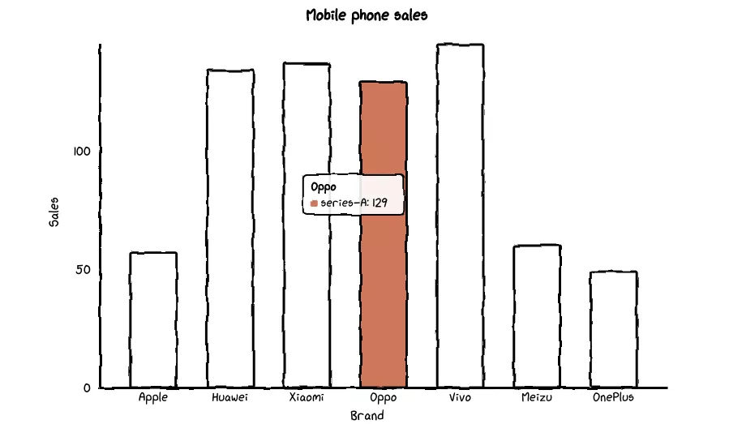
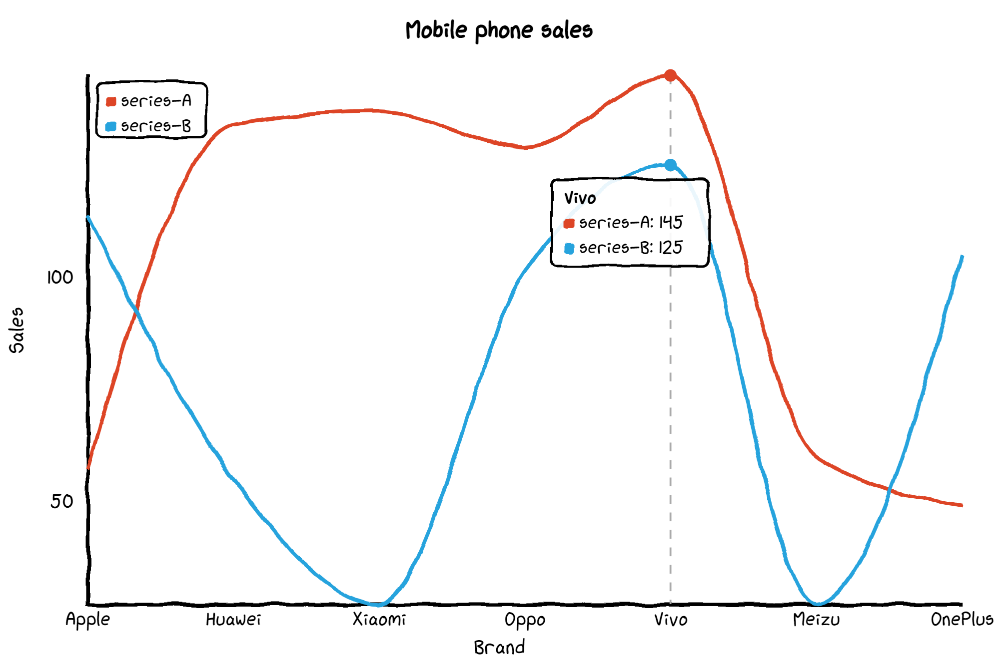
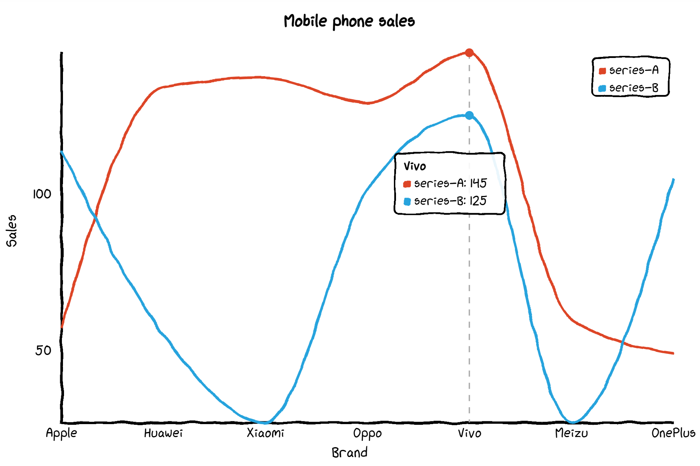
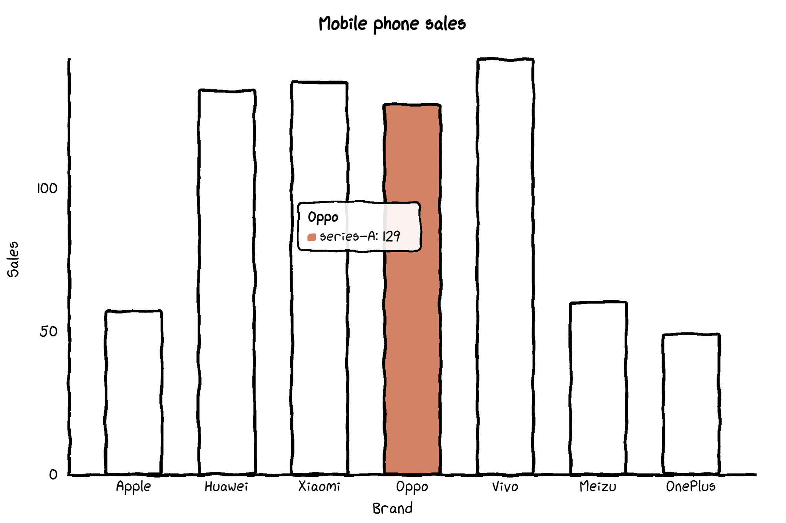
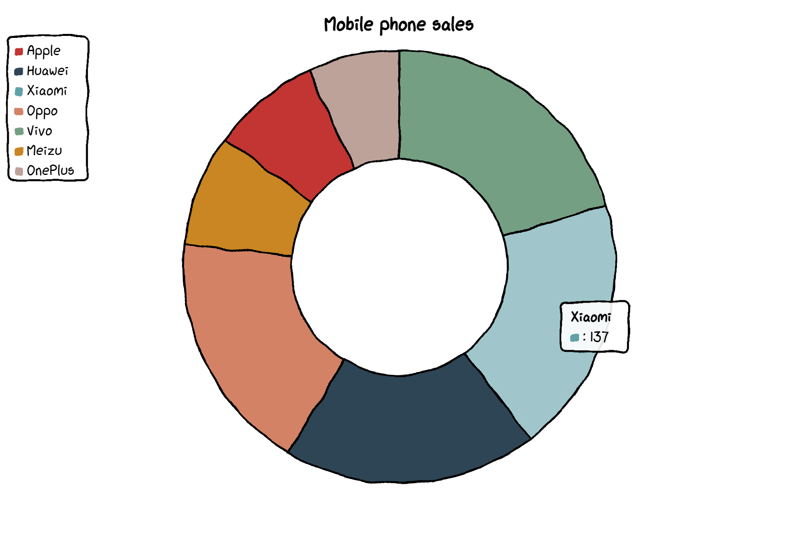
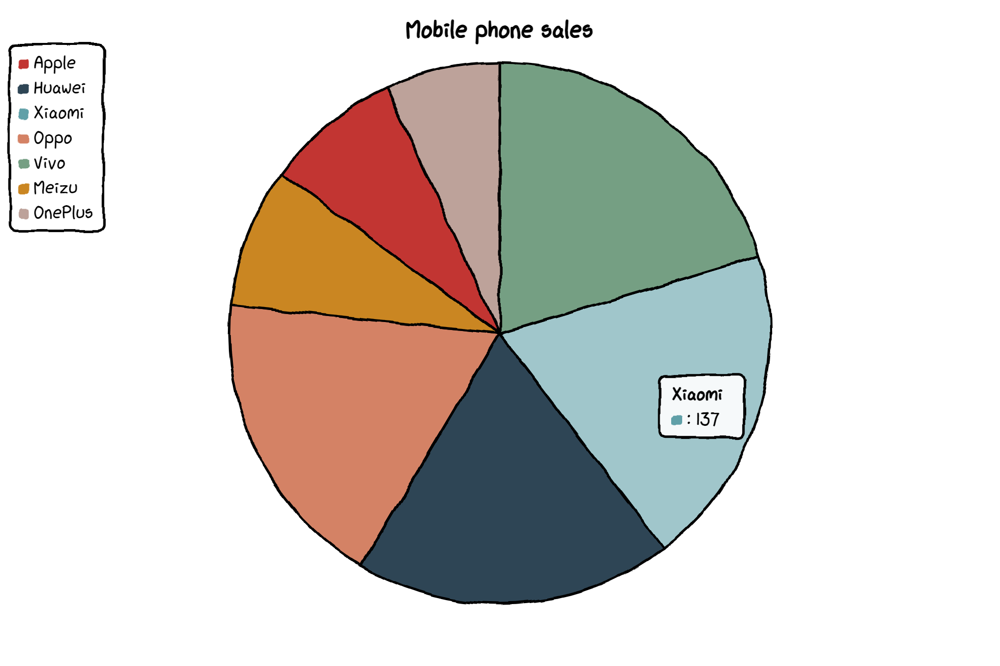
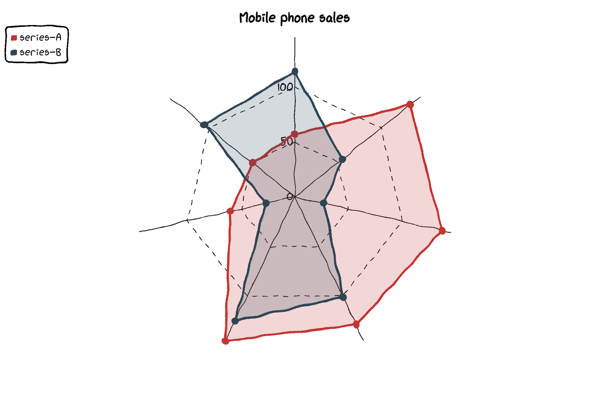
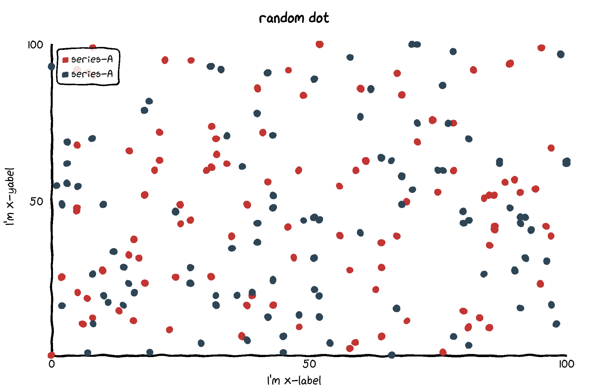
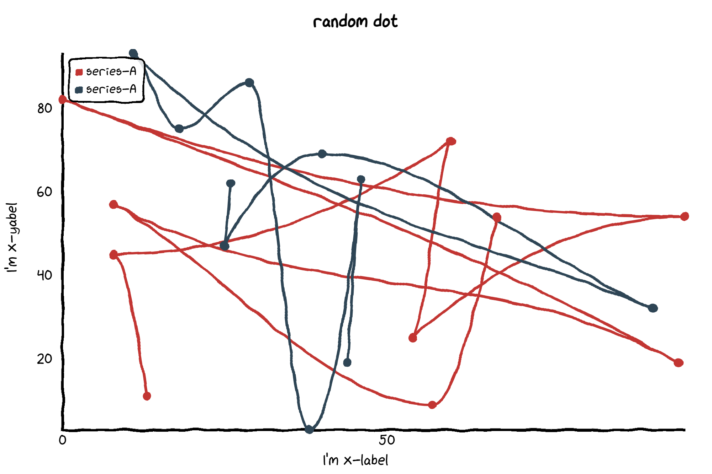
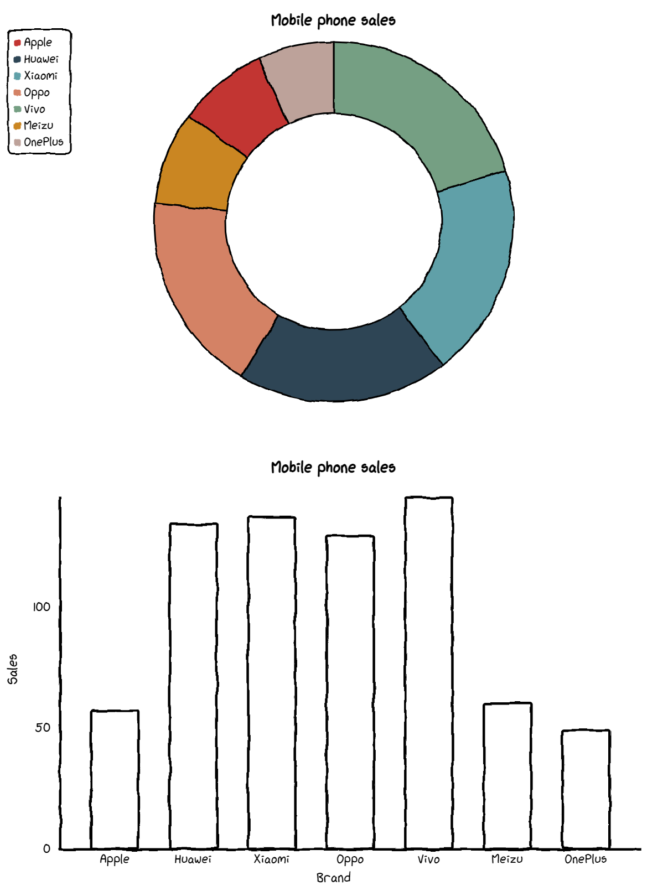

Python 可视化
<a name="NMy0o"></a>
### 前言
介绍一个很酷的 Python 手绘风格可视化神包：cutecharts<br />和 Matplotlib 、pyecharts 等常见的图表不同，使用这个包可以生成看起来像手绘的各种图表，在一些特殊场景下使用效果可能会更好。<br />GitHub 地址：[https://github.com/chenjiandongx/cutecharts](https://github.com/chenjiandongx/cutecharts)<br />它的画风是这样的：<br />

- cutecharts是由pyecharts作者chenjiandongx开源的一个轻量级的项目；
- 目前支持Bar, Line，Pie，Radar，Scatter五种图表；
- 支持Page组合图表;
<a name="tNoy2"></a>
### 安装
```bash
pip install cutecharts
```
<a name="d8Lst"></a>
### Line——基本示例
```python
def set_options(
        self,
        labels: Iterable,
        x_label: str = "",
        y_label: str = "",
        y_tick_count: int = 3,
        legend_pos: str = "upLeft",
        colors: Optional[Iterable] = None,
        font_family: Optional[str] = None,
    ):
        """
        :param labels: X 坐标轴标签数据
        :param x_label: X 坐标轴名称
        :param y_label: Y 坐标轴名称
        :param y_tick_count: Y 轴刻度分割段数
        :param legend_pos: 图例位置，有 "upLeft", "upRight", "downLeft", "downRight" 可选
        :param colors: label 颜色数组
        :param font_family: CSS font-family
        """


def add_series(self, name: str, data: Iterable):
        """
        :param name: series 名称
        :param data: series 数据列表
        """
```
<a name="DiYzN"></a>
#### 基本示例
```python
from cutecharts.charts import Line
# 虚假数据
x_data = ['Apple', 'Huawei', 'Xiaomi', 'Oppo', 'Vivo', 'Meizu', 'OnePlus']
y_data_1 = [57, 134, 137, 129, 145, 60, 49]
y_data_2 = [114, 55, 27, 101, 125, 27, 105]

chart = Line("Mobile phone sales")
chart.set_options(
    labels=x_data, 
    x_label="Brand", 
    y_label="Sales",
)
chart.add_series("series-A", y_data_1)
chart.add_series("series-B", y_data_2)
chart.render_notebook()
```

<a name="pwGOm"></a>
#### 修改图例位置
```python
from cutecharts.charts import Line
# 虚假数据
x_data = ['Apple', 'Huawei', 'Xiaomi', 'Oppo', 'Vivo', 'Meizu', 'OnePlus']
y_data_1 = [57, 134, 137, 129, 145, 60, 49]
y_data_2 = [114, 55, 27, 101, 125, 27, 105]

chart = Line("Mobile phone sales")
chart.set_options(
    labels=x_data, 
    x_label="Brand", 
    y_label="Sales",
    legend_pos="upRight"
)
chart.add_series("series-A", y_data_1)
chart.add_series("series-B", y_data_2)
chart.render_notebook()
```

<a name="NwSE1"></a>
### Bar——基本示例
不支持多个系列的数据～
```python
def set_options(
        self,
        labels: Iterable,
        x_label: str = "",
        y_label: str = "",
        y_tick_count: int = 3,
        colors: Optional[Iterable] = None,
        font_family: Optional[str] = None,
    ):
        """
        :param labels: X 坐标轴标签数据
        :param x_label: X 坐标轴名称
        :param y_label: Y 坐标轴名称
        :param y_tick_count: Y 轴刻度分割段数
        :param colors: label 颜色数组
        :param font_family: CSS font-family
        """

def add_series(self, name: str, data: Iterable):
        """
        :param name: series 名称
        :param data: series 数据列表
        """
```
<a name="SxoFH"></a>
#### 基本示例
```python
from cutecharts.charts import Bar
from cutecharts.faker import Faker

# 虚假数据
x_data = ['Apple', 'Huawei', 'Xiaomi', 'Oppo', 'Vivo', 'Meizu', 'OnePlus']
y_data = [57, 134, 137, 129, 145, 60, 49]

chart = Bar("Mobile phone sales")
chart.set_options(
    labels=x_data, 
    x_label="Brand", 
    y_label="Sales",
    colors=Faker.colors
)
chart.add_series("series-A", y_data)

chart.render_notebook()
```

<a name="aZVQa"></a>
### Pie——基本示例
```python
def set_options(
        self,
        labels: Iterable,
        inner_radius: float = 0.5,
        legend_pos: str = "upLeft",
        colors: Optional[Iterable] = None,
        font_family: Optional[str] = None,
    ):
        """
        :param labels: 数据标签列表
        :param inner_radius: Pie 图半径
        :param legend_pos: 图例位置，有 "upLeft", "upRight", "downLeft", "downRight" 可选
        :param colors: label 颜色数组
        :param font_family: CSS font-family
        """


def add_series(self, data: Iterable):
        """
        :param data: series 数据列表
        """
```
<a name="ELr8d"></a>
#### 基本示例
```python
from cutecharts.charts import Pie
from cutecharts.faker import Faker

# 虚假数据
x_data = ['Apple', 'Huawei', 'Xiaomi', 'Oppo', 'Vivo', 'Meizu', 'OnePlus']
y_data = [57, 134, 137, 129, 145, 60, 49]

chart = Pie("Mobile phone sales")
chart.set_options(
    labels=x_data,
    colors=Faker.colors
)
chart.add_series(y_data)

chart.render_notebook()
```

<a name="L2ssd"></a>
#### 修改内圈半径
```python
from cutecharts.charts import Pie
from cutecharts.faker import Faker
# 虚假数据
x_data = ['Apple', 'Huawei', 'Xiaomi', 'Oppo', 'Vivo', 'Meizu', 'OnePlus']
y_data = [57, 134, 137, 129, 145, 60, 49]

chart = Pie("Mobile phone sales")
chart.set_options(
    labels=x_data, 
    inner_radius=0,
    colors=Faker.colors
)
chart.add_series(y_data)

chart.render_notebook()
```

<a name="kUA5M"></a>
### Radar——基本示例
参考代码注释：
```python
def set_options(
        self,
        labels: Iterable,
        is_show_label: bool = True,
        is_show_legend: bool = True,
        tick_count: int = 3,
        legend_pos: str = "upLeft",
        colors: Optional[Iterable] = None,
        font_family: Optional[str] = None,
    ):
        """
        :param labels: 数据标签列表
        :param is_show_label: 是否显示标签
        :param is_show_legend: 是否显示图例
        :param tick_count: 坐标系分割刻度
        :param legend_pos: 图例位置，有 "upLeft", "upRight", "downLeft", "downRight" 可选
        :param colors: label 颜色数组
        :param font_family: CSS font-family
        """


def add_series(self, name: str, data: Iterable):
        """
        :param name: series 名称
        :param data: series 数据列表
        """
```
<a name="NQvuQ"></a>
#### 基本示例
```python
from cutecharts.charts import Radar
from cutecharts.faker import Faker

# 虚假数据
x_data = ['Apple', 'Huawei', 'Xiaomi', 'Oppo', 'Vivo', 'Meizu', 'OnePlus']
y_data_1 = [57, 134, 137, 129, 145, 60, 49]
y_data_2 = [114, 55, 27, 101, 125, 27, 105]

chart = Radar("Mobile phone sales")
chart.set_options(
    labels=x_data,
    is_show_legend=True,
    colors=Faker.colors
)
chart.add_series("series-A", y_data_1)
chart.add_series("series-B", y_data_2)
chart.render_notebook()
```

<a name="agRAA"></a>
### Scatter——基本示例
```python
def set_options(
        self,
        x_label: str = "",
        y_label: str = "",
        x_tick_count: int = 3,
        y_tick_count: int = 3,
        is_show_line: bool = False,
        dot_size: int = 1,
        time_format: Optional[str] = None,
        legend_pos: str = "upLeft",
        colors: Optional[Iterable] = None,
        font_family: Optional[str] = None,
    ):
        """
        :param x_label: X 坐标轴名称
        :param y_label: Y 坐标轴名称
        :param x_tick_count: X 轴刻度分割段数
        :param y_tick_count: Y 轴刻度分割段数
        :param is_show_line: 是否将散点连成线
        :param dot_size: 散点大小
        :param time_format: 日期格式
        :param legend_pos: 图例位置，有 "upLeft", "upRight", "downLeft", "downRight" 可选
        :param colors: label 颜色数组
        :param font_family: CSS font-family
        """


def add_series(self, name: str, data: Iterable):
        """
        :param name: series 名称
        :param data: series 数据列表，[(x1, y1), (x2, y2)]
        """
```
<a name="TROLj"></a>
#### 基本示例
```python
import random
from cutecharts.charts import Scatter

# 随机生成数据
data_1 = [(random.randint(0, 100), random.randint(0, 100)) for _ in range(100)]
data_2 = [(random.randint(0, 100), random.randint(0, 100)) for _ in range(100)]

chart = Scatter("random dot")
chart.set_options(
    x_label = "I'm x-label",
    y_label = "I'm x-yabel",
    x_tick_count = 3,
    y_tick_count = 3,
    is_show_line = False,
    dot_size = 1,
    legend_pos = "upLeft",
    colors=Faker.colors
)
chart.add_series("series-A", data_1)
chart.add_series("series-A", data_2)
chart.render_notebook()
```

<a name="bqDzA"></a>
#### 点连线
```python
import random
from cutecharts.charts import Scatter

# 随机生成数据
data_1 = [(random.randint(0, 100), random.randint(0, 100)) for _ in range(10)]
data_2 = [(random.randint(0, 100), random.randint(0, 100)) for _ in range(10)]

chart = Scatter("random dot")
chart.set_options(
    x_label = "I'm x-label",
    y_label = "I'm x-yabel",
    x_tick_count = 3,
    y_tick_count = 3,
    is_show_line = True,
    dot_size = 1,
    legend_pos = "upLeft",
    colors=Faker.colors
)
chart.add_series("series-A", data_1)
chart.add_series("series-A", data_2)
chart.render_notebook()
```

<a name="Jsb4e"></a>
### 组合图表——Page
```python
from cutecharts.components import Page

# 虚假数据
x_data = ['Apple', 'Huawei', 'Xiaomi', 'Oppo', 'Vivo', 'Meizu', 'OnePlus']
y_data = [57, 134, 137, 129, 145, 60, 49]

chart_1 = Pie("Mobile phone sales")
chart_1.set_options(
    labels=x_data,
    inner_radius=0.6,
    colors=Faker.colors
)
chart_1.add_series(y_data)


chart_2 = Bar("Mobile phone sales")
chart_2.set_options(
    labels=x_data,
    x_label="Brand",
    y_label="Sales",
    colors=Faker.colors
)
chart_2.add_series("series-A", y_data)

page = Page()
page.add(chart_1, chart_2)
page.render_notebook()
```

