Python 手绘图形
<a name="ejLQI"></a>
## cutecharts介绍
一个很酷的 Python 手绘风格可视化神包：cutecharts。<br />和 Matplotlib 、pyecharts 等常见的图表不同，使用这个包可以生成下面这种看起来像手绘的各种图表，在一些场景下使用效果可能会更好。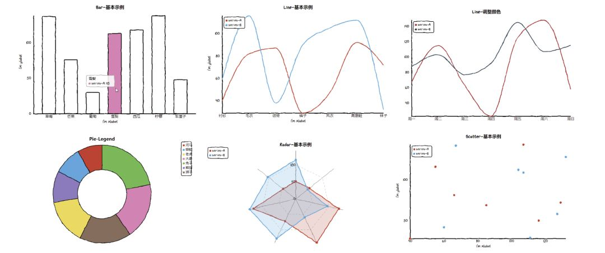<br />GitHub 地址：<br />[https://github.com/chenjiandongx/cutecharts](https://github.com/chenjiandongx/cutecharts)<br />怎么画出这些图表呢，很简单，一行命令先安装好该库：
```bash
pip install cutecharts
```
也可以使用源码安装的方式：
```bash
$ git clone https://github.com/chenjiandongx/cutecharts.git
$ cd cutecharts
$ pip install -r requirements.txt
$ python setup.py install
```
下面就介绍下每个图表如何绘制。<br />首先是一些图表共通的参数：
<a name="Dctlr"></a>
### Commons
不同图表有着部分相同的方法。
<a name="EBGZL"></a>
#### __init__
```
Params                                          Desc
------                                          ----
title: Optional[str] = None                     图表标题
width: str = "800px"                            图表宽度
height: str = "600px"                           图表高度
assets_host: Optional[str] = None               引用资源 Host
```
<a name="mro2o"></a>
#### render
```
Params                                          Desc
------                                          ----
dest: str = "render.html"                       渲染的文件路径
template_name: str = "basic_local.html"         渲染使用的模板，一般不需要修改
```
<a name="UX5nb"></a>
#### render_notebook
```
Params                                          Desc
------                                          ----
template_type: str = "basic"                    渲染使用的模板类型，一般不需要修改
```
load_javascript
> 加载 JS 依赖，在 JupyterLab 渲染时使用。

<a name="ZearL"></a>
## Bar（柱状图/条形图）
> cutecharts.charts.Bar

<a name="BzOhp"></a>
### API
> cutecharts.charts.Bar.set_options

```
Params                                          Desc
------                                          ----
labels: Iterable                                X 坐标轴标签数据
x_label: str = ""                               X 坐标轴名称
y_label: str = ""                               Y 坐标轴名称
y_tick_count: int = 3                           Y 轴刻度分割段数
colors: Optional[Iterable] = None               label 颜色数组
font_family: Optional[str] = None               CSS font-family
```
> cutecharts.charts.Bar.add_series

```
Params                                          Desc
------                                          ----
name: str                                       series 名称
data: Iterable                                  series 数据列表
```
<a name="O4dqO"></a>
### Bar-基本示例
```python
from cutecharts.charts import Bar
from cutecharts.faker import Faker


def bar_base() -> Bar:
    chart = Bar("Bar-基本示例")
    chart.set_options(labels=Faker.choose(), x_label="I'm xlabel", y_label="I'm ylabel")
    chart.add_series("series-A", Faker.values())
    return chart


bar_base().render()

```
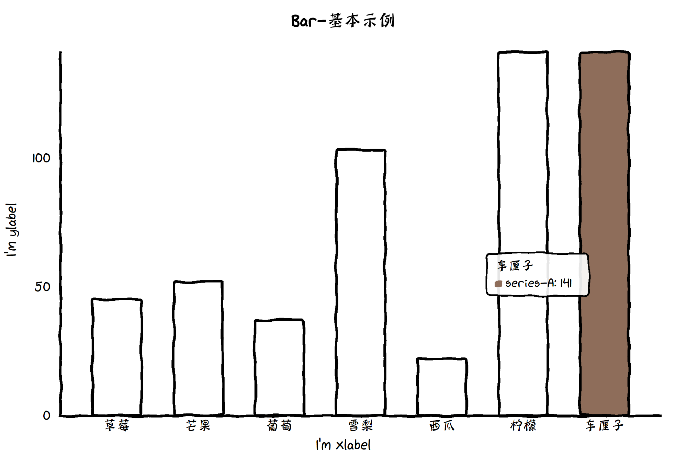
```python
import cutecharts.charts as ctc
import pandas as pd

df = pd.DataFrame({
    'x': ['Sun.', 'Mon.', 'Tue.', 'Wed.', 'Thu.', 'Fri.', 'Sat.'],
    'y': [14, 15, 17, 20, 22.3, 23.7, 24.8],
    'z': [16, 16.4, 23.6, 24.5, 19.9, 13.6, 13.4]})

chart = ctc.Bar('Toronto Temperature', width='500px', height='400px')
chart.set_options(
    labels=list(df['x']),
    x_label='Days',
    y_label='Temperature (Celsius)',
    colors=['#1EAFAE' for i in range(len(df))]
)
chart.add_series('This week', list(df['y']))
chart.render()

```
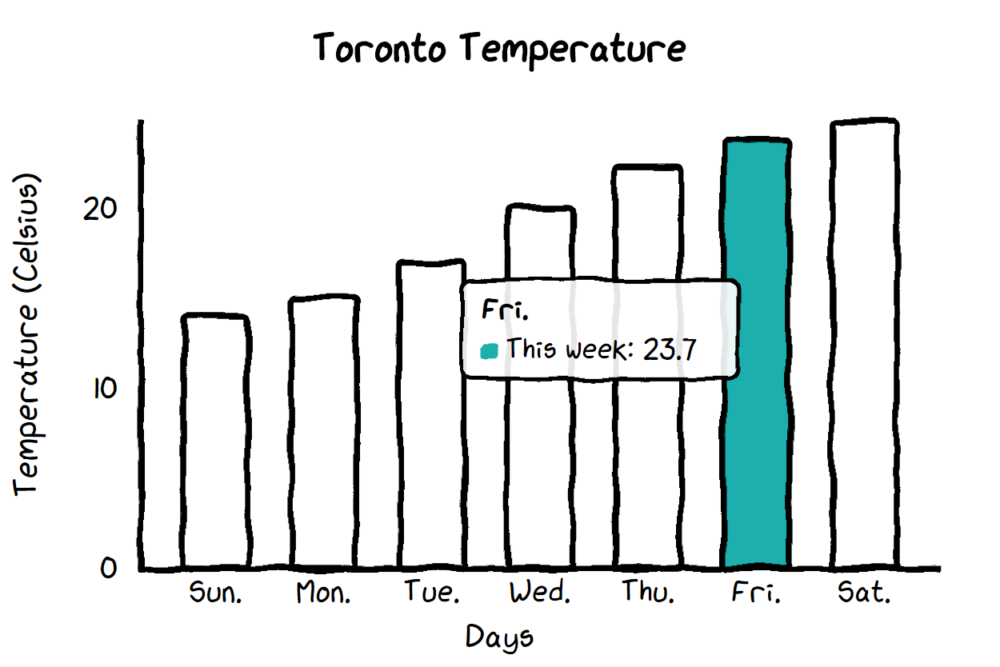
<a name="wMZum"></a>
### Bar-调整颜色
```python
from cutecharts.charts import Bar
from cutecharts.faker import Faker


def bar_tickcount_colors():
    chart = Bar("Bar-调整颜色")
    chart.set_options(labels=Faker.choose(), y_tick_count=10, colors=Faker.colors)
    chart.add_series("series-A", Faker.values())
    return chart


bar_tickcount_colors().render()

```
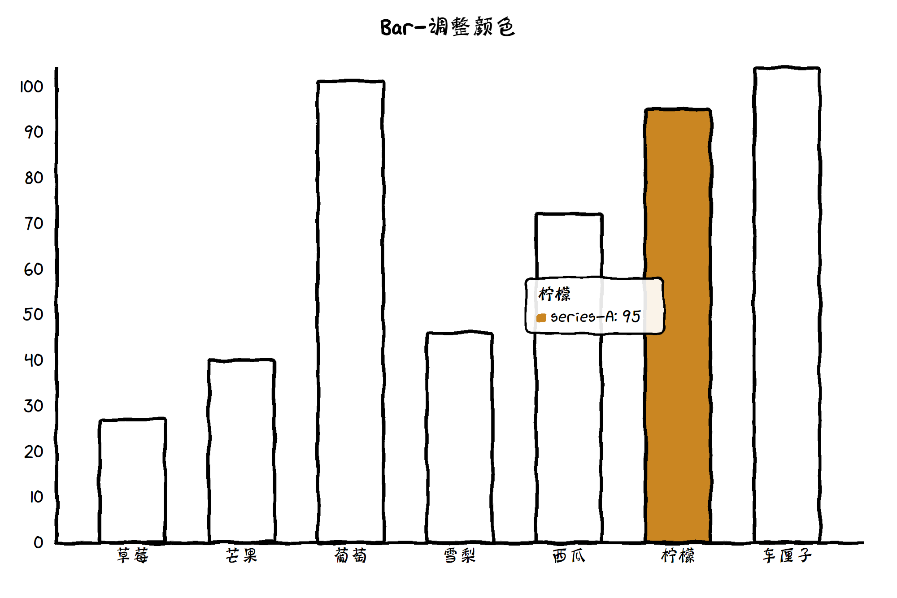
```python
import cutecharts.charts as ctc
import pandas as pd

df = pd.DataFrame({
    'x': ['Sun.', 'Mon.', 'Tue.', 'Wed.', 'Thu.', 'Fri.', 'Sat.'],
    'y': [14, 15, 17, 20, 22.3, 23.7, 24.8],
    'z': [16, 16.4, 23.6, 24.5, 19.9, 13.6, 13.4]})

chart = ctc.Bar('Toronto Temperature', width='500px', height='400px')
chart.set_options(
    labels=list(df['x']),
    x_label='Days',
    y_label='Temperature (Celsius)',
    colors=['#FFF1C9','#F7B7A3','#EA5F89','#9B3192','#57167E','#47B39C','#00529B']
)
chart.add_series('This week', list(df['y']))
chart.render()

```
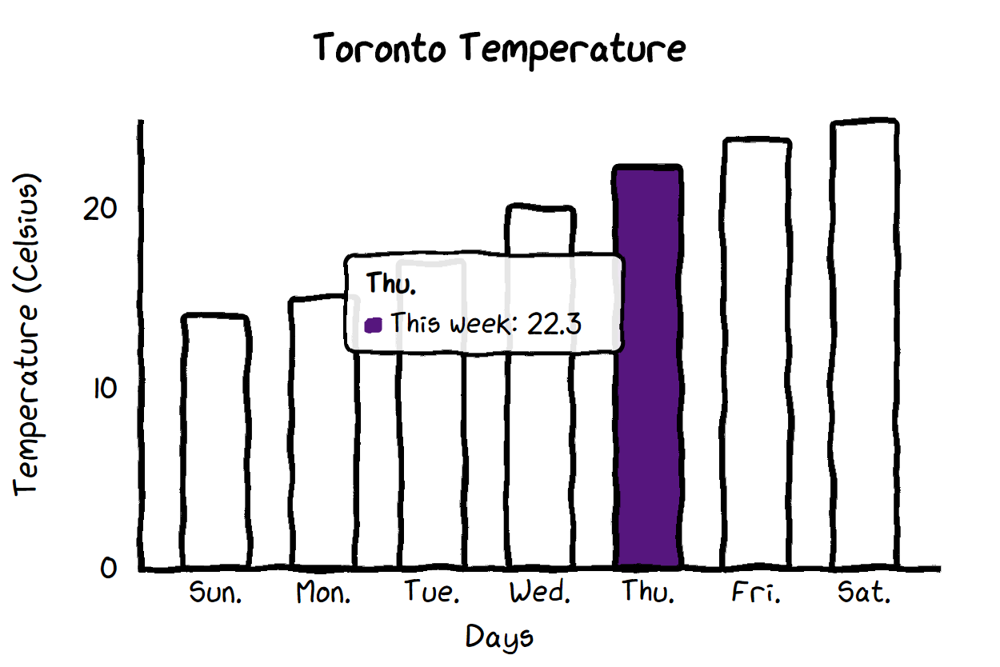
<a name="uYb16"></a>
## Line（折线图）
> cutecharts.charts.Line

<a name="8xLA3"></a>
### API
> cutecharts.charts.Line.set_options

```
Params                                          Desc
------                                          ----
labels: Iterable                                X 坐标轴标签数据
x_label: str = ""                               X 坐标轴名称
y_label: str = ""                               Y 坐标轴名称
y_tick_count: int = 3                           Y 轴刻度分割段数
legend_pos: str = "upLeft"                      图例位置，有 "upLeft", "upRight", "downLeft", "downRight" 可选
colors: Optional[Iterable] = None               label 颜色数组
font_family: Optional[str] = None               CSS font-family
```
> cutecharts.charts.Line.add_series

```
Params                                          Desc
------                                          ----
name: str                                       series 名称
data: Iterable                                  series 数据列表
```
<a name="sW9VZ"></a>
### Line-基本示例
```python
from cutecharts.charts import Line
from cutecharts.components import Page
from cutecharts.faker import Faker
def line_base() -> Line:
    chart = Line("Line-基本示例")
    chart.set_options(labels=Faker.choose(), x_label="I'm xlabel", y_label="I'm ylabel")
    chart.add_series("series-A", Faker.values())
    chart.add_series("series-B", Faker.values())
    return chart
line_base().render()
```
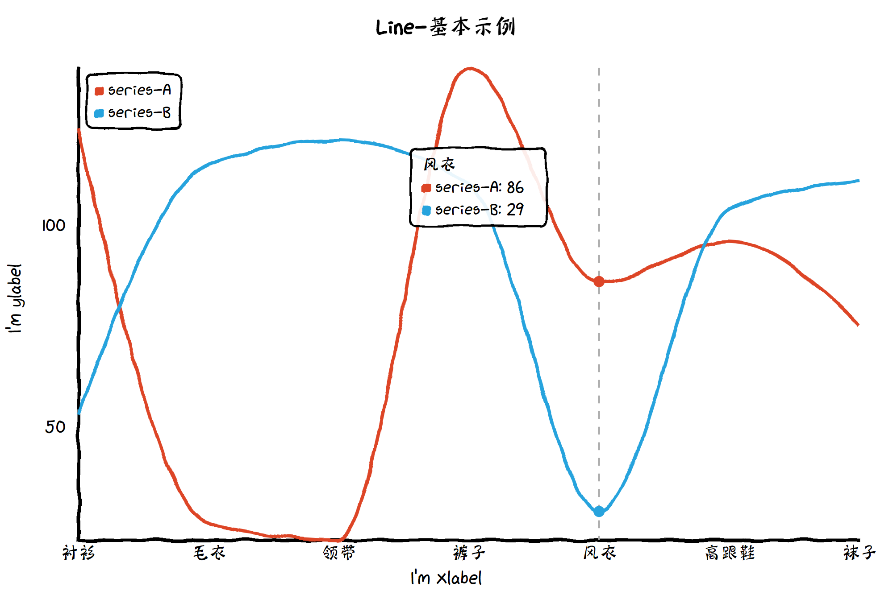
<a name="LiWlh"></a>
### Line-Legend 位置
```python
def line_legend():
    chart = Line("Line-Legend 位置")
    chart.set_options(labels=Faker.choose(), legend_pos="upRight")
    chart.add_series("series-A", Faker.values())
    chart.add_series("series-B", Faker.values())
    return chart
```
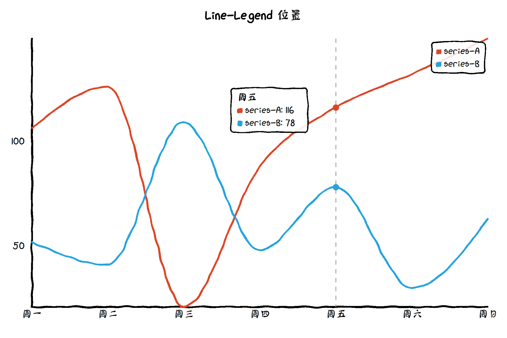
<a name="b850e46f"></a>
### Line-调整颜色
```python
def line_tickcount_colors():
    chart = Line("Line-调整颜色")
    chart.set_options(labels=Faker.choose(), colors=Faker.colors, y_tick_count=8)
    chart.add_series("series-A", Faker.values())
    chart.add_series("series-B", Faker.values())
    return chart
```
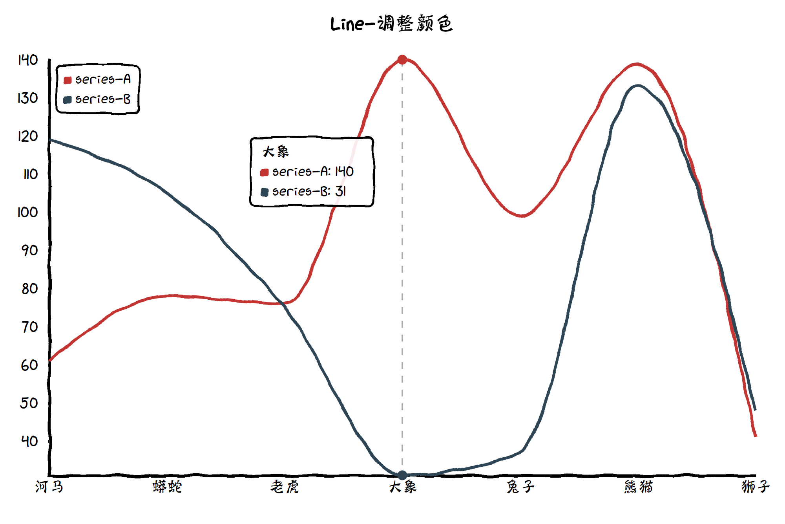
<a name="DN12G"></a>
## Pie（饼图）
> cutecharts.charts.Pie

<a name="rssiD"></a>
### API
> cutecharts.charts.Pie.set_options

```
Params                                          Desc
------                                          ----
labels: Iterable                                数据标签列表
inner_radius: float = 0.5                       Pie 图半径
legend_pos: str = "upLeft"                      图例位置，有 "upLeft", "upRight", "downLeft", "downRight" 可选
colors: Optional[Iterable] = None               label 颜色数组
font_family: Optional[str] = None               CSS font-family
```
> cutecharts.charts.Pie.add_series

```
Params                                          Desc
------                                       ----
data: Iterable                                  series 数据列表
```
<a name="ggKmV"></a>
### Pie-基本示例
```python
from cutecharts.charts import Pie
from cutecharts.components import Page
from cutecharts.faker import Faker
def pie_base() -> Pie:
    chart = Pie("Pie-基本示例")
    chart.set_options(labels=Faker.choose())
    chart.add_series(Faker.values())
    return chart
pie_base().render()
```
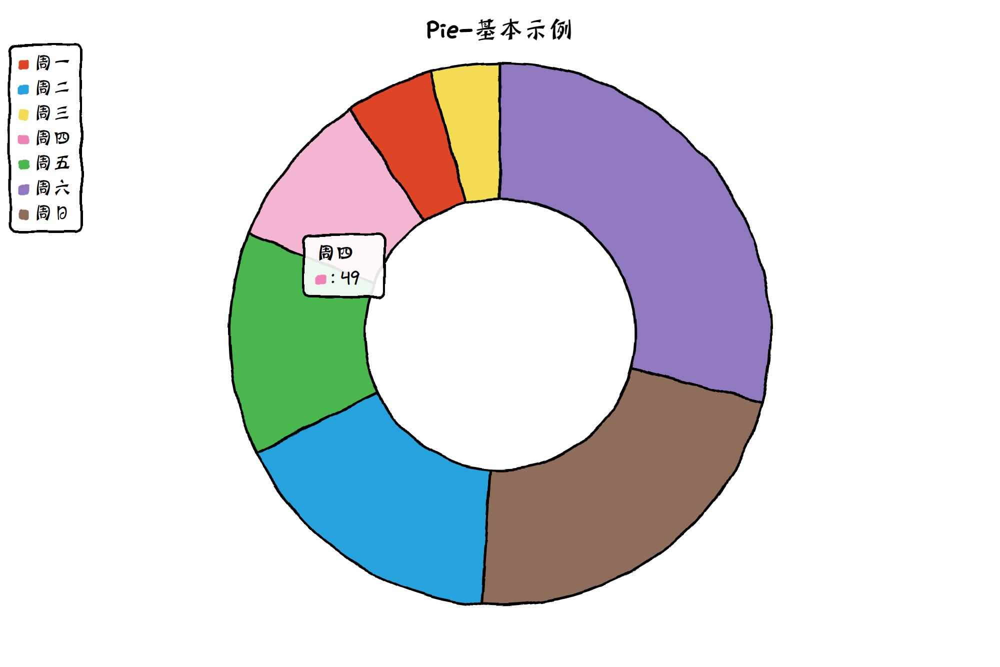
<a name="bHCN7"></a>
### Pie-Legend
```python
def pie_legend_font():
    chart = Pie("Pie-Legend")
    chart.set_options(
        labels=Faker.choose(),
        legend_pos="downLeft",
        font_family='"Times New Roman",Georgia,Serif;',
    )
    chart.add_series(Faker.values())
    return chart
```
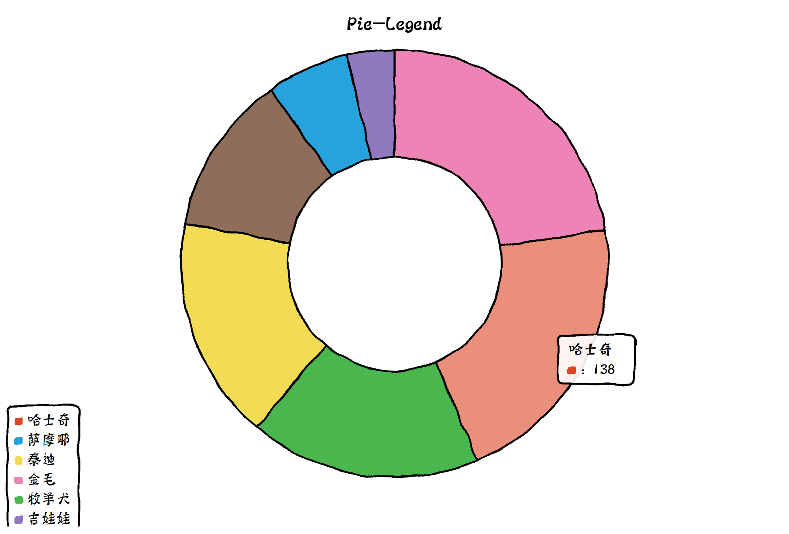
<a name="y1lJu"></a>
### Pie-Radius
```python
def pie_radius():
    chart = Pie("Pie-Radius")
    chart.set_options(
        labels=Faker.choose(),
        inner_radius=0,
    )
    chart.add_series(Faker.values())
    return chart
```
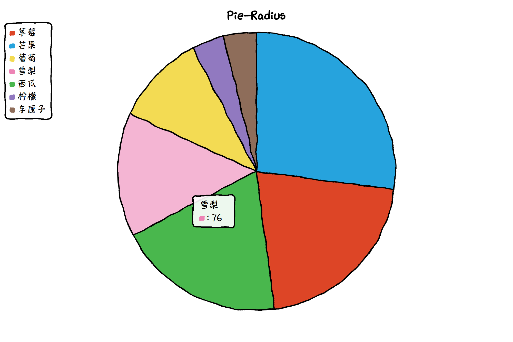
<a name="J6t6L"></a>
## Radar（雷达图）
> cutecharts.charts.Radar

<a name="0w0OP"></a>
### API
> cutecharts.charts.Radar.set_options

```
Params                                          Desc
------                                          ----
labels: Iterable                                数据标签列表
is_show_label: bool = True                      是否显示标签
is_show_legend: bool = True                     是否显示图例
tick_count: int = 3                             坐标系分割刻度
legend_pos: str = "upLeft"                      图例位置，有 "upLeft", "upRight", "downLeft", "downRight" 可选
colors: Optional[Iterable] = None               label 颜色数组
font_family: Optional[str] = None               CSS font-family
```
> cutecharts.charts.Radar.add_series

```
Params                                          Desc
------                                          ----
name: str                                       series 名称
data: Iterable                                  series 数据列表
```
<a name="qNHET"></a>
### Radar-基本示例

```python
from cutecharts.charts import Radar
from cutecharts.components import Page
from cutecharts.faker import Faker
def radar_base() -> Radar:
    chart = Radar("Radar-基本示例")
    chart.set_options(labels=Faker.choose())
    chart.add_series("series-A", Faker.values())
    chart.add_series("series-B", Faker.values())
    return chart
radar_base().render()
```
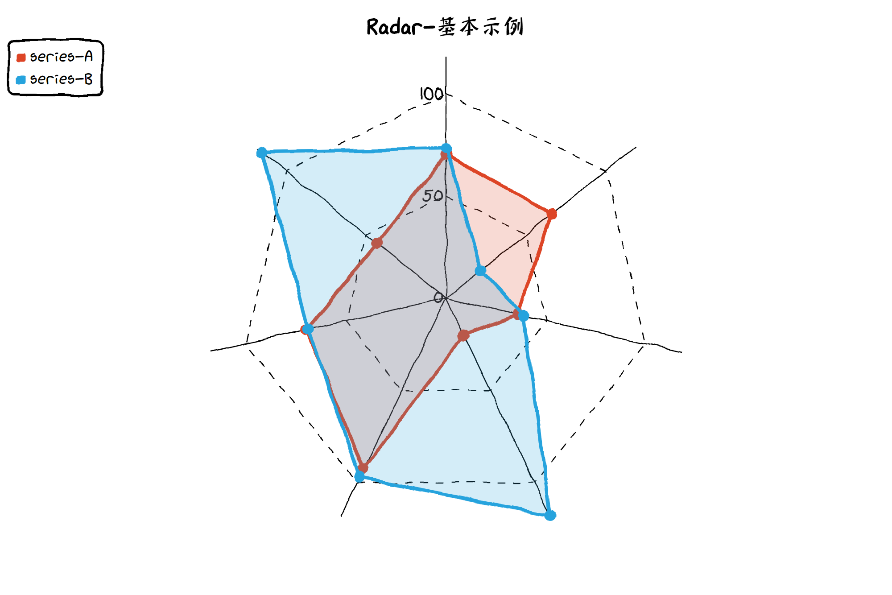
<a name="B3dnX"></a>
### Radar-颜色调整
```python
def radar_legend_colors():
    chart = Radar("Radar-颜色调整")
    chart.set_options(labels=Faker.choose(), colors=Faker.colors, legend_pos="upRight")
    chart.add_series("series-A", Faker.values())
    chart.add_series("series-B", Faker.values())
    return chart
```
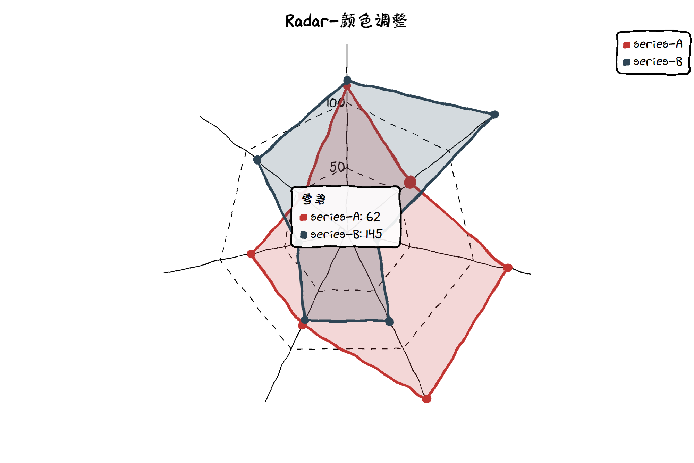
<a name="TgdGn"></a>
## Scatter（散点图）
> cutecharts.charts.Scatter

<a name="3O3xX"></a>
### API
> cutecharts.charts.Scatter.set_options

```
Params                                          Desc
------                                          ----
x_label: str = ""                               X 坐标轴名称
y_label: str = ""                               Y 坐标轴名称
x_tick_count: int = 3                           X 轴刻度分割段数
y_tick_count: int = 3                           Y 轴刻度分割段数
is_show_line: bool = False                      是否将散点连成线
dot_size: int = 1                               散点大小
time_format: Optional[str] = None               日期格式
legend_pos: str = "upLeft"                      图例位置，有 "upLeft", "upRight", "downLeft", "downRight" 可选
colors: Optional[Iterable] = None               label 颜色数组
font_family: Optional[str] = None               CSS font-family
```
> cutecharts.charts.Scatter.add_series

```
Params                                          Desc
------                                          ----
name: str                                       series 名称
data: Iterable                                  series 数据列表，[(x1, y1), (x2, y2)]
```
<a name="Cn7Ca"></a>
### Scatter-基本示例

```python
from cutecharts.charts import Scatter
from cutecharts.components import Page
from cutecharts.faker import Faker
def scatter_base() -> Scatter:
    chart = Scatter("Scatter-基本示例")
    chart.set_options(x_label="I'm xlabel", y_label="I'm ylabel")
    chart.add_series(
        "series-A", [(z[0], z[1]) for z in zip(Faker.values(), Faker.values())]
    )
    chart.add_series(
        "series-B", [(z[0], z[1]) for z in zip(Faker.values(), Faker.values())]
    )
    return chart
scatter_base().render()
```
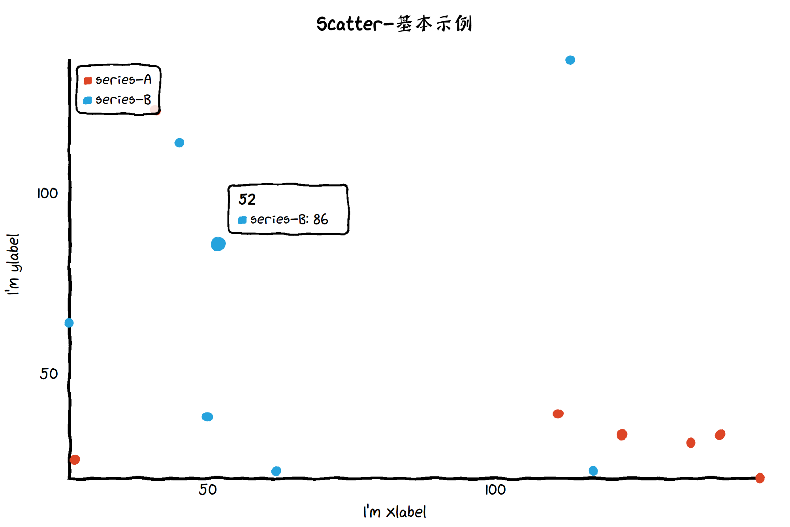
<a name="cd6e8714"></a>
### Scatter-散点大小
```python
def scatter_dotsize_tickcount():
    chart = Scatter("Scatter-散点大小")
    chart.set_options(dot_size=2, y_tick_count=8)
    chart.add_series(
        "series-A", [(z[0], z[1]) for z in zip(Faker.values(), Faker.values())]
    )
    chart.add_series(
        "series-B", [(z[0], z[1]) for z in zip(Faker.values(), Faker.values())]
    )
    return chart
```
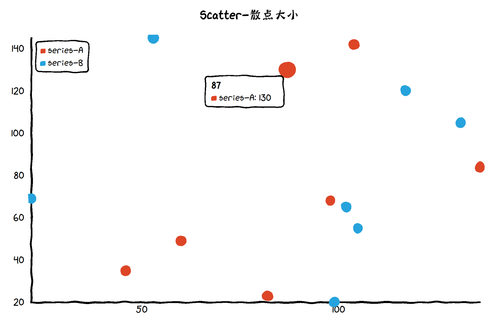
<a name="0fcde631"></a>
### Scatter-散点连成线
```python
def scatter_show_line():
    chart = Scatter("Scatter-散点连成线")
    chart.set_options(y_tick_count=8, is_show_line=True)
    chart.add_series(
        "series-A", [(z[0], z[1]) for z in zip(Faker.values(), Faker.values())]
    )
    chart.add_series(
        "series-B", [(z[0], z[1]) for z in zip(Faker.values(), Faker.values())]
    )
    return chart
```
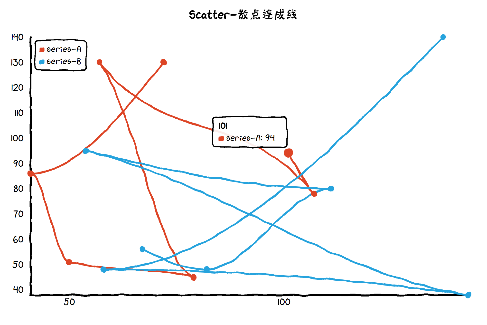
<a name="z5fn0"></a>
## 组合图
```python
import cutecharts.charts as ctc
from cutecharts.components import Page
import pandas as pd

df = pd.DataFrame({
    'x': ['Sun.', 'Mon.', 'Tue.', 'Wed.', 'Thu.', 'Fri.', 'Sat.'],
    'y': [14, 15, 17, 20, 22.3, 23.7, 24.8],
    'z': [16, 16.4, 23.6, 24.5, 19.9, 13.6, 13.4]})

chart1 = ctc.Line("Toronto Temperature", width='500px', height='400px')
chart1.set_options(
    labels=list(df['x']),
    x_label="Days",
    y_label="Temperature (Celsius)")
chart1.add_series("This Week", list(df['y']))
chart1.add_series("Last Week", list(df['z']))
chart2 = ctc.Bar('Toronto Temperature', width='500px', height='400px')
chart2.set_options(
    labels=list(df['x']),
    x_label="Days",
    y_label="Temperature (Celsius)",
    colors=['#1EAFAE' for i in range(len(df))]
)
chart2.add_series("This week", list(df['y']))
chart2.add_series("Last week", list(df['z']))
page = Page()
page.add(chart1, chart2)
page.render_notebook()
page.render()

```
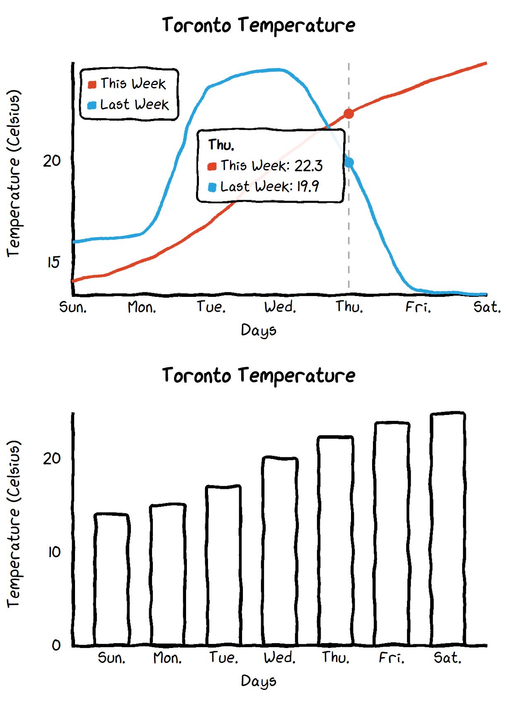
