Python Bokeh<br />Python中常用且可灵活交互使用的的可视化绘制包-Bokeh，由于网上关于该包较多及官方介绍也较为详细，这里就在不再过多介绍，直接放出几副精美的可视化作品供大家欣赏：
<a name="ZjsgL"></a>
## 在jupyter notebook 中显示
在绘制可视化作品之前需输入：
```python
output_notebook()
```
即可在jupyter notebook 中交互显示可视化结果。
<a name="zvHaZ"></a>
## Bokeh 可视化作品欣赏
<a name="HXnla"></a>
### bar_colormapped
```python
from bokeh.io import output_file, show
from bokeh.models import ColumnDataSource
from bokeh.palettes import Spectral6
from bokeh.plotting import figure
from bokeh.transform import factor_cmap

output_file("bar_colormapped.html")

fruits = ['Apples', 'Pears', 'Nectarines', 'Plums', 'Grapes', 'Strawberries']
counts = [5, 3, 4, 2, 4, 6]

source = ColumnDataSource(data=dict(fruits=fruits, counts=counts))

p = figure(x_range=fruits, plot_height=350, toolbar_location=None, title="Fruit Counts")
p.vbar(x='fruits', top='counts', width=0.9, source=source, legend_field="fruits",
       line_color='white', fill_color=factor_cmap('fruits', palette=Spectral6, factors=fruits))

p.xgrid.grid_line_color = None
p.y_range.start = 0
p.y_range.end = 9
p.legend.orientation = "horizontal"
p.legend.location = "top_center"

show(p)
```
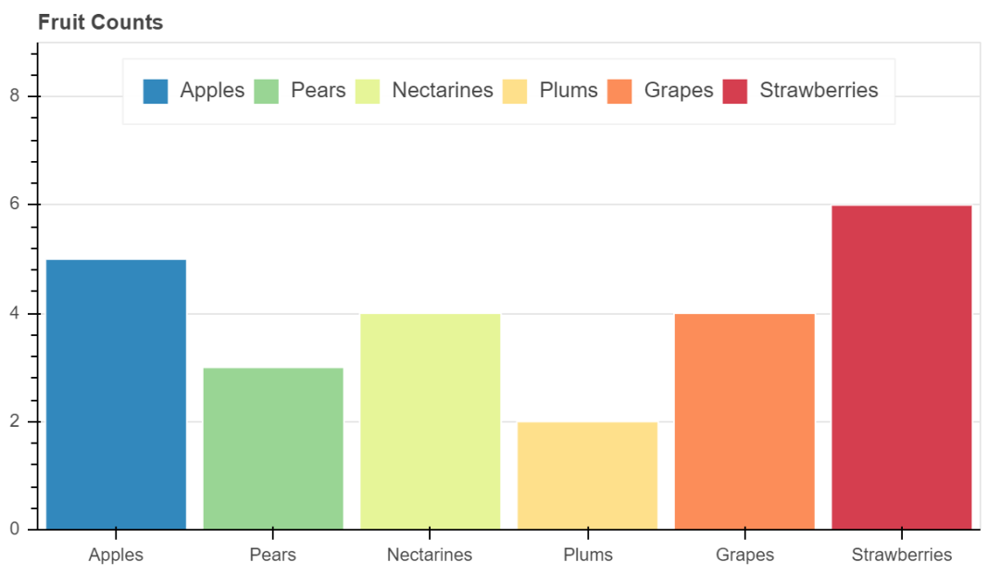<br />bar_colormapped
<a name="fHdCe"></a>
### hexbin
```python
import numpy as np

from bokeh.io import output_file, show
from bokeh.models import HoverTool
from bokeh.plotting import figure

n = 500
x = 2 + 2*np.random.standard_normal(n)
y = 2 + 2*np.random.standard_normal(n)

p = figure(title="Hexbin for 500 points", match_aspect=True,
           tools="wheel_zoom,reset", background_fill_color='#440154')
p.grid.visible = False

r, bins = p.hexbin(x, y, size=0.5, hover_color="pink", hover_alpha=0.8)

p.circle(x, y, color="white", size=1)

p.add_tools(HoverTool(
    tooltips=[("count", "@c"), ("(q,r)", "(@q, @r)")],
    mode="mouse", point_policy="follow_mouse", renderers=[r]
))

output_file("hexbin.html")

show(p)
```
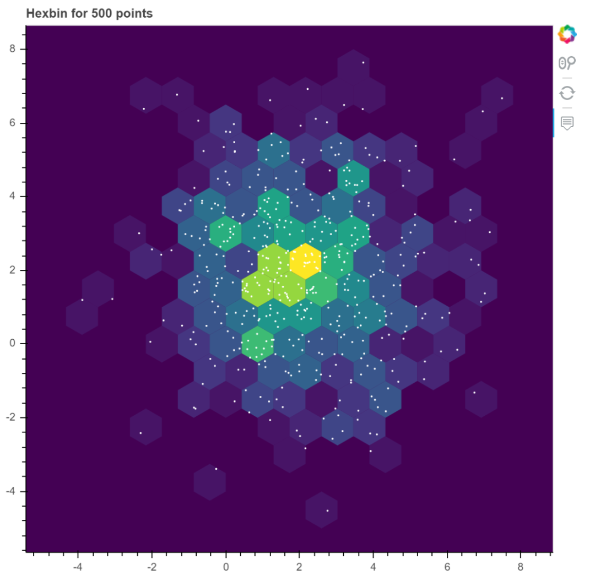<br />hexbin
<a name="WeWO1"></a>
### boxplot
```python
import numpy as np
import pandas as pd

from bokeh.plotting import figure, output_file, show

# generate some synthetic time series for six different categories
cats = list("abcdef")
yy = np.random.randn(2000)
g = np.random.choice(cats, 2000)
for i, l in enumerate(cats):
    yy[g == l] += i // 2
df = pd.DataFrame(dict(score=yy, group=g))

# find the quartiles and IQR for each category
groups = df.groupby('group')
q1 = groups.quantile(q=0.25)
q2 = groups.quantile(q=0.5)
q3 = groups.quantile(q=0.75)
iqr = q3 - q1
upper = q3 + 1.5*iqr
lower = q1 - 1.5*iqr

# find the outliers for each category
def outliers(group):
    cat = group.name
    return group[(group.score > upper.loc[cat]['score']) | (group.score < lower.loc[cat]['score'])]['score']
out = groups.apply(outliers).dropna()

# prepare outlier data for plotting, we need coordinates for every outlier.
if not out.empty:
    outx = []
    outy = []
    for keys in out.index:
        outx.append(keys[0])
        outy.append(out.loc[keys[0]].loc[keys[1]])

p = figure(tools="", background_fill_color="#efefef", x_range=cats, toolbar_location=None)

# if no outliers, shrink lengths of stems to be no longer than the minimums or maximums
qmin = groups.quantile(q=0.00)
qmax = groups.quantile(q=1.00)
upper.score = [min([x,y]) for (x,y) in zip(list(qmax.loc[:,'score']),upper.score)]
lower.score = [max([x,y]) for (x,y) in zip(list(qmin.loc[:,'score']),lower.score)]

# stems
p.segment(cats, upper.score, cats, q3.score, line_color="black")
p.segment(cats, lower.score, cats, q1.score, line_color="black")

# boxes
p.vbar(cats, 0.7, q2.score, q3.score, fill_color="#E08E79", line_color="black")
p.vbar(cats, 0.7, q1.score, q2.score, fill_color="#3B8686", line_color="black")

# whiskers (almost-0 height rects simpler than segments)
p.rect(cats, lower.score, 0.2, 0.01, line_color="black")
p.rect(cats, upper.score, 0.2, 0.01, line_color="black")

# outliers
if not out.empty:
    p.circle(outx, outy, size=6, color="#F38630", fill_alpha=0.6)

p.xgrid.grid_line_color = None
p.ygrid.grid_line_color = "white"
p.grid.grid_line_width = 2
p.xaxis.major_label_text_font_size="16px"

output_file("boxplot.html", title="boxplot.py example")

show(p)
```
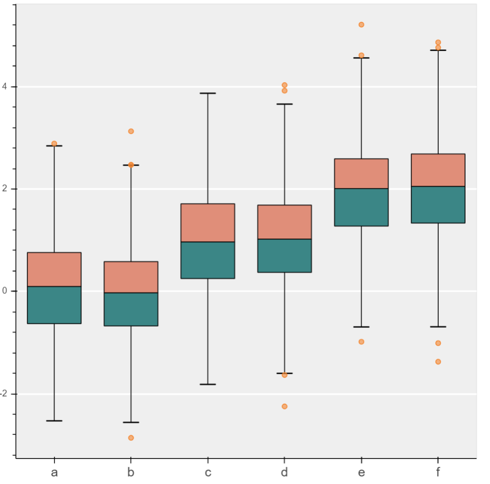<br />boxplot
<a name="IlPmk"></a>
### burtin
```python
from collections import OrderedDict
from io import StringIO
from math import log, sqrt

import numpy as np
import pandas as pd

from bokeh.plotting import figure, output_file, show

antibiotics = """
bacteria,                        penicillin, streptomycin, neomycin, gram
Mycobacterium tuberculosis,      800,        5,            2,        negative
Salmonella schottmuelleri,       10,         0.8,          0.09,     negative
Proteus vulgaris,                3,          0.1,          0.1,      negative
Klebsiella pneumoniae,           850,        1.2,          1,        negative
Brucella abortus,                1,          2,            0.02,     negative
Pseudomonas aeruginosa,          850,        2,            0.4,      negative
Escherichia coli,                100,        0.4,          0.1,      negative
Salmonella (Eberthella) typhosa, 1,          0.4,          0.008,    negative
Aerobacter aerogenes,            870,        1,            1.6,      negative
Brucella antracis,               0.001,      0.01,         0.007,    positive
Streptococcus fecalis,           1,          1,            0.1,      positive
Staphylococcus aureus,           0.03,       0.03,         0.001,    positive
Staphylococcus albus,            0.007,      0.1,          0.001,    positive
Streptococcus hemolyticus,       0.001,      14,           10,       positive
Streptococcus viridans,          0.005,      10,           40,       positive
Diplococcus pneumoniae,          0.005,      11,           10,       positive
"""

drug_color = OrderedDict([
    ("Penicillin",   "#0d3362"),
    ("Streptomycin", "#c64737"),
    ("Neomycin",     "black"  ),
])

gram_color = OrderedDict([
    ("negative", "#e69584"),
    ("positive", "#aeaeb8"),
])

df = pd.read_csv(StringIO(antibiotics),
                 skiprows=1,
                 skipinitialspace=True,
                 engine='python')

width = 800
height = 800
inner_radius = 90
outer_radius = 300 - 10

minr = sqrt(log(.001 * 1E4))
maxr = sqrt(log(1000 * 1E4))
a = (outer_radius - inner_radius) / (minr - maxr)
b = inner_radius - a * maxr

def rad(mic):
    return a * np.sqrt(np.log(mic * 1E4)) + b

big_angle = 2.0 * np.pi / (len(df) + 1)
small_angle = big_angle / 7

p = figure(plot_width=width, plot_height=height, title="",
    x_axis_type=None, y_axis_type=None,
    x_range=(-420, 420), y_range=(-420, 420),
    min_border=0, outline_line_color="black",
    background_fill_color="#f0e1d2")

p.xgrid.grid_line_color = None
p.ygrid.grid_line_color = None

# annular wedges
angles = np.pi/2 - big_angle/2 - df.index.to_series()*big_angle
colors = [gram_color[gram] for gram in df.gram]
p.annular_wedge(
    0, 0, inner_radius, outer_radius, -big_angle+angles, angles, color=colors,
)

# small wedges
p.annular_wedge(0, 0, inner_radius, rad(df.penicillin),
                -big_angle+angles+5*small_angle, -big_angle+angles+6*small_angle,
                color=drug_color['Penicillin'])
p.annular_wedge(0, 0, inner_radius, rad(df.streptomycin),
                -big_angle+angles+3*small_angle, -big_angle+angles+4*small_angle,
                color=drug_color['Streptomycin'])
p.annular_wedge(0, 0, inner_radius, rad(df.neomycin),
                -big_angle+angles+1*small_angle, -big_angle+angles+2*small_angle,
                color=drug_color['Neomycin'])

# circular axes and lables
labels = np.power(10.0, np.arange(-3, 4))
radii = a * np.sqrt(np.log(labels * 1E4)) + b
p.circle(0, 0, radius=radii, fill_color=None, line_color="white")
p.text(0, radii[:-1], [str(r) for r in labels[:-1]],
       text_font_size="11px", text_align="center", text_baseline="middle")

# radial axes
p.annular_wedge(0, 0, inner_radius-10, outer_radius+10,
                -big_angle+angles, -big_angle+angles, color="black")

# bacteria labels
xr = radii[0]*np.cos(np.array(-big_angle/2 + angles))
yr = radii[0]*np.sin(np.array(-big_angle/2 + angles))
label_angle=np.array(-big_angle/2+angles)
label_angle[label_angle < -np.pi/2] += np.pi # easier to read labels on the left side
p.text(xr, yr, df.bacteria, angle=label_angle,
       text_font_size="12px", text_align="center", text_baseline="middle")

# OK, these hand drawn legends are pretty clunky, will be improved in future release
p.circle([-40, -40], [-370, -390], color=list(gram_color.values()), radius=5)
p.text([-30, -30], [-370, -390], text=["Gram-" + gr for gr in gram_color.keys()],
       text_font_size="9px", text_align="left", text_baseline="middle")

p.rect([-40, -40, -40], [18, 0, -18], width=30, height=13,
       color=list(drug_color.values()))
p.text([-15, -15, -15], [18, 0, -18], text=list(drug_color),
       text_font_size="12px", text_align="left", text_baseline="middle")

output_file("burtin.html", title="burtin.py example")

show(p)
```
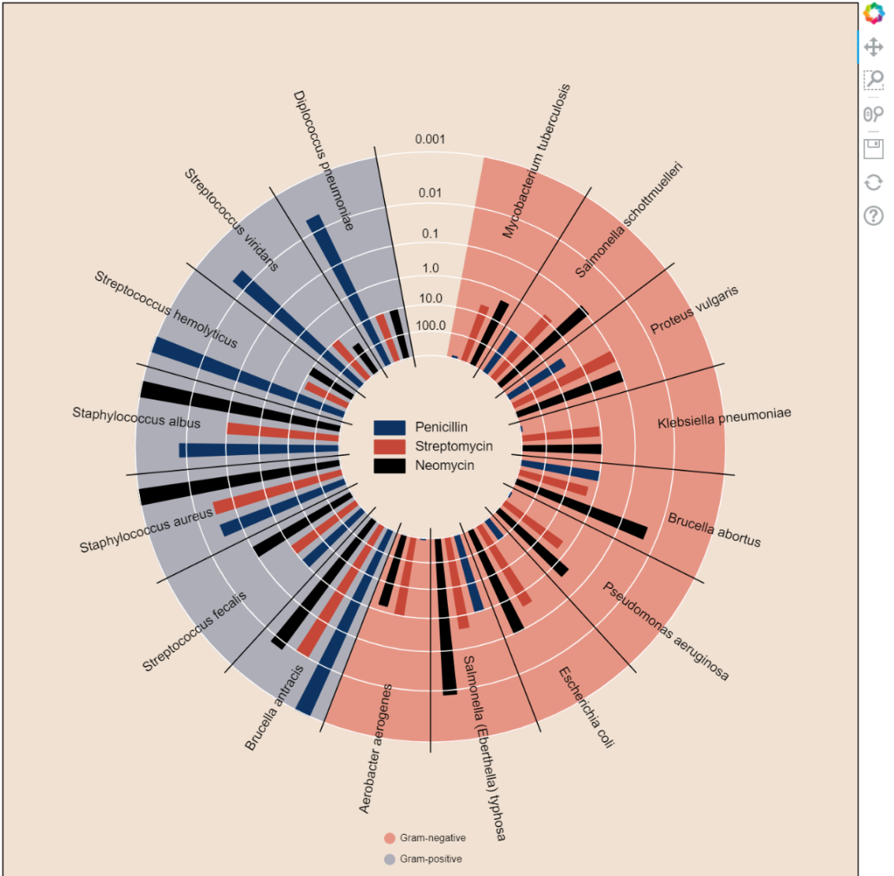<br />burtin<br />其他可视化作品直接放出结果，绘制代码省略，可以自行去官网搜索：
<a name="XmaH6"></a>
### periodic——化学元素周期表
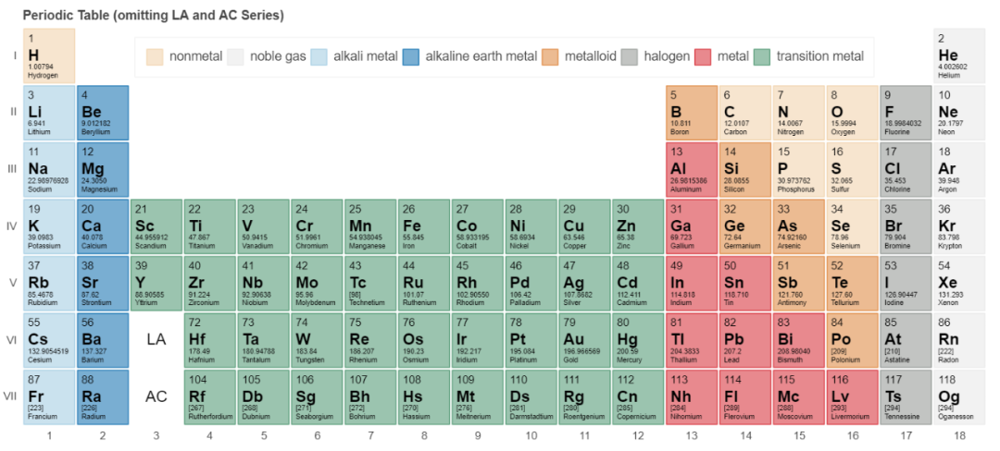<br />periodic
<a name="Kbdla"></a>
### markers
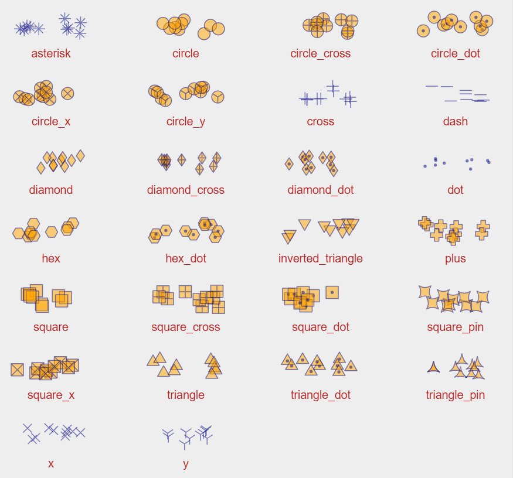<br />markers plots<br />以上所有的可视化作品都是可以交互操作的，除此之外，Bokeh 还提供大量的可视化APP应用。
<a name="pdBWe"></a>
### 物理洛伦茨吸引子
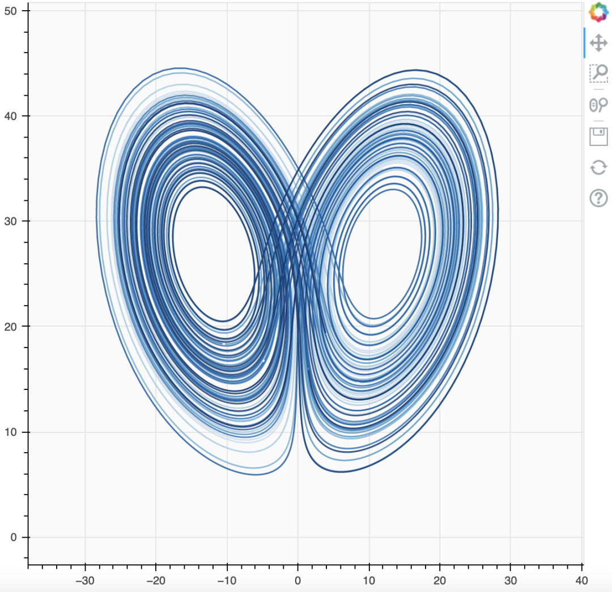
<a name="lCr5Z"></a>
### 数学正弦曲线
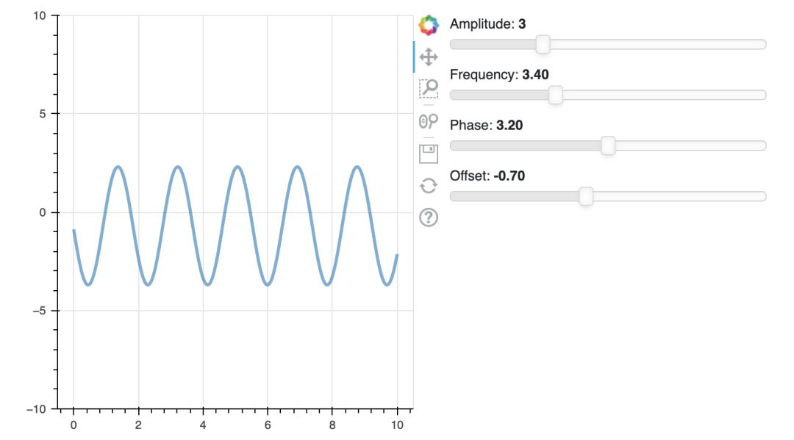
<a name="tiP4W"></a>
### 地理德克萨斯州
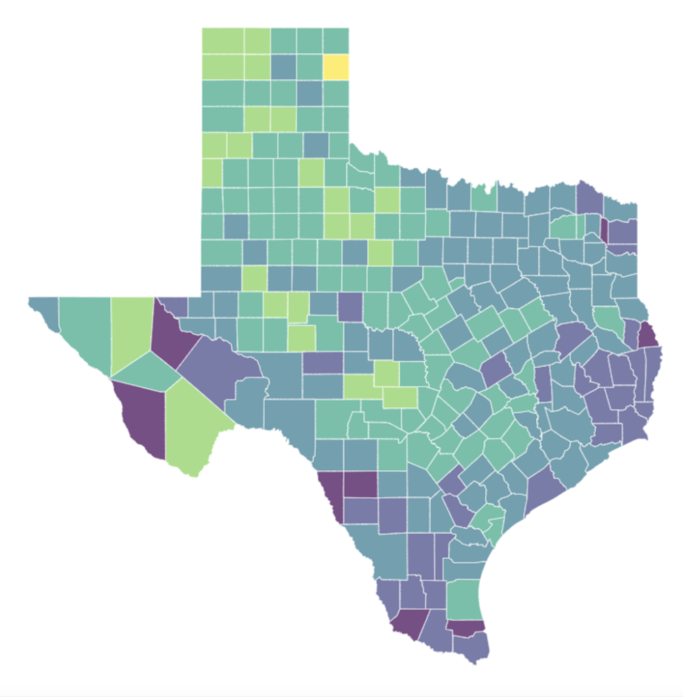
<a name="vvmfB"></a>
### 美术颜色滑块图
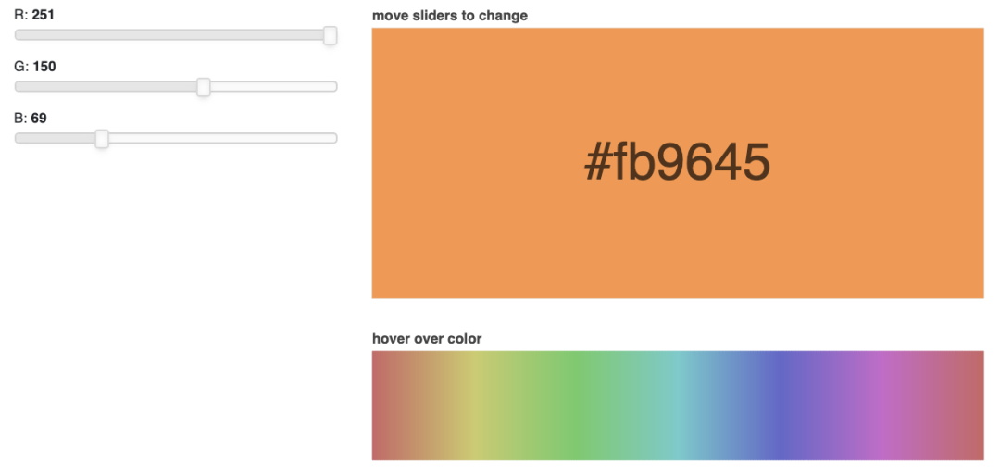

---

<a name="RGLwO"></a>
## 用bokeh绘图交互图形的基本步骤

1. 准备一些数据Python列表，NumPy数组，panda的数据筐等准备数据
2. 创建一个新的情节
3. 使用可视渲染器塑造数据
4. 指定在何处生成输出
5. 显示或保存结果
```python
from bokeh.plotting import figure
from bokeh.io import output_file, show
x = [1, 2, 3, 4, 5]                       # Step 1
y = [6, 7, 2, 4, 5]
p = figure(title="simple line example",   # Step 2 
           x_axis_label='x',
           y_axis_label='y')
p.line(x, y, legend="Temp.", line_width=2)# Step 3
output_file("lines.html")                 # Step 4 
show(p)                                   # Step 5
```
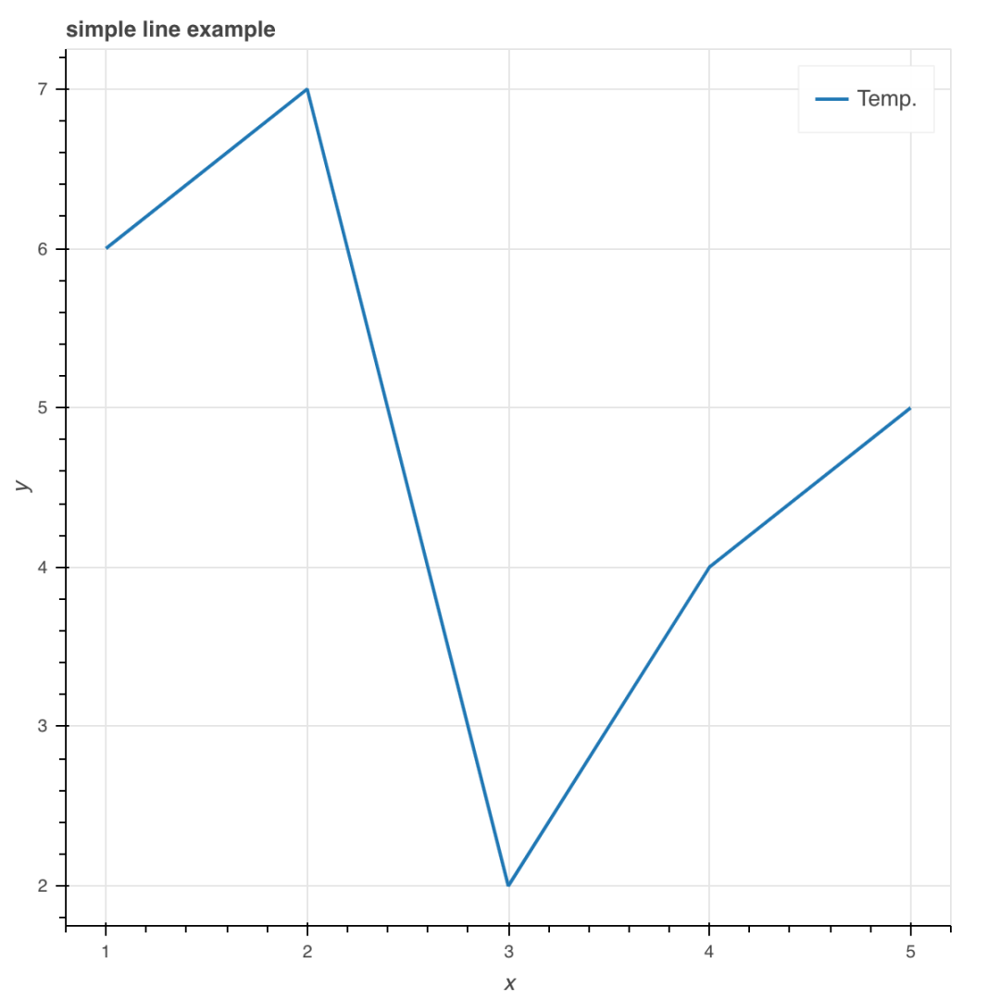
<a name="btvQU"></a>
### bokeh接口
`Charts`: 高层接口，以简单的方式绘制复杂的统计图<br />`Plotting`: 中层接口，用于组装图形元素<br />`Models`: 底层接口，为开发者提供了最大的灵活性<br />本次实用中层接口`boken.plotting`绘制图形
<a name="BHqya"></a>
### 数据准备
Python列表和NumPy数组等数据序列来将数据传递给bokeh。bokeh自动将这些列表转换为ColumnDataSource对象。<br />也可以手动操作:
```python
import numpy as np
import pandas as pd
df = pd.DataFrame(np.array([[33.9,4,65, 'US'],
                            [32.4,4,66, 'Asia'],
                            [21.4,4,109, 'Europe']]), 
                  columns=['mpg','cyl', 'hp', 'origin'],
                  index=['Toyota', 'Fiat', 'Volvo'])

from bokeh.models import ColumnDataSource
cds_df = ColumnDataSource(df)
```
ColumnDataSource是Bokeh自己的数据结构。
<a name="pvItF"></a>
### 创建图表
使用`figure()`函数创建图表。
```python
from bokeh.plotting import figure
p1 = figure(plot_width=300, tools='pan,box_zoom')
p2 = figure(plot_width=300, plot_height=300,
            x_range=(0, 8), y_range=(0, 8))
p3 = figure()
```
<a name="VHHIg"></a>
### 添加和自定义渲染器
Bokeh的绘图界面支持许多不同的字形，例如线条、条形或其他多边形。
<a name="et3L4"></a>
#### 符号
```python
# 散点标记
p1.circle(np.array([1,2,3]), 
          np.array([3,2,1]),
          fill_color='white')
p2.square(np.array([1.5,3.5,5.5]), 
          [1,4,3], 
          color='blue', 
          size=1)

# 线符号
p1.line([1,2,3,4], 
        [3,4,5,6], 
        line_width=2)
p2.multi_line(pd.DataFrame([[1,2,3],[5,6,7]]),
              pd.DataFrame([[3,4,5],[3,2,1]]),
              color="blue")
```
<a name="tq2aF"></a>
#### 自定义符号
不同的渲染器函数接受各种参数来控制字形的外观。<br />如使用`circel()`定义圆环的颜色或直径:<br />`fill_color`：圆圈的填充颜色<br />`fill_alpha`：填充颜色的透明度（0到1之间的任何值）<br />`line_color`：圆圈轮廓的填充颜色<br />`size`：圆的大小（以屏幕空间或数据空间单位）<br />`legend_label`: 圈圈的传奇条目
```python
# 选择和非选择符号
p = figure(tools='box_select')
p.circle('mpg', 'cyl', 
         source=cds_df,
         selection_color='red',
         nonselection_alpha=0.1)

# 悬停符号
from bokeh.models import HoverTool
hover = HoverTool(tooltips=None, mode='vline')
p3.add_tools(hover)
```
在bokeh中，可以通过几种方式指定颜色。例如：

1. CSS颜色器(如"firebrick")
2. 使用十六进制值 (如"#00ff00")
3. 使用RGB颜色的3元组（如(100, 100, 255))
4. 使用4元组的RGBA颜色 (如(100, 100, 255, 0.5))
5. 颜色映射器
```python
# 颜色映射器
from bokeh.models import CategoricalColorMapper
color_mapper = CategoricalColorMapper(
               factors=['US', 'Asia', 'Europe'],
               palette=['blue', 'red', 'green'])
p3.circle('mpg', 'cyl', 
          source=cds_df,
          color=dict(field='origin',transform=color_mapper),
          legend='Origin')
```
<a name="MvJTa"></a>
#### 图例位置
```python
# 绘图区域内部
p.legend.location = 'bottom_left'
from bokeh.models import Legend
r1 = p2.asterisk(np.array([1,2,3]), 
                 np.array([3,2,1])
r2 = p2.line([1,2,3,4], [3,4,5,6])
legend = Legend(items=[("One" ,[p1, r1]),("Two",[r2])],
                location=(0, -30))
# 绘图区域外部
p.add_layout(legend, 'right')
```
<a name="yLUvP"></a>
#### 图例方向
```python
p.legend.orientation = "horizontal"
p.legend.orientation = "vertical"
```
<a name="l01XY"></a>
#### 图例背景和边界
```python
p.legend.border_line_color = "navy"
p.legend.background_fill_color = "white"
```
<a name="XO05Y"></a>
#### 图例文本的外观
```python
p.legend.label_text_font = "times"
p.legend.label_text_font_style = "italic"
p.legend.label_text_color = "navy"
```
<a name="OTcBa"></a>
#### 实用主题
五个内置主题：`caliber`, `dark_minimal`, `light_minimal`, `night_sky`, and `contrast`。
```python
from bokeh.io import curdoc
curdoc().theme = "dark_minimal"
```
<a name="cAmcP"></a>
#### 创建行&列布局
组合单个图表的最简单方法是将它们分配给行或列。
```python
# 行
from bokeh.layouts import row
layout = row(p1,p2,p3)
# 列
from bokeh.layouts import columns
layout = column(p1,p2,p3)
# 嵌套行和列
layout = row(column(p1,p2), p3)
```
<a name="Z9Qf1"></a>
#### 创建网格布局
```python
from bokeh.layouts import gridplot
row1 = [p1,p2]
row2 = [p3]
layout = gridplot([[p1,p2],[p3]])
```
<a name="qnpb7"></a>
#### 选项卡布局
```python
from bokeh.models.widgets import Panel, Tabs
tab1 = Panel(child=p1, title="tab1")
tab2 = Panel(child=p2, title="tab2")
layout = Tabs(tabs=[tab1, tab2])
```
<a name="Q8Zjs"></a>
#### 连接绘图
```python
# 连接轴
p2.x_range = p1.x_range
p2.y_range = p1.y_range
# 连接刷
p4 = figure(plot_width = 100,
            tools='box_select,lasso_select')
p4.circle('mpg', 'cyl', 
          source=cds_df)
p5 = figure(plot_width = 200,
            tools='box_select,lasso_select')
p5.circle('mpg', 'hp', 
          source=cds_df)
layout = row(p4,p5)
```
<a name="dy2bM"></a>
### 输出与导出
<a name="ppjTl"></a>
#### Notebook
```python
from bokeh.io import output_notebook, show
output_notebook()
```
<a name="Pf4in"></a>
#### HTML
```python
# 独立的
from bokeh.embed import file_html
from bokeh.resources import CDN
html = file_html(p, CDN, "my_plot")

使用output_file()函数将可视化保存到HTML文件中。
from bokeh.io import output_file, show
output_file('my_bar_chart.html', mode='cdn')

# 组件
from bokeh.embed import components
script, div = components(p)
```
<a name="YL02K"></a>
#### PNG & SVG
Bokeh使用Selenium创建PNG和SVG文件，所以bokeh需要通过能够让Selenium访问的浏览器来渲染PNG或SVG文件。<br />Selenium允许Bokeh在没有图形用户界面(GUI)的浏览器中运行。Selenium需要能够访问Firefox浏览器(通过geckodriver包)或Chromium浏览器(通过chromedriver包)。<br />因此需要安装第三方包：
```bash
pip install selenium geckodriver firefox
```
```python
# png
from bokeh.io import export_png
export_png(p, filename="plot.png")
 # svg
from bokeh.io import export_svgs
p.output_backend = "svg"
export_svgs(p, filename="plot.svg")
```
<a name="KLwFP"></a>
### 显示和导出图表
选择HTML且调用`show()`函数时，Bokeh会创建HTML文件。该功能还会自动打开网页浏览器以显示HTML文件。<br />如果希望Bokeh只生成文件而不在web浏览器中打开它，则使用`save()`函数代替。此时需要提前导入`save()`函数。
```python
from bokeh.plotting import show, save
show(layout)
save(layout)
```
更多详情请参见官方文档：[https://docs.bokeh.org/](https://docs.bokeh.org/)
