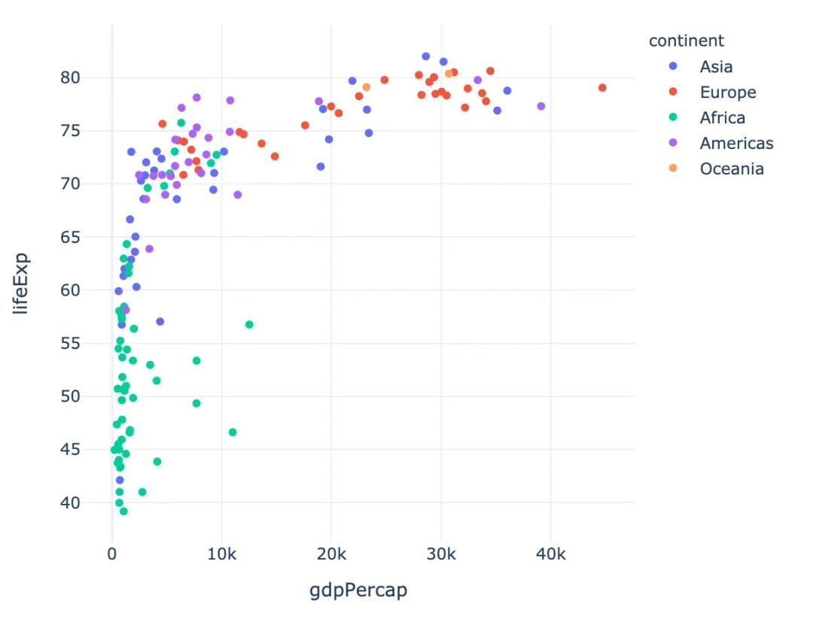

Python 可视化<br />
<a name="rOSCh"></a>
### 高级可视化神器Plotly_Express快速入门
Plotly_Express是新一代的高级可视化神器，它是plotly.py的高级封装，内置了大量实用、现代的绘图模板。<br />使用者只需要调用简单的API函数，便可快速地生成漂亮的动态可视化图表；同时其内置了很多的数据集，方便自行调用，快速模拟作图。<br />
<a name="fWy9y"></a>
### 安装
用`pip install plotly_express` 命令可以安装`plotly_express`
```bash
pip install plotly_express
```
<a name="A6lru"></a>
### 内置数据集
先导入相关库，进行查看数据集：
```python
import pandas as pd
import numpy as np
import plotly_express as px  
# 或 import plotly.express as px
```
<a name="mCMd0"></a>
#### GDP数据
记录的是不同国家历年GDP收入与人均寿命，包含的字段：

- 国家country
- 洲continent
- 年份year
- 平均寿命lifeExp
- 人口数量pop
- GDPgdpPercap
- 国家简称iso_alpha
- 国家编号iso_num


<a name="zMpb8"></a>
#### 餐厅流水数据
餐厅的订单流水数据，包含字段：

- 总账单费用bill
- 小费tip
- 顾客性别sex
- 顾客是否抽烟smoker
- 就餐日期day
- 就餐时间time
- 就餐人数size


<a name="C7iYs"></a>
#### 鸢尾花数据集
著名的鸢尾花数据集，包含字段：

- 萼片长sepal_length
- 萼片宽sepal_width
- 花瓣长petal_length
- 花瓣宽petal_width
- 花的种类species
- 种类所属编号species_id


<a name="gTTts"></a>
#### 风力数据
一份关于风力等级的数据：

- 方向direction
- 强度strength
- 频率frequency


<a name="VH9EH"></a>
#### 选举投票结果
该数据集记录的是2013年蒙特利尔市长选举投票结果，包含的主要字段：

- 区域district
- Coderre票数
- Bergeron票数
- Joly票数
- 总票数total
- 胜者winner
- 结果result
- 区编号district_id


<a name="wbvJF"></a>
#### 汽车共享可用性数据
该数据记录的是蒙特利尔一个区域中心附近的汽车共享服务的可用性，包含的字段：

- 纬度centroid_lat
- 经度centroid_lon
- 汽车小时数car_hours
- 高峰小时peak_hour


<a name="ZcDMC"></a>
#### 股票数据
内置的一份股票数据，包含字段：

- 日期date
- 6个公司名称：GOOG、AAPL、AMZN、FB、NFLX、MSFT


<a name="gMxim"></a>
### 内置颜色面板
`plotly_express`还内置了很多颜色面板，颜色任你选择，下面是各个主题下的部分截图：
<a name="zQjLl"></a>
#### 卡通片主题
```python
px.colors.carto.swatches()
```

<a name="pyRw2"></a>
#### CMOcean系列
```python
px.colors.cmocean.swatches()
```

<a name="dxfwb"></a>
#### ColorBrewer2系列
```python
px.colors.colorbrewer.swatches()
```

<a name="Ga8Lq"></a>
#### 周期性色调
适用于具有自然周期结构的连续数据
```python
px.colors.cyclical.swatches()
```

<a name="YhR9N"></a>
#### 分散色标
适用于具有自然中点的连续数据
```python
px.colors.diverging.swatches()
```

<a name="KdwTU"></a>
#### 定性色标系列
适用于没有自然顺序的数据
```python
px.colors.qualitative.swatches()
```


<a name="UoWeh"></a>
#### 顺序色标系列
渐变的颜色系列，适用于大多数连续数据
```python
px.colors.sequential.swatches()
```

<a name="IkfI9"></a>
### 作图
下面介绍使用Plotly_express绘制常见的图形，所有的图形在jupyter notebook中都是动态可视化的，本文中采用截图展示。
<a name="n7Eri"></a>
#### 柱状图
```python
# 指定选取国家：Switzerland

Switzerland  = gapminder[gapminder["country"] == "Switzerland"]
Switzerland   # 数据显示如下
```

```python
px.bar(Switzerland,  # 上面指定的数据
       x="year",  # 横坐标
       y="pop",  # 纵坐标
       color="pop")  # 颜色取值
```
具体结果如下：<br />
<a name="BgJ7D"></a>
#### 散点图
先选取绘图需要的数据：
```python
# 写法1
# gapminder_2002 = gapminder.query("year==2002")

# 写法2
gapminder_2002 = gapminder[gapminder["year"] == 2002]
gapminder_2002
```

```python
px.scatter(gapminder_2002,   # 传入的数据集
           x="gdpPercap",  # 横坐标是人均GDP
           y="lifeExp",  # 纵坐标是平均寿命
           color="continent"  # 颜色取值：根据洲的值来取
          )
```

<a name="vjK3k"></a>
#### 冒泡散点图
```python
px.scatter(gapminder_2002   # 绘图DataFrame数据集
           ,x="gdpPercap"  # 横坐标
           ,y="lifeExp"  # 纵坐标
           ,color="continent"  # 区分颜色
           ,size="pop"   # 区分圆的大小
           ,size_max=60  # 散点大小
          )
```

<a name="Igan1"></a>
#### 散点矩阵图
```python
px.scatter_matrix(iris,  # 传入绘图数据
                  dimensions=["sepal_width","sepal_length","petal_width","petal_length"],  # 维度设置
                  color="species")  # 颜色取值
```

<a name="KHTsg"></a>
#### 面积图
```python
# area 图
px.area(gapminder,   # 绘图的数据集
        x="year",   # 横轴数据
        y="pop",  # 纵轴数据
        color="continent",  # 颜色取值
        line_group="country")  # 线型分组
```

<a name="Z3JTI"></a>
#### 股票趋势图
```python
# FB公司股票趋势图
px.line(stock, x='date', y="FB")
```

<a name="ygGSk"></a>
#### 饼图
1、使用小费tips数据，查看前5行数据：<br /><br />2、根据day分组，统计total_bill字段的和<br /><br />3、绘制饼图，自动显示每个day的占比
```python
px.pie(total_bill_byday, # 绘图数据
       names="day",  # 每个组的名字
       values="total_bill"  # 组的取值
      )
```

<a name="IHs9y"></a>
#### 旭日图
```python
# 选取2002年数据
gapminder_2002 = gapminder[gapminder["year"] == 2002]

px.sunburst(gapminder_2002,   # 绘图数据
            path=['continent', 'country'],  # 指定路径：从洲到国家
            values='pop', # 数据大小：人口数
            color='lifeExp',  # 颜色
            hover_data=['iso_alpha'] # 显示数据
           )
```

<a name="hTEAG"></a>
#### 漏斗图
漏斗图形在互联网的电商、用户分群等领域使用的比较广泛，自行模拟一个电商UV-付款转化的数据绘图：
```python
data = dict(   # 创建原始数据
    number = [1000, 800, 400, 200, 100, 30],
    stage = ["UV", "搜索", "搜藏", "加购", "下单", "付款"]
)

# 传入数据和数轴
px.funnel(data, 
          x="number", 
          y="stage")
```
<br />加入一个颜色参数color，改变每个阶段的颜色：
```python
data = dict(   # 创建原始数据
    number = [1000, 800, 400, 200, 100, 30],
    stage = ["UV", "搜索", "搜藏", "加购", "下单", "付款"]
)

# 传入数据和数轴
px.funnel(data, 
          x="number", 
          y="stage",
          color="number"  # 颜色设置
         )
```

<a name="East6"></a>
#### 直方图
```python
px.histogram(
    tips,  # 绘图数据
    x="sex",  # 指定两个数轴
    y="tip",
    histfunc="avg",  # 直方图函数：均值
    color="smoker",  # 颜色取值
    barmode="group",  # 柱状图模式
    facet_row="time",  # 横纵纵轴的字段设置
    facet_col="day",
    category_orders={"day":["Thur","Fri","Sat","Sun"],  # 分类
                     "time":["Lunch","Dinner"]})
```

<a name="QWmW1"></a>
#### 联合分布图
多种图形的组合显示：
```python
px.scatter(
    iris,
    x="sepal_width",
    y="sepal_length",
    color="species",
    marginal_x="histogram",
    marginal_y="rug")
```

<a name="wlMFD"></a>
#### 箱型图
```python
# notched=True显示连接处的锥形部分
px.box(tips,  # 数据集
       x="day",  # 横轴数据
       y="total_bill",  # 纵轴数据
       color="smoker",  # 颜色
       notched=True)  # 连接处的锥形部分显示出来
```

<a name="baaCd"></a>
#### 小提琴图
```python
px.scatter(iris,  # 传入数据
           x="sepal_width",  # 设置XY轴
           y="sepal_length",
           color="species",  # 颜色取值
           marginal_y="violin",  # xy两表图形的设置：小提琴图和箱型图
           marginal_x="box",
           trendline="ols")  # 趋势线设置
```

<a name="FMy3e"></a>
#### 等高线图
```python
px.density_contour(iris,  # 数据集
                   x="sepal_width",  # xy轴
                   y="sepal_length",
                   color="species"  # 颜色取值
                  )  
```
<br />还可以绘制密度等值线图；
```python
px.density_heatmap(iris,   # 传入数据
                   x="sepal_width",  # 两个轴的数据设置
                   y="sepal_length",
                   marginal_y="rug",  # 边缘图形设置
                   marginal_x="histogram"   # 在密度图的基础上，指定另外两种图形
                  )
```

<a name="M7zhm"></a>
#### 密度热力图
数据的设置和密度等值图相同，只是选择的图形种类不同：
```python
px.density_heatmap(   # 密度热力图
  iris,  
  x="sepal_width",
  y="sepal_length",
  marginal_y="rug",
  marginal_x="histogram"   
)
```

<a name="dAXpx"></a>
#### 并行分类图
```python
px.parallel_categories(
    tips,  # 传入数据
    color="size",  # 颜色取值
    color_continuous_scale=px.colors.sequential.Inferno # 颜色变化趋势
)
```

<a name="feyfr"></a>
#### 3D散点图
使用的是选举结果数据集：
```python
px.scatter_3d(
    election,  # 传入数据集
    x="Joly",  # 指定XYZ坐标轴的数据
    y="Coderre",  
    z="Bergeron",  
    color="winner",  # 颜色取值
    size="total",   # 大小取值
    hover_name="district_id",  # 指定颜色种类、大小和显示名称
    symbol="result",  # 右边的圆形和菱形
    color_discrete_map={"Joly":"blue",
                        "Bergeron":"green",
                        "Coderre":"red"}   # 改变默认颜色
)
```

<a name="wEtDh"></a>
#### 3D线型图
```python
px.line_3d(
  election,  # 绘图数据集
  x="Joly",  # 3个坐标轴
  y="Coderre",
  z="Bergeron",
  color="winner",  # 颜色和线型设置
  line_dash="winner"
)
```

<a name="WKi3E"></a>
#### 基于地图的图形
基于choropleth分布的地图：
```python
px.choropleth(
  gapminder,  # 数据
  locations="iso_alpha",  # 简称
  color="lifeExp",  # 颜色取值
  hover_name="country",  # 悬停数据
  animation_frame="year",  # 播放按钮设置
  color_continuous_scale=px.colors.sequential.Plasma,  # 颜色变化取值
  projection="natural earth"  # 使用的地图设置
) 
```
<br />基于`line_geo`线型地图：
```python
px.line_geo(
  gapminder_2002,
  locations="iso_alpha",
  color="continent",
  projection="orthographic")
```

<a name="aZM3b"></a>
#### 矩阵式树状结构图
矩阵式树状结构图是一种用于分层数据的复杂、基于区域的数据展示图形：
```python
# 选取2002年数据
gapminder_2002 = gapminder[gapminder["year"] == 2002]

px.treemap(
    gapminder_2002, # 数据
    path=[px.Constant('world'), 'continent', 'country'],   # 绘图路径：world---continent---country
    values='pop',  # 数据取值
    color='pop',   # 颜色取值
    hover_data=['iso_alpha'])  # 显示数据：国家简称
```

<a name="fYFS0"></a>
#### 散点极坐标图
```python
px.scatter_polar(  # 散点极坐标
    wind,  #  数据集
    r="frequency",  # 半径
    theta="direction",   # 角度
    color="strength",  # 颜色
    symbol="strength",  # 符号
    color_discrete_sequence=px.colors.sequential.Plasma_r)  # 颜色
```

<a name="pL4tr"></a>
#### 线性极坐标图
```python
px.line_polar(  # 线性极坐标
    wind,  # 数据集
    r="frequency",  # 半径
    theta="direction",  # 角度
    color="strength",  # 颜色
    line_close=True,  # 线性闭合
    color_discrete_sequence=px.colors.sequential.Plasma_r)  # 颜色
```

<a name="Vd5JL"></a>
#### 柱状极坐标图
```python
px.bar_polar(   # 柱状图极坐标图
    wind,   # 数据集
    r="frequency",   # 半径
    theta="direction",  # 角度
    color="strength",  # 颜色
    template="plotly_dark",  # 主题
    color_discrete_sequence=px.colors.sequential.Plasma_r)  # 颜色
```

<a name="v92WW"></a>
### 内置主题
Plotly_Express内置了3种主题可供选择：

- `plotly`
- `plotly_white`
- `plotly_dark`
```python
px.scatter(gapminder_2002,   # 传入的数据集
           x="gdpPercap",  # 横坐标是人均GDP
           y="lifeExp",  # 纵坐标是平均寿命
           color="continent",  # 颜色取值：根据洲的值来取
           template="plotly"  # 分别主题设置为：plotly、plotly_dark
          )
```
<br /><br />
