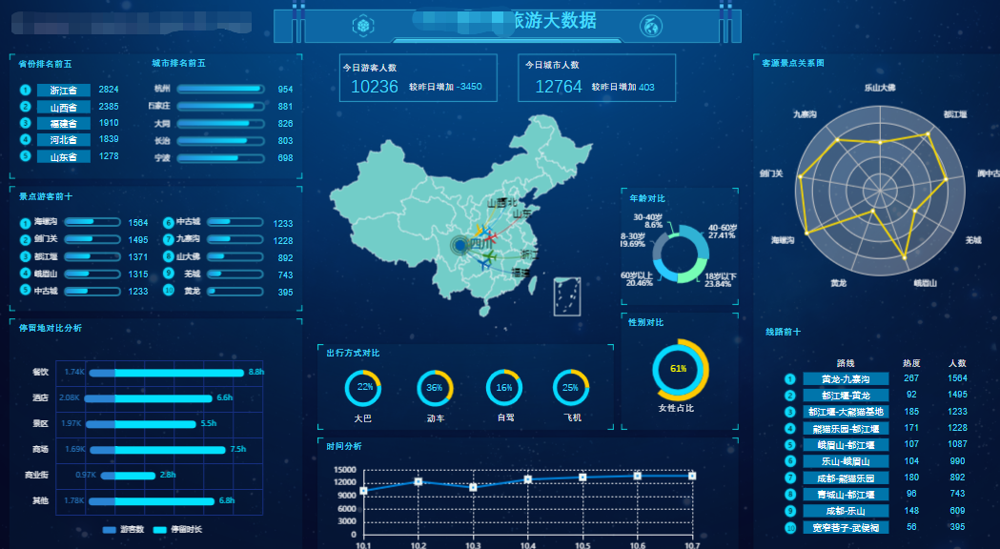
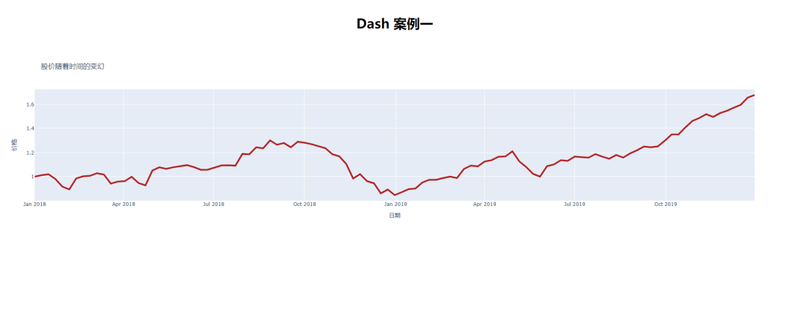
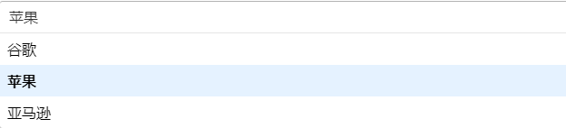
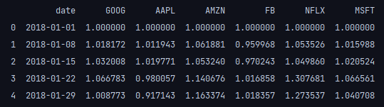
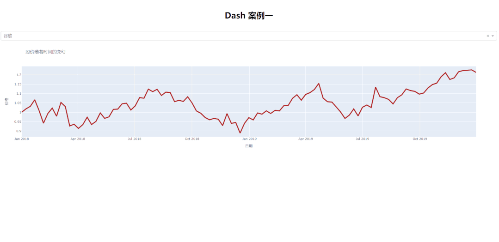

Python<br />
<a name="zFiNF"></a>
## Dash框架中的两个基本概念
先来了解一下Dash框架中的两个基本概念

- Layout
- Callbacks

Layout顾名思义就是用来设计可视化大屏的外观和布局，添加一些例如下拉框、单选框、复选框、输入框、文本框、滑动条等组件，其中Dash框架对HTML标签也进行了进一步的封装，直接可以通过Python代码来生成和设计每一个网页所需要的元素，例如
```html
<div>
  <h1>Hello World!!</h1>
  <div>
    <p>Dash converts Python classes into HTML</p>
  </div>
</div>
```
转化成Dash的Python结构就是
```python
html.Div([
    html.H1('Hello Dash'),
    html.Div([
        html.P('Dash converts Python classes into HTML'),
    ])
])
```
Callbacks也就是回调函数，基本上是以装饰器的形式来体现的，实现前后端异步通信的交互，例如在点击按钮或者下拉框之后出现的功能就是通过回调函数来实现的。
<a name="Emgex"></a>
## 安装和导入模块
在导入模块之前，先用pip命令来进行安装，
```python
!pip install dash   
!pip install dash-html-components
!pip install dash-core-components                           
!pip install plotly
```
然后导入这些刚刚安装完的模块，其中dash-html-components用来生成HTML标签，dash-core-components模块用来生成例如下拉框、输入框等组件，这里还需要用到plotly模块，因为需要用到的数据来自该模块，里面是一众互联网公司过去一段时间中股价的走势
```python
import dash
import dash_html_components as html
import dash_core_components as dcc
import plotly.graph_objects as go
import plotly.express as px
```
<a name="mlqZF"></a>
## 读取数据并且绘制折线图
那么读取数据并且用plotly来绘制折线图，代码如下
```python
app = dash.Dash()   #实例化Dash
df = px.data.stocks() #读取股票数据 

def stock_prices():
    # 绘制折线图
    fig = go.Figure([go.Scatter(x=df['date'], y=df['AAPL'],
                                line=dict(color='firebrick', width=4), name='Apple')
                     ])
    fig.update_layout(title='股价随着时间的变幻',
                      xaxis_title='日期',
                      yaxis_title='价格'
                      )
    return fig
    
app.layout = html.Div(id='parent', children=[
    html.H1(id='H1', children='Dash 案例一', style={'textAlign': 'center',
                                                 'marginTop': 40, 'marginBottom': 40}),
    dcc.Graph(id='line_plot', figure=stock_prices())
])

if __name__ == '__main__':
    app.run_server()
```
点击运行之后会按照提示将url复制到浏览器当中便可以看到出来的结果了，如下所示<br /><br />从代码的逻辑上来看，通过Dash框架中的Div方法来进行页面的布局，其中有参数id来指定网页中的元素，以及style参数来进行样式的设计，最后将绘制出来的图表放在`dcc.Graph()`函数当中。
<a name="yvhSd"></a>
## 添置一个下拉框
然后再添置一个下拉框，当点击这个下拉框的时候，可是根据选择展示不同公司的股价，代码如下
```python
dcc.Dropdown(id='dropdown',
             options=[
                 {'label': '谷歌', 'value': 'GOOG'},
                 {'label': '苹果', 'value': 'AAPL'},
                 {'label': '亚马逊', 'value': 'AMZN'},
             ],
             value='GOOG'),
```
output<br /><br />`options`参数中的label对应的是下拉框中的各个标签，而`value`对应的是DataFrame当中的列名
```python
df.head()
```
output<br />
<a name="Avwhc"></a>
## 添加回调函数
最后将下拉框和绘制折线图的函数给连接起来，点击下拉框选中不同的选项的时候，折线图也会相应的产生变化，
```python
@app.callback(Output(component_id='bar_plot', component_property='figure'),
              [Input(component_id='dropdown', component_property='value')])
def graph_update(dropdown_value):
    print(dropdown_value)
    # Function for creating line chart showing Google stock prices over time
    fig = go.Figure([go.Scatter(x=df['date'], y=df['{}'.format(dropdown_value)],
                                line=dict(color='firebrick', width=4))
                     ])
    fig.update_layout(title='股价随着时间的变幻',
                      xaxis_title='日期',
                      yaxis_title='价格'
                      )
    return fig
```
可以看到`callback()`方法中指定输入和输出的媒介，其中Input参数，里面的component_id对应的是下拉框的id也就是`dropdown`，而Output参数，当中的component_id对应的是折线图的id也就是bar_plot，来看一下最后出来的结果如下<br /><br />最后，全部的代码如下所示
```python
import dash
import dash_html_components as html
import dash_core_components as dcc
import plotly.graph_objects as go
import plotly.express as px
from dash.dependencies import Input, Output

app = dash.Dash()  
df = px.data.stocks()  

app.layout = html.Div(id='parent', children=[
    html.H1(id='H1', children='Dash 案例一', style={'textAlign': 'center',
                                                 'marginTop': 40, 'marginBottom': 40}),
    dcc.Dropdown(id='dropdown',
                 options=[
                     {'label': '谷歌', 'value': 'GOOG'},
                     {'label': '苹果', 'value': 'AAPL'},
                     {'label': '亚马逊', 'value': 'AMZN'},
                 ],
                 value='GOOG'),
    dcc.Graph(id='bar_plot'),
])

@app.callback(Output(component_id='bar_plot', component_property='figure'),
              [Input(component_id='dropdown', component_property='value')])
def graph_update(dropdown_value):
    print(dropdown_value)
    fig = go.Figure([go.Scatter(x=df['date'], y=df['{}'.format(dropdown_value)],
                                line=dict(color='firebrick', width=4))
                    ])
    fig.update_layout(title='股价随着时间的变幻',
                      xaxis_title='日期',
                      yaxis_title='价格'
                     )
    return fig

if __name__ == '__main__':
    app.run_server()
```
