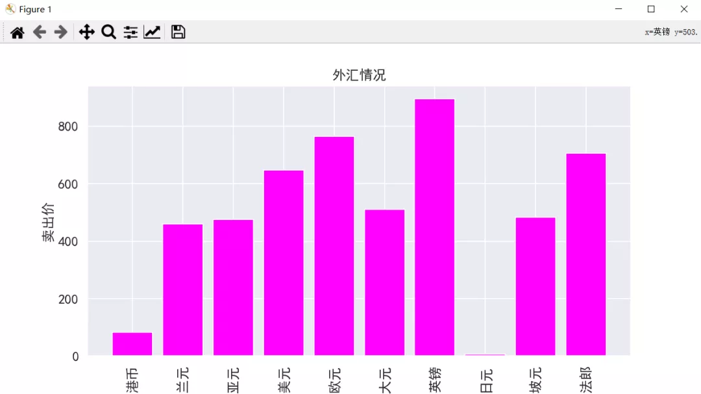
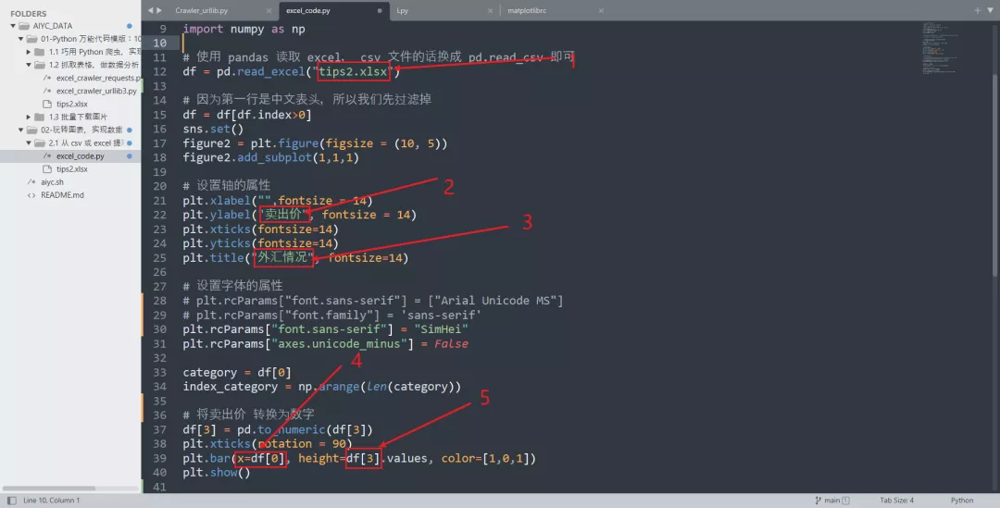
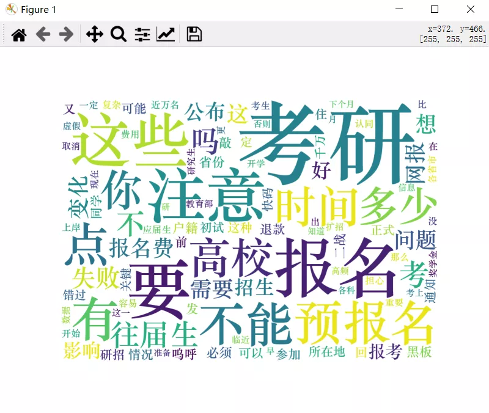
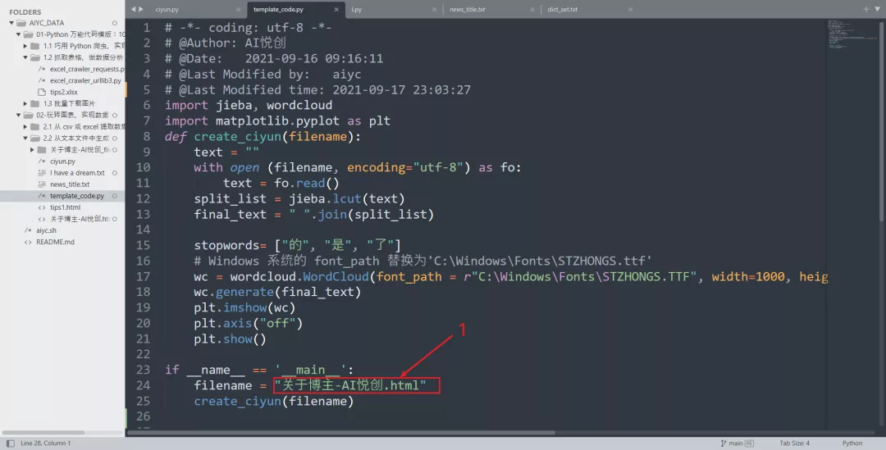

Python 
<a name="H33T7"></a>
## 1、从 csv 或 excel 提取数据来画图
需要先安装 pandas 、matplotlib、seaborn
```bash
pip install pandas matplotlib seaborn
```
以刚才创建的 tips_2.xlsx 这个 excel 为例，来介绍如何把 Excel 表格中的数据画成图。<br />这次将 excel 中的卖出价一列，生成柱状图。<br />代码如下所示：
```python
# -*- coding: utf-8 -*-

import pandas as pd
import matplotlib.pyplot as plt
import seaborn as sns
import numpy as np

# 使用 pandas 读取 excel， csv 文件的话换成 pd.read_csv 即可
df = pd.read_excel("tips2.xlsx")

# 因为第一行是中文表头，所以我们先过滤掉
df = df[df.index>0]
sns.set()
figure2 = plt.figure(figsize = (10, 5))
figure2.add_subplot(1,1,1)

# 设置轴的属性
plt.xlabel("",fontsize = 14)
plt.ylabel("卖出价", fontsize = 14)
plt.xticks(fontsize=14)
plt.yticks(fontsize=14)
plt.title("外汇情况", fontsize=14)

# 设置字体的属性
# plt.rcParams["font.sans-serif"] = ["Arial Unicode MS"]
# plt.rcParams["font.family"] = 'sans-serif'
plt.rcParams["font.sans-serif"] = "SimHei"
plt.rcParams["axes.unicode_minus"] = False

category = df[0]
index_category = np.arange(len(category))

# 将卖出价 转换为数字
df[3] = pd.to_numeric(df[3])
plt.xticks(rotation = 90)
plt.bar(x=df[0], height=df[3].values, color=[1,0,1])
plt.show()
```
输出如下所示：<br /><br />替换说明：<br />

1. 替换要画图的 excel 文件夹名称
2. Y 轴的标题
3. 图的标题
4. 横轴的数据（第几列做横轴）
5. 纵轴的数据（第几列做纵轴）
<a name="qini6"></a>
## 2、从文本文件中生成词云
需要先安装 wordcloud，jieba
```bash
pip install wordcloud jieba
```
词云是最近数据分析报告中非常常见的数据表现形式了，它会从一段文字中抽取出高频的词汇并且以图片的形式将它们展示出来。<br />如何用 Python 生成词云呢？<br />为了做示范，首先解析第一步抓取的 tips_1.html 网页（考研网），将所有的新闻标题都存储到一个文本文档中。<br />代码如下：
```python
# -*- coding: utf-8 -*-

from bs4 import BeautifulSoup

# 输入参数为要分析的 html 文件名，返回值为对应的 BeautifulSoup 对象
def create_doc_from_filename(filename):
	with open(filename, "r", encoding='utf-8')as f:
		html_content = f.read()
	doc = BeautifulSoup(html_content, "lxml")
	return doc


def parse(doc):
	post_list = doc.find_all("div",class_="post-info")
	result = []
	for post in post_list:
		link = post.find_all("a")[1]
		result.append(link.text.strip())

	result_str="\n".join(result)
	with open("news_title.txt", "w", encoding='utf-8') as fo:
		fo.write(result_str)

def main():
	filename = "tips1.html"
	doc = create_doc_from_filename(filename)
	parse(doc)
	
if __name__ == '__main__':
	main()
```
接下来将 news_title.txt 这个文本文件中的汉字进行分词，并生成词云。代码如下：
```python
import jieba
import wordcloud
import matplotlib.pyplot as plt

def create_ciyun():
	text = ""
	with open ("news_title.txt", encoding="utf-8") as fo:
		text = fo.read()
	split_list = jieba.lcut(text)
	final_text = " ".join(split_list)

	stopwords= ["的", "是", "了"]
	# Windows 系统的 font_path 替换为'C:\Windows\Fonts\STZHONGS.ttf'
	wc = wordcloud.WordCloud(font_path = r"C:\Windows\Fonts\STZHONGS.TTF", width=1000, height=700, background_color="white",max_words=100,stopwords = stopwords)
	wc.generate(final_text)
	plt.imshow(wc)
	plt.axis("off")
	plt.show()

然后，在 main 函数中调用：
def main():
	filename = "tips1.html"
	doc = create_doc_from_filename(filename)
	parse(doc)
	create_ciyun()
```
为了方便阅读，这里我也把整合好的代码放出来：
```python
# -*- coding: utf-8 -*-

import jieba
import wordcloud
import matplotlib.pyplot as plt
from bs4 import BeautifulSoup

# 输入参数为要分析的 html 文件名，返回值为对应的 BeautifulSoup 对象
def create_doc_from_filename(filename):
	with open(filename, "r", encoding='utf-8')as f:
		html_content = f.read()
	doc = BeautifulSoup(html_content, "lxml")
	return doc


def parse(doc):
	post_list = doc.find_all("div",class_="post-info")
	result = []
	for post in post_list:
		link = post.find_all("a")[1]
		result.append(link.text.strip())

	result_str="\n".join(result)
	with open("news_title.txt", "w", encoding='utf-8') as fo:
		fo.write(result_str)


def create_ciyun():
	text = ""
	with open ("news_title.txt", encoding="utf-8") as fo:
		text = fo.read()
	split_list = jieba.lcut(text)
	final_text = " ".join(split_list)

	stopwords= ["的", "是", "了"]
	# Windows 系统的 font_path 替换为'C:\Windows\Fonts\STZHONGS.ttf'
	wc = wordcloud.WordCloud(font_path = r"C:\Windows\Fonts\STZHONGS.TTF", width=1000, height=700, background_color="white",max_words=100,stopwords = stopwords)
	wc.generate(final_text)
	plt.imshow(wc)
	plt.axis("off")
	plt.show()

def main():
	filename = "tips1.html"
	doc = create_doc_from_filename(filename)
	parse(doc)
	create_ciyun()

if __name__ == '__main__':
	main()
```
输出结果如下：<br />如果想生成自己的词云，首先需要想清楚数据来源，一般是一个网页或者一个文本文件。

- 如果是网页的话可以首先保存到本地，提取文本，之后就可以进行代码替换来生成了。（对于网页文件，需要自行提取文本咯，实在不会就把网页的文件的内容，复制出来。保存成 .txt 格式文件。
- 如果是文本，直接复制在 text，再执行下文即可。）

代码模板，实际是下面这个模板：
```python
def create_ciyun():
	text = ""
	with open ("news_title.txt", encoding="utf-8") as fo:
		text = fo.read()
	split_list = jieba.lcut(text)
	final_text = " ".join(split_list)

	stopwords= ["的", "是", "了"]
	# Windows 系统的 font_path 替换为'C:\Windows\Fonts\STZHONGS.ttf'
	wc = wordcloud.WordCloud(font_path = r"C:\Windows\Fonts\STZHONGS.TTF", width=1000, height=700, background_color="white",max_words=100,stopwords = stopwords)
	wc.generate(final_text)
	plt.imshow(wc)
	plt.axis("off")
	plt.show()
```
替换说明：<br />

1. 替换准备的网页或者文本文件的文件名。
