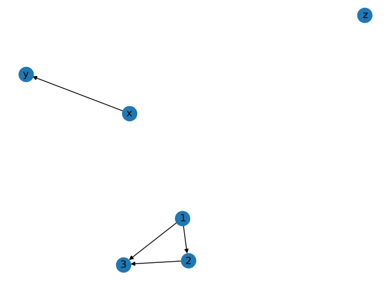
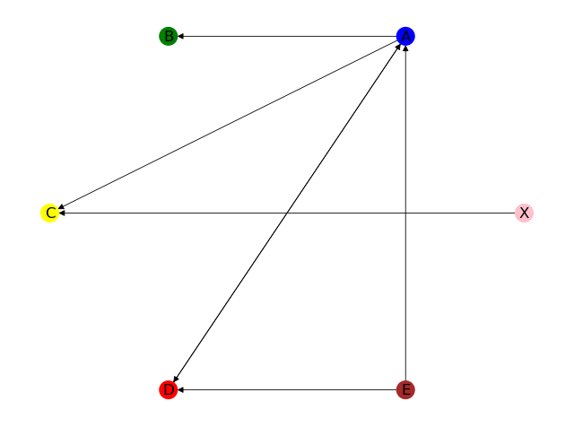
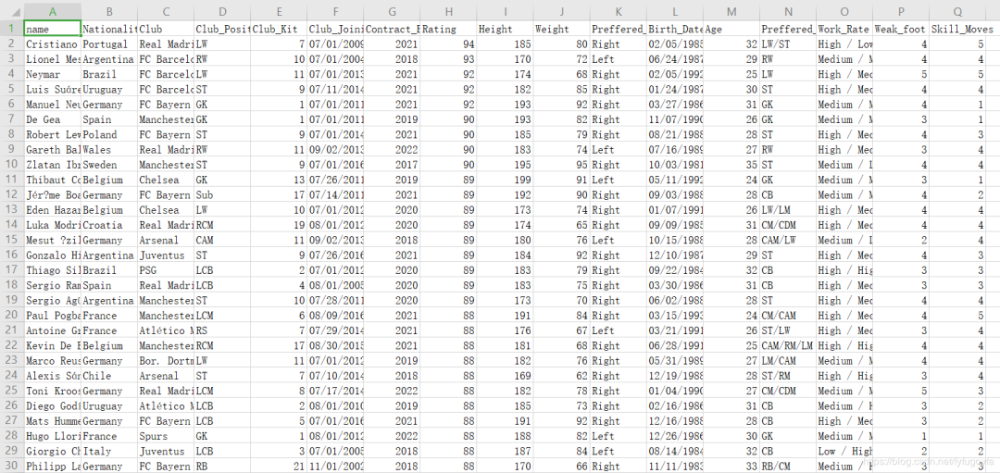
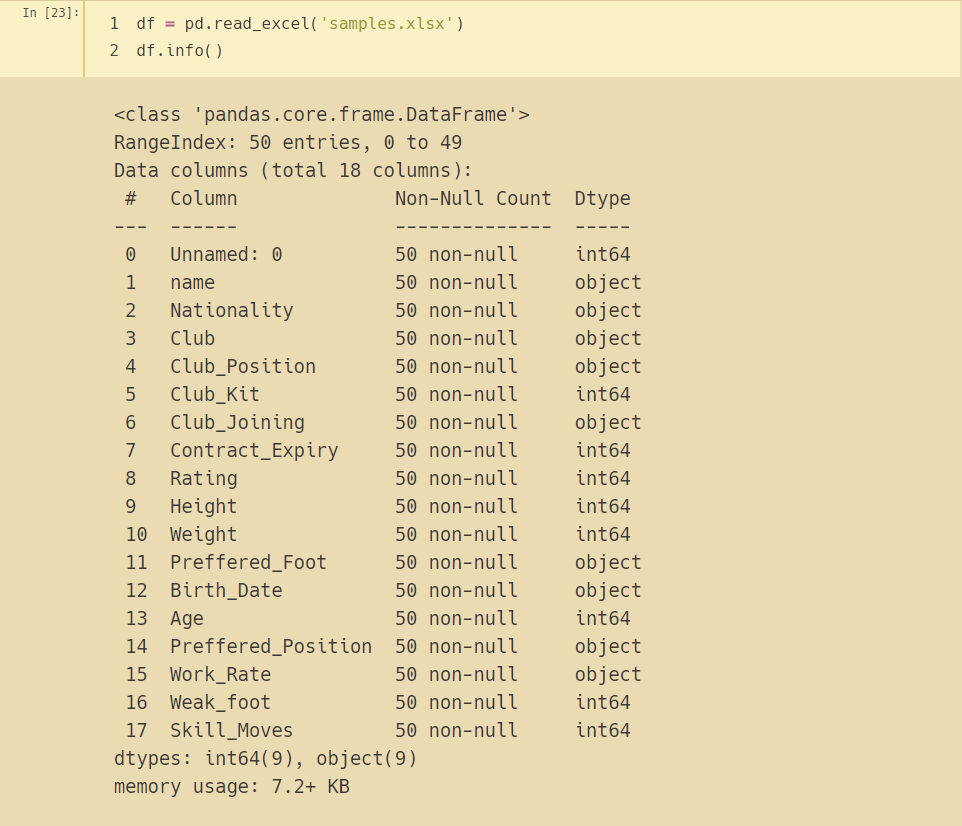
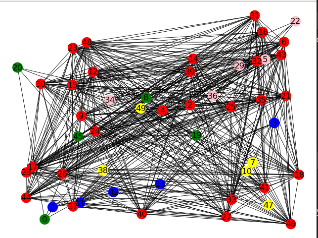
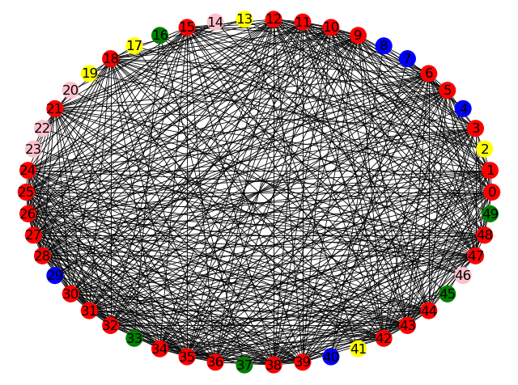

Python<br />在做数据可视化时，要展现多个元素之间的相互关系时（比如人物关系图），常会用到网络图。<br />分享一个在 Python 里绘制网络图的库：NetworkX，并显示它的基本操作。
<a name="fbroC"></a>
## 一、NetworkX 概述
NetworkX 是一个用 Python 语言开发的图论与复杂网络建模工具，内置了常用的图与复杂网络分析算法，可以方便的进行复杂网络数据分析、仿真建模等工作。<br />NetworkX 支持创建简单无向图、有向图和多重图；内置许多标准的图论算法，节点可为任意数据；支持任意的边值维度，功能丰富。主要用于创造、操作复杂网络，以及学习复杂网络的结构、动力学及其功能。用于分析网络结构，建立网络模型，设计新的网络算法，绘制网络等等。
<a name="Frj8g"></a>
## 二、NetworkX 的安装
```bash
pip install networkx -i http://pypi.douban.com/simple --trusted-host pypi.douban.com
```
<a name="yWSbX"></a>
## 三、NetworkX 基础知识
<a name="N3rMX"></a>
### 1. 创建图
可以利用 networkx 创建四种图：Graph 、DiGraph、MultiGraph、MultiDiGraph，分别为无多重边无向图、无多重边有向图、有多重边无向图、有多重边有向图。
```python
import network as nx
G = nx.Graph()
G = nx.DiGraph()
G = nx.MultiGraph()
G = nx.MultiDiGraph()
```
<a name="hN8TN"></a>
### 2. 网络图的加点和加边
```python
import networkx as nx
import matplotlib.pyplot as plt

G = nx.DiGraph()
G.add_node('z')     # 添加节点z
G.add_nodes_from([1, 2, 3])   # 添加节点 1 2 3
G.add_edge('x', 'y')          # 添加边  起点为x  终点为y
G.add_edges_from([(1, 2), (1, 3), (2, 3)])   # 添加多条边

# 网络图绘制与显示
nx.draw(G, with_labels=True)
plt.show()
```
运行效果如下：<br /><br />为了让网络图更美观可以调节 `nx.draw()` 方法里的参数
```python
nx.draw(G, pos=nx.random_layout(G), node_color = 'b', edge_color = 'r', with_labels = True, font_size =18, node_size =20)
```

- `G`：待绘制的网络图G
- `node_size`：指定节点的尺寸大小(默认是300)
- `node_color`: 指定节点的颜色 (可以用字符串简单标识颜色，例如'r'为红色，'g'为绿色这样)
- `node_shape`: 节点的形状（默认是圆形，用字符串'o'标识）
- `alpha`: 透明度 (默认是1.0，不透明，0为完全透明)
- `width`: 边的宽度 (默认为1.0)
- `edge_color`: 边的颜色(默认为黑色)
- `style`: 边的样式(默认为实现，可选：solid | dashed | dotted | dashdot
- `with_labels`：节点是否带标签
- `font_size`: 节点标签字体大小
- `font_color`: 节点标签字体颜色（默认为黑色）
<a name="v4I40"></a>
### 3. 运用布局
`circular_layout`：节点在一个圆环上均匀分布 <br />`random_layout`：节点随机分布 <br />`shell_layout`：节点在同心圆上分布 <br />`spring_layout`：用 Fruchterman-Reingold 算法排列节点（样子类似多中心放射状） <br />`spectral_layout`：根据图的拉普拉斯特征向量排列节点<br />绘制网络图实例如下：
```python
import networkx as nx
import matplotlib.pyplot as plt

# 初始化一个有向图对象
DG = nx.DiGraph()
DG.add_node('X')
# 添加节点   传入列表
DG.add_nodes_from(['A', 'B', 'C', 'D', 'E'])
print(f'输出图的全部节点：{DG.nodes}')
print(f'输出节点的数量：{DG.number_of_nodes()}')
# 添加边  传入列表  列表里每个元素是一个元组  元组里表示一个点指向另一个点的边
DG.add_edges_from([('A', 'B'), ('A', 'C'), ('A', 'D'), ('D', 'A'), ('E', 'A'), ('E', 'D')])
DG.add_edge('X', 'C')
print(f'输出图的全部边:{DG.edges}')
print(f'输出边的数量：{DG.number_of_edges()}')
# 可自定义节点颜色
colors = ['pink', 'blue', 'green', 'yellow', 'red', 'brown']
# 运用布局
pos = nx.circular_layout(DG)
# 绘制网络图
nx.draw(DG, pos=pos, with_labels=True, node_size=200, width=0.6, node_color=colors)
# 展示图片
plt.show()
```
运行效果如下：
```python
输出图的全部节点：['X', 'A', 'B', 'C', 'D', 'E']
输出节点的数量：6
输出图的全部边:[('X', 'C'), ('A', 'B'), ('A', 'C'), ('A', 'D'), ('D', 'A'), ('E', 'A'), ('E', 'D')]
输出边的数量：7
```

<a name="vs7aP"></a>
## 四、利用 NetworkX 实现关联类分析
[soccer.csv](https://www.yuque.com/attachments/yuque/0/2021/xls/396745/1621491169129-76f4ec39-28c4-4f7c-b0ec-3ca0c244793e.xls?_lake_card=%7B%22src%22%3A%22https%3A%2F%2Fwww.yuque.com%2Fattachments%2Fyuque%2F0%2F2021%2Fxls%2F396745%2F1621491169129-76f4ec39-28c4-4f7c-b0ec-3ca0c244793e.xls%22%2C%22name%22%3A%22soccer.csv%22%2C%22size%22%3A1965599%2C%22type%22%3A%22application%2Fvnd.ms-excel%22%2C%22ext%22%3A%22xls%22%2C%22status%22%3A%22done%22%2C%22taskId%22%3A%22u550bf9f5-f881-440a-ba51-d2bd8a76fe1%22%2C%22taskType%22%3A%22upload%22%2C%22id%22%3A%22u907e8460%22%2C%22card%22%3A%22file%22%7D)<br />利用 soccer.csv 中的数据，使用 Python 的 NetworkX 包按要求进行绘图。<br />
<a name="lnKqV"></a>
### 1. 提取数据
统计不同俱乐部（Club）的球员数量，从球员最多的五个俱乐部抽取 50 名球员信息(球员数量最多的俱乐部抽取 30 名，剩下 4 个俱乐部各抽取 5 名)构成新的 DataFrame，打印其 `info()`。
```python
import pandas as pd

df = pd.read_csv('soccer.csv', encoding='gbk')
data = df['Club'].value_counts()
# 球员人数最多的5个俱乐部
clubs = list(data.index[:5])

# 球员数量最多的俱乐部抽取30名
df1 = df[df['Club'] == clubs[0]].sample(30, axis=0)
# 剩下4个俱乐部各抽取5名
df2 = df[df['Club'] == clubs[1]].sample(5, axis=0)
df3 = df[df['Club'] == clubs[2]].sample(5, axis=0)
df4 = df[df['Club'] == clubs[3]].sample(5, axis=0)
df5 = df[df['Club'] == clubs[4]].sample(5, axis=0)

# 合并多个DataFrame
result = pd.concat([df1, df2, df3, df4, df5], axis=0, ignore_index=True)
# 打乱DataFrame顺序
new_result = result.sample(frac=1).reset_index(drop=True)
# new_result.info()
# 抽样的数据保存到excel
new_result.to_excel('samples.xlsx')
```
[samples.xlsx](https://www.yuque.com/attachments/yuque/0/2021/xlsx/396745/1621491196257-14cb554f-b56b-455d-af12-5a47b300b55a.xlsx?_lake_card=%7B%22src%22%3A%22https%3A%2F%2Fwww.yuque.com%2Fattachments%2Fyuque%2F0%2F2021%2Fxlsx%2F396745%2F1621491196257-14cb554f-b56b-455d-af12-5a47b300b55a.xlsx%22%2C%22name%22%3A%22samples.xlsx%22%2C%22size%22%3A10954%2C%22type%22%3A%22application%2Fvnd.openxmlformats-officedocument.spreadsheetml.sheet%22%2C%22ext%22%3A%22xlsx%22%2C%22status%22%3A%22done%22%2C%22taskId%22%3A%22u91694a06-7b6f-40b9-88b5-26fe796b923%22%2C%22taskType%22%3A%22upload%22%2C%22id%22%3A%22u967f6eb5%22%2C%22card%22%3A%22file%22%7D)<br />Jupyter Notebook 环境中读取 samples.xlsx，打印其 `info()`，结果如下：


```python
import pandas as pd
df = pd.read_excel('samples.xlsx')
df.info()
```

<a name="hJrfd"></a>
### 2. 画网络图
在提取出的数据的基础上，通过判断球员是否属于同一俱乐部，绘出随机分布网络图、Fruchterman-Reingold 算法排列节点网络图与同心圆分布网络图。尽可能让网络图美观，如为属于同一俱乐部的节点设置相同的颜色。<br />将每个球员当作网络图中一个节点，计算节点之间的连通关系，同属一个俱乐部则连通。
```python
import pandas as pd

df = pd.read_excel('samples.xlsx')
df = df.loc[::, ['Name', 'Club']]
print(df['Club'].value_counts())
datas = df.values.tolist()
name = [datas[i][0] for i in range(len(datas))]
nodes = [str(i) for i in range(len(datas))]
club = [datas[i][1] for i in range(len(datas))]
# print(nodes)
df = pd.DataFrame({'姓名': name, '节点编号': nodes, '所属俱乐部': club})
df.to_csv('nodes_info.csv')
with open('record.txt', 'w') as f:
    for i in range(len(nodes)):
    for j in range(i, len(nodes) - 1):
        if datas[i][1] == datas[j+1][1]:      # 属于同一俱乐部
            f.write(f'{nodes[i]}-{nodes[j + 1]}-{datas[i][1]}'+ '\n')
```
<a name="jHEgi"></a>
#### (1) 随机分布网络图
```python
import networkx as nx
import matplotlib.pyplot as plt
import pandas as pd
from collections importCounter

df = pd.read_csv('nodes_info.csv')['所属俱乐部']
items = df.values
print(Counter(items))
node_colors = []
# 5个俱乐部   属于同一个俱乐部的节点设置相同颜色
for item in items:
    if item == 'Free Agents':
            node_colors.append('red')
    elif item == 'Real Madrid':
            node_colors.append('yellow')
    elif item == 'Chelsea':
            node_colors.append('blue')
    elif item == 'FC Barcelona':
            node_colors.append('green')
    elif item == 'Manchester Utd':
            node_colors.append('pink')


DG = nx.MultiGraph()
DG.add_nodes_from([str(i) for i in range(0, 50)])
DG.nodes()

with open('record.txt', 'r') as f:
    con = f.read().split('\n')

edges_list = []
for i in con[:-1]:
    edges_list.append(tuple(i.split('-')[:2]))

print(edges_list)
DG.add_edges_from(edges_list)

# 运用布局
pos = nx.random_layout(DG)      # 节点随机分布
# 绘制网络图
nx.draw(DG, pos, with_labels=True, node_size=200, width=0.6, node_color=node_colors)
# 显示图片
plt.show()
```
运行效果如下：<br />
<a name="eeY5M"></a>
#### (2) Fruchterman-Reingold 算法排列节点网络图
```python
import networkx as nx
import matplotlib.pyplot as plt
import pandas as pd
from collections importCounter

df = pd.read_csv('nodes_info.csv')['所属俱乐部']
items = df.values
print(Counter(items))
node_colors = []
# 5个俱乐部   属于同一个俱乐部的节点设置相同颜色
for item in items:
    if item == 'Free Agents':
            node_colors.append('red')
    elif item == 'Real Madrid':
            node_colors.append('yellow')
    elif item == 'Chelsea':
            node_colors.append('blue')
    elif item == 'FC Barcelona':
            node_colors.append('green')
    elif item == 'Manchester Utd':
            node_colors.append('pink')

DG = nx.MultiGraph()
DG.add_nodes_from([str(i) for i in range(0, 50)])
DG.nodes()

with open('record.txt', 'r') as f:
    con = f.read().split('\n')

edges_list = []
for i in con[:-1]:
    edges_list.append(tuple(i.split('-')[:2]))

print(edges_list)
DG.add_edges_from(edges_list)

# 运用布局
pos = nx.spring_layout(DG)      # 用Fruchterman-Reingold算法排列节点（样子类似多中心放射状）
# 绘制网络图
nx.draw(DG, pos, node_size=10, width=0.6, node_color=node_colors)
# 显示图片
plt.show()
```
运行效果如下：<br />
<a name="zdIoy"></a>
#### (3) 同心圆分布网络图
```python
import networkx as nx
import matplotlib.pyplot as plt
import pandas as pd
from collections import Counter

df = pd.read_csv('nodes_info.csv')['所属俱乐部']
items = df.values
print(Counter(items))
node_colors = []
# 5个俱乐部   属于同一个俱乐部的节点设置相同颜色
for item in items:
    if item == 'Free Agents':
        node_colors.append('red')
    elif item == 'Real Madrid':
        node_colors.append('yellow')
    elif item == 'Chelsea':
        node_colors.append('blue')
    elif item == 'FC Barcelona':
        node_colors.append('green')
    elif item == 'Manchester Utd':
        node_colors.append('pink')


DG = nx.MultiGraph()
DG.add_nodes_from([str(i) for i in range(0, 50)])
DG.nodes()

with open('record.txt', 'r') as f:
    con = f.read().split('\n')

edges_list = []
for i in con[:-1]:
    edges_list.append(tuple(i.split('-')[:2]))

print(edges_list)
DG.add_edges_from(edges_list)

# 运用布局
pos = nx.shell_layout(DG)         # 节点在同心圆上分布
# 绘制网络图
nx.draw(DG, pos, with_labels=True, node_size=200, width=0.6, node_color=node_colors)
# 显示图片
plt.show()
```
运行效果如下：<br /><br />以上就是利用 NetworkX 绘制关系网络图的常用方法。
