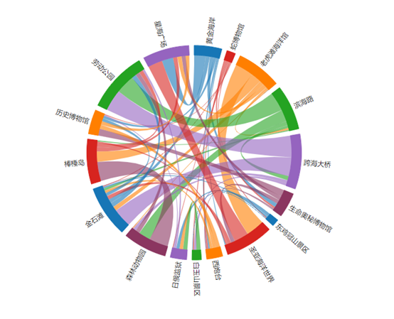
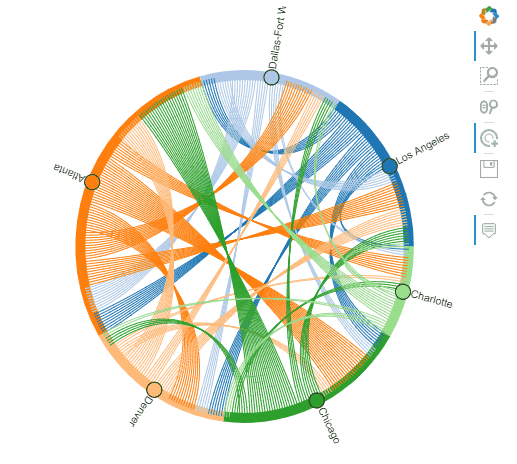
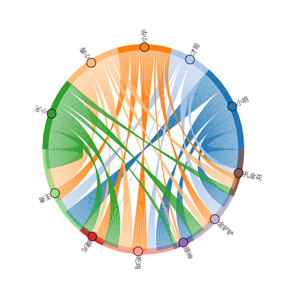

Python 可视化
<a name="CKiTX"></a>
## 1、什么是弦图
下面这张图就是弦图，主要用于展示多个对象之间的关系，连接在圆上任意两点之间的线段叫做弦。<br /><br />来源：网络<br />对于弦图，有以下特点：

- 用不同颜色区分不同的对象（点）
- 圆上的两点之间的弦表示之间存在关系
- 弦的宽度表示关系程度，关系越明显则弦宽越宽
- 因为不同对象颜色不同，可以通过两点之间弦的颜色区分是对象->对象的方向

一般来说，弦图可以用于以下几种场景：

- 人口迁徙（不同城市之间迁入迁出）
- 电竞战队或球队之间选手交易
- 具有重叠成分的不同成品与各成分关系
- 类似以上几类场景的情况等等

绘制弦图要用到的可视化库是holoviews
<a name="Ildsx"></a>
## 2、弦图绘制
HoloViews是一个开源的Python库，可以用非常少的代码行中完成数据分析和可视化，除了默认的matplotlib后端外，还添加了一个Bokeh后端。Bokeh提供了一个强大的平台，通过结合Bokeh提供的交互式小部件，可以使用HTML5 canvas和WebGL快速生成交互性和高维可视化，非常适合于数据的交互式探索。官网：[http://holoviews.org/](http://holoviews.org/)<br />首先，需要安装第三方库holoviews
```bash
pip install holoviews
```
先看看官方案例
```python
import holoviews as hv
from holoviews import opts, dim
from bokeh.sampledata.airport_routes import routes, airports

# 选择bokeh引擎
hv.extension('bokeh')

# Count the routes between Airports
route_counts = routes.groupby(['SourceID', 'DestinationID']).Stops.count().reset_index()
nodes = hv.Dataset(airports, 'AirportID','City')
chord = hv.Chord((route_counts, nodes), ['SourceID', 'DestinationID'], ['Stops'])

# Select the 6 busiest airports
busiest = list(routes.groupby('SourceID').count().sort_values('Stops').iloc[-6:].index.values)
busiest_airports = chord.select(AirportID=busiest, selection_mode='nodes')

busiest_airports.opts(
    opts.Chord(cmap='Category20', edge_color=dim('SourceID').str(), 
               height=500,
               labels='City', 
               node_color=dim('AirportID').str(), width=500))
```
<br />弦图<br />拿玩家在不同游戏中的付费金额来绘制弦图，演示每一个步骤
<a name="JxYla"></a>
### 2.1 数据准备
用以下数据进行案例演示
```python
import pandas as pd

df = pd.read_clipboard()
df
```
| 姓名 | 王者 | 曙光 | 吃鸡 | 原神 | 金铲铲 | 扎金花 |
| --- | --- | --- | --- | --- | --- | --- |
| 小明 | 20 | 0 | 15 | 10 | 12 | 17 |
| 才哥 | 11 | 1 | 8 | 0 | 11 | 5 |
| 小华 | 10 | 9 | 14 | 2 | 8 | 4 |
| 小青 | 18 | 4 | 12 | 3 | 6 | 8 |
| 小天 | 17 | 9 | 13 | 4 | 12 | 6 |

需要将宽表变为窄表（如果你就是窄表，则不需要这么操作）
```python
data = df.melt(id_vars=['姓名'], 
               value_vars=['王者', '曙光', '吃鸡', '原神', '金铲铲', '扎金花']
              )
data.head()
```
| 

 | 姓名 | variable | value |
| --- | --- | --- | --- |
| 0 | 小明 | 王者 | 20 |
| 1 | 才哥 | 王者 | 11 |
| 2 | 小华 | 王者 | 10 |
| 3 | 小青 | 王者 | 18 |
| 4 | 小天 | 王者 | 17 |

用于绘制弦的数据已经有了：

- 弦的方向就是姓名->variable
- 弦的宽度就是value

接下来，搞定 圆上的对象（点）
```python
node = pd.DataFrame(data['姓名'].append(data['variable']).unique(),
                    columns=['节点']
                   )
node
```
| <br /> | 节点 |
| --- | --- |
| 0 | 小明 |
| 1 | 才哥 |
| 2 | 小华 |
| 3 | 小青 |
| 4 | 小天 |
| 5 | 王者 |
| 6 | 曙光 |
| 7 | 吃鸡 |
| 8 | 原神 |
| 9 | 金铲铲 |
| 10 | 扎金花 |

最终，对象节点数据如下：
```python
nodes = hv.Dataset(node, '节点',)
```
搞定这些，就可以进行绘制了
<a name="l9XSU"></a>
### 2.2 绘制操作
```python
chord = hv.Chord((route_counts, nodes), 
                 ['姓名', 'variable'], ['value'])

# 可选择节点数
busiest = node['节点'].to_list()
busiest_airports = chord.select(AirportID=busiest, selection_mode='nodes')

busiest_airports.opts(
    opts.Chord(cmap='Tab20', edge_color=dim('姓名').str(), 
               height=500,
               width=500,
               labels='节点',
               node_color='节点',
               edge_visible=True
              ))
```
最终，得到效果如下：<br /><br />弦图案例<br />这个弦图是可以交互的，可以save本地html文件。
```python
hv.save(busiest_airports,r'output.html')
```
<br />保存本地<br />其实，弦图绘制还有很多参数，可以自己help试试（比如背景颜色、字体大小、弦的颜色cmap等等）
