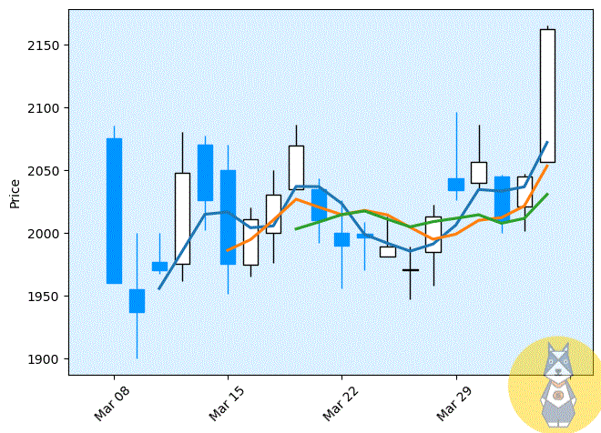

Python K线图
<a name="nv1M5"></a>
## 获取股票交易数据
巧妇难为无米之炊，做可视化也离不开数据。<br />这里以酱香型科技——贵州茅台为例，获取它的近期股票数据并绘制K线图。<br /><br />如果要特意去动手去写爬虫，就显得有些多余了，因为Python的第三库里已经有现成的工具，比如tushare 、akshare等等金融数据接口。这里用akshare来试一试。<br />如果没安装先在命令行里安装好：
```bash
pip install akshare
```
运行以下语句，即可得到贵州茅台(600519)的历史数据：
```python
import akshare as ak
df = ak.stock_zh_a_daily(symbol="sh600519", adjust="qfq")
df.tail()
```
<br />这样就获取到了所需的数据。
:::warning
注：`ak.stock_zh_a_daily()`函数，单次返回指定 A 股上市公司指定日期间的历史行情日频率数据。其中参数`adjust="qfq"`，返回前复权后的数据。
:::
为了方便后面可视化，还需要使用索引选择固定的行列。
```python
df = df.iloc[-20:,0:5]
```
这样就只筛选了开盘价、最高价、最低价、收盘价以及交易量的近期数据，下面开始用python制作高颜值的K线图。
<a name="LRoAh"></a>
## 绘制K线图
K线图，又称蜡烛图。<br />通常包含四个数据，即开盘价、最高价、最低价、收盘价，所有的k线都是围绕这四个数据展开，从而反映大势的状况和价格信息。如果把每日的K线图放在一张纸上，就能得到日K线图，同样也可画出周K线图、月K线图。一般它长这样👇<br /><br />目前制作K线图时通常都是以pyecharts为主。这里推荐一个更方便的库——`mplfinance`<br />[https://github.com/matplotlib/mplfinance](https://github.com/matplotlib/mplfinance)<br />它原本是是Matplotlib的子模块，现被剥离成为一个独立的库。<br />导入库后，只需一行代码就可以生成K线图！
```python
import mplfinance as mpf

mpf.plot(data=df)
```
<br />这跟平常看到的K线图相差有点大。再改一点点参数。
```python
mpf.plot(
    data=df,
    type='candle',
    mav=(3, 6, 9), 
    volume=True,
    show_nontrading=True
    )
```

<a name="dsWqm"></a>
## 参数说明
matplotlib库绘制K线图的主要参数如下所示：<br />`mpf.plot(data, type, title, ylabel, style, volume, ylabel_lower, show_nontrading, figratio, mav)`

- `data`: 数据需要有'Open','High','Low','Close'等字段。
- `volume`: True表示添加成交量，默认False
- `type`: 图表类型，可选值包含：'ohlc', 'candle', 'line', 'renko', 'pnf'
- `title`: 标题
- `ylabel`: 纵轴标签
- `ylabel_lower`: 成交量的Y轴标签
- `show_nontrading`: 是否显示非交易日，默认False
- `figratio`: 控制图表大小的元组
- `mav`: 是否添加移动平均线
- `style`: 各种内置样式

这里就不对每个参数做具体说明了，感兴趣的话可以自己更改参数查看效果。<br />展示一下各种style样式的效果👇<br />
<a name="slxZf"></a>
## 解决中文乱码
在使用Matplotlib可视化时，会遇到中文乱码问题，一般用以下语句轻松解决：
```python
plt.rcParams['font.sans-serif'] = ['SimHei']  # 用来正常显示中文标签
plt.rcParams['axes.unicode_minus'] = False  # 用来正常显示负号
```
同理，也可提前设置mplfinance的style里的字体格式，从而能够展示中文标题、标签等。
```python
style = mpf.make_mpf_style(base_mpf_style='default', rc={'font.family': 'SimHei'})

mpf.plot(
    data=df,
    type='candle',
    title="贵州茅台股票K线图",
    ylabel="价格",
    ylabel_lower="成交量",
    mav=(3, 6, 9), 
    volume=True,
    show_nontrading=True,
    style=style)
```
这样就解决了mplfinance可视化的中文乱码问题。<br />
