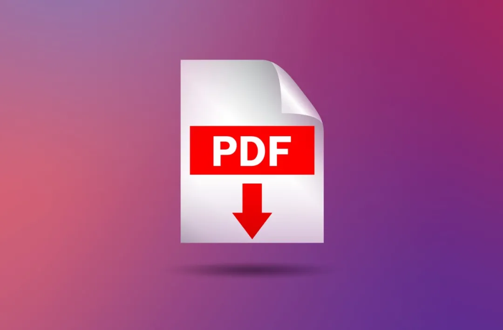
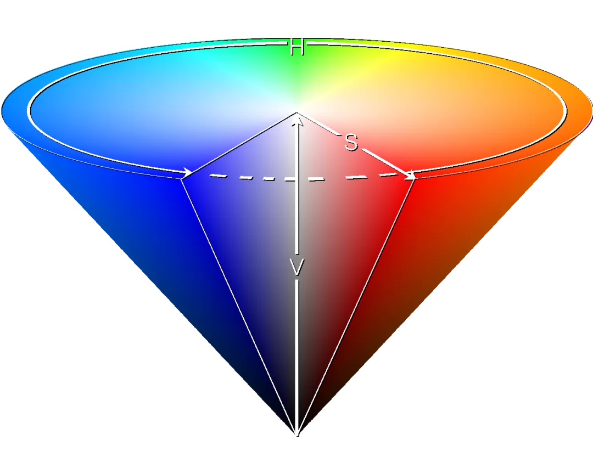
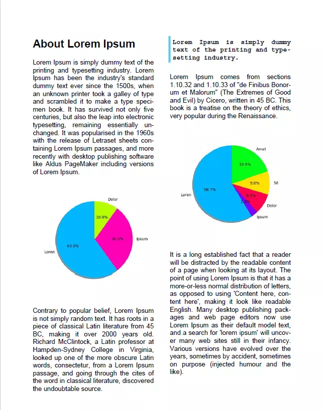

Python 可视化 Matplotlib PDF<br />
<a name="oGtmq"></a>
## 介绍
PDF 格式是与平台无关，它独立于底层操作系统和渲染引擎。事实上，PDF 是基于一种脚本语言——PostScript，它是第一个独立于设备的页面描述语言。<br />在本指南中，这里将使用 borb —— 一个专门用于阅读、操作和生成 PDF 文档的 Python 库。它提供了一个低级模型（允许访问精确的坐标和布局）和一个高级模型（可以将边距、位置等精确计算委托给布局管理器） .<br />matplotlib 是一个数据可视化库，也是许多其他流行库（如 Seaborn）背后的引擎。<br />基于用于创建报告（通常包括图形）的常见 PDF 文档，看看如何使用 borb 将 Matplotlib 图表集成到 PDF 文档中。
<a name="pEeGr"></a>
## 安装 borb和 matplotlib
borb 可以从 GitHub 上的源代码下载，或通过 pip 安装：
```bash
$ pip install borb
```
matplotlib 也可以通过 pip 安装：
```bash
$ pip install matplotlib
```
<a name="wgsqt"></a>
## 用 Borb 在 PDF 文档中集成 Matplotlib 图表
在创建饼图等图表之前，将编写一个小的效用函数，该函数生成 N 种颜色，均匀分布在颜色光谱中。<br />每当需要创建绘图并为每个部分着色时，这将有所帮助：
```python
from borb.pdf.canvas.color.color import HSVColor, HexColor
from decimal import Decimal
import typing

def create_n_colors(n: int) -> typing.List[str]:
  # The base color is borb-blue
  base_hsv_color: HSVColor = HSVColor.from_rgb(HexColor("56cbf9"))
  # This array comprehension creates n HSVColor objects, transforms then to RGB, and then returns their hex string
  return [HSVColor(base_hsv_color.hue + Decimal(x / 360), Decimal(1), Decimal(1)).to_rgb().to_hex_string() for x in range(0, 360, int(360/n))]
```
HSL 和 HSV/HSB 是由计算机图形学研究人员在 1970 年代设计的，目的是更接近人类视觉感知色彩属性的方式。在这些模型中，每种色调的颜色都排列在一个径向切片中，围绕中性色的中心轴，范围从底部的黑色到顶部的白色：<br /><br />用它表示颜色的优点是可以轻松地将颜色光谱分成相等的部分。<br />现在可以定义一个 `create_pie_chart()` 函数（或其他类型图的函数）：
```python
# New import(s)
import matplotlib.pyplot as plt
from borb.pdf.canvas.layout.image.chart import Chart
from borb.pdf.canvas.layout.layout_element import Alignment

def create_piechart(labels: typing.List[str], data: typing.List[float]):

    # Symetric figure to ensure equal aspect ratio
    fig1, ax1 = plt.subplots(figsize=(4, 4))
    ax1.pie(
        data,
        explode=[0 for _ in range(0, len(labels))],
        labels=labels,
        autopct="%1.1f%%",
        shadow=True,
        startangle=90,
        colors=create_n_colors(len(labels)),
    )

    ax1.axis("equal")  # Equal aspect ratio ensures that pie is drawn as a circle.

    return Chart(
        plt.gcf(),
        width=Decimal(200),
        height=Decimal(200),
        horizontal_alignment=Alignment.CENTERED,
    )
```
在这里，使用 Matplotlib 通过 `pie()` 函数创建饼图。<br />`PyPlot` 实例的 `gcf()` 函数返回当前图形。该图可以嵌入到 PDF 文档中，方法是将其注入到 `Chart` 构造函数中，并与自定义参数（例如`width`, `height` 和 `horizontal_alignment`）一起插入。<br />只需向`Chart`构造函数提供一个 Matplotlib 图。
<a name="pfV0K"></a>
## 将 Matplotlib 图表添加到 PDF 文档
现在是时候创建 PDF 文档并向其中添加内容了。
```python
# New import(s)
from borb.pdf.document import Document
from borb.pdf.page.page import Page
from borb.pdf.pdf import PDF
from borb.pdf.canvas.layout.page_layout.multi_column_layout import MultiColumnLayout
from borb.pdf.canvas.layout.page_layout.page_layout import PageLayout
from borb.pdf.canvas.layout.text.paragraph import Paragraph

# Create empty Document
pdf = Document()

# Create empty Page
page = Page()

# Add Page to Document
pdf.append_page(page)

# Create PageLayout
layout: PageLayout = MultiColumnLayout(page)

# Write title
layout.add(Paragraph("About Lorem Ipsum", 
                     font_size=Decimal(20), 
                     font="Helvetica-Bold"))
```
在此 PDF 中使用连字符，以确保文本的布局更加流畅。borb 中的连字符非常简单：
```python
# New import(s)
from borb.pdf.canvas.layout.hyphenation.hyphenation import Hyphenation

# Create hyphenation algorithm
hyphenation_algorithm: Hyphenation = Hyphenation("en-gb")

# Write paragraph
layout.add(Paragraph(
    """
    Lorem Ipsum is simply dummy text of the printing and typesetting industry. 
    Lorem Ipsum has been the industry's standard dummy text ever since the 1500s, 
    when an unknown printer took a galley of type and scrambled it to make a type specimen book. 
    It has survived not only five centuries, but also the leap into electronic typesetting, remaining essentially unchanged. 
    It was popularised in the 1960s with the release of Letraset sheets containing Lorem Ipsum passages, 
    and more recently with desktop publishing software like Aldus PageMaker including versions of Lorem Ipsum.
    """, text_alignment=Alignment.JUSTIFIED, hyphenation=hyphenation_algorithm))
```
现在可以使用之前声明的函数添加饼图；
```python
# Write graph
layout.add(create_piechart(["Loren", "Ipsum", "Dolor"], 
                           [0.6, 0.3, 0.1]))
```
接下来将编写另外三个 `Paragraph`对象。其中一个将不仅仅表示引用（侧面边框，不同字体等）。
```python
# Write paragraph
layout.add(Paragraph(
    """
    Contrary to popular belief, Lorem Ipsum is not simply random text. 
    It has roots in a piece of classical Latin literature from 45 BC, making it over 2000 years old. 
    Richard McClintock, a Latin professor at Hampden-Sydney College in Virginia, looked up one of the more obscure Latin words, 
    consectetur, from a Lorem Ipsum passage, and going through the cites of the word in classical literature, 
    discovered the undoubtable source.
    """, text_alignment=Alignment.JUSTIFIED, hyphenation=hyphenation_algorithm))

# Write paragraph
layout.add(Paragraph(
    """
    Lorem Ipsum is simply dummy text of the printing and typesetting industry. 
    """, 
    font="Courier-Bold",
    text_alignment=Alignment.JUSTIFIED, 
    hyphenation=hyphenation_algorithm,
    border_color=HexColor("56cbf9"),
    border_width=Decimal(3),
    border_left=True,
    padding_left=Decimal(5),
    padding_bottom=Decimal(5),
))

# Write paragraph
layout.add(Paragraph(
    """
    Lorem Ipsum comes from sections 1.10.32 and 1.10.33 of "de Finibus Bonorum et Malorum" 
    (The Extremes of Good and Evil) by Cicero, written in 45 BC. 
    This book is a treatise on the theory of ethics, very popular during the Renaissance.
    """, text_alignment=Alignment.JUSTIFIED, hyphenation=hyphenation_algorithm))
```
添加另一个绘图。
```python
# Write graph
layout.add(create_piechart(["Loren", "Ipsum", "Dolor", "Sit", "Amet"], 
                           [600, 30, 89, 100, 203]))
```
还有一段内容（`Paragraph`）:
```python
# Write paragraph
layout.add(Paragraph(
    """
    It is a long established fact that a reader will be distracted by the readable content of a page when looking at its layout. 
    The point of using Lorem Ipsum is that it has a more-or-less normal distribution of letters, as opposed to using 'Content here, content here', 
    making it look like readable English. Many desktop publishing packages and web page editors now use Lorem Ipsum as their default model text, 
    and a search for 'lorem ipsum' will uncover many web sites still in their infancy. 
    Various versions have evolved over the years, sometimes by accident, sometimes on purpose (injected humour and the like).
    """, text_alignment=Alignment.JUSTIFIED, hyphenation=hyphenation_algorithm))
```
最后，可以存储文档(`Document`)：
```python
# Write to disk
with open("output.pdf", "wb") as pdf_file_handle:
    PDF.dumps(pdf_file_handle, pdf)
```
运行此代码会生成如下所示的 PDF 文档：<br />
