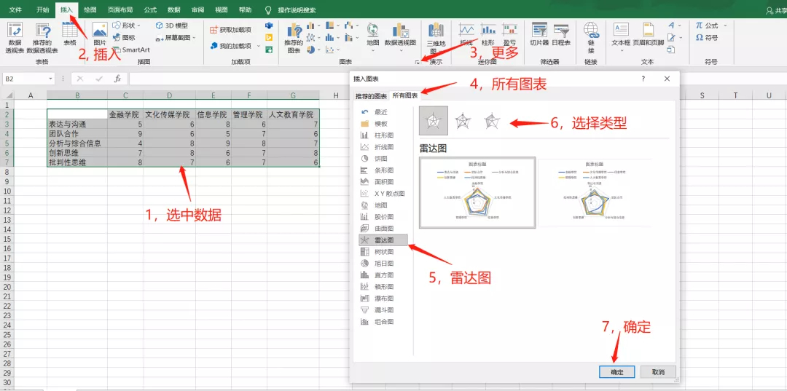
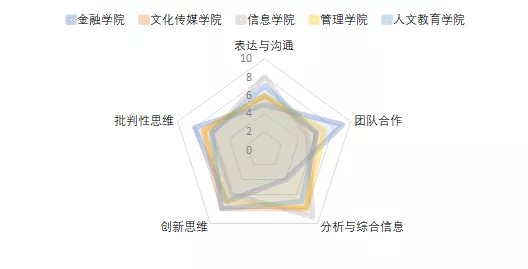
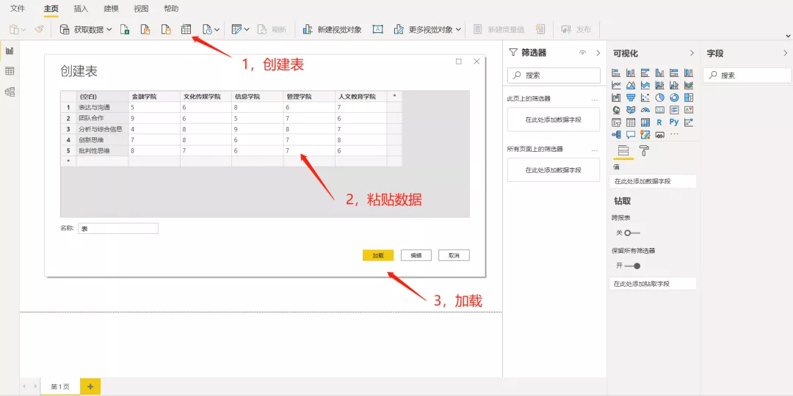
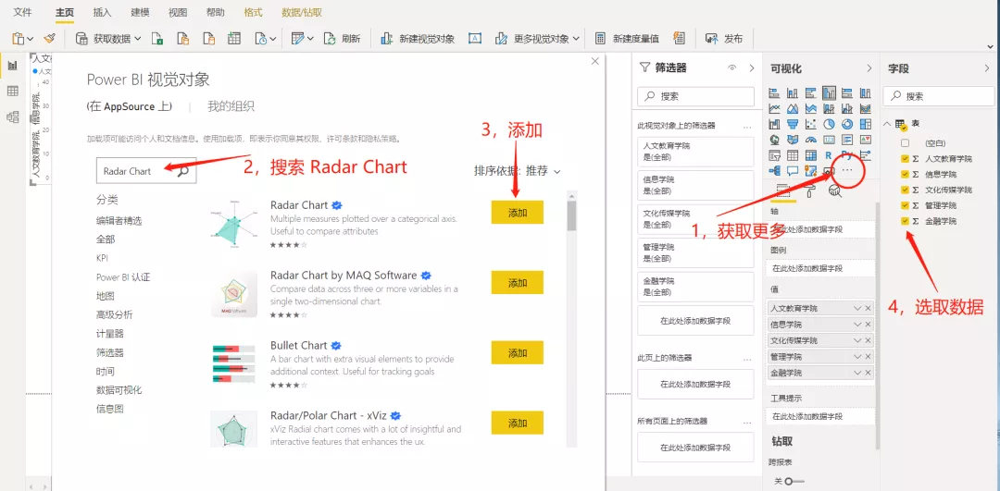
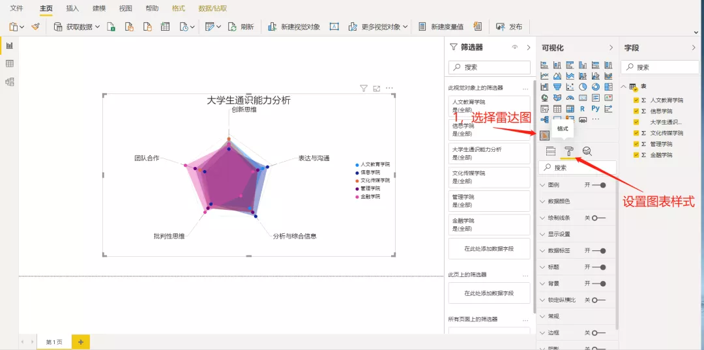
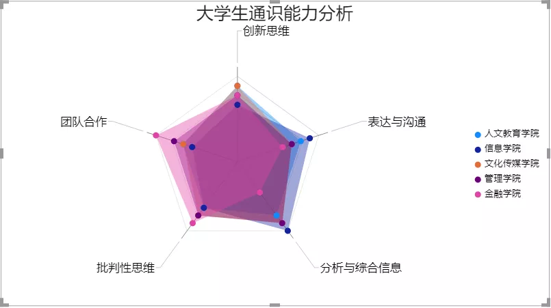
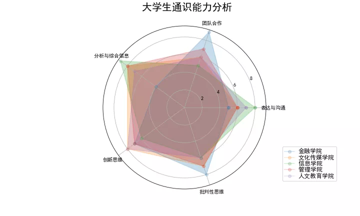
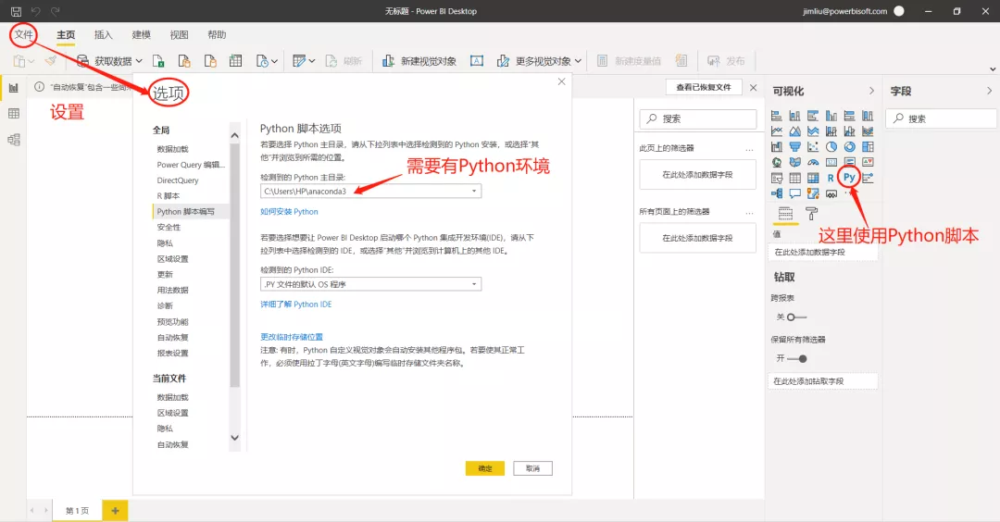
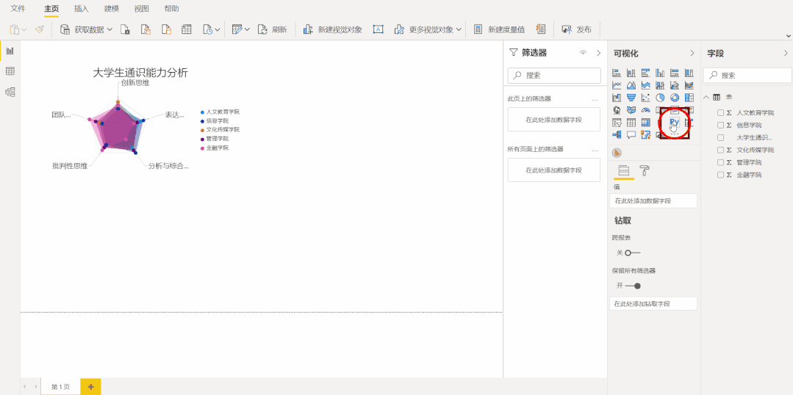

雷达图是通过多个离散属性比较对象的最直观工具，掌握绘制雷达图的方法将会为生活和工作带来乐趣。本例数据来源于网络，某大学本科一年级不同分院学生在五种核心通识能力方面的数据，使用多个工具来绘制多级雷达图，即在一组同心圆上填充不规则五边形，其每个顶点到圆心的距离代表分院学生的某种能力。<br />通过Excel、PowerBI和Python分别绘制雷达图，其中比较有意思的是在PowerBI里运行Python代码，绘制雷达图。
<a name="PxSPR"></a>
### 方法一、Excel绘制
最简单的方法便是使用Excel绘制雷达图，绘图步骤如下图所示，选中数据，插入图表，由于雷达图不是最常用的图表，需要展开所有图表才能找到，展开方式如下图所示。<br /><br />这里需要注意的是，第6步选择类型后，下面有两个雷达图可供选择，不仔细看，很容易混淆，他类型、颜色等都是一样的。但他们分别将行和列作为维度，即行列倒置，选择时需要仔细看清楚需要的那个。<br />选择结束后，就跟其他图表一样了，调整格式即可，如颜色、图例排布，字体大小等等，结果如下。<br />
<a name="FTdFV"></a>
### 方法二、PowerBI绘制
PowerBI（简称PB）其实是Excel的升级版中的一个，在Excel增强版里有PowerQuery（简称PQ）功能，这里使用的是PowerBI桌面版，其包含PowerQuery。<br />首先导入数据到PowerBI内，数据导入有多种方法，因为这里数据量不多，直接使用复制粘贴的方法。首先创建表，然后直接粘贴数据，最后加载即可。<br /><br />如果是第一次绘制雷达图，这一步就是必须的。由于雷达图不是常用的图表，在PB默认的可视化图表选项里没有，所以需要在AppSource里导入视觉对象。具体操作如下图所示，搜索框里输入【Radar Chart】，找到对应的雷达图对象，直接点添加即可。<br /><br />如果已经有雷达图，即可直接绘图。先在可视化图表里找到并选择雷达图小图标，再选择数据，最后设置图表样式，按照自己的需求定制样式。<br />这里的绘图方法也较简单，而且但从样式看，也似乎比在Excel里的漂亮许多。此外，在PB里还可以跟其他图表联动，包括各种切片，这里有兴趣的朋友可以研究研究，这里就不做过多的介绍了。<br /><br />经过部分样式的调整，最后得到如下的结果。<br />
<a name="aqNoz"></a>
### 方法三、Python绘制
以上两个方法都不需要编程，就能得到精美的雷达图。对于不喜欢或不擅长编程的小伙伴们，可以选择上述两种方式。下面介绍的两种方式，都是需要编程的。不过只要稍微掌握Python或R语言，这个雷达图还是可以信手捏来的。（下面以Python为例）<br />下面用绘图模块matplotlib绘制雷达图，具体代码如下所示。
```python
import numpy as np
import pandas as pd
import matplotlib.pyplot as plt
# import matplotlib 
# matplotlib.rcParams['font.family']='SimHei' 
# matplotlib.rcParams['font.sans-serif']='SimHei' 
dataset = pd.DataFrame(data=[[5, 6, 8, 6, 7],
                [9, 6, 5, 7, 6],
                [4, 8, 9, 8, 7],
                [7, 8, 6, 7, 8],
                [8, 7, 6, 7, 6]],
            index=['表达与沟通', '团队合作','分析与综合信息 ','创新思维','批判性思维'],
            columns=['金融学院','文化传媒学院','信息学院 ','管理学院 ','人文教育学院'])
radar_labels=dataset.index
nAttr=5
data=dataset.values #数据值
data_labels=dataset.columns
# 设置角度
angles=np.linspace(0,2*np.pi,nAttr,
                   endpoint= False)
data=np.concatenate((data, [data[0]])) 
angles=np.concatenate((angles, [angles[0]]))
# 设置画布
fig=plt.figure(facecolor="white",figsize=(10,6))
plt.subplot(111, polar=True)
# 绘图
plt.plot(angles,data,'o-',
         linewidth=1.5, alpha= 0.2)
# 填充颜色
plt.fill(angles,data, alpha=0.25) 
plt.thetagrids(angles[:-1]*180/np.pi, 
               radar_labels,1.2) 
plt.figtext(0.52, 0.95,'大学生通识能力分析', 
            ha='center', size=20)
# 设置图例
legend=plt.legend(data_labels, 
                  loc=(1.1, 0.05),
                  labelspacing=0.1)
plt.setp(legend.get_texts(), 
         fontsize='large') 
plt.grid(True)
# plt.savefig('tongshi.png')
plt.show()
```
结果展示。<br /><br />运用Python绘制雷达图灵活度更大，可以任意配置所需要的样式，只要对代码足够熟悉。
<a name="tdq5g"></a>
### 方法四、Python + PowerBI绘制
下面再介绍一种比较有意思绘图方法，就是在PowerBI内运行Python代码，将两者集成在一起。<br />在使用这个功能之前，需要确认下本机中是否有Python环境，如果没有，也比较简单，直接安装一个anaconda，PowerBI会自动检测Python环境。<br />如果已经有这个环境，就可以先将数据导入，在来通过Python绘制图形。<br /><br />具体操作步骤录了一个小视频，可以感受下。这里不得不说PowerBI的强大。这里得到的结果与在jupyter里绘制的图形长得一模一样。他就是跟PowerBI集成到一起了，在PowerBI中可以用Python代码绘制PowerBI不能绘制，或难以绘制的一些复杂图形，作为PowerBI的一个补充，这样才是强强联合，否则就是本末倒置了。<br />
