Python 可视化 地图<br />常用的几种绘制地图的方法：<br />pyecharts、plotly、folium、bokeh、basemap、geopandas、cartopy
<a name="abmDn"></a>
## Boken
首先先介绍 Boken 绘制地图的方法<br />Bokeh 支持创建基本地图可视化和基于处理地理数据的地图可视化<br />画一张世界地图
```python
from bokeh.plotting import figure, show
from bokeh.tile_providers import CARTODBPOSITRON, get_provider
from bokeh.io import output_notebook


output_notebook()
tile_provider = get_provider(CARTODBPOSITRON)

p = figure(x_range=(-2000000, 6000000), y_range=(-1000000, 7000000),
           x_axis_type="mercator", y_axis_type="mercator")
p.add_tile(tile_provider)

show(p)
```
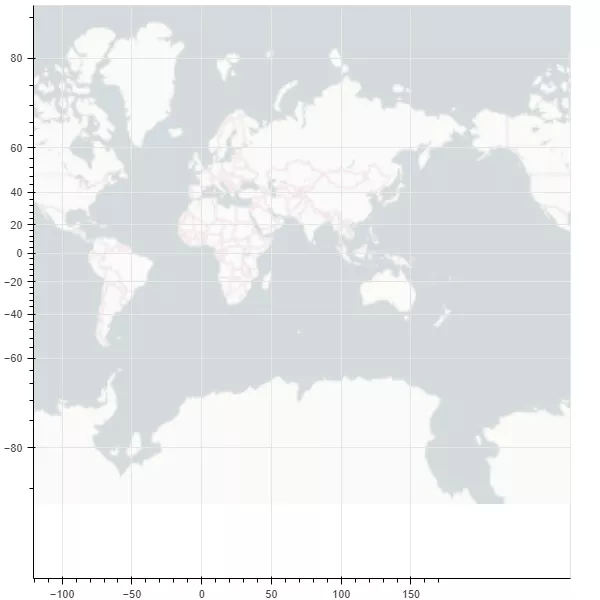<br />再画一张中国地图看看
```python
from bokeh.plotting import curdoc, figure
from bokeh.models import GeoJSONDataSource
from bokeh.io import show

# 读入中国地图数据并传给GeoJSONDataSource
with open("china.json", encoding="utf8") as f:
    geo_source = GeoJSONDataSource(geojson=f.read())
# 设置一张画布
p = figure(width=500, height=500)
# 使用patches函数以及geo_source绘制地图
p.patches(xs='xs', ys='ys', source=geo_source)
show(p)
```
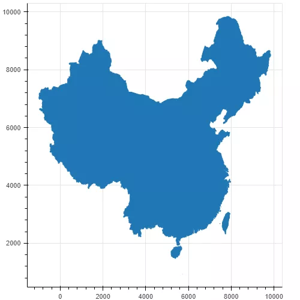<br />通过 GEO 地理数据来绘制地图同样非常方便，但是地图看起来有一些单调，把不同的省份绘制成不同的颜色来看看
```python
with open("china.json", encoding="utf8") as f:
    data = json.loads(f.read())
# 判断是不是  北京地区数据
def isBeijing(district):
    if 'beijing' in district['properties']['woe-name'].lower():
        return True
    return False
# data['features'] = list(filter(isInLondon, data['features']))
# 过滤数据
# 为每一个地区增加一个color属性
for i in range(len(data['features'])):
    data['features'][i]['properties']['color'] = ['red', 'blue', 'yellow', 'orange', 'gray', 'purple'][i % 6]
    data['features'][i]['properties']['number'] = random.randint(0, 20_000)
geo_source = GeoJSONDataSource(geojson=json.dumps(data))
p = figure(width=500, height=500, tooltips="@name, number: @number")
p.patches(xs='xs', ys='ys', fill_alpha=0.7,
        line_color='white',
        line_width=0.5,
        color="color",   # 增加颜色属性，这里的"color"对应每个地区的color属性
        source=geo_source)
p.axis.axis_label = None
p.axis.visible = False
p.grid.grid_line_color = None

show(p)
```
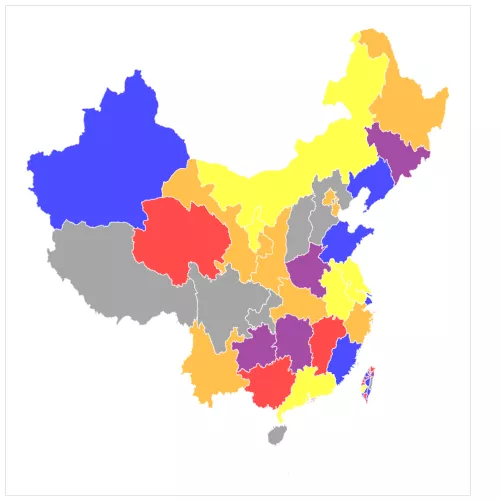<br />可以看到已经有内味了，唯一美中不足的就是南海的十三段线没有展示出来
<a name="eJBcr"></a>
## geopandas
GeoPandas 是基于 Pandas 的地图可视化工具，其数据结构完全继承自 Pandas，对于熟悉潘大师的同学来说还是非常友好的<br />还是先画一张世界地图
```python
import pandas as pd
import geopandas
import matplotlib.pyplot as plt
%matplotlib inline

world = geopandas.read_file(geopandas.datasets.get_path('naturalearth_lowres'))
world.plot()
plt.show()
```
<br />这也是 geopandas 官网上的经典图片，可以看到非常简单，除去 `import` 代码，仅仅三行，就完成了地图的绘制<br />下面继续绘制中国地图，这次加上九段线信息
```python
china_nine = geopandas.read_file(r"geojson/九段线GS（2019）1719号.geojson")
china = geopandas.read_file('china-new.json')
fig, ax = plt.subplots(figsize=(12, 8),dpi=80)
ax = china.plot(ax=ax, column='number')
ax = china_nine.plot(ax=ax)
plt.show()
```
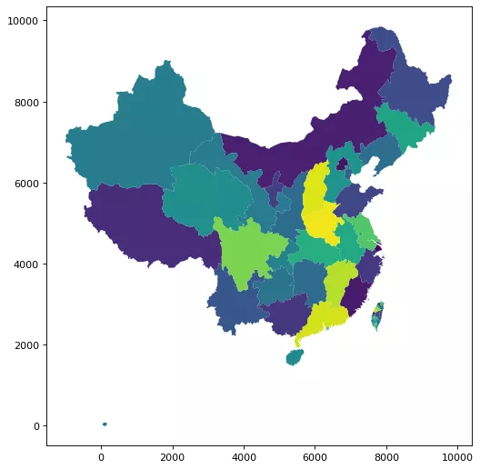<br />复用了前面处理的 china.json 数据，里面的 number 字段是随机生成的测试数据，效果与 Bokeh 不相上下
<a name="ngko0"></a>
## plotly
接下来介绍 plotly，这也是一个非常好用的 Python 可视化工具，如果要绘制地图信息，需要安装如下依赖
```python
!pip install geopandas==0.3.0
!pip install pyshp==1.2.10
!pip install shapely==1.6.3
```
接下来先绘制一个世界地图
```python
import plotly.graph_objects as go

fig = go.Figure(go.Scattermapbox(
    mode = "markers+lines",
    lon = [10, 20, 30],
    lat = [10, 20,30],
    marker = {'size': 10}))

fig.add_trace(go.Scattermapbox(
    mode = "markers+lines",
    lon = [-50, -60,40],
    lat = [30, 10, -20],
    marker = {'size': 10}))

fig.update_layout(
    margin ={'l':0,'t':0,'b':0,'r':0},
    mapbox = {
        'center': {'lon': 113.65000, 'lat': 34.76667},
        'style': "stamen-terrain",
        'center': {'lon': -20, 'lat': -20},
        'zoom': 1})

fig.show()
```
这里使用底层 API `plotly.graph_objects.Choroplethmapbox` 来绘制<br />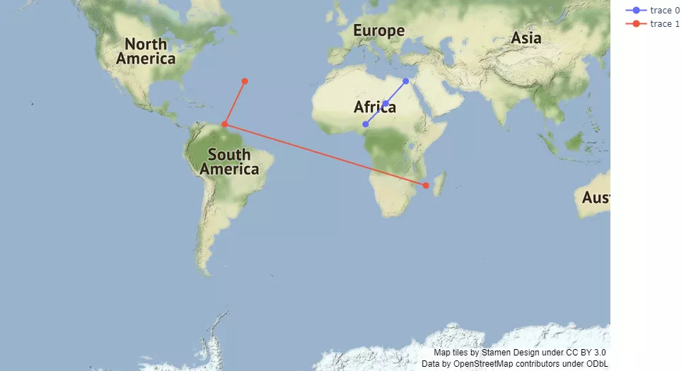<br />下面继续绘制中国地图，使用一个高级 API `plotly.express.choropleth_mapbox`
```python
import pandas as pd
import plotly.express as px
import numpy as np
import json

with open(r"china_province.geojson", encoding='utf8') as f:
    provinces_map = json.load(f)

df = pd.read_csv(r'data.csv')
df.确诊 = df.确诊.map(np.log)

fig = px.choropleth_mapbox(
    df,
    geojson=provinces_map,
    color='确诊',
    locations="地区",
    featureidkey="properties.NL_NAME_1",
    mapbox_style="carto-darkmatter",
    color_continuous_scale='viridis',
    center={"lat": 37.110573, "lon": 106.493924},
    zoom=3,
)
fig.show()
```
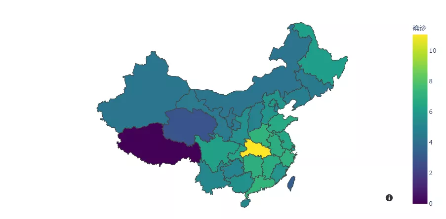<br />可以看出绘制出的交互式地图还是非常漂亮的，不过渲染速度有些感人，这个就看个人的需求了，如果对渲染速度有要求，那么 Ployly 可能不是最好的选择~
<a name="YVGUe"></a>
## Cartopy/Basemap
之所以把这两个库放到一起，是因为他们都是基于 Matplotlib 之上的，而随着 Python2 的不再维护，Basemap 也被 Matplotlib 放弃，Cartopy 随之转正，下面主要介绍 Cartopy 工具<br />Cartopy 利用了强大的 PROJ.4、NumPy 和 Shapely 库，并在 Matplotlib 之上构建了一个编程接口，用于创建发布高质量的地图<br />先来绘制一个世界地图
```python
%matplotlib inline
import cartopy.crs as ccrs
import matplotlib.pyplot as plt

ax = plt.axes(projection=ccrs.PlateCarree())
ax.coastlines()

plt.show()
```
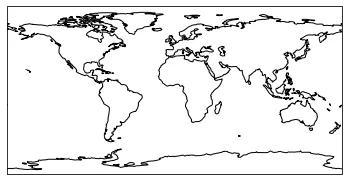<br />这是一个 cartopy 绘制的非常经典且常见的世界地图，形式比较简单，下面增强该地图
```python
import datetime
import matplotlib.pyplot as plt
import cartopy.crs as ccrs
from cartopy.feature.nightshade import Nightshade


fig = plt.figure(figsize=(10, 5))
ax = fig.add_subplot(1, 1, 1, projection=ccrs.PlateCarree())

date = datetime.datetime(2021, 12, 2, 21)

ax.set_title(f'Night time shading for {date}')
ax.stock_img()
ax.add_feature(Nightshade(date, alpha=0.2))
plt.show()
```
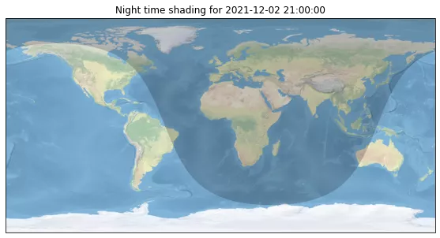<br />通过上面的代码，绘制了当前时间世界昼夜图，还是很强的<br />下面继续绘制中国地图
```python
import cartopy.io.shapereader as shpreader
import numpy as np
import matplotlib.pyplot as plt
import cartopy.crs as ccrs
import cartopy.feature as cfeature
from cartopy.mpl.gridliner import LONGITUDE_FORMATTER, LATITUDE_FORMATTER
from cartopy.mpl.ticker import LongitudeFormatter, LatitudeFormatter
import cartopy.io.shapereader as shapereader
import matplotlib.ticker as mticker
#从文件中加载中国区域shp
shpfile = shapereader.Reader(r'ne_10m_admin_0_countries_chn\ne_10m_admin_0_countries_chn.shp')
# 设置 figure 大小
fig = plt.figure(figsize=[8, 5.5])
# 设置投影方式并绘制主图
ax = plt.axes(projection=ccrs.PlateCarree(central_longitude=180))
ax.add_geometries(
        shpfile.geometries(),
        ccrs.PlateCarree())
ax.set_extent([70, 140, 0, 55],crs=ccrs.PlateCarree())
plt.show()
```
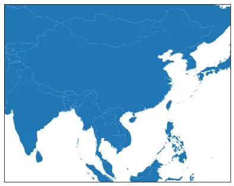

使用 cartopy 绘制地图最大的特点就是灵活度高，那么相对应的代价就是编写代码也会更难一些，比如如果想要给不同省份填充不同颜色，需要编写的代码就有点多
```python
import matplotlib.patches as mpatches
import matplotlib.pyplot as plt
from matplotlib.font_manager import FontProperties
import shapely.geometry as sgeom

import cartopy.crs as ccrs
import cartopy.io.shapereader as shpreader

font = FontProperties(fname=r"c:\windows\fonts\simsun.ttc", size=14) 

def sample_data():
#    lons = [110, 115, 120, 122, 124 ]
    lons = [124, 122, 120, 115, 110 ]
    lats = [33, 32, 28, 30, 28 ]
    return lons, lats

#ax = plt.axes([0, 0, 1, 1], projection=ccrs.LambertConformal())
ax = plt.axes(projection=ccrs.PlateCarree())


ax.set_extent([70, 140, 0, 55],crs=ccrs.Geodetic())

shapename = 'admin_1_states_provinces'
states_shp = shpreader.natural_earth(resolution='10m', category='cultural', name=shapename)


lons, lats = sample_data()

# to get the effect of having just the states without a map "background"
# turn off the outline and background patches
ax.background_patch.set_visible(False)
ax.outline_patch.set_visible(False)

plt.title(u'China Province Level', fontproperties=font)

# turn the lons and lats into a shapely LineString
track = sgeom.LineString(zip(lons, lats))

track_buffer = track.buffer(1)

for state in shpreader.Reader(states_shp).geometries():
    # pick a default color for the land with a black outline,
    # this will change if the storm intersects with our track
    facecolor = [0.9375, 0.9375, 0.859375]
    edgecolor = 'black'

    if state.intersects(track):
        facecolor = 'red'
    elif state.intersects(track_buffer):
        facecolor = '#FF7E00'

    ax.add_geometries([state], ccrs.PlateCarree(),
                      facecolor=facecolor, edgecolor=edgecolor)


# make two proxy artists to add to a legend
direct_hit = mpatches.Rectangle((0, 0), 1, 1, facecolor="red")
within_2_deg = mpatches.Rectangle((0, 0), 1, 1, facecolor="#FF7E00")
labels = [u'省份level1',
          '省份level2']
plt.legend([direct_hit, within_2_deg], labels,
           loc='lower left', bbox_to_anchor=(0.025, -0.1), fancybox=True, prop=font)
ax.figure.set_size_inches(14, 9)
plt.show()
```
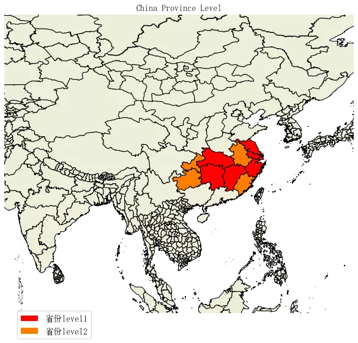
<a name="gbzHn"></a>
## folium
folium 是建立在 Python 生态系统的数据应用能力和 Leaflet.js 库的映射能力之上的高级地图绘制工具，通过 Python 操作数据，然后在 Leaflet 地图中可视化，可以灵活的自定义绘制区域，并且展现形式更加多样化<br />首先是三行代码绘制世界地图
```python
import folium


# define the world map
world_map = folium.Map()
# display world map
world_map
```
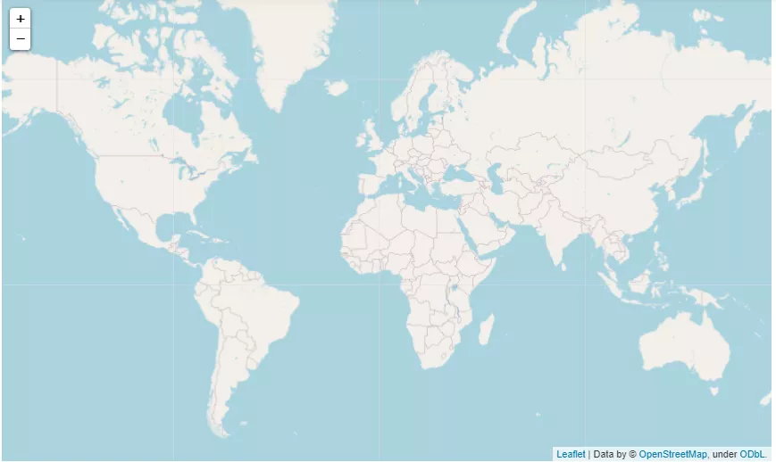<br />接下来绘制中国地图
```python
# 绘制边界
import json

df = pd.read_csv(r'plotly-choropleth-mapbox-demo-master/data.csv')
# read china border 
with open(r"plotly-choropleth-mapbox-demo-master/china_province.geojson", encoding='utf8') as f:
    china = json.load(f)

chn_map = folium.Map(location=[40, 100], zoom_start=4)


folium.Choropleth(
    geo_data=china,
    name="choropleth",
    data=df,
    columns=["地区", "确诊"],
    key_on="properties.NL_NAME_1",
    fill_color="YlGn",
    fill_opacity=0.7,
    line_opacity=0.2,
    legend_name="新冠确诊",
).add_to(chn_map)

folium.LayerControl().add_to(chn_map)

chn_map
```
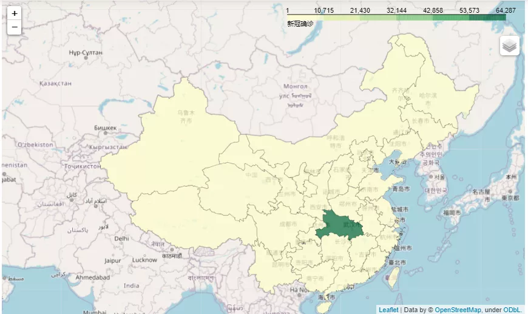<br />作为专业地图工具，不仅渲染速度快，自定义程度也是非常高的，值得使用尝试
<a name="iR38y"></a>
## PyEcharts
最后介绍 PyEcharts，这款国产的精良可视化工具 <br />绘制世界地图
```python
from pyecharts import options as opts
from pyecharts.charts import Map
from pyecharts.faker import Faker


c = (
    Map()
    .add("测试数据", [list(z) for z in zip(Faker.country, Faker.values())], "world")
    .set_series_opts(label_opts=opts.LabelOpts(is_show=False))
    .set_global_opts(
        title_opts=opts.TitleOpts(title="Map-世界地图"),
        visualmap_opts=opts.VisualMapOpts(max_=200),
    )
)
c.render_notebook()
```
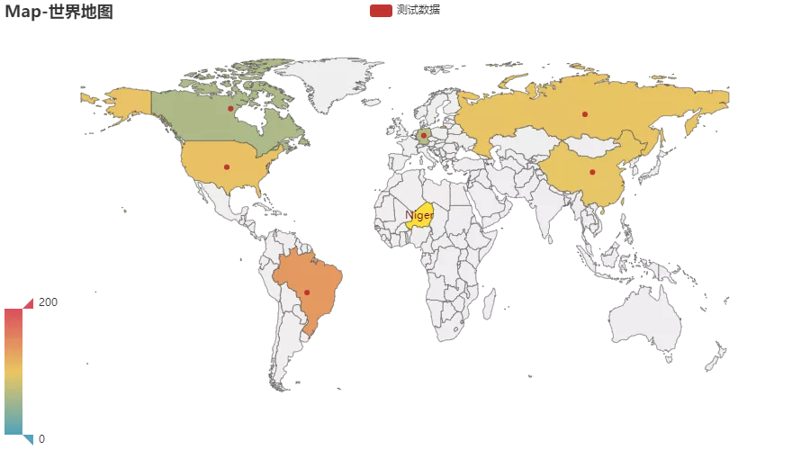<br />通过 Pyecharts 绘制地图的一个好处就是不需要处理 GEO 文件，直接输入国家名称，就可以自动匹配到地图上，非常方便<br />再绘制中国地图
```python
c = (
    Map()
    .add("测试数据", [list(z) for z in zip(Faker.provinces, Faker.values())], "china")
    .set_global_opts(
        title_opts=opts.TitleOpts(title="Map-VisualMap（中国）"),
        visualmap_opts=opts.VisualMapOpts(max_=200, is_piecewise=True),
    )
)
c.render_notebook()
```
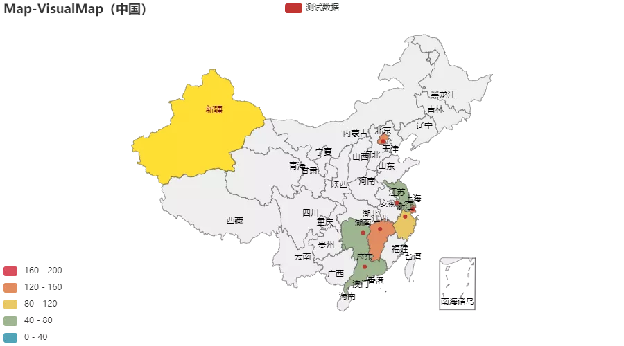<br />只需要把参数替换成“china”就可方便的绘制中国地图，真的很给力，当然对于 Pyecharts 还有很多种玩法，就不一一介绍了<br />综合上面的示例，可以看出， Pyecharts 绘制地图最为简单，非常适合新手学习使用；而 folium 和 cartopy 则胜在自由度上，它们作为专业的地图工具，留给了使用者无限可能；至于 Plotly 和 Bokeh 则属于更高级的可视化工具，它们胜在画质更加优美，API 调用也更加完善
