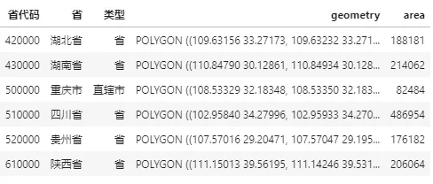
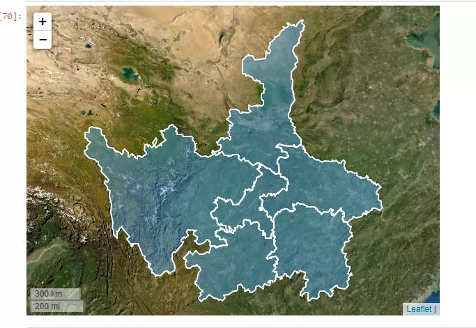
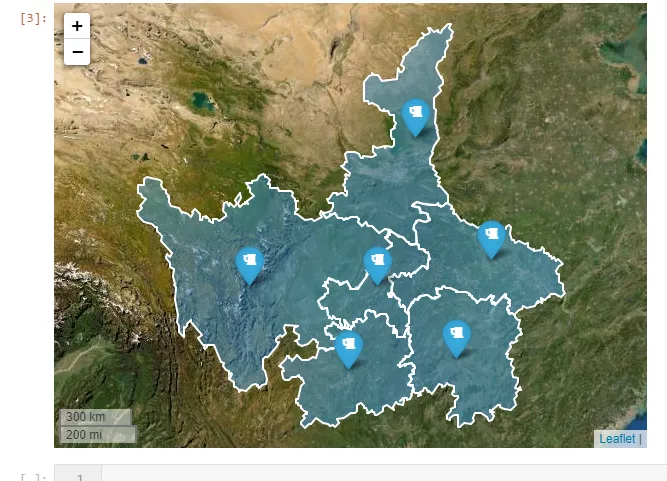
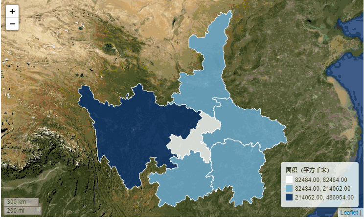
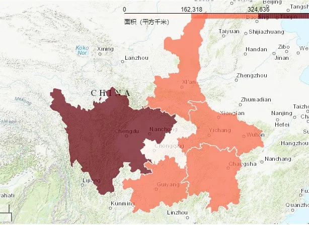
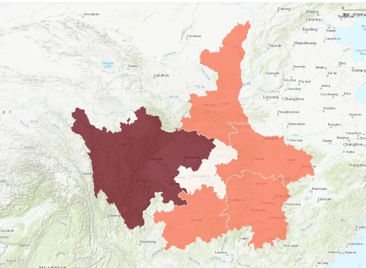

Python 可视化 地图<br /><br />`explore()`方法类似熟悉的`plot()`方法，是GeoSeries与GeoDataFrame对象皆有的方法，下面递进式地介绍：
<a name="I9jt6"></a>
## 1、`GeoSeries.explore()`方法的使用
`GeoSeries.explore()`的主要参数如下：

- `color`：str或数组，用于设置所绘制矢量的颜色，当传入数组时可一一对应按顺序设置每个矢量的颜色
- `m`：类似`plot()`方法中的`ax`参数，用于传入已存在的地图对象，从而实现多图层叠加
- `tiles`：str型，用于设置底图来源，默认为'OpenStreetMap'，其他可用的有'Stamen Terrain'、'Stamen Toner'、'Stamen Watercolor'、'CartoDB positron'及'CartoDB dark_matter'，亦可传入格式类似http://{s}.yourtiles.com/{z}/{x}/{y}.png的自定义地图服务，注意，当自定义tiles时，必须设置attr参数
- `attr`：str型，用于设置底图对应的attribution信息
- `highlight`：bool型，用于设置是否在鼠标悬浮于矢量上时展示高亮效果，默认为True
- `width`：int或str型，int型时用于设置地图像素宽度，字符型时用于设置地图相对于容器的百分比宽度，此参数在参数m设置时会失效
- `height`：int或str型，int型时用于设置地图像素高度，字符型时用于设置地图相对于容器的百分比高度，此参数在参数m设置时会失效
- `control_scale`：bool型，用于设置是否展示比例尺，默认为True
- `zoom_control`：bool型，用于设置是否展示缩放组件，默认为True
- `marker_type`：str型，用于设置点要素的样式类型，可选的有'marker'、'circle'和'circle_marker'
- `marker_kwds`：dict型，用于设置点要素的更多细节参数，常用的有：
- radius：float型，用于设置点要素的半径，当marker_type='circle'时单位为米，当`marker_type='circle_marker'`时单位为像素
- `icon`：folium.map.Icon型，当marker_type='marker'时，用于自定义点图标，详细用法参考：[https://python-visualization.github.io/folium/modules.html#folium.map.Icon](https://python-visualization.github.io/folium/modules.html#folium.map.Icon)
- `draggable`：bool型，用于设置点图标是否可自由拖拽，默认为False
- `style_kwds`：dict型，用于设置矢量的样式细节参数，常用的参数有：
- `stroke`：bool型，设置是否绘制矢量轮廓，默认为True
- `color`：str型，用于设置轮廓颜色
- `weight`：int型，用于设置轮廓像素宽度
- `opacity`：float型，取值0~1之间，用于设置轮廓透明度，默认为1.0
- `fill`：bool型，用于设置是否绘制矢量填充，默认为True
- `fillColor`：str型，用于设置矢量填充色
- `fillOpacity`：float型，用于设置填充色透明度，默认为0.5
- `highlight_kwds`：dict型，参数结构同`style_kwds`，用于设置鼠标悬浮高亮状态下的各样式参数
- `min_zoom`、`max_zoom`、`zoom_start`：int型，分别用于设置地图的最小、最大及初始化缩放层级，默认值分别为0、18、10
- `location`：元组或列表，用于设置地图初始化时的中心坐标，格式为[纬度, 经度]

get到这些参数之后，就可以非常快捷地制作在线可视化作品，以环渝地区为例：<br />
```python
m = shp.geometry.explore(
    color='#40a9ff',
    tiles='https://server.arcgisonline.com/ArcGIS/rest/services/World_Imagery/MapServer/tile/{z}/{y}/{x}',
    attr=' ',
    width='80%',
    tooltip=False, # 关闭鼠标悬浮时的空白tooltip
    style_kwds={
        'color': 'white',
        'fillOpacity': 0.4
    },
    highlight_kwds={
        'fillColor': 'white',
        'fillOpacity': 0.6
    }
)
m
```
<br />叠加多个图层：
```python
import folium

m = shp.geometry.explore(
    color='#40a9ff',
    tiles='https://server.arcgisonline.com/ArcGIS/rest/services/World_Imagery/MapServer/tile/{z}/{y}/{x}',
    attr=' ',
    width='80%',
    tooltip=False, # 关闭鼠标悬浮时的空白tooltip
    style_kwds={
        'color': 'white',
        'fillOpacity': 0.4
    },
    highlight_kwds={
        'fillColor': 'white',
        'fillOpacity': 0.6
    }
)

shp.representative_point().explore(
    color='red',
    tooltip=False, # 关闭鼠标悬浮时的空白tooltip
    m=m, # 叠加已有地图
    marker_type='marker',
    marker_kwds={
        'icon': folium.map.Icon(icon='beer', prefix='fa')
    }
)
```

<a name="iknqT"></a>
## 2、`GeoDataFrame.explore()`方法的使用
与`GeoSeries.explore()`相比，GeoDataFrame除了矢量字段之外，还可以快捷地利用数据框中其他字段的信息，来辅助视觉元素的映射，因此在`GeoSeries.explore()`的参数体系基础上，`GeoDataFrame.explore()`新增了如下参数，与`plot()`方法非常相似：

- column：str型或数组，用于指定绘图映射基于的字段名，亦或是额外传入的与矢量一一对应的数组
- cmap：str型或matplotlib中的colormap对象，用于设置色彩映射方案
- tooltip：bool、str或list型，用于自定义鼠标悬浮时提示框内显示的字段信息，True表示展示全部字段，False表示关闭提示框，str型时可指定单个要展示的字段名，list型时指定多个要展示的字段
- popup：用于设置鼠标点击触发展示的信息框内容，格式同tooltip
- categorical：bool型，用于设置是否开启类别映射模式，默认为False
- legend：bool型，设置是否显示图例，默认为True
- scheme：字符型，同`plot()`中的同名参数，用于设定分层设色规则
- k：int型，用于设置分层设色分段数量，默认为5
- vmin：float型，用于手动设置色彩映射最小值
- vmax：float型，用于手动设置色彩映射最大值
- categories：list型，用于传入顺序类别列表
- tooltip_kwds：dict型，用于自定义设置tooltip样式，详细参考：[https://python-visualization.github.io/folium/modules.html#folium.features.GeoJsonTooltip](https://python-visualization.github.io/folium/modules.html#folium.features.GeoJsonTooltip)
- popup_kwds：dict型，用于自定义设置popup样式，详细参考：[https://python-visualization.github.io/folium/modules.html#folium.features.GeoJsonPopup](https://python-visualization.github.io/folium/modules.html#folium.features.GeoJsonPopup)
- legend_kwds：dict型，用于自定义设置图例，主要的参数有：
- caption：str型，自定义图例标题，默认为映射字段名
- colorbar：bool型，用于设置是否开启colorbar模式，设置为False时会开启分段模式
- fmt：str型，用于自定义图例项数值格式，默认为'{:.2f}'
- labels：list型，自定义图例项标签文字，来覆盖原始自动生成内容
- max_labels：int型，设置colorbar图例中刻度数量
- scale：bool型，设置是否以真实尺度来渲染每段分层设色区间，False时每段色阶长度会强制相同

下面来基于这些实用的参数，绘制几个示例：
```python
m = shp.explore(
    column='area',
    cmap='Blues',
    tiles='https://server.arcgisonline.com/ArcGIS/rest/services/World_Imagery/MapServer/tile/{z}/{y}/{x}',
    attr=' ',
    scheme='NaturalBreaks',
    k=3,
    vmin=0,
    legend_kwds={
        'caption': '面积（平方千米）',
        'scale': False,
        'colorbar': False
    },
    style_kwds={
        'color': 'white',
        'weight': 1,
        'fillOpacity': 0.8
    }
)
m
```

```python
m = shp.explore(
    column='area',
    cmap='Reds',
    tiles='https://server.arcgisonline.com/ArcGIS/rest/services/World_Topo_Map/MapServer/tile/{z}/{y}/{x}',
    attr=' ',
    scheme='NaturalBreaks',
    k=3,
    vmin=0,
    legend_kwds={
        'caption': '面积（平方千米）',
        'scale': False
    },
    style_kwds={
        'color': 'white',
        'weight': 1,
        'fillOpacity': 0.7
    }
)
m
```

<a name="g75Sp"></a>
## 3、保存在线底图
如果想要持久化保存绘制好的在线地图作品，可以利用地图对象的`save()`方法，将其保存为离线html文件：
```python
m.save('demo.html')
```
浏览器中查看已保存的html文件：<br />
