Python

## 1、简介
geopandas之所以如此高效易用，成为Python GIS生态中的翘楚，离不开其底层依赖库shapely对其矢量计算功能的支持。 不仅是作为geopandas的基石，直接使用shapely中极其丰富的各种矢量操作API，也可以轻松实现各种细致入微的矢量操作。而就在近期，shapely发布了其颇具里程碑意义的2.0正式版本，带来了更加澎湃的运算性能提升，以及更稳定更丰富的新功能，来一览shapely 2.0版本中的主要新特性🥳。 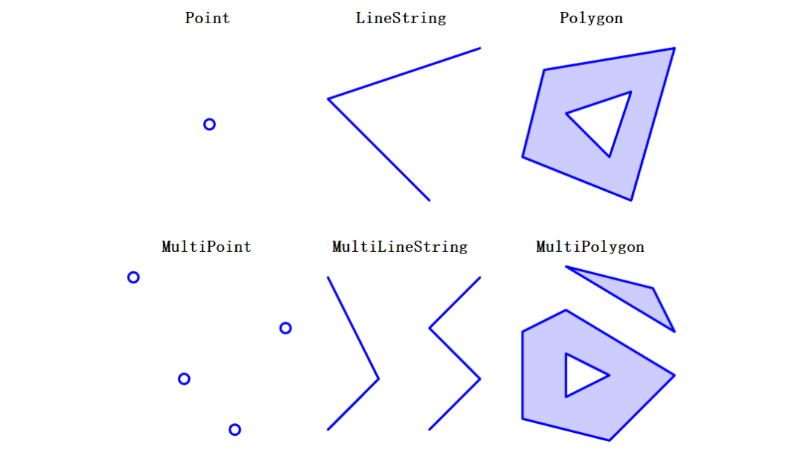

## 2、shapely 2.0重要新特性一览
通常不会专门去安装shapely，在安装geopandas的过程中它就顺带被安装上了，在本地示例虚拟环境中shapely原先的版本为1.8.5，通过执行`conda update shapely -c conda-forge -y`可将其稳定升级到2.0.0以上的正式版本： 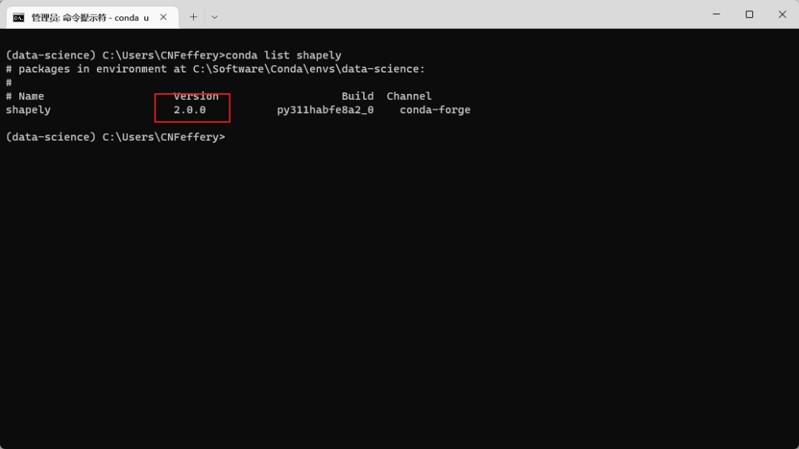 接下来看看本次大的版本更新中带来了哪些重要内容：

### 2.1 向量化矢量操作带来高达百倍的性能提升
新版shapely重写了底层对C++库GEOS的封装方式，大幅度降低了冗余计算成本，并且吸收了pygeos中的底层逻辑，对各种常用接口进行**「ufunc向量化」**运算支持，可以配合numpy快速实现，以`contains()`为例，基于shapely的顶级API接口： 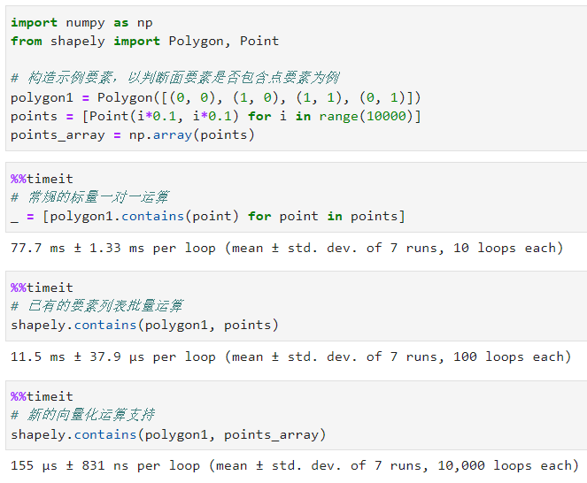 在上面的例子中，相较于标量一对一运算和列表批量运算，新的向量化运算分别取得了500多倍和70多倍的运算加速😉。 目前shapely的所有顶级API，以及`shapely.ops`等子模块下的顶级API均已支持向量化运算特性，具体见shapely中的API文档是否如下图所示提及ufunc： 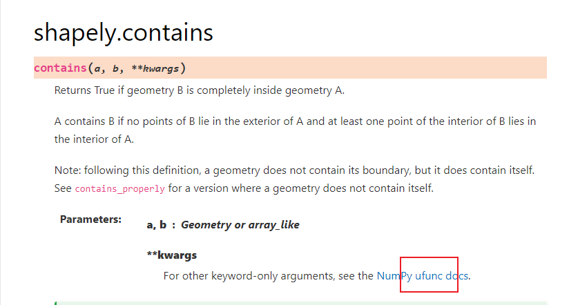

### 2.2 矢量对象不可变
在以前的版本中，shapely中的矢量要素对象是可变的，譬如对于LineString要素，可以在被创建后，通过为其coords属性赋值新的坐标串信息以改变其矢量信息： 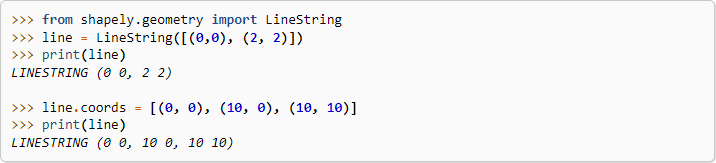 而从2.0.0开始，shapely中所有的矢量要素变为不可变对象，这意味着它们**「可hash」**，譬如可以作为字典的键，或pandas分组运算的分组依据等： 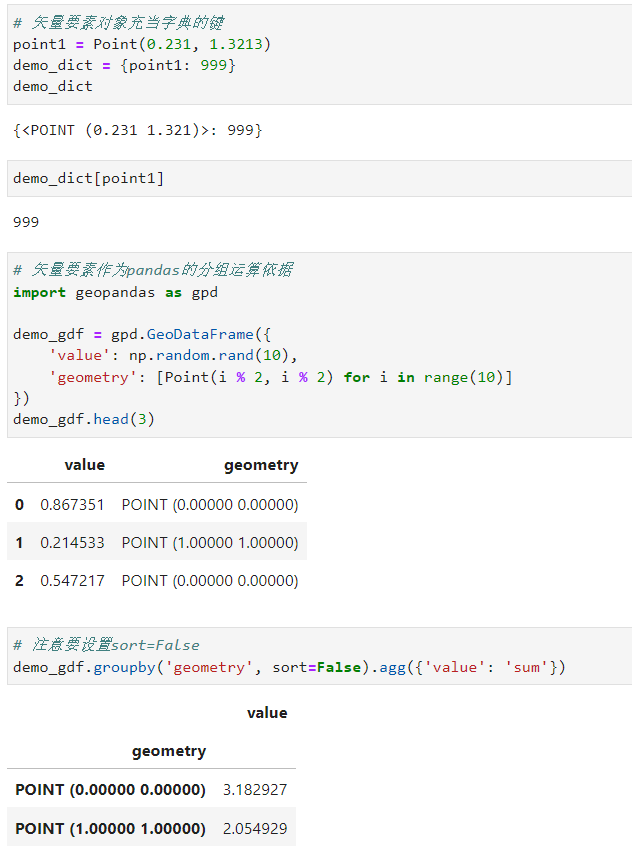

### 2.3 矢量要素类可作为顶级API使用
从上面的几个例子中也可以发现，新版shapely中可以直接从shapely导入常用的各种矢量要素类，这将作为`from shapely.geometry import XXX`方式的备选方式： 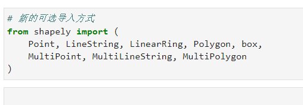

### 2.4 多部件要素不再可视作序列型对象
在以前的版本中，多部件要素譬如MultiPoint可以直接视作数组对象来直接按位置索引或迭代，而从2.0.0开始，原有的方式会引发错误，请注意更换为使用其geoms属性实现相关操作： 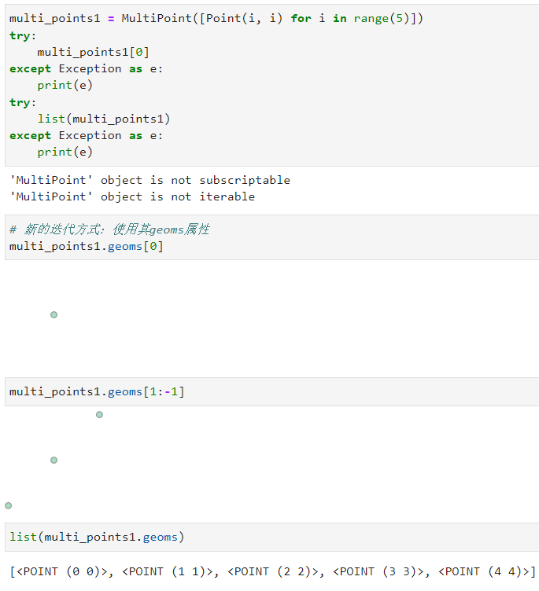

### 2.5 矢量要素支持精度控制
从2.0.0开始，shapely新增API接口`set_precision()`和`get_precision()`用于针对矢量要素进行坐标精度设置和精度查询，非常的方便： 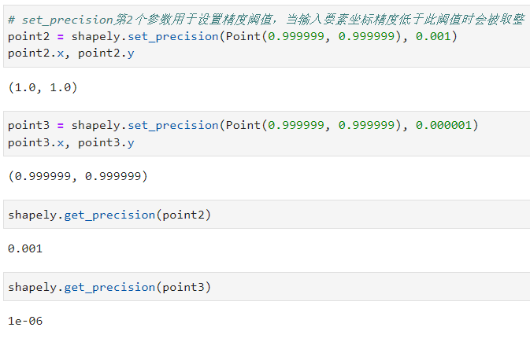

### 2.6 基于GEOS新增大量新功能函数
随着对底层GEOS依赖库的版本更新（当前依赖版本：3.11.1），一大批新的实用功能函数得以被添加到shapely中，由于数量非常众多，下面仅对其中的部分典型新功能函数做介绍：

#### `extract_unique_points()`
通过新增的函数`extract_unique_points()`，可以从指定要素中快速提取去重后的折点要素： 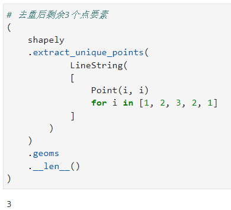

#### `node()`
通过新增的函数`node()`，可以轻松地从线要素中提取出彼此不交叉的片段： 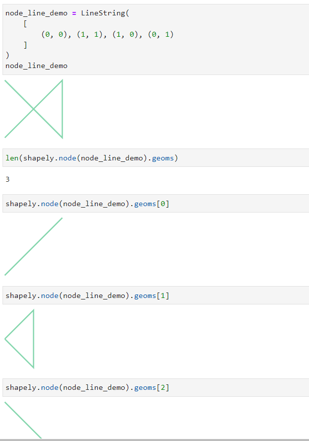

#### `minimum_bounding_circle()`与`minimum_bounding_radius()`
通过`minimum_bounding_circle()`和`minimum_bounding_radius()`可以快速得到目标要素的最小外接圆及其对应半径： 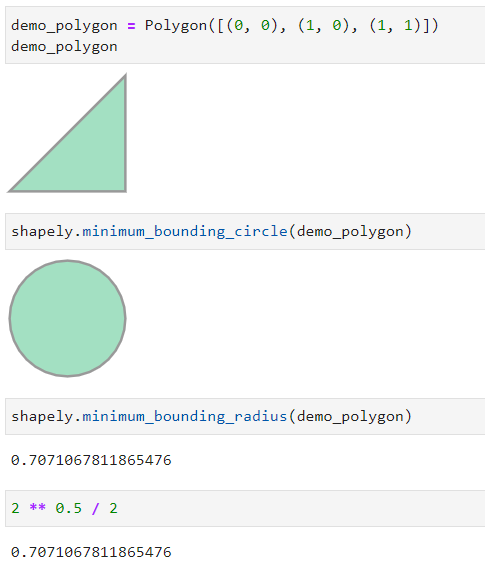

#### `dwithin()`
通过`dwithin()`，可以快速判断要素之间的距离是否小于所给定的阈值： 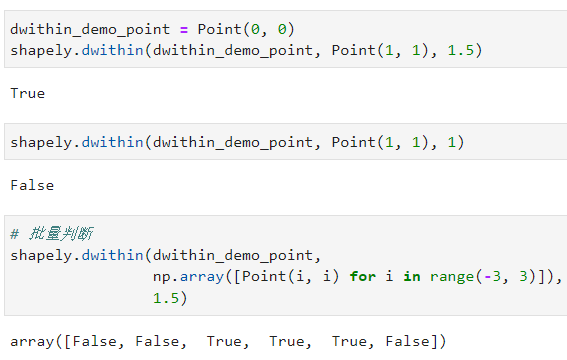

### 2.7 新增`force_2d()`、`force_3d()`函数
通过新增的快捷函数`force_2d()`和`force_3d()`，可以直接为指定要素移除/添加z轴信息： 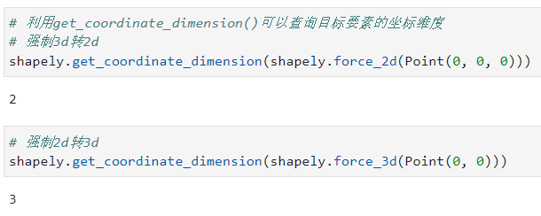 篇幅有限，本文只针对shapely 2.0中一些比较重要的内容进行介绍，更多新特性请移步其更新说明文档页：[https://shapely.readthedocs.io/en/stable/release/2.x.html](https://shapely.readthedocs.io/en/stable/release/2.x.html)
