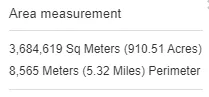

Python 可视化
<a name="pqxSa"></a>
## 1、准备工作
这里以高德地图为底图样式，经纬度也是基于高德地图下！
```python
import folium.plugins as plugins
import folium

tiles= 'https://wprd01.is.autonavi.com/appmaptile?x={x}&y={y}&z={z}&lang=zh_cn&size=1&scl=1&style=7'

m = folium.Map([40.003451,116.326398],
               tiles=tiles ,
               attr='高德-常规图',
               zoom_start=15,
               control_scale=True,
               width='70%'
              )

m
```

<a name="Q8jJI"></a>
## 2、标记点
标记点就是在地图上标记出某经纬度所在的位置，使用的是函数方法`folium.Marker()`。
```python
folium.Marker(
    location=None,
    popup=None,
    tooltip=None,
    icon=None,
    draggable=False,
    **kwargs,
)
```

- `location`：经纬度列表
- `popup`：点击标记点时弹出的内容
- `tooltip`：鼠标移动到标记点时弹出的提示
- `icon`：标记点颜色
```python
# 提示语
tooltip = "点我"
# 标记点
folium.Marker(
    # 标记的点经纬度
    [40.005711,116.32529], 
    # 点击标记出现的 文本
    popup="情人坡",
    # 提示语（鼠标放到标记点上的提示语）
    tooltip=tooltip
).add_to(m)
m
```
<br />有朋友可能会说，点击标记点的提示内容怎么是竖着显示的，要是太长的话不就太长了！！当然，可以通过设置参数`max_width`来解决这个问题，**让文本信息横向显示**~
```python
# 图书馆
location = [40.004774,116.3251]

folium.Marker(
    location, 
    # max_width设置每行显示字符数
    popup=folium.Popup("图书馆",max_width=10),
    tooltip=tooltip
).add_to(m)
m
```
<br />到这里，可能也有朋友会问，这个标记点显示的好单调，可以有比如修改颜色或者icon之类的操作吗！？当然，也是有的！

- `iconcolor`：标记图案颜色
- `icon`：标记形状，比如`cloud`、`cny`与`info-sign`等
```python
# 不同的标记点样式
folium.Marker(
    [40.001528,116.32408], 
    popup="第一教学楼",
    icon=folium.Icon(icon="cloud", icon_color='yellow'),
).add_to(m)

folium.Marker(
    [39.998586,116.328908], 
    popup=folium.Popup("纳米科技楼", max_width=100),
    icon=folium.Icon(color="green", icon="cny"),
).add_to(m)

folium.Marker(
    location=[40.005251,116.322299],
    popup="体育场",
    icon=folium.Icon(color="red", icon="info-sign"),
).add_to(m)

m
```

<a name="APcfa"></a>
## 3、标记圆形区域
标记圆形区域有两种操作，分别是`Circle`和`CircleMarker`，后者是一个**始终与整个Map保持相对尺寸的Circle**。<br />区别于`Circle`就是`Circle`是绝对尺寸（以m为单位），当放大地图时`Circle`会变小，因为它与地图的相对尺寸变小了；而`CircleMarker`不论怎么缩放地图，它在地图都始终是那么大。
```python
m = folium.Map([40.003451,116.326398],
               tiles= tiles,
               attr='高德-常规图',
               zoom_start=15,
               control_scale=True,
               width='70%'
              )
# 标记圆形区域
folium.Circle(
    radius=50,
    location=[40.005062,116.321216],
    popup="西区体育馆",
    color="crimson",
    fill=False,
).add_to(m)

folium.CircleMarker(
    location=[40.004404,116.33239],
    radius=20,
    popup="体育中心",
    color="Blue",
    fill=True,
    fill_color="#3186cc",
).add_to(m)

m
```

<a name="Az5AX"></a>
## 4、标记连线
标记连线就比较简单了，就是按照给到的经纬度坐标点依次连线呗，可以应用在比如知道了导航路径的经纬度列表，然后在地图上绘制导航路径之类的。这里用到的是函数方法PolyLine，具体大家看下面效果感受一下！
```python
# 标记线
m = folium.Map([40.003451,116.326398],
               tiles= tiles,
               attr='高德-常规图',
               zoom_start=15,
               control_scale=True,
               width='70%'
              )
              
folium.PolyLine(
    locations=[       
        [39.998586,116.328908],
        [40.001528,116.32408],
        [40.005251,116.322299],
    ],
    popup=folium.Popup('标记坐标点之间连线', max_width=200),
    color='red'
).add_to(m)

m
```

<a name="i7Ae1"></a>
## 5、标记区域
知道点之间的连线后，那么点之间围成的区域就是目标区域了，剩下的交给Polygon~
```python
# 标记区域
m = folium.Map([40.003451,116.326398],
               tiles= tiles,
               attr='高德-常规图',
               zoom_start=15,
               control_scale=True,
               width='70%'
              )
folium.Polygon(
    locations=[
        [39.998586,116.328908],
        [40.001528,116.32408],
        [40.005251,116.322299],
    ],
    popup=folium.Popup('标记坐标点之间多边形区域', max_width=200),
    color='blue', # 线颜色
    fill=True, # 是否填充
    weight=3, # 边界线宽
).add_to(m)

m              
```

<a name="s1ewa"></a>
## 6、鼠标点击事件
鼠标点击事件顾名思义即可，这里将演示两种：**点击显示经纬度**、**点击进行标记点**。用`add_child`来添加这类事件插件！
<a name="F0CBY"></a>
### 点击显示经纬度
```python
# 添加点击触发事件
m = folium.Map([40.003451,116.326398],
               tiles= tiles,
               attr='高德-常规图',
               zoom_start=15,
               control_scale=True,
               width='70%'
              )
# 点击显示经纬度
m.add_child(folium.LatLngPopup())
```

<a name="cJLcT"></a>
### 点击进行标记点
```python
# 点击显示标记点
m.add_child(folium.ClickForMarker(popup="选中的点"))
```

<a name="GY1WK"></a>
## 7、鼠标操作标记
其实，以上的各种操作还可以通过鼠标来一一操作，需要调用`plugins.Draw()`对象来完成~
```python
# 鼠标操作绘制地图标记
m = folium.Map([40.003451,116.326398],
               tiles= tiles,
               attr='高德-常规图',
               zoom_start=15,
               control_scale=True,
               width='70%'
              )
draw = plugins.Draw()
draw.add_to(m)
m
```

<a name="c0rh8"></a>
## 8、双地图
双地图就是同时演示两张地图的操作，这里可以同时显示常规地图和卫星地图，或者别的需求！
```python
m = folium.plugins.DualMap([40.003451,116.326398],
                           tiles= tiles,
                           attr='高德-常规图',
                           zoom_start=15,
                           control_scale=True,
              )
folium.TileLayer().add_to(m.m1)
tiles1 = 'https://webst02.is.autonavi.com/appmaptile?style=6&x={x}&y={y}&z={z}'
folium.TileLayer(tiles1,attr='高德卫星地图').add_to(m.m2)
folium.LayerControl(collapsed=True).add_to(m)
m
```
<br />也可以通过双地图发现在不同的地图瓦片样式下，经纬度存在一定的偏移，比如默认内置图和高德地图就有比较明显的区别。<br />
<a name="awP73"></a>
## 9、测距与面积
在folium绘制的地图中，其实还提供了**测距**与**测算面积**的小插件，点点鼠标就可以完成。
```python
m = folium.Map([40.003451,116.326398],
               tiles= tiles,
               attr='高德-常规图',
               zoom_start=15,
               control_scale=True,
               width='70%'
              )
m.add_child(plugins.MeasureControl())
m
```
<br />可以看到最终结果大致是面积368万平方米，和网上查到的占地面积329万平方米差的也没太远。（这里手动标记的区域不一定精准）<br />

 
