Python 可视化<br />空间（地理）数据可视化神器：keplergl是Uber完全开源的，也是Uber内部进行空间数据可视化的默认工具。<br />通过其面向Python开放的接口包keplergl，可以在jupyter notebook中通过书写Python代码的方式传入多种格式的数据，在其嵌入notebook的交互窗口中使用其内建的多种丰富的空间数据可视化功能。下面有3个主要的学习地址：<br />1、官网地址：[https://kepler.gl/](https://kepler.gl/)<br />2、jupyter notebook使用手册地址：[https://github.com/keplergl/kepler.gl/tree/master/docs/keplergl-jupyter#geojson](https://github.com/keplergl/kepler.gl/tree/master/docs/keplergl-jupyter#geojson)<br />3、案例地址：[https://github.com/keplergl/kepler.gl/tree/master/bindings/kepler.gl-jupyter/notebooks](https://github.com/keplergl/kepler.gl/tree/master/bindings/kepler.gl-jupyter/notebooks)<br />
<a name="ZPYfh"></a>
## 安装
keplergl的安装是非常简单的。
```bash
pip install keplergl
```
<a name="xz0TY"></a>
## 惊艳图
一大波惊艳图形来了：<br />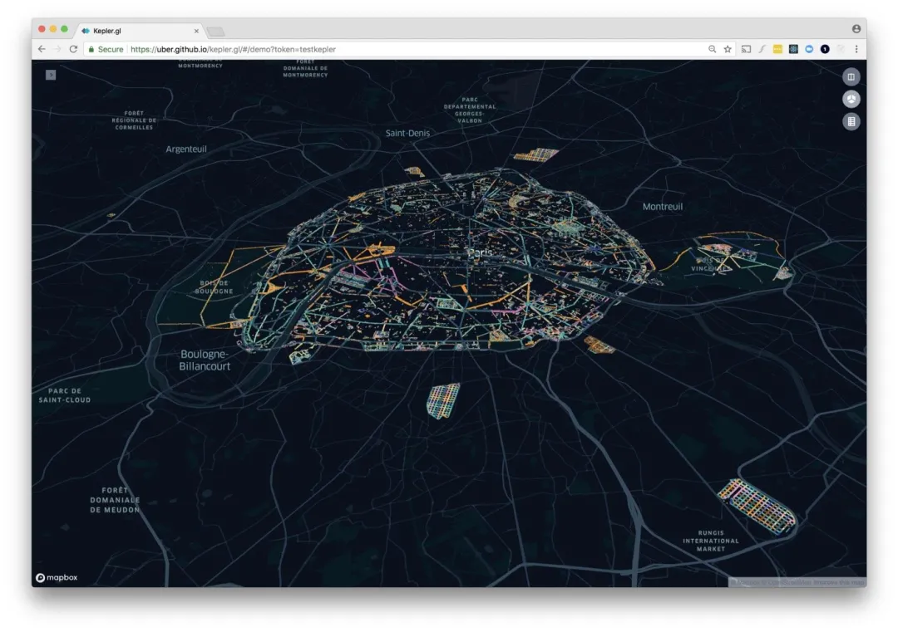<br />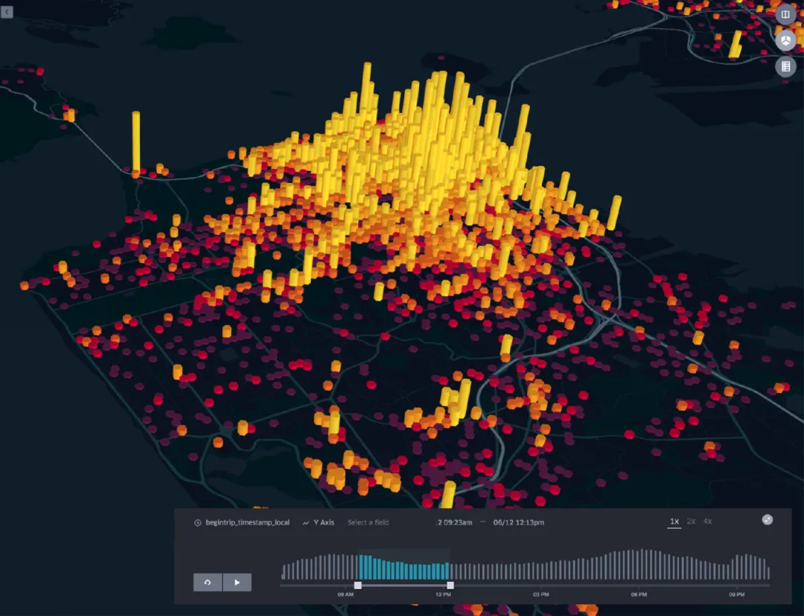<br /><br />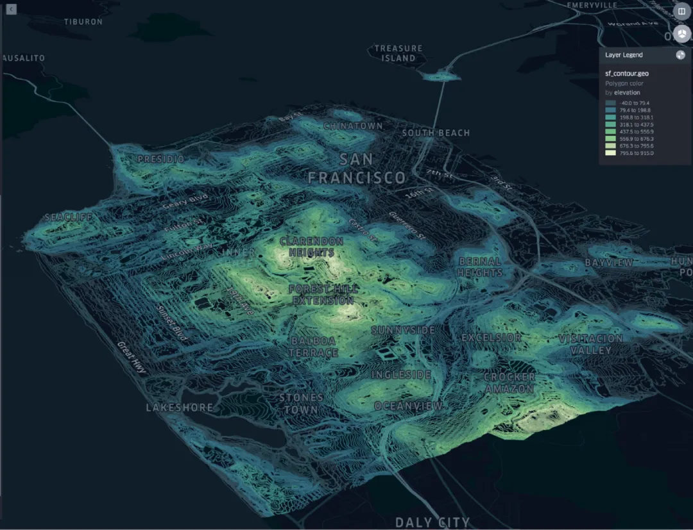<br />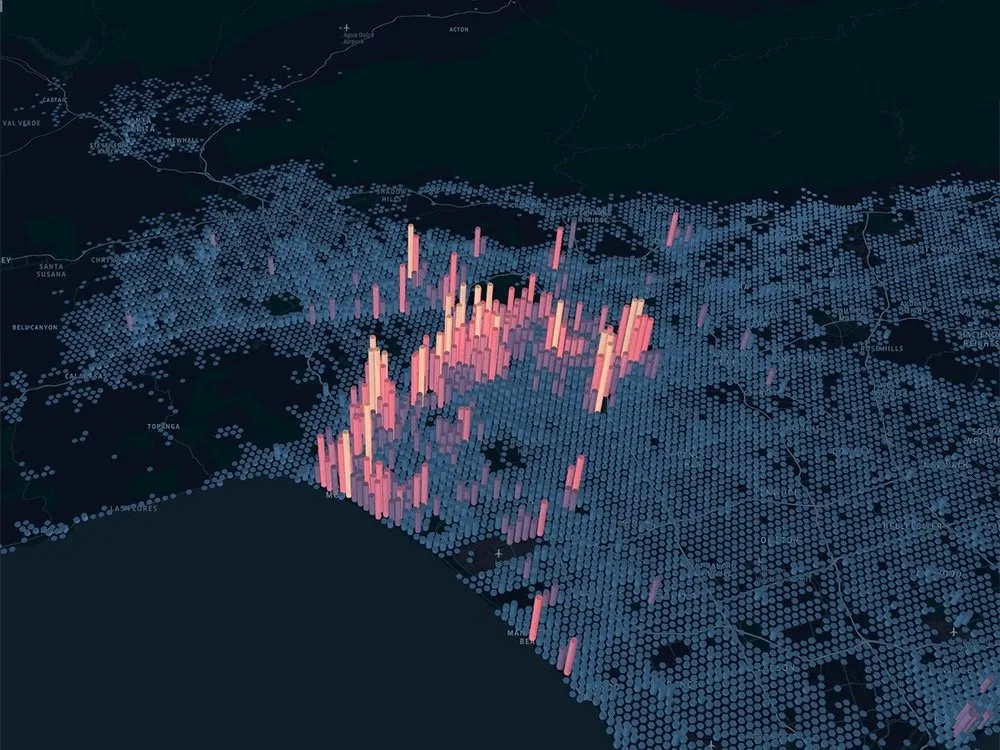<br /><br />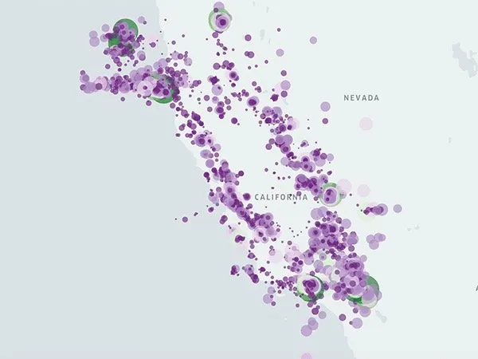<br />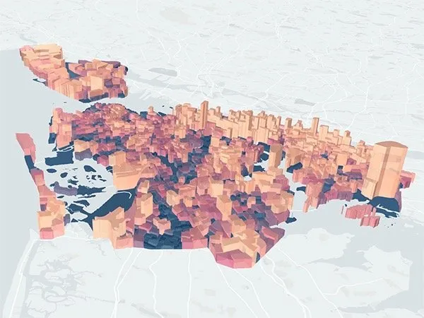<br />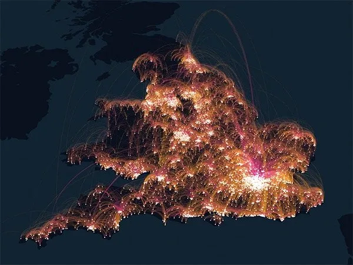
<a name="BT3j1"></a>
## 案例入门
```python
import pandas as pd
import geopandas as gpd

from keplergl import KeplerGl

# 创建对象
kep1 = KeplerGl(height=600)
# 激活对象，加载到jupyter notebook中
kep1
```
可以看到，运行了基本代码后在Jupyter中直接就产生了内置的图形，图形本身也是动态的：<br />
<a name="HiJGA"></a>
## 添加数据
keplergl默认是可以添加3种形式的数据：

- csv
- GeoJSON
- DataFrame
<a name="AbojV"></a>
### csv格式
本地目录下有一份csv数据：china.csv，记录的是我国各个省份的经纬度：
```python
with open("china.csv","r") as f:
    csv_data = f.read()
    
# add_data添加数据
kep1.add_data(data=csv_data, name="csv_kep")
kep1
```
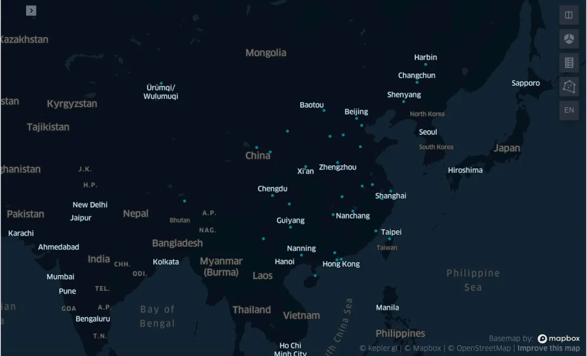
<a name="GnWZQ"></a>
### DataFrame格式
```python
china = pd.read_csv("china.csv")
kep1.add_data(data=china, name="dataframe_kep")
kep1
```

<a name="Pp6ny"></a>
### GeoJson格式
```python
url = 'http://eric.clst.org/assets/wiki/uploads/Stuff/gz_2010_us_040_00_500k.json'
country_gdf = gpd.read_file(url)  # geopandas读取json文件

kep1.add_data(data=country_gdf, name="state")
kep1
```
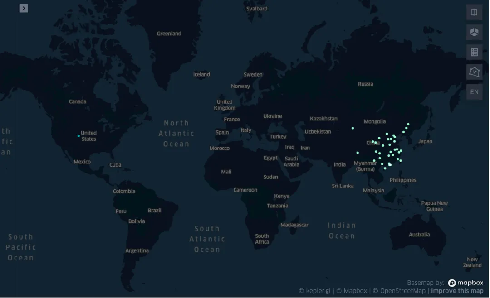
<a name="FAM8H"></a>
## 自定义图形
Keplergl的自定义方法：关键性按钮。进去了之后就可以自定义操作<br />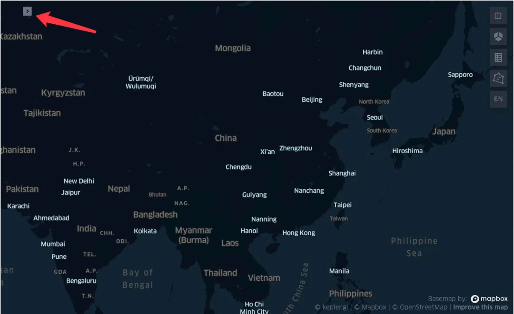<br />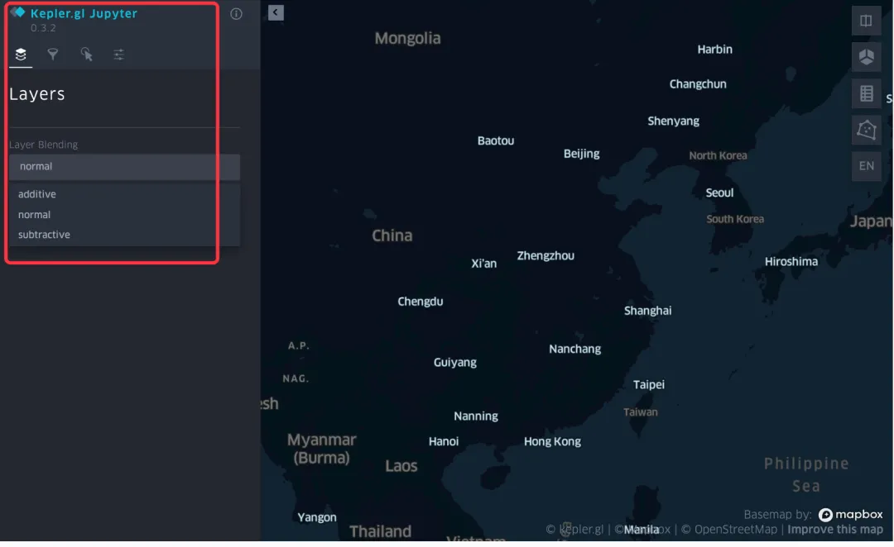<br />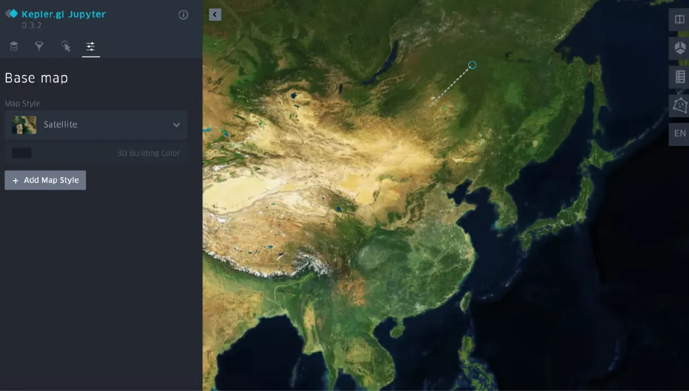
<a name="L5DYN"></a>
## 配置的保存及复用
实例化kep的配置可以保存在后面的实例对象中复用：
<a name="FwRIF"></a>
### 1、保存
```python
# 保存成文件
with open('config1.py','w') as f:
    f.write('config={}'.format(kep1.config))
    
# 运行：魔法命令%run
%run config1.py
```
<a name="nNWau"></a>
### 2、复用
```python
kep2 = KeplerGl(height=400,
                data={"layer1":df},
                config=kep1.config  # kep1的配置
               )
kep2
```
<a name="vx8VX"></a>
## 保存图形
<a name="nF8a9"></a>
### 1、简约版本，主要是文件名
```python
kep1.save_to_html(file_name="first_kep.html")
```
<a name="DWXm1"></a>
### 2、完整版本：文件名、配置、数据、可读性
```python
# 4个参数
kep1.save_to_html(file_name="first_kep.html",
                  data={'data_1':china},
                  config=config,
                  read_only=True
                 )
```
<a name="xx4Di"></a>
## 在线操作
上面显示的操作都是在notebook中完成的，也可以直接在线操作：[https://kepler.gl/demo](https://kepler.gl/demo)
