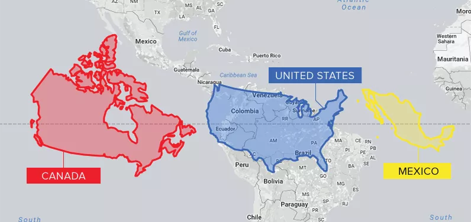
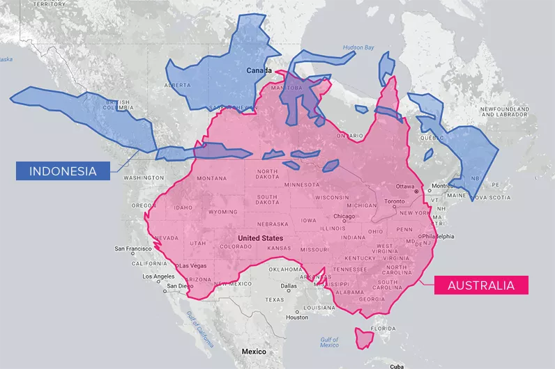
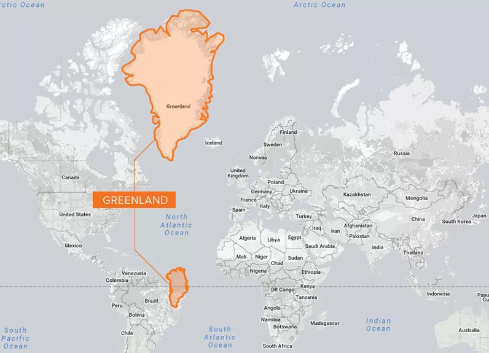
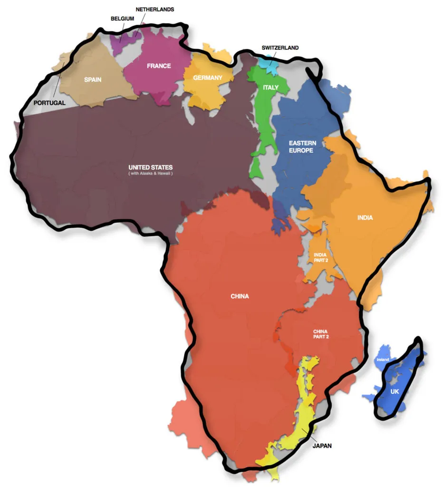
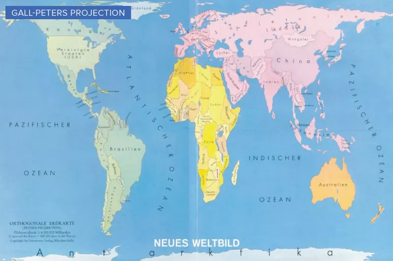
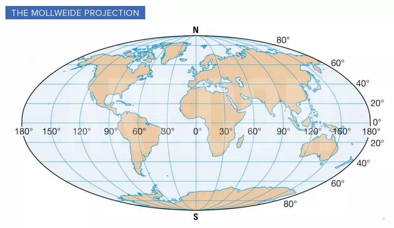
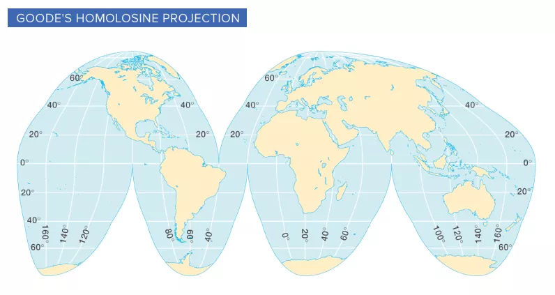
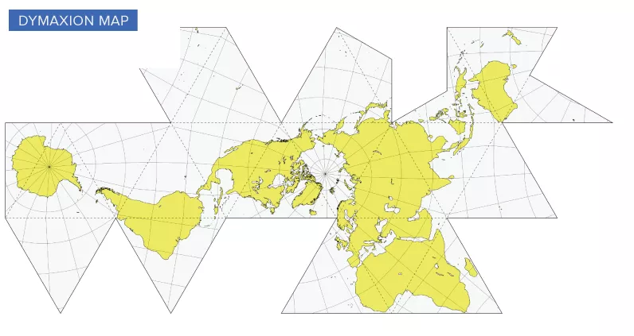
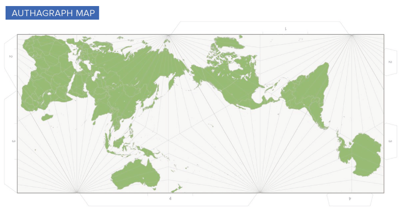

Python 可视化 对于地图都不陌生，它塑造了人们对世界的理解——在日益互联的全球经济中，地理知识比以往任何时候都更加重要 但是很不幸，当前由于使用了一种称为墨卡托投影的制图技术，世界各地有数十亿人对国家的真实大小存在偏差。墨卡托投影是大多数人们识别地球大陆位置和大小的方式，从教室挂图到导航应用程序，它几乎无处不在

## 墨卡托投影（The Mercator Projection）
公元 1569 年，伟大的制图师 Gerardus Mercator 创建了基于圆柱投影的革命性地图展示技术。新地图技术非常适合航海导航，因为球体上的每条线都是一条恒定的航线，或称 loxodrome。到了现代，这项技术仍然非常有用，因为可以在在线地图应用程序中以无缝方式描绘地球 也就是说，在这种投影方式中，陆地的大小随着它们离赤道越远而变得越来越扭曲，墨卡托地图效用的一个权衡是它扩大了欧洲和北美的规模。从视觉上看，加拿大和俄罗斯似乎约占地球陆地面积的25%，而实际上它们只占5% ，如果将南极洲排除在外（通常如此），加拿大和俄罗斯在陆地上的视觉份额将跃升至40%左右 下图是对加拿大、美国和墨西哥的正常面积大小的对比情况  与距离赤道较远的国家相比，非洲、南亚和南美洲似乎都小得多 从北美的角度来看，澳大利亚和印度尼西亚等国家看起来比实际小很多，通过比较与加拿大处于同一纬度的陆地有助于了实际陆地面积的大小  格陵兰岛是世界上最大的岛屿，但看看下面地图中过度夸张的描绘，可能经常会产生疑惑为什么它不是一个独立的大陆？实际上，格陵兰岛的面积仅仅大约是非洲的1/4  下面来看一张有趣的地图，它完美的展示了”非洲到底有多大“ 

## 多种投影技术
由于地图失真的影响越来越大，也就出现了更多的接近真实比例的投影技术。例如，波士顿公立学校最近改用加尔-彼得斯投影，它能更准确地描绘陆地的真实大小  同样，每月有大约 10 亿人使用谷歌的地图应用程序，谷歌在 2018 年采取了大胆的改变，将不同的投影用于不同的目的 地球被描绘成一个进一步缩放级别的地球，完全回避了地图投影问题，从而真实地展示世界：圆形  约翰·保罗·古德 (John Paul Goode) 的尝试被称为古德同质投影，通过在关键位置添加中断以帮助减少大陆的扭曲，生成的形状有时称为“橘皮图”  制图的另一个演变是 Dymaxion 地图，它由 Buckminster Fuller 发明并于 1946 年获得专利。在这个版本中，大陆不再处于我们熟悉的位置——但是，与其他的投影方法相比，空间保真度更高。能够看到非洲、加拿大北部、南极洲和其他失真热点区域的真实比例  Dymaxion 地图的创建并非纯粹出于实用的目的。富勒认为，如果人类能够以连续的方式可视化地球的大陆，那么将能够更好地应对全球的各种挑战 最后一种名为 AuthaGraph 的新地图制作方法横空出世，日本建筑师 Hajime Narukawa 可能已经创建了迄今为止最准确的世界地图。AuthaGraph 将地球分成 96 个三角形，将它们转换为四面体并展开为矩形。 最终结果就是陆地和海洋的比例比传统预测更准确  AuthaGraph 地图最大的缺点是经纬度线不再是整齐的网格。同样，地图上的大陆重新定位，这对于已经熟悉传统地理知识的人们来说是陌生的 也就是说，在平面上描绘的圆形世界总是需要一些权衡利弊的
