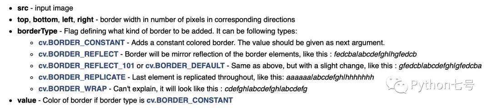
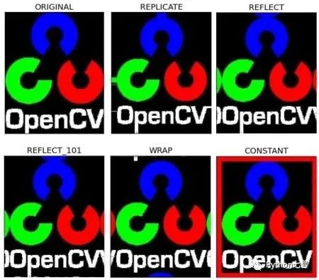
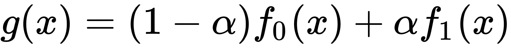
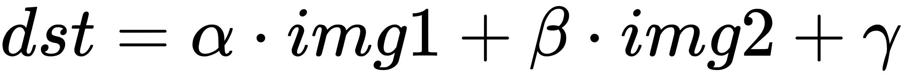

PythonOpenCV
<a name="FNrDV"></a>
## 1、OpenCV 介绍
OpenCV 的 全称是 Open Computer Vision，Open 表示开源的，Computer Vision 就是计算机视觉，也就是说 OpenCV 是开放源代码的计算机视觉技术。<br />OpenCV 由 Gary Bradsky 于 1999 年在英特尔创立，第一个版本于 2000 年发布。Vadim Pisarevsky 加入 Gary Bradsky 管理英特尔的俄罗斯软件 OpenCV 团队。2005 年，OpenCV 被用于获得 2005 年 DARPA 大挑战赛的车辆 Stanley。后来，它在 Willow Garage 的支持下继续积极发展，由 Gary Bradsky 和 Vadim Pisarevsky 领导该项目。OpenCV 现在支持多种与计算机视觉和机器学习相关的算法，并且日益扩展。<br />OpenCV 支持多种编程语言，如 C、Python、Java 等，可在不同平台上使用，包括 Windows、Linux、OS X、Android 和 iOS。基于 CUDA 和 OpenCL 的高速 GPU 操作接口也在积极开发中。<br />OpenCV-Python 是 OpenCV 的 Python 接口，结合了 OpenCV C API 和 Python 语言的最佳特性。Python 是由 Guido van Rossum 创立的通用编程语言，是当前非常流行的编程语言，主要是因为它的简单性和代码可读性。它使程序员能够在不降低可读性的情况下用更少的代码行来表达想法。<br />与 C/C 等语言相比，Python 速度较慢。也就是说，Python 可以很容易地使用 C/C 进行扩展，这允许在 C/C 中编写计算密集型代码并创建可以用作 Python 模块的 Python 包。两个优势：首先，代码与原始 C/C 代码一样快（因为它是在后台运行的是 C 代码），其次，用 Python 编写代码比 C/C 更容易。OpenCV-Python 就是 C 实现的 Python 包。<br />OpenCV-Python 使用 Numpy，这是一个高度优化的库，用于具有 MATLAB 样式语法的数值运算。所有 OpenCV 数组结构都与 Numpy 数组相互转换。这也使得与使用 Numpy 的其他库（例如 SciPy 和 Matplotlib）集成变得更加容易，因此在学习 OpenCV-Python 之前，需要先学习 Numpy，这样才能写出优化的代码。
<a name="QZyhJ"></a>
## 2、OpenCV 的安装
不推荐编译源代码安装，因为太耗时间了。可以使用 pip 直接安装编译好的就行。<br />如果想安装最新版本，可以这样：
```bash
pip install opencv-python
pip install opencv-contrib-python
```
b 站上的老师推荐，3.4.1.15 版本比较稳定，且没有专利限制，如果想安装这个版本，可以这样：
```bash
pip install opencv-python==3.4.1.15
pip install opencv-contrib-python==3.4.1.15
```
<a name="mEgsr"></a>
## 3、图片的打开/保存
注释都在里面了：
```python
import cv2 as cv
import sys

# 打开一个图片
img = cv.imread("/Users/aaron/Downloads/IMG_4733.JPG")
if img is None:
    sys.exit("Could not read the image.")
# 显示图片
cv.imshow("Display window", img)

# 参数 0 表示按任意键退出，其他数字表示等待制定的秒数后退出。
k = cv.waitKey(0)
if k == ord("s"): #如果按下的是字符 s
    #保存图片

    cv.imwrite("saved.jpg", img)
```
<a name="sqzp6"></a>
## 4、视频/摄像头的打开、帧操作，保存
API 可以参考：[https://docs.opencv.org/4.x/d8/dfe/classcv_1_1VideoCapture.html](https://docs.opencv.org/4.x/d8/dfe/classcv_1_1VideoCapture.html)
```python
import cv2 as cv

# 0 表示第一个摄像头
# 也可以传入视频文件的路径
cap = cv.VideoCapture(0)
# cap = cv.VideoCapture("/Users/aaron/Downloads/0__xhfux2NnE3xtE_e.mp4")
if not cap.isOpened():
    print("Cannot open camera")
    exit()
while True:
    # 一帧一帧来读取
    ret, frame = cap.read()
    # 如果没有读取到：
    if not ret:
        print("无法获取视频帧，是不是播放结束了？Exiting ...")
        break
    # 这里可以对帧进行操作，比如转化为灰度图
    gray = cv.cvtColor(frame, cv.COLOR_BGR2GRAY)
    # 显示帧
    cv.imshow("frame", gray)
    if cv.waitKey(1) == ord("q"):  # 等待按键
        break
# 结束后要释放资源
cap.release()
cv.destroyAllWindows()
```
视频的保存，比如说从摄像头录制视频，保存为 mp4 文件。
```python
import cv2 as cv

cap = cv.VideoCapture(0)
# 定义视频编码
cap.set(3, 640)
cap.set(4, 480)

fourcc = cv.VideoWriter_fourcc(*"mp4v")
out = cv.VideoWriter("output.mp4", fourcc, 20.0, (640, 480))
while cap.isOpened():
    ret, frame = cap.read()
    if not ret:
        print("无法获取视频帧，Exiting ...")
        break
    # 帧反转操作
    # frame = cv.flip(frame, 0)
    # 保存帧
    out.write(frame)
    cv.imshow("frame", frame)
    if cv.waitKey(1) == ord("q"):  # 这里的等待 1 秒其实控制着速度
        break
cap.release()
out.release()

cv.destroyAllWindows()
```
<a name="p6H3G"></a>
## 5、图片的操作、划线、添加文字
```python
import numpy as np
import cv2 as cv


def img_show(img):
    # 定义一个函数显示图片，这样可以少写代码。
    cv.imshow("img", img)
    cv.waitKey(0)
    cv.destroyWindow("img")


# 画一个黑色背景图
img = np.zeros((512, 512, 3), np.uint8)

# 一条蓝色的线 Blue Green Red （255，0，0）
cv.line(img, (0, 0), (511, 511), (255, 0, 0), 5)

# 画一个矩形

cv.rectangle(img, (384, 0), (510, 128), (0, 255, 0), 3)

# 画一个圆
cv.circle(img, (447, 63), 63, (0, 0, 255), -1)

# 画一个椭圆
cv.ellipse(img, (256, 256), (100, 50), 0, 0, 180, 255, -1)

# 画一个多边形
pts = np.array([[10, 5], [20, 30], [70, 20], [50, 10]], np.int32)
pts = pts.reshape((-1, 1, 2))
cv.polylines(img, [pts], True, (0, 255, 255))

# 添加文字
font = cv.FONT_HERSHEY_SIMPLEX
cv.putText(img, "OpenCV", (10, 500), font, 4, (255, 255, 255), 2, cv.LINE_AA)

img_show(img)
```
<a name="JmFgg"></a>
## 6、图像的基本操作
学习读取和编辑像素值，使用图像 ROI 和其他基本操作。主要是以下四点：

- 访问像素值并修改它们
- 访问图像属性
- 设置感兴趣区域 (ROI)
- 拆分和合并图像

本节中几乎所有的操作都主要与 Numpy 相关，而不是 OpenCV。使用 OpenCV 编写更好的优化代码需要良好的 Numpy 知识。
<a name="Ekwk6"></a>
### 访问像素值并修改它们
```python
>>> import numpy as np
>>> import cv2 as cv
>>> img = cv.imread('messi5.jpg')
```
接下来就可以通过其行和列坐标访问像素值。对于 BGR 图像，它返回一个包含蓝色、绿色、红色值的数组。对于灰度图像，只返回相应的强度：
```python
>>> px = img[100,100] #访问坐标（100，100）处的像素值
>>> print( px ) #打印出来的是BGR，也就是蓝、绿、红、对应的值
[157 166 200]
# #访问B通道像素值，那么传入索引 0，相应的访问 R 通道，就是 2
>>> blue = img[100,100,0]
>>> print( blue )
157
>>> red = img[100,100,2]
>>> print( red )
200
```
可以直接修改某一坐标的像素值：
```python
>>> img[100,100] = [255,255,255]
>>> print( img[100,100] )
[255 255 255]
```
Numpy 是一个用于快速数组计算的优化库。因此，简单地访问每个像素值并对其进行修改将非常慢，上述代码仅用于演示，不是推荐的做法。<br />更优雅的访问并修改像素的做法是这样的：
```python
# 访问坐标10，10 出的 R 值
>>> img.item(10,10,2)
59
# 修改坐标10，10 出的 R 值
>>> img.itemset((10,10,2),100)
>>> img.item(10,10,2)
100
```
<a name="dlcLF"></a>
### 访问图像属性
获取图片的形状：
```python
>>> print( img.shape )
(342, 548, 3)
```
342 是高，也就是有多少行像素值，548 是宽，也就是有多少列像素值，而 3 代表 3 通道，表示这是个彩色图而不是灰度图。如果是灰度图，那么返回的结果只有高和宽。<br />获取总的像素数：342*548*3 = 562248
```python
>>> print( img.size )
562248
```
获取图片的数据类型：
```python
>>> print( img.dtype )
uint8
```
因为像素的最大值就是 255，因此，8 位够用了。
<a name="BIwid"></a>
### 设置感兴趣区域 ROI(ROI-Region of Interest)
有时，将不得不使用某些图像区域。比如，对于图像中的眼睛检测，首先对整个图像进行人脸检测。当获得人脸时，只选择人脸区域并在其中搜索眼睛，而不是搜索整个图像。它提高了准确性（因为眼睛总是在脸）和性能（因为在一个小区域内搜索）。<br />使用 Numpy 索引来获得 ROI。在这里，选择了球并将其复制到图像中的另一个区域：
```python
>>> ball = img[280:340, 330:390]
>>> img[273:333, 100:160] = ball
```
效果图如下：


<a name="EL9Xu"></a>
### 拆分和合并图像
有时需要单独处理图像的 B、G、R 通道。在这种情况下，需要将 BGR 图像拆分为单个通道。在其他情况下，可能需要加入这些单独的频道来创建 BGR 图像。可以通过以下方式简单地做到这一点：
```python
>>> b,g,r = cv.split(img)
>>> img = cv.merge((b,g,r))
```
但是，`cv.split` 效率没有下面使用索引的方式高：
```python
>>> b = img[:,:,0]
```
修改也可以用索引，比如想把所有的红色值设为 0:
```python
>>> img[:,:,2] = 0
```
有时候，想为图片加上边框，比如相框，可以使用 `cv.copyMakeBorder()`。但它在卷积运算、零填充等方面有更多应用。此函数采用以下参数：<br /><br />下面是一个示例代码，演示了所有这些边框类型，以便可以更好地理解：
```python
import cv2 as cv
import numpy as np
from matplotlib import pyplot as plt
BLUE = [255,0,0]
img1 = cv.imread('opencv-logo.png')
replicate = cv.copyMakeBorder(img1,10,10,10,10,cv.BORDER_REPLICATE)
reflect = cv.copyMakeBorder(img1,10,10,10,10,cv.BORDER_REFLECT)
reflect101 = cv.copyMakeBorder(img1,10,10,10,10,cv.BORDER_REFLECT_101)
wrap = cv.copyMakeBorder(img1,10,10,10,10,cv.BORDER_WRAP)
constant= cv.copyMakeBorder(img1,10,10,10,10,cv.BORDER_CONSTANT,value=BLUE)
plt.subplot(231),plt.imshow(img1,'gray'),plt.title('ORIGINAL')
plt.subplot(232),plt.imshow(replicate,'gray'),plt.title('REPLICATE')
plt.subplot(233),plt.imshow(reflect,'gray'),plt.title('REFLECT')
plt.subplot(234),plt.imshow(reflect101,'gray'),plt.title('REFLECT_101')
plt.subplot(235),plt.imshow(wrap,'gray'),plt.title('WRAP')
plt.subplot(236),plt.imshow(constant,'gray'),plt.title('CONSTANT')
plt.show()

```
效果如下所示：<br />
<a name="hOeup"></a>
## 7、图像的算术运算
对图像执行算术运算，如加法、减法、按位运算等。主要使用这些函数：`cv.add()`、`cv.addWeighted()` 等。
<a name="Am5Gs"></a>
### 图片加法
可以使用 OpenCV 函数 `cv.add()` 或简单地通过 numpy 操作 `res = img1 + img2` 添加两个图像。两个图像应该具有相同的深度和类型，或者第二个图像可以只是一个标量值。<br />OpenCV 加法和 Numpy 加法是有区别的。OpenCV 加法是饱和运算，而 Numpy 加法是模运算。
```python
>>> x = np.uint8([250])
>>> y = np.uint8([10])
>>> print( cv.add(x,y) ) # 250+10 = 260 => 255
[[255]]
>>> print( x+y )          # 250+10 = 260 % 256 = 4
[4]
```
<a name="JegW9"></a>
### 图片混合
这也是图像添加，但为图像赋予不同的权重，以便给人一种混合或透明的感觉。根据以下等式添加图像：<br /><br />α 从 0→1。。在这里把两张图像混合在一起。第一张图片的权重为 0.7，第二张图片的权重为 0.3。`cv.addWeighted()` 将以下等式应用于图像，这里 γ 是 0。<br />
```python
img1 = cv.imread('ml.png')
img2 = cv.imread('opencv-logo.png')
dst = cv.addWeighted(img1,0.7,img2,0.3,0)
cv.imshow('dst',dst)
cv.waitKey(0)
cv.destroyAllWindows()
```
效果如下：<br />
<a name="gYMz9"></a>
### 位运算
这包括按位与、或、非和异或运算。它们在提取图像的任何部分（将在接下来的章节中看到）、定义和使用非矩形 ROI 等时非常有用。下面将看到一个如何更改图像特定区域的示例。<br />比如将 OpenCV logo 放在图像上方。如果添加两个图像，它会改变颜色。如果混合它们，会得到透明的效果。但希望它是不透明的。如果它是一个矩形区域，可以使用 ROI。但是 OpenCV 标志不是一个矩形。因此，可以使用按位运算来完成，如下所示：
```python
# 读取两个图片
img1 = cv.imread('messi5.jpg')
img2 = cv.imread('opencv-logo-white.png')
# 想把 logo 放左上角，因此创建一个 ROI
rows,cols,channels = img2.shape
roi = img1[0:rows, 0:cols]

# 现在创建一个 logo 蒙版并创建其反向蒙版 
img2gray = cv.cvtColor(img2,cv.COLOR_BGR2GRAY)
ret, mask = cv.threshold(img2gray, 10, 255, cv.THRESH_BINARY)
mask_inv = cv.bitwise_not(mask)

# 现在将 ROI 中的 logo 区域涂黑
img1_bg = cv.bitwise_and(roi,roi,mask = mask_inv)

# 从 logo 图像中仅获取 logo 区域
img2_fg = cv.bitwise_and(img2,img2,mask = mask)


# 放置 logo
dst = cv.add(img1_bg,img2_fg)
img1[0:rows, 0:cols ] = dst


cv.imshow('res',img1)
cv.waitKey(0)
cv.destroyAllWindows()
```
效果图：<br />
<a name="sfa6y"></a>
## 8、性能测试和改进
获得解决方案很重要。但是以最快的方式获得它更重要。<br />在图像处理中，由于每秒处理大量操作，因此代码不仅要提供正确的解决方案，而且还要以最快的方式提供解决方案，这是必须的。接下来，看一下如何衡量代码的性能和一些提高代码性能的技巧。<br />会用到这些函数：`cv.getTickCount`、`cv.getTickFrequency` 等。<br />除了 OpenCV，Python 还提供了一个模块 time，有助于测量执行时间。另一个模块 profile 有助于获得关于代码的详细报告，例如代码中每个函数花费了多少时间，函数被调用了多少次等。
<a name="FKd11"></a>
### 使用 OpenCV 测量性能
`cv.getTickCount` 函数返回从机器开启的那一刻到调用此函数的那一刻的时钟周期数。因此，如果在函数执行之前和之后调用它，将获得用于执行函数的时钟周期数。<br />`cv.getTickFrequency` 函数返回时钟周期的频率，或每秒的时钟周期数。因此，要以秒为单位查找执行时间，可以执行以下操作：
```python
e1 = cv.getTickCount()
# 这里放置你的代码
e2 = cv.getTickCount()
time = (e2 - e1)/ cv.getTickFrequency()
```
通过以下示例进行演示。下面的例子应用了中值过滤，核的大小从 5 到 49 不等:
```python
img1 = cv.imread('messi5.jpg')
e1 = cv.getTickCount()
for i in range(5,49,2):
    img1 = cv.medianBlur(img1,i)
e2 = cv.getTickCount()
t = (e2 - e1)/cv.getTickFrequency()
print( t )
# 0.521107655 seconds
```
也可以使用 time 模块来计时
<a name="s6fgQ"></a>
### OpenCV 中的默认优化
许多 OpenCV 函数都使用 SSE2、AVX 等进行了优化。它还包含未优化的代码。因此，如果系统支持这些功能，应该利用它们（几乎所有现代处理器都支持它们）。编译时默认启用。所以 OpenCV 如果启用则运行优化的代码，否则运行未优化的代码。可以使用 `cv.useOptimized()` 检查它是否启用/禁用，并使用 `cv.setUseOptimized()` 启用/禁用它。看一个简单的例子。
```python
# 检查优化是否启用
In [5]: cv.useOptimized()
Out[5]: True
In [6]: %timeit res = cv.medianBlur(img,49)
10 loops, best of 3: 34.9 ms per loop
# 禁用优化
In [7]: cv.setUseOptimized(False)
In [8]: cv.useOptimized()
Out[8]: False
In [9]: %timeit res = cv.medianBlur(img,49)
10 loops, best of 3: 64.1 ms per loop
```
<a name="txxd6"></a>
### 在 IPython 中测试时间
```python
In [10]: x = 5
In [11]: %timeit y=x**2
10000000 loops, best of 3: 73 ns per loop
In [12]: %timeit y=x*x
10000000 loops, best of 3: 58.3 ns per loop
In [15]: z = np.uint8([5])
In [17]: %timeit y=z*z
1000000 loops, best of 3: 1.25 us per loop
In [19]: %timeit y=np.square(z)
1000000 loops, best of 3: 1.16 us per loop
```
<a name="NeLm3"></a>
### 性能优化技术
有几种技术和编码方法可以发挥 Python 和 Numpy 的最大性能。此处仅注明相关内容，并提供重要来源的链接。这里要注意的主要是，首先尝试以简单的方式实现算法。一旦它开始工作，就对其进行分析，找到瓶颈再对其进行优化。

1. 尽可能避免在 Python 中使用循环，尤其是双/三循环等。它们天生就很慢。
2. 尽可能将算法/代码矢量化，因为 Numpy 和 OpenCV 针对矢量运算进行了优化。
3. 利用缓存一致性。
4. 除非必要，否则切勿复制数组。尝试改用视图。数组复制是一项昂贵的操作。

如果代码在执行完所有这些操作后仍然很慢，或者如果不可避免地使用大循环，请使用 Cython 等其他库来加快速度。<br />可以参考：<br />[Python 优化技术](https://wiki.python.org/moin/PythonSpeed/PerformanceTips)<br />[Numpy 高级操作](https://scipy-lectures.github.io/advanced/advanced_numpy/index.html#advanced-numpy)<br />[IPython 中的时序和分析](https://pynash.org/2013/03/06/timing-and-profiling/)
<a name="EZHzx"></a>
## 参考资料
Python 优化技术：[https://wiki.python.org/moin/PythonSpeed/PerformanceTips](https://wiki.python.org/moin/PythonSpeed/PerformanceTips)<br />Numpy 高级操作：[https://scipy-lectures.github.io/advanced/advanced_numpy/index.html#advanced-numpy](https://scipy-lectures.github.io/advanced/advanced_numpy/index.html#advanced-numpy)<br />IPython 中的时序和分析：[https://pynash.org/2013/03/06/timing-and-profiling/](https://pynash.org/2013/03/06/timing-and-profiling/)
