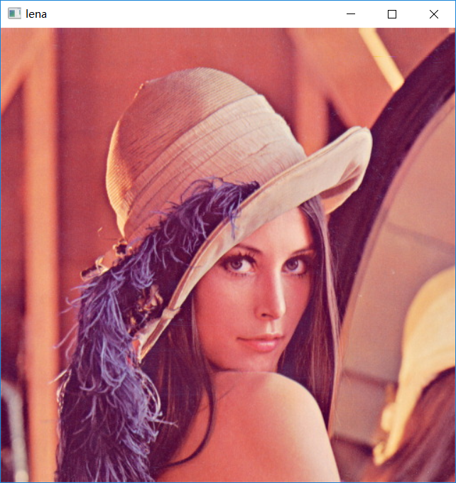
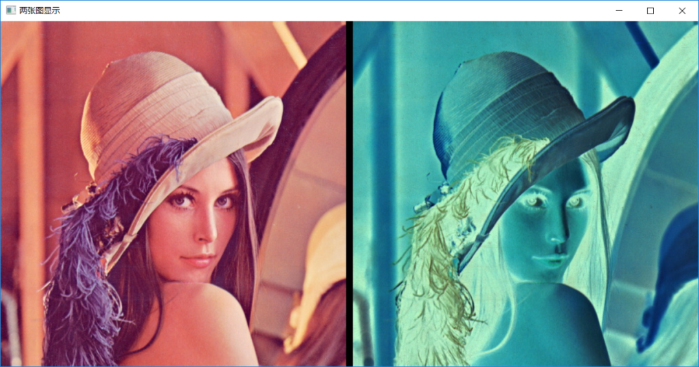
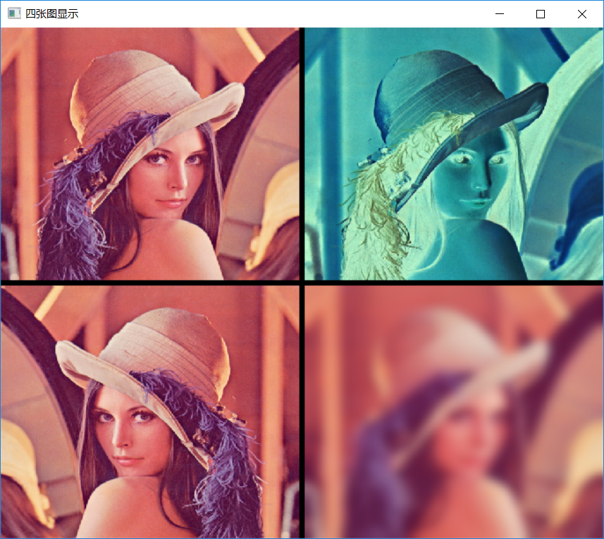

OpenCV<br />如何在一个imshow里面显示多个Mat对象/图像？其实这个本质就是一个Mat数据的合并操作。OpenCV读入每张图像都是一个Mat对象，而这些Mat对象本质就是数组，当然可以继续进行数组的合并的，可以把多个Mat对象合并成一个更大的Mat对象，然后传给`imshow`函数即可显示。<br />这样就完成了多张图像在同一个窗口显示了。理论上可以创建生成一个grid，每个网络对应一个Mat对象也就是图像，根据需要只要内存够大，可以生成很大的 Grid来实现图像预览。这里就不搞这么复杂，分别以两张图与四张图显示在同一个窗口为例，来说明如何实现多张图的同一窗口显示。
<a name="RvHjf"></a>
## 代码实现
<a name="eHtRz"></a>
### 首先读入一张图像
```cpp
Mat image = imread("D:/images/lena.jpg");
imshow("lena", image);
```
运行结果：<br />
<a name="zxWuL"></a>
### 然后完成几种常规简单的处理
```cpp
Mat invert, blur, yflip;
// 反色
bitwise_not(image, invert);
// 高斯模糊
GaussianBlur(image, blur, Size(0, 0), 10);
// 镜像
flip(image, yflip, 1);
```
<a name="epZAX"></a>
### 实现两张图的同一个窗口显示
```cpp
// 两张图显示一个窗口
Mat two_view = Mat::zeros(Size(image.cols * 2 + 10, image.rows), image.type());
Rect roi(0, 0, image.cols, image.rows);
image.copyTo(two_view(roi));
roi.x = image.cols + 10;
invert.copyTo(two_view(roi));
imshow("两张图显示", two_view);
```

<a name="PL8bm"></a>
### 实现四张图的同一个窗口显示
```cpp
// 四张图显示一个窗口
std::vector<Mat> images;
images.push_back(image);
images.push_back(invert);
images.push_back(yflip);
images.push_back(blur);
int w = image.cols * 2;
int h = image.rows * 2;
Mat result = Mat::zeros(Size(w + 10, h + 10), image.type());
Rect box(0, 0, image.cols, image.rows);
for (int i = 0; i < 4; i++) {
    int row = i / 2;
    int col = i % 2;
    box.x = image.cols * col + 10*col;
    box.y = image.rows * row + 10*row;
    images[i].copyTo(result(box));
}
namedWindow("四张图显示", WINDOW_FREERATIO);
imshow("四张图显示", result);
```
运行结果如下：<br />
