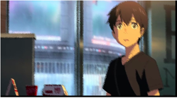
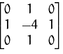

Python OpenCV
<a name="glZ76"></a>
## 毛玻璃效果
毛玻璃效果的原理，即遍历每一个像素，随机选取这个像素周围的某一个像素，替换当前像素。可以使用opencv实现，代码如下：
```python
#coding:utf-8
import cv2
import numpy as np
import random

img = cv2.imread('test.jpg',1)
shape = img.shape
h = shape[0]
w = shape[1]
dst = np.zeros((h,w,3),np.uint8)
mm = 8          
for m in range(h-mm):             
    for n in range(w-mm):
        index = int(random.random()*8)
        (b,g,r) = img[m+index,n+index]
        dst[m,n] = (b,g,r)
cv2.imwrite("result.jpg", dst)
```
整个过程即选择周围像素的范围距离最大为8像素，运行以上代码前后如下图：<br />
<a name="RqDuk"></a>
## 识别毛玻璃等模糊效果
接下来介绍如何使用OpenCV、Python和Laplacian算子计算图像中的模糊量，<br />如果有信号处理方面的背景，首先要考虑的方法是计算图像的快速傅里叶变换，然后检查低频和高频的分布：如果图像只有少量的高频，那么图像就会被认为是模糊的。然而，定义什么算低数量的高频或者什么是高数量的高频是相当困难的。<br />本文介绍的方法可以计算一个单一的浮点值来表示一个给定图像的模糊程度，只需采取一个图像的单一通道(大概灰度)和卷积它与以下3 x 3的内核，然后取响应的方差(即标准差的平方)。如果方差低于预先定义的阈值，则认为图像模糊；否则，图像不会模糊。<br /><br />方法很简单，如下一行代码就可
```python
cv2.Laplacian(image, cv2.CV_64F).var()
```
这种方法有效的原因是由于Laplacian算子本身的定义，它用于测量图像的二阶导数。拉普拉斯算子突出显示图像中包含快速梯度变化的区域，很像Sobel和Scharr算子。和这些算子一样，Laplacian也经常用于边缘检测。这里的假设是，如果一幅图像的方差较高，那么就说明图像有广泛的响应，包括类边和非类边，这是一幅正常的聚焦图像的代表。但如果方差很低，那么就会有很小的响应扩散，这表明图像中几乎没有边缘。而图像越模糊，边缘就越少。所以可以用来检测是否模糊。<br />显然，这里的关键是设置正确的阈值，而阈值的设置与应用到的图像集相关。如果阈值过低，就会错误地将原本不模糊的图像标记为模糊。如果阈值过高，那么实际上模糊的图像将不会被标记为模糊。这种方法只有在非常稳定的图像集（同一类型）中应用良好。<br />具体实现代码如下，定义variance_of_laplacian函数。这个方法将想要计算焦距的图像(假设为单个通道，例如灰度图像)作为参数, 先读取输入图像图像，再将其转换为灰度，然后使用OpenCV应用模糊检测，通过自己设定的阈值即可区分出模糊图片和不模糊图片。
```python
import cv2
def variance_of_laplacian(image):
  return cv2.Laplacian(image, cv2.CV_64F).var()

imagePath = “test.jpg”
image = cv2.imread(imagePath)
gray = cv2.cvtColor(image, cv2.COLOR_BGR2GRAY)
fm = variance_of_laplacian(gray)
if fm < 100:
    print("Blurry")
```
