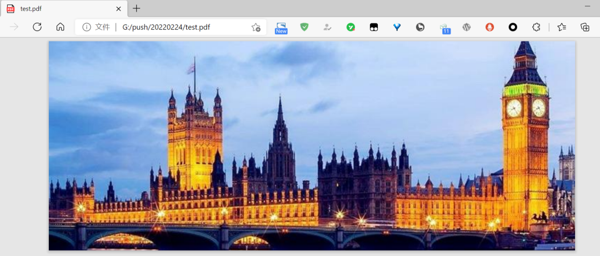
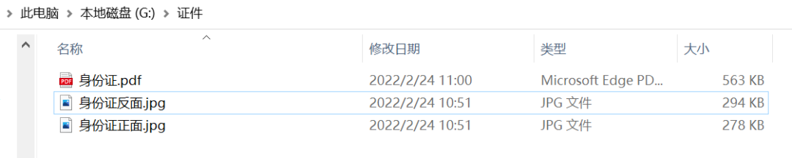

Python 
<a name="DrkvO"></a>
## 1、准备
请选择以下任一种方式输入命令安装依赖：

1. Windows 环境 打开 Cmd (开始-运行-CMD)。
2. MacOS 环境 打开 Terminal (command+空格输入Terminal)。
3. 如果用的是 VSCode编辑器 或 Pycharm，可以直接使用界面下方的Terminal。
```bash
pip install pillow
```
<a name="q8LrC"></a>
## 2、合成原理
Pillow模块，即PIL：Python Imaging Library，已经是Python平台事实上的图像处理标准库了。PIL功能非常强大，但API却非常简单易用。通过它，能很轻松地操作图像，并导出为不同格式。<br />首先来一个简单的示例，将打开一张图片，并将其保存为pdf格式：
```python
from PIL import Image
import os


def convert_img_pdf(filepath, output_path):
    """
    转换图片为pdf格式

    Args:
        filepath (str): 文件路径
        output_path (str): 输出路径
    """
    output = Image.open(filepath)
    output.save(output_path, "pdf", save_all=True)
    
    
if __name__ == "__main__":
    convert_img_pdf("1.jpeg", "./test.pdf")
```
随便使用一张图片测试一下：<br /><br />在运行代码后，它便成功地转化为了PDF文件：<br /><br />几行代码便完成了这个转换，这个可比那些把照片上传到云端的网站安全多了。
<a name="FREqg"></a>
## 3、多张照片合成PDF
有了前面照片转化PDF的基础知识，想要理解下面的多图合成PDF的代码就非常简单了。<br />其实就是使用了`.save`的一个特殊参数 append_images:
```python
output.save(pdfFilePath, "pdf", save_all=True, append_images=sources)
```
通过把图片都存入到一个"sources"数组中，就能很轻易地合成这些图像到PDF中。
```python
from PIL import Image
import os

def combine_imgs_pdf(folder_path, pdf_file_path):
    """
    合成文件夹下的所有图片为pdf

    Args:
        folder_path (str): 源文件夹
        pdf_file_path (str): 输出路径
    """
    files = os.listdir(folder_path)
    png_files = []
    sources = []
    for file in files:
        if 'png' in file or 'jpg' in file:
            png_files.append(folder_path + file)
    png_files.sort()

    output = Image.open(png_files[0])
    png_files.pop(0)
    for file in png_files:
        png_file = Image.open(file)
        if png_file.mode == "RGB":
            png_file = png_file.convert("RGB")
        sources.append(png_file)
    output.save(pdf_file_path, "pdf", save_all=True, append_images=sources)

if __name__ == "__main__":
    folder = r"G:\证件\\"
    pdfFile = r"G:\证件\身份证.pdf"
    combine_imgs_pdf(folder, pdfFile)
```
这样，只要将证件照都放在一个文件夹中，运行这个Python代码，它就能自动将这些证件合成到一个PDF中，并输出到指定的路径。非常简单方便。<br />
