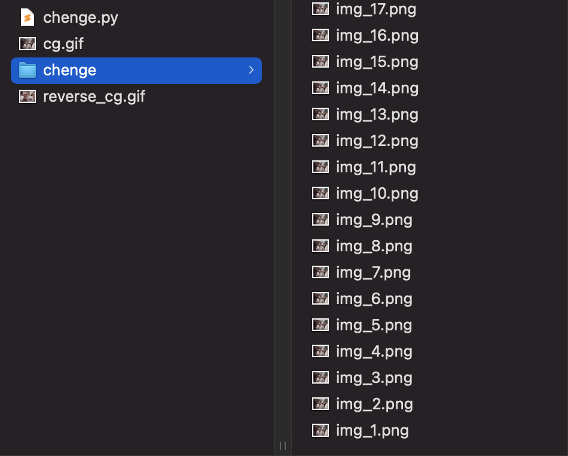

Python 
<a name="cO0DH"></a>
## 导入库
```python
from PIL import Image, ImageSequence

Image库用于读取（加载）图片
ImageSequence 用于将GIF拆解为图片（一帧一图）
# 加载本地动图
image = Image.open("cg.gif")
# GIF 动图拆分器
list = ImageSequence.Iterator(image)
```
<a name="DpZv2"></a>
## 拆分动图
```python
imgs = []
# 拆分后的图片进行编号，从1开始
k = 1
# 遍历图片流的每一帧
for frame in list:
    # 拆分后的图片，保存到chenge文件夹下，图片命名为img_1.png、img_2.png、...
    frame.save("./chenge/img_%d.png" % k)
    imgs.append(frame.copy())
    k += 1


将拆解后的帧图进行反转（倒序排列），并保存成新的动图reverse_cg.gif
# 拆分图片流进行反序
imgs.reverse()
# 将反序后所有帧图保存下来，命名为reverse_cg.gif
imgs[0].save("reverse_cg.gif", save_all=True, append_images=imgs[1:])
```
<a name="hRlBh"></a>
## 最后生成结果

<a name="Umddo"></a>
## 完整源码
```python
from PIL import Image, ImageSequence
# 加载本地动图
image = Image.open("cg.gif")
# GIF 动图拆分器
list = ImageSequence.Iterator(image)

imgs = []
# 拆分后的图片进行编号，从1开始
k = 1
# 遍历图片流的每一帧
for frame in list:
    # 拆分后的图片，保存到chenge文件夹下，图片命名为img_1.png、img_2.png、...
    frame.save("./chenge/img_%d.png" % k)
    imgs.append(frame.copy())
    k += 1

# 拆分图片流进行反序
imgs.reverse()
# 将反序后所有帧图保存下来，命名为reverse_cg.gif
imgs[0].save("reverse_cg.gif", save_all=True, append_images=imgs[1:])
```
