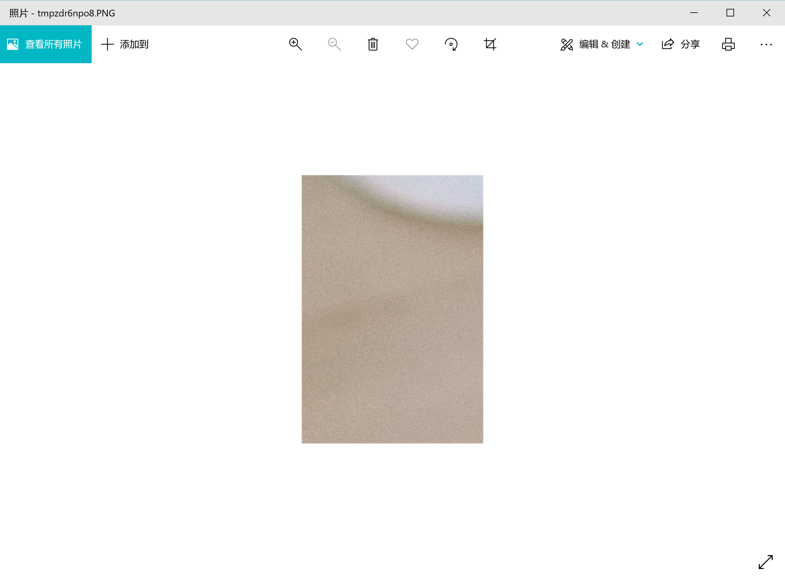
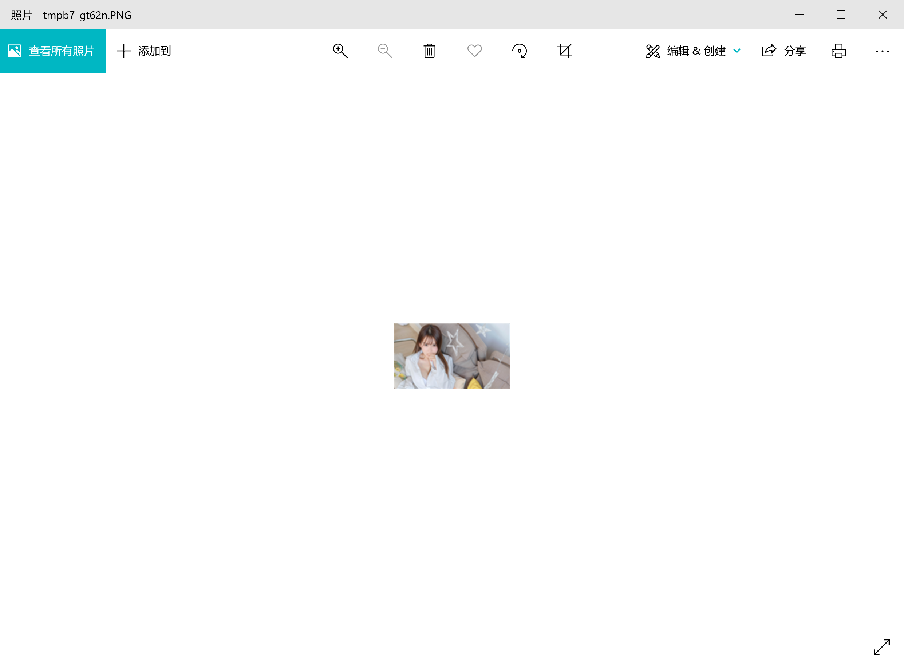

Python 图像处理
<a name="ygxOj"></a>
## 计算机图像相关知识
<a name="U2q20"></a>
### 颜色
如果有使用颜料画画的经历，那么一定知道混合红、黄、蓝三种颜料可以得到其他的颜色，事实上这三种颜色就是称为美术三原色的东西，它们是不能再分解的基本颜色。在计算机中，可以将红、绿、蓝三种色光以不同的比例叠加来组合成其他的颜色，因此这三种颜色就是色光三原色，所以通常会将一个颜色表示为一个RGB值或RGBA值（其中的A表示Alpha通道，它决定了透过这个图像的像素，也就是透明度）。

| 名称 | RGBA值 | 名称 | RGBA值 |
| --- | --- | --- | --- |
| White | (255, 255, 255, 255) | Red | (255, 0, 0, 255) |
| Green | (0, 255, 0, 255) | Blue | (0, 0, 255, 255) |
| Gray | (128, 128, 128, 255) | Yellow | (255, 255, 0, 255) |
| Black | (0, 0, 0, 255) | Purple | (128, 0, 128, 255) |

<a name="z5fo0"></a>
### 像素
对于一个由数字序列表示的图像来说，最小的单位就是图像上单一颜色的小方格，这些小方块都有一个明确的位置和被分配的色彩数值，而这些一小方格的颜色和位置决定了该图像最终呈现出来的样子，它们是不可分割的单位，通常称之为像素（pixel）。每一个图像都包含了一定量的像素，这些像素决定图像在屏幕上所呈现的大小。
<a name="FjoiU"></a>
## 用Pillow操作图像
Pillow是由从著名的Python图像处理库PIL发展出来的一个分支，通过Pillow可以实现图像压缩和图像处理等各种操作。可以使用下面的命令来安装Pillow。
```bash
pip install pillow
```
Pillow中最为重要的是Image类，读取和处理图像都要通过这个类来完成。
```python
from PIL import Image
image = Image.open('./res/guido.jpg')
image.format, image.size, image.mode
# ('JPEG', (500, 750), 'RGB')
image.show()
```

<a name="DbE9r"></a>
### 剪裁图像
```python
image = Image.open('./res/guido.jpg')
rect = 80, 20, 310, 360
image.crop(rect).show()
```

<a name="jGumX"></a>
### 生成缩略图
```python
image = Image.open('./res/guido.jpg')
size = 128, 128
image.thumbnail(size)
image.show()
```

<a name="LK91G"></a>
### 缩放和黏贴图像
```python
image1 = Image.open('./res/luohao.png')
image2 = Image.open('./res/guido.jpg')
rect = 80, 20, 310, 360
guido_head = image2.crop(rect)
width, height = guido_head.size
image1.paste(guido_head.resize((int(width / 1.5), int(height / 1.5))), (172, 40))
image1.show()
```

<a name="splrB"></a>
### 旋转和翻转
```python
image = Image.open('./res/guido.png')
image.rotate(180).show()
image.transpose(Image.FLIP_LEFT_RIGHT).show()
```

<a name="ElrA3"></a>
### 操作像素
```python
image = Image.open('./res/guido.jpg')
for x in range(80, 310):
    for y in range(20, 360):
        image.putpixel((x, y), (128, 128, 128))

image.show()
```

<a name="I9wM6"></a>
### 滤镜效果
```python
from PIL import Image, ImageFilter

image = Image.open('./res/guido.jpg')
image.filter(ImageFilter.CONTOUR).show()
```

