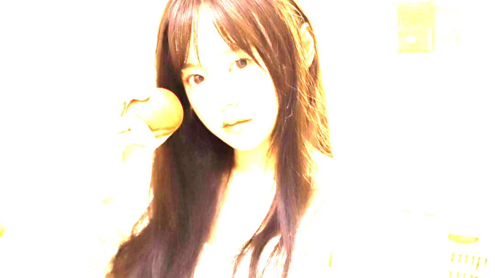
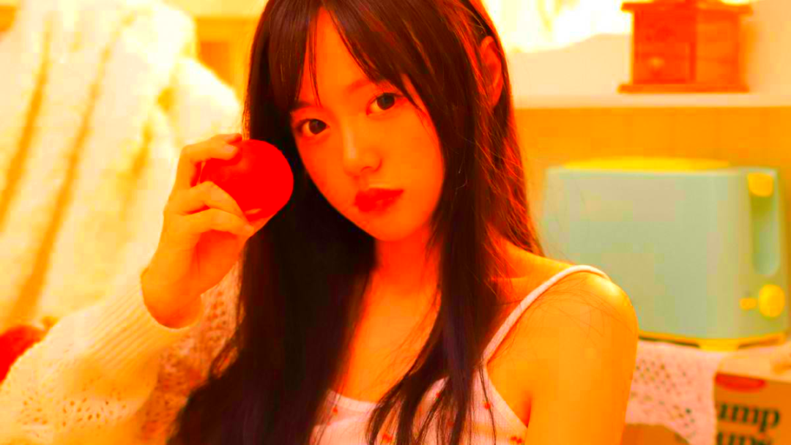

Python<br />平时使用一些图像处理软件时，经常会看到其对图像的亮度、对比度、色度或者锐度进行调整。<br />其实最基础的实现原理，用 Python 实现只需要几行代码，学会后也可以进行简单的图像增强处理了。<br />Python 中 PIL 模块中有一个叫做 `ImageEnhance` 的类，该类专门用于图像的增强处理，不仅可以增强（或减弱）图像的亮度、对比度、色度，还可以用于增强图像的锐度。<br />要使用这个模块，必须先安装 PIL库：
```bash
pip install pillow
```
<a name="t85k7"></a>
## 图像增强处理
<a name="yMNHS"></a>
### 读取图像
```python
image = Image.open('girl.jpeg')
image.show()
```
原始图像是一个拿着西红柿的清纯女孩：<br />
<a name="DxICR"></a>
### 亮度增强
```python
enh_bri = ImageEnhance.Brightness(image)
brightness = 4
image_brightened = enh_bri.enhance(brightness)
image_brightened.show()
```
为了对比明显，将原始图像的亮度增强4倍，看看效果：<br /><br />增强后的图像过于曝光了，是不是有那么一点刺眼？
<a name="LPN1l"></a>
### 色度增强
```python
enh_col = ImageEnhance.Color(image)
color = 4
image_colored = enh_col.enhance(color)
image_colored.show()
```
同样地，将原始图像的色度增强4倍，看看效果：<br /><br />这张图像的色彩就比较浓厚了，顿时感觉从一个青春少女变成一个风尘女子了！
<a name="U1yYG"></a>
### 对比度增强
```python
enh_con = ImageEnhance.Contrast(image)
contrast = 4
image_contrasted = enh_con.enhance(contrast)
image_contrasted.show()
```
同样地，将原始图像的对比度增强4倍，看看效果：<br /><br />这张图像就把细节处凸显得很明显了，有点像很早期的那种电影画面。
<a name="Ikrdj"></a>
### 锐度增强
```python
enh_sha = ImageEnhance.Sharpness(image)
sharpness = 4
image_sharped = enh_sha.enhance(sharpness)
image_sharped.show()
```
同样地，将原始图像的锐度增强4倍，看看效果：<br /><br />锐度增强之后，看起来还比较可以，跟原图相比变化没那么明显。
